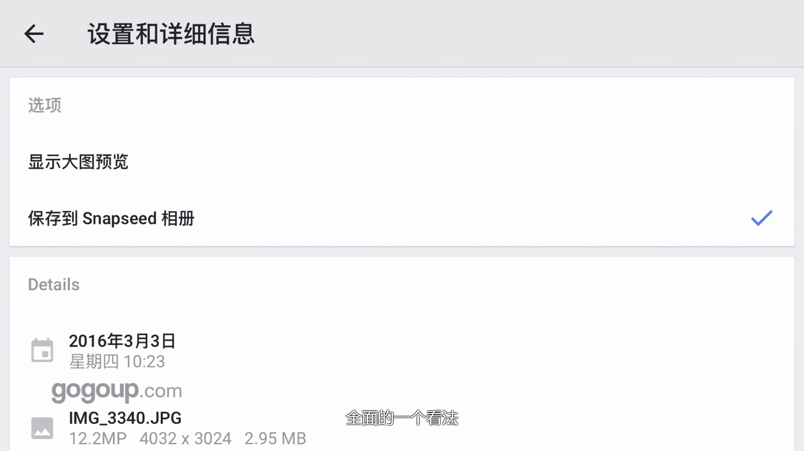
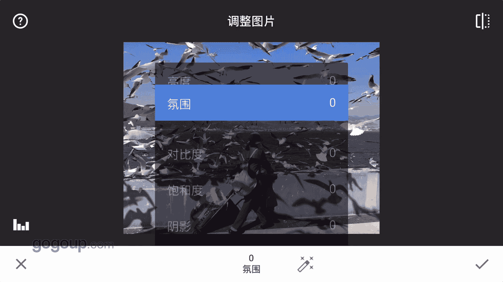
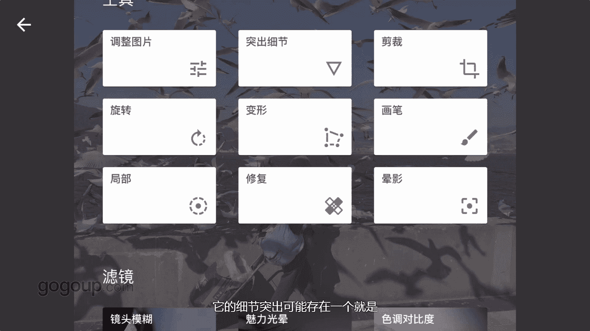

# 何雄-手机摄影教程：第05课·用手机做后期：课时1 · Snapseed

现在手机摄影的APP非常的强大，我所有的手机摄影作品都是在手机上用APP进行后期完成的。但也有很多相机的作品也拿手机APP进行处理。啊，那我们就从介绍我自己常用的修图APP开始吧。哎，好。

这章节跟大家分享的是我最常用的一些呃手机摄影修图的APP就这么6个啊，大家啊对也可以看一下这些记一下，我会在后面的每个在每对每个软件进行一个啊演示它的优点啊或者特长。啊。

这样可能更直观的跟大家分享怎么去应用它每个软件的一个一些特点。

哎，好，我们现在打开的是snapson的这个软件。啊，盗了一张照片，我们先看一下它的段一些呃一些功能的一些功能。这是到照片，我们点右上角这个的那个右边有个。

33个点的东西可以看到它的一个这个这个软件的一个特点，就综合性很强。嗯，可以看到一个你看设置和信息参数，我们点开核进器，它有一个你看一个什么相相册时间。对，以及这个他的一个。

呃，多大。或者是说咱们拍的手候可能有一个的定位它一个一个一个定位的那个什么地方拍的这样的一一个参数。

这是一个音乐嗯。佢。前面的一一个看法的。然后我们在这里可以进行倒好张照片，这是咱们前就瑞起呃，外拍海鸥的一张照片。我们打开右下角的一个小别的地方啊，这个小笔画的。然后他能看到的有个图片调整。

细节突出裁剪以及旋转变形。

以及化笔局部修复阴用。这样的几个一个直外的功能。下面还有一个滤镜这，还有一些呃镜头模糊啊，魅力光影、色调对比啊，以及HDI景观一些细剧化效果、杂志这些等等。这些事实呃滤镜以及后面的一个边框。对。

这是一个滤镜。然后比如说他这个片子综合性很强的话，他在调整里面有很多的一些一些。你看点开调整图片里面以后，我们把手指放在那个画面中间，它就会出现一个可调的一个亮度氛围以及呃对比度、饱和度、阴影。嗯。

然后高光暖色调这样的一些整体的一一个调试东西。

他这一个还有细节突出，它就存在一个就可能就是咱们的锐化，叫锐化结构这样的一个一个对照片的一个很综合性很强的。咱们也可以用到一些它的滤镜，像HDI啊，咱我们点进去看一下，它有5。

呃，每个议舍这议设可以嗯可以进行一个调整。一些可以进行强度的一个调整，薄度的修复是吧？

这个是中国性很强调，在对于我们修图上或者对他的一些。诶。自我的那个那个叫风格或者叫样微调的话，其就是一个很强大的功能。在。然后最值接说这个这个软件它有一个好点的话，它就是对你修的照片。

它不会损伤你的像素。我说像素的墙边，他不会把你的照片缩成10或者1202411150啊这样的一个尺寸，它保持了800万或者500万的尺寸。这是n胜的一个大家熟知的一个软件都在用。

可能随这是一个简单的介绍。

