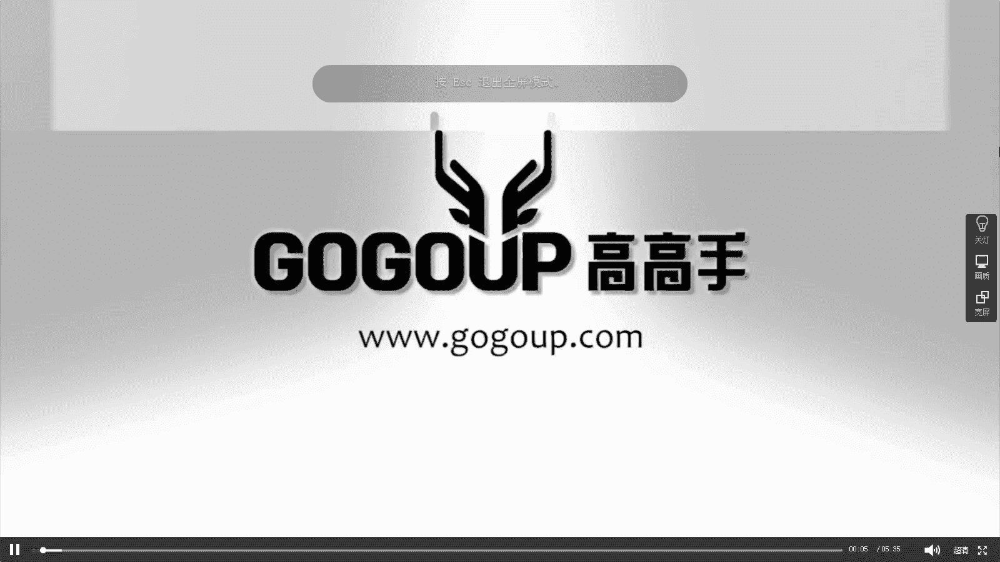
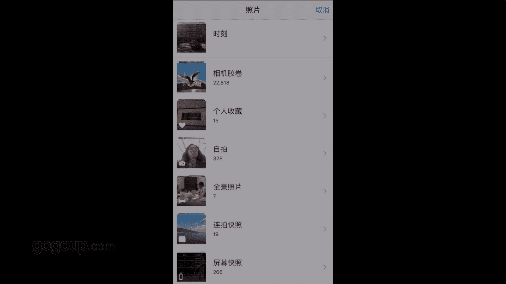

# 何雄-手机摄影教程：第05课·用手机做后期：课时10 · 彩色修图（1）

OK我们现在来进行一张啊进行那个彩色的一张啊其他秒片啊，红酒的一个一个逆光拍摄的一个一个。作品的一个进行。后期我们还是打开snap的ok。你给我们倒进去那张照片。好。

我们只能把张照片看到就是很平淡的一张逆逆光的照片，怎么把它修成成彩色，比较有穿透力，很很很很。内光很突很突出，然后穿透力强的一个一个引照的一个照片呢。OK我们就打开以后。

我们还是一样的点开这个音tel角的一个小印进行一个。好，这里新到用到一个新的一个滤镜的，这个滤镜就是一个叫颗粒胶片这样OK。然后经期下面有很多东西呢，有十几种的一个。

将近十多20种的一个一个一个一个滤镜的意识的写择。我们看一下它第一个是A01的1个A02的它的变化。OK我们A01看到A01了，它就有它这个胶片模具它它存在一个颗粒感。

也颗粒OK力度就我们把颗粒还是想见到你。好，这都编辑出具了一个。嗯，有点天空很蓝的一个饮调。这就是有让他一个。嗯。这就是模拟一个胶片的一个效果的一个一个滤径。我们把把颗粒感。减成0以后。

然后把这个他的那个样式进行一个啊加加到百分之百。ok。点勾好，这种照片就进行了一个简单的就用到的一个胶片胶片效果，颗粒效果的一个一个利的一个一个处理。这很简单，这个东西同样用于这风景人像上面去做。

它是简单的一一个调整。我们再到一个工具里面后，然后进行图片调整OK。还是老重复一些老东西，然后我们看亮度不够的话，我们进行一些亮度的加OK。加减然控制。

然后第二步这个氛围一定要这种氛围是非常有用的一个软一个效果。你看咱们把氛围向左加大氛围的一个力度。它那个立体感的出通透率是非常明显的一个展示，非常明的一个变化。OK我们一般根据这照片，我们就到70%吧。

这个是我的一个能看到我的一个效果，屏幕效果的一个。个条件，咱们可以根据自己的喜好进行一个调节下。OK可能看的有点心淡不够那种。嗯。一个离一个张力的话，我们就进行一个对比度的一个一调。

把它这个明暗对比进行一个加大。减的话会很平实，加大的话就会有一个通透力会更强，减的话就会有一个灰度存在的这。我想把它给它积节性对比强烈一点话加到个10%。嗯，这个三首是这样看你的。

再根据大家的一个喜好OK。然后我就会进行一个好，我们这个氛围不够，不够浓烈，我们加饱度。OK大家看那个照片的变化就饱和度不大。哎，现在饱和度的一个一个一个一个浓面度。然后这个照片一个高光，我们看剪一剪。

高光击的一个减的话，他就。就出现了一个一个一个很。很对比很强的一一个那个那个。立体感那个明暗对比。好，现在也动一下。这个因为这照片有点比较，刚刚用到那个胶片里的话，它比较蓝偏很蓝，然后有一点。

冷料我这里边加一点点。暖掉。让这个效果跟他就黄的逆光的效果更加突出。OK好，那回到前面，我们把这个。啊，这个亮度加加减一点点，再把这个因为经过很多的很多调试变化以后，我会再回到氛围。因为氛围刚刚说到的。

刚刚用了6060的一个氛围，我再把这个氛围给它进行一个加，让他这个立体感或者通透力，更加的一个一个明显，OK。这样就是一张照片的，就经过就简单的就几个步骤。啊，就调出来一张照片。

但是有个问题现们看到可能叫在上方，咱们放着看它有些噪点或者那一些东西的。因为这个加到颗粒感的话，它这个对比的一个过多的后期，就存在一些一些这种呃类似于摩尔王的一些一些段一些杂志东西的。这个咱们就。

在这里不管它还是他保存了以后，就用了两部，咱们看下就用了两部，咱们用的就两部，就是一部那个叫灯颗粒的一个滤镜。然后图片作战的，这是非常简单的东西啊，东西可以用在很多风景或人像上面拍这些东西的，好不好？

我们可以再来一张吧。这张我们就给大家暂时给大保存以后。我们再进行一张的调整一章也行。这个很明显的一个调整一张。

🎼。

🎼。

