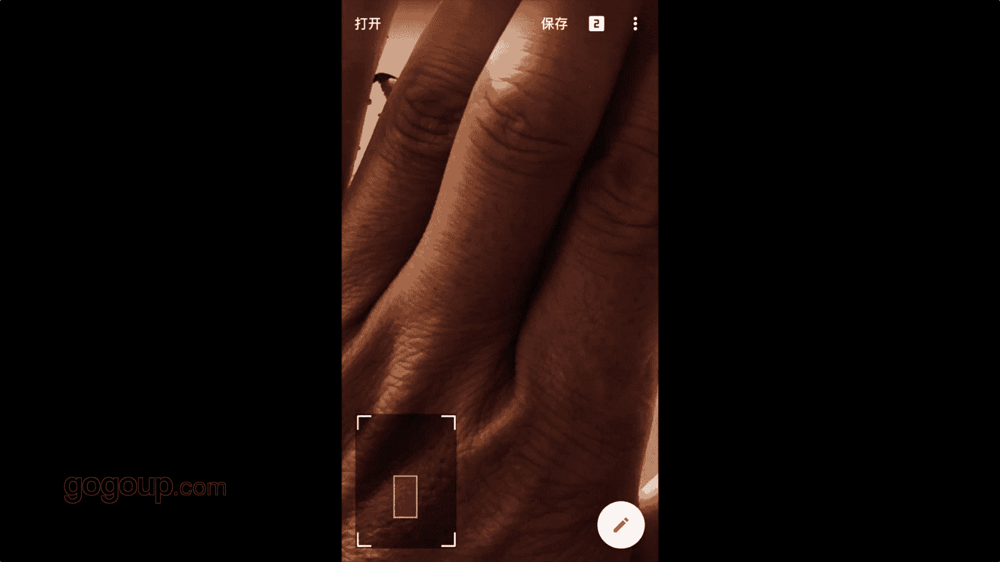

# 何雄-手机摄影教程：第05课·用手机做后期：课时11 · 彩色修图（2） 

嗯，我们打开我们刚刚的。这样子一个也是一张鸟片，好像是一张。嗯，对，也是一张鸟片吧。几张红嘴的尿片进行一个对。嗯，好，这张嘴。好，这张照片再看出来，它是也是一张非常。呃，曝光正确的存在我手上的一张照片。

我们给他处理一下，看看这。我们不说他照片好好坏，现在我们还是还是用到胶片颗粒。大家看到一下，用到第1个A01的模式里面，它就一下就凸显看。咱们按着它的时候，这颜片。他就一个很平常很视角。

很正常的一个东西，它没那么啊就是对比度或者质感，没那么惊艳浓艳。OK我们用到第一步的时候，它就产生一个这样它红的更红，然后有点泛黄的一个胶片扩效果的，它应该跟翻弹片或者一些老胶片的一个一个调子很像。

OK我们02。第我们可以去尝试看看每个效果的一个特点，你看它都有变化。还一个特点的OK林教像这样子去看一下它的饮调，我们可以写的不同的饮调。这个里面很多大家就很我现在用到的这些东西。好。

这个等调或者隐调OK我会这样的用这样的一个调子。大家可能会说到这样东西了讲，我们可能好多人用到这也都也会用，就胡略的东西要就把那个它的颗粒一直保留到它。其实我们要把颗粒一定要记住，把颗粒给它减。

建立OK。定一个出来，然后我们再进行一个打勾，然后我们再进到记住，永远记住这一步很重要的就些说的一是图片调整里图片调整里面一定把亮度拉一拉。把那个。这个氛围拉一嘛O。然后进行一个对比度。调条好。

这个饱和度可能就是它这个本来有点比较很冷的一个调度。我们给它啊饱和度可以加加一点。因为它是下火的这方，OK我们再把高光给它。啊，剪下来你看剪毛刚的目目的是什么？是让它不太那么高光，那么特亮，特刺眼。

他有个反应，然后我见高光的时候，他那个照片的一个明暗度，这个亮度，高光度就有很多的细节出来，很多的细节剪到零白，你看这地方就细节就出来了。如果我把高光不动的话，高光不动的话加到。A，咱们看这么一段。

这白高光地方就没有戏了，这个是对一个照片的一个东西一个工作。OK我们可以把高光剪到个剪到剪点，对合适的一个一个世纪段这个调子咱们可以在动啊，这蛮调冷暖可以去变化它的一个影调。

或者可以抽象可以就夸张的这样去调的这样的一个东西。这是这是一个。手法嗯，也是就是一个胶片去拍正常调试的一个东西，不是非常少，还不怎么损不损画质的一个一个的一个一个效果。你看这是这是原颜片。

这是呃进行一个呃一个颠倒的是，它这个这个效果是，就非常的这是处经过一个立锦套的一个效果OK。

🎼。🎼。