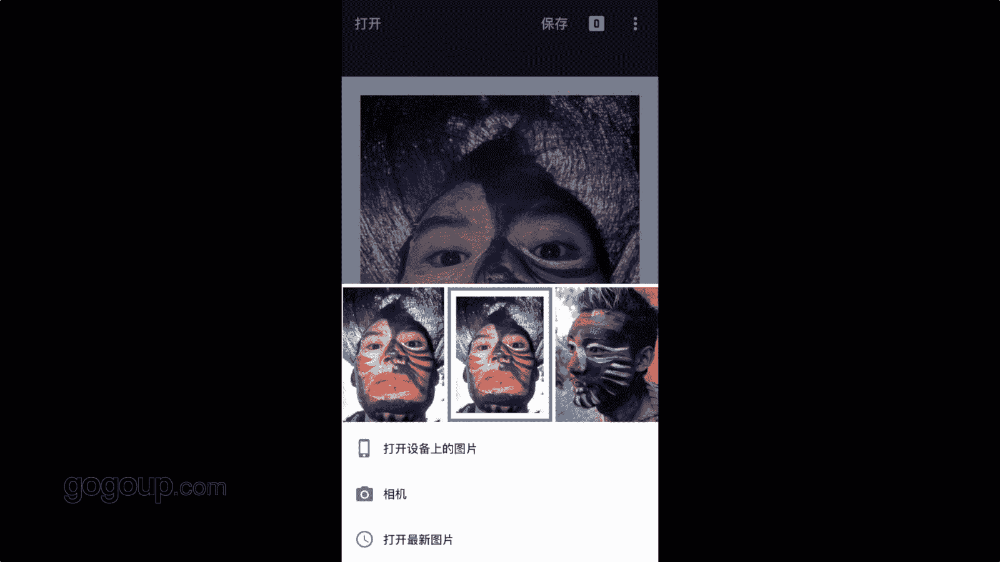

# 何雄-手机摄影教程：第05课·用手机做后期：课时12 · 彩色修图（3）

哎，我们刚刚呃像你讲的是脸黑白的一个对一个黑白冷暖度的一个处理。现在我们。嗯，用snap不是你打开一张要做彩色照片的一个后期。然后我们打开了一个snapce里面倒入了一张遗族巨龙的一个肖像的一个拍摄。

但肖像拍确实当时是用开手机闪光拍的OK然后他为什么做到做黑做彩色的照片的一个后期呢？因为他脸上有丰富的一个色彩的一个。彩绘。我想这样的话做彩色的东西，他就会彰显他自己的一个经艳度，一个一个一个比较啊。

一个比较吸引眼球的一个效果。OK好吧，我们就进入第一个模式。这个很关键，可能很多人就这样调调就okK了，我会进行一个怀旧。大家知道怀旧这个东西，对？都是有一种低饱和的。或者朦胧这种感觉。

朦胧的感觉这这样的11个顾名思义一个滤境。OK我进去以后，他有有总共有。13个那个呃新的，我们可以尝试一下的。每个尝试一下都要改这看它有个变化，这个很怀旧，它就很柔和，有种比较。暖的感觉对吧？

那种的皮肤上它就变化种很柔和一种就。嗯，没那么。就是刺眼。好，它有一种叫真实的感觉。OK我就会显得到啊。第二，你看大家看到皮皮子就他就眼部，我们点开看得到它虽然很灰心的物，它就它有点真实感。

它没那么高饱高饱和度，它就跟皮肤接近的，有点不那么刺眼OK它但样它有一个我们点进去手上点上去看到手指放在屏上，它有个这有亮度，有饱和度，有对比度有。样式强度。一样长度就是它这个滤镜意识的一个强度。

我们这可以进行加减就可以对外对对外来说。然后你看这花痕花痕肯定不喜欢，它是一个怀旧的东西，都知道花痕和那些照片上一些花痕，这个就有怀旧的一一些一些一些花痕或者漏光。OK我们就把划痕，我不需要。

这里我把划痕。讲道理。讲道理OK看没有画面没有那么脏了，没有一些一些污点啊。对那个也划痕的效果还剧效果。OK然后我们把饱和度，因为饱和它怀旧的都都是东西都是一些低饱和的。我们这里我们不需要。

我们不要怀旧，只需要它的一个皮肤的一个一个色彩东西，我们把饱和度加高。加高OK加到百分之百。OK然后这个对比度我们就不动它了。OK再按这个样式强度，什么样上通，它就这个滤镜的一个强烈。

我们进行看一下对比一下。OK我们看加它个加的话，它就有它比较冷暖的行一个变化，就是强度的一个大小。OK我们可以加点可以加到70%吧，就是80那的可以这样。OK这个是算加到这个。

一个东西一个刮痕的一个一一个一个过程的呃，我们剪了，然后我们这个亮度加了的，okK这个算保。但是我们把它okK点击它打勾。好，现在我们放大看照片，它有种朦胧一个。

因为当时闪光拍的或加到这个这个滑柔滤镜的话，它就很很肉，很柔和的一个东西对？我觉得它还不够惊艳。因为我要它色彩的凸现它色彩的一个惊验或者吸力对化。ok我就进行在在下一个操作上。点到下面的一个呃对。

回到那个一个比像OK我们进行一个这个这很重要的一个加入这个一个戏剂效果。这细效果也就是我常说的它跟HDR很像。他比如说他对一些呃。照片影层啊一些好东西它会有一个凸显立体感很强的一个特效。

OK我们点击试试看。はい。他一下就感觉这好像立体感很强的，把灰屋给气了。这样的一感觉到吧，是不是我们我们下面他也他也有总共也有对，那么6个特效，有个洗几一洗G啊，然后明亮或者是红案这样的。

我们就每个尝试一下，看你喜欢的尝试。OK第二，你看。他每个的变化不一样。OK。它不一样，我一般就7G一就是这个其7G应该是一个中性的东西的。好，看到我们饱和度被降了，这可不行的。我们要的试它。

我们就点上去以后，它要的定的强度饱和度。最近我们可以到100。因为他这个立体感强那个OK。薄度因为被减了一个减到40%肯定不对啊。这个我们要的是这个，我们把它加回来。加加加回来OK。加这一版。好。

今天呢我们给剪点。我们你看对比一下，我们按它对比的话，是不是很灰。经过细效果的话，一下就把这个照片变得非常的那种叫惊艳。我们刚刚加的这个薄度高了一点，检验OK。好，我们打勾。确定的。在看到这个东西的。

它这个皮肤的它就非常的一个眼部的皮肤，它就非常的那种有种柔和的那种感。但是它保留了一些自然东西。这这一步我们就把这个算细际效果出来了，okK还不够完完完成好。OK我们再再进行一个处理。

还回到这个非常关键一步，我们每次都用到一个调整。图片投整图片的话，这个是对照片的精细的一个修复。居户OK你看我们就把这个氛围进行一个加。加的话，它也跟那个HDR，那刚刚那细效果很像，你看它就非常的惊艳。

非常的那种亮亮度起来。好，亮度不要，我们把它讲一点亮度，我们把这个宝的那个氛围加到70%。好，我们再写它饱和度，我们就来高了，我们可以加减，看看它效果，你想欢效果对？哎，这个我要的经验，我就得加饱和度。

然后倒倒倒到哎曝光高光高光之后我们前面高光。剪点高光的把高光剪了掉吧，亮的地方叫刚光，你看出现有问题的。okK你看出现问题的，这个有有那个的不要。咁白九咁之下钱 o k 。给他这个高光地方给他过。

就不会出现一些所所以说的摩尔玩家OK。好，这个暖调的话，我们也可以觉得太太惊艳，或者太暖的话，我们可以进行一个呃一个。这样OK他就给他降到点EDM。啊，冷一点或者暖一点，这个根据你的一个一个习惯。

你视角的一一个一个一个的呃个。审美的观念个一个11个1一个凸显的认知啊去进行变化。我给他。呃，见到了19段OK保存。好，我们说到就是我为什么要进一个一个刚刚处理这个波骤的这个调整图面的一个加减是吧？

一个冷暖调的呃暖调的暖色调的一个加减的话，因为我认为。它进行一个简简弱的一点的话，它有个人跟背景或者环境的一个一个对比，它会让你的色彩更加的个惊艳。经验而不失就着一种嗯。暖的暖暖就太暖了些。

被子暖的东西就会一个一个。不再凸现不再凸现我们的这这个这个这个这个这个呃，看我们看到原片。他就人的人物的那个立体感跟那个环境就有个系。我们出来后进来以后你看它就非常那个提凸现了我们这个药的这个一个效果。

他面部的表情，面部的那个一个色彩的一个一张力OK这是这是这张照片就这样修。然后我再说到一个我们这个局部段。跟局部大家可能不知道的这个局部这东西。

这个局部是非常强大的一个东西可以分具也可以说分期曝光或者分器进行这个色彩的控制。我们再演示一下，虽然这张照片可以用到这它它会用不到OK我们可以加号。你把手放在上面洗后。它有个亮度。

你看我们进行亮度的一个一个一个加或者减断。他很看很明显。就可以对几部进调的，他可以讲点的很黑。这个就几部的调整，这个是一个很很。特别的一个一个东西啊，或者高光地方。他会减得很大。

OK这个是一个一个一个很细微的一个很精细的一个调整的，也就是snap里面一个非常。棒的一一个特效。但这个片如果我加的阴影的话，也可以来掉让它的更有的氛围的话，这个是个这是一个阴影的。我们把手放上去以后。

你看到他有一个轻千，就轻千可以。手指相互内外花给一个一个东西的。比如我特效去一个一个短很特别东西，我就这样把这个。这个重新点放眼睛部位。我进行一个外部亮度的一改。这个加减这样的是一个一个效果的好。

我不动打，然后内部亮度的一个加减。这个是一个张力讲，这个也是一个非常有信心的我突出那个主题的话，我可以这样去把它压背景压黑。把背景把周边的按角压出来，然后对进行一个一个一个展示，一个表达。

OK这样照边区展是可以说我们用了四个步骤，我们这也回回放下段呃，沿头怀旧，然后细节效果图投避条件，最后阴影OK这是这个步骤的一个一个。东西如果我们非常喜欢这样效果的话，我们就把这个步骤给记一下。

重复演练几遍。好，这张照片我们就现在就算在n里面就完了。我们还在重复上次次做的一个效果。因为我们这作片很喜欢，我们要给他很喜欢很棒。我就要把它打开看门夹。导进单给它做成一个TF格式的保存。

这个就可以说在里面可以替复个什么，也可以好导入照片，在com下里面OK编辑。好。我们分到很干队。这个里面为什么因为到过我们重复再重复啊，倒到这个地方，这个导过来的在这个另外一个软件里面的话。

它的算法不对，还是重复到的话题，我们就要进行一些调整。因为我们进调整的话，我们可能锐化，因为他可能会一些损失，我们一定还要进锐化。印豆片的一个锐化O。锐化好，然后在电影科粒，我们一定也要有点赞。

我们可以放到卡的电影可以要有一有一点的。这个是让照片更加的那个厚实。该。我们保存。我想加钢，这个肯定给不加。啊，对我还是加了一个白框，这个是肯定结果的一个短片的一个啊。完成。进一个保存。嗯。

这就是咱我们从这里来看一下。OK这里的。打开看一下。这张照片对我们修好的完一个照片一个放大的看。这样可能后期是呃教程里面可能会大的更大的投大家看到几部。这样的一个东西。好，我们再就是看一下这照片。

它对里现在已经变毒到已经三兆，我们再打开。snap z里面OK我们打开。这样是一个简易照片，这张照片怎么样？它的一个质感OK打开我们刚写张照片也很慢。

我们都看到这个对这个三角右视上角的这个三三点这个标志，有一个设置或详细细节OK点进去看看。我们照片看到没有？我们照片变成是照到。因为他现在就是是是用就是TGPG格式来看的话的。

他长边以前改变了他2774到3559的，他已经超出了。800万，那是六拍的，他说的800万，因为他又是架了框，还有他很多调整细节的锐度，一些锐化的细节，保存的是T格式。它有这样的一个一个变化OK。

这个就是一这个是黑白呃彩色的。一个。

人像的一个肖像的一个调戏。

Yeah。

