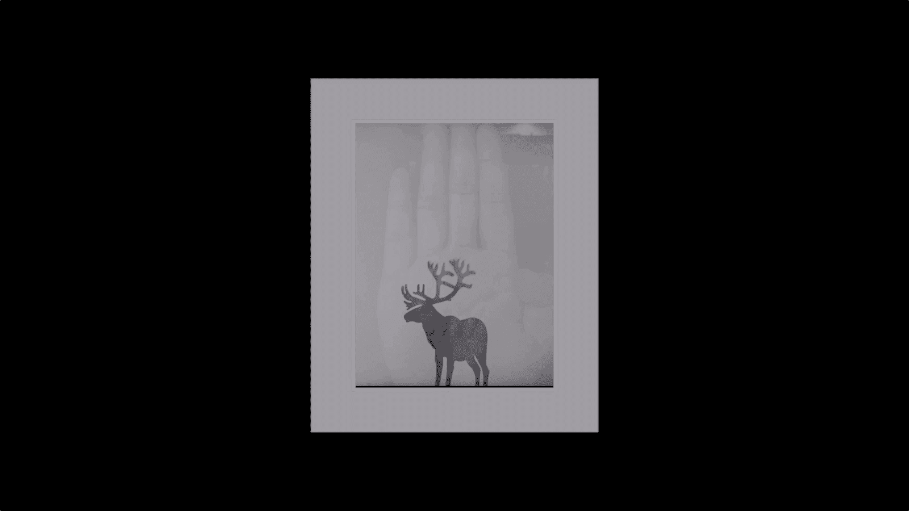

# 何雄-手机摄影教程：第05课·用手机做后期：课时13 · 多重曝光

OK现在我们跟大家演示一下一个非常好玩的一个一个一个拍摄手法，拍摄的1个APP就是胶接胶片模拟相机可大家都知道这个相机可以进行一个机内多重曝光的一个效果，而不是后期去弄。我们是在前期就给他拍的时候频以。

做到这点。好，我们就在高高手。的一个吉祥路进行做一为一个多重曝光的一个题材一个。被拍物，我们现在开始吧。呃，OK现在我们就打开了这个胶片模拟相机的一个这个相机。准备对一个高高手的一个吉祥物。

进行一个的二次曝重曝光的一个量这一个创作。OK我们现在。先拍一张，把右上角打开这个多重曝光那个一个。呃，开关。打开以后。就对一个路进行一个第一次曝光的拍摄。O。然后我们再把它高高手，我们把。

把这一个小路重抱在。我的手掌心上。ok。这就是一张应该。重报好的一个一个一个作品吧。我点开看的话它很棒。然后我们就进行这张照片进行一个啊后期的一个一个一个调整。因为有诸多一些长期的周边的不太那个。

一个完美的一个东西叫我们可以打开到。这个。打开。我们的这个一个就是sn，然后进行一个调整。我们首先可能他的照片有些不规格啊，我们进行一个一个。自由的裁剪。OK自由的拆剪的话，就把它。裁剪成一个数的构图。

因为我们的背景，高高路的那个高高处那个小吉祥物小路的背景的话有点。那个不太。哎，OK这就是一张锁。拍好的裁剪好的一个一个一张照片，一张高高露跟那个手的一个重抱的一个。还有色照片，我用这个。

给他进行一个保存，拆好以后。OK好，我们进行一个打开模式，看能不能行成。打开的方式，这个也说过的。在那拷贝到抗美家里面这这一个。一个过程OK我们导过去以后，我们进行它的一个。

又恢复到之前的一些创一些修图的一些。一些那个一个锐化这些模式进行一个颗粒。然后进行一个。饱和度的。加减O。亮度这曝光的个界。这个意图就是我让。这是呃几像物小度重抱在我的手掌心里面，它有一个呃一个对比。

然后背景是手的这个若隐若现的一一个。很有灵感的一1个一这样的一个一个创意。一个。效果OK我们让他这里把它。做成一个黑白的吧，黑白的一个对。呃，一个一个一个效果，我喜欢黑白它更。认为更有一种。

灵性的感觉把饱和度降低。然后我们在对比度上。进行一个反差的拉一下，OK景德周会一点。OK然后我们加一个。这里说到之前说到的一个叫装裱好的一个框的一个效果。OK进行一个完成。错准。

OK我们回到照片里面就可以。打开一张，刚刚太多了。打开一张刚刚在咱们这己拍的这张一张后退一个。作品的一个一个一个来检验它的一个一个效果。这就是一张作品的创作的一个过程。

🎼。

