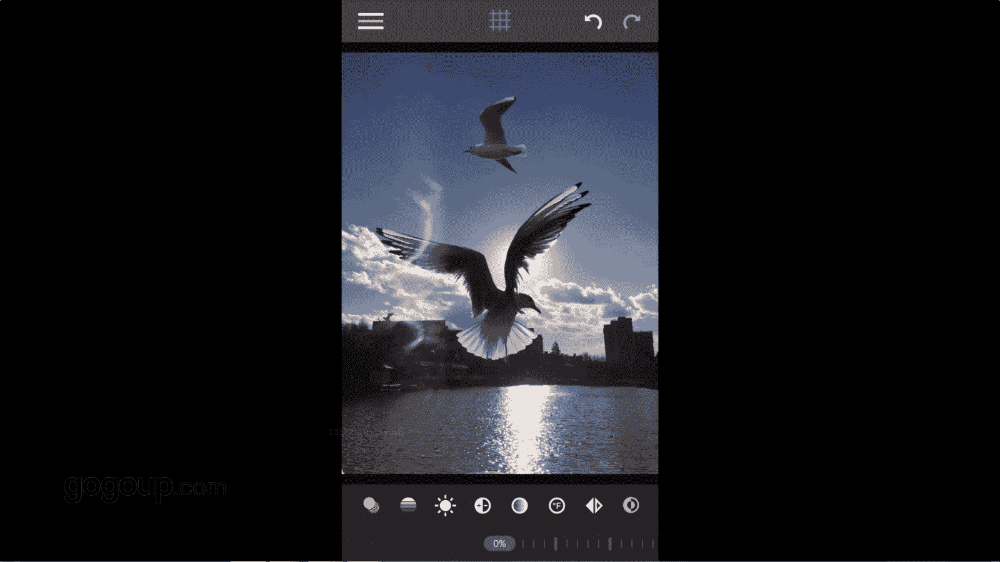

# 何雄-手机摄影教程：第05课·用手机做后期：课时14 · 抠图合成

好吧，我们肯定都看到很多网上很多手机的一些呃合成的那种重报模拟重报，应该大家后期重报的一些。呃，那个图片。都离不开一个软件，我觉得这应该就是这个优i。我们打开U你看来的优你。OK我们先打开用一下。

就看到一个一个大家看到一一个对一个界面是一个背景前景是嗯蒙版咱们第一步就先给它背景里面去加入一张照片。他们刚刚写好的一张对这张一张那一张海鸥这个背影的照片OK。

这个已把起转然后我们第二步是做到的是一个前景。就是我们所要把它进行一个抠脱的拿出一个情节的一个东西，一个照片。OK我们写了这张头上样一个一个只鸟飞过来，我想把这只鸟。抽了放在它这个把它去剔出来。

放在这个呃前景的上面，上方的天空。OK我们就可以用到一个第三步，打开蒙板。哎，蒙板里面有个橡皮擦。OK我们点到门板橡皮擦面点进去以后，它有一个魔术棒，对吧，有一个那个。对蒙办翻转。

还有一个对少这样的一个蒙板的一个红色的一个东西，大家我们看到的还有一个比例一下绘制图这样的一个东西，最后面这个是一个呃你要画笔的一个大小或者明暗度的一个一个调节下缩放。O我们用到用地就就把这个。就用到。

系。第一个用这个魔术棒。这个是非常简单一个东西的。手放在右。空气的地方的点击OK你看大家看到下，我们就把这个海鸥它对比很大的这海鸥，然后就给它就被我们给。给抠出来了。好，这个细性东西我们为了。啊。

我们就会用到。Okay。然后现在我们抠抠了海鸥就肯能就抠多了，然后把它还原到，可能把因为我们这个魔术棒的时候，它不那么精准。就会影响到把那个照片给对周机给偷了。OK那我们就这样子用到换到我们用的橡皮擦。

剩沙的话，我们就去。呃，把它给它周边的干，看他看到应该的很明显这个把它抹出。OK一个抹抽来，一个直接。长期的地放弃一个某处。Okay。对，抹出，然后我们可以把它放大来来擦。双手把双指打开放大的擦开。

再看到这个这这个很很一个很细的东西这样。这种尽量选一些比较干净的。对反正大的东西来进行一个扣展，它会很容易点。如果咱们用到对很复杂的Q的话，那个很费时的也可以做到。好，咱们这个就是把它已经插好了。

咱们回到一个前景。OK咱们就可以把这个秒。进行一个对看风道，还是看他的不够干净的话，怎么。再细细的扣他一下，再回到那个。公办明细。手指队把那个多余的地方给他擦了。做的精细一点。好。

刚才咱们把这个鸟可以就就这扣好了一个东西，扣好就是这个鸟不通。反正你放在地方，我们要对这种鸟的图进行一个的亮度。我们下面还有一个你看不透明或者亮度，或者我们现在看一下叠加，它正常的拍出来叠加。

他不行在这个对证明底价或者变量。这他一些的东西，我们不要大家，我们还是就用到一个。啊。曝光的对那只要进行曝光的一个补偿的亮度调整OK。这个就有一个很就很。很清晰的一个一个对比下啊，我们把这个对比度。

进行一阶段来进跟他周体。OK这就应该算就是这么咱们这里的话可以有个办法呀，这也很特别，可以可合并或者不合并。不合并的话，咱们就这样子扣出来这个鸟，咱们还可以就就当一个素材。

就彩咱们把这张照片给他哎保存起来，导出。O。这个你可以拥有这个素材，咱们你可以把它再换前景。OK我比如说换前景，换到一张嗯。随便找一张干。一个对。怎么修的一张图片你们去再给他叠下OK。

这样的他就更有一个一个一种特效果的。

🎼。

