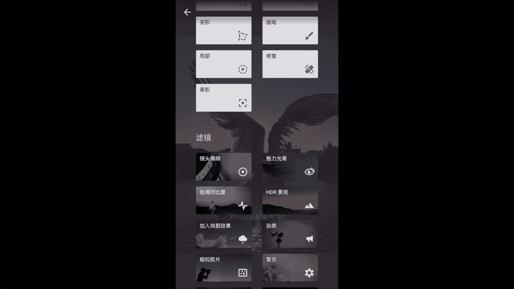

# 何雄-手机摄影教程：第05课·用手机做后期：课时2 · Snapseed局部处理

。

哎，好吧，我们再深的说几一个呃。sniapcent里面非常强大的一些功能，啊，就跟一些PS的room他们很强大的一个一个东西，对局部的一些处理。OK我们现在打开一张逆光拍摄的海鸥海鸥的照片。

看了照片在屏幕上的曝光不太是吧？有点欠爆的感。这个是为了当初我放大看一下，为了拍的时候让它更清晰。对一个一个光影的效果。所以说就拍的是拍的时候是他进行了一个。一个那个简报的。是这样的这样的1一个手法。

OK我们说怎么怎么去对应对应它进行它一个调整呢。OK我们点开以后有一个杠，咱们今天用到的是。调整裁剪，还有变形，这个没收到家在，然后这个变形就是一个调整图形的一个水平压左右的一个偏差。

然后锐化形转也用过咱们现在说到的这个画笔。哎，这个画笔也很强大的一个东西啊，点开画笔一下OK我们看一下。这画笔就相当于一个就是说在后期里面进行的一个EV叫曝光补偿的一个一个。一个。

给大家加减曝光的一个一个对局部性的修复的东西。你看我们看一下，点开以后这个加减曝光有个化肥电能量加减加光加光减光那的OK我们就。点到画笔。进行一个，现在是加，我们要让暗部给它加到个0。1。7。

中间有个1。7，可以这们给滑动到。OK咱们你看手指上进去轻轻的一滑动。我这羽毛的黑的这个部位下。旧存就。立马就进行了一个加加曝光的一个一个效果。你看我们给他家把这个曝光加到一点。OK这个就效果出来。

很明显，咱们可以看到这。这样的东西，一个东西咱们可以放大来的。对，这个地方来，比如放在一个局部这里的OK。这样的一个。OK看得到这个就很明显的一个一个那个咱们可能这个。不要这样的这这么这么重。

咱们回头看一下大大就很明显。我们不要这么重OK我们再重复一下就。他在画笔的眼里画笔研究是一个曝光补偿。啊，曝光你看加减，就是接着加0。3减0。3相比差去差一些。就是你要需要给他每个区域。

比如说我要给这个暗部这个翅膀地方进行一个一个。曝光的一个一个。加曝光的下，OK我把它加到11点11。31。0。7OK。大家看到一个变先修改变变化。OK你看。像暗部的一个细节的一个东西样。

就非常非常明显就把它细节的。即可以到个直或者子O啊。大家看这对这个明显的一个一个阴影部分的一个这个细节。错了OK我们可以看一下这。放大看好。这个部位刚刚动过的这。

他就一个非常非常明显的一个一个一个曝光的一个。一个加大的曝光的一个透度暗部的一个细节啊。这是就是在相当于说就是曝光补偿拍摄的时候的在弥补后期拍摄。拍摄时候的一个呃一个不足。

我们再看在某某某这个地方的请这个地方的一个节目OK。我们打开画比较。O。好吧，我们再进行一个剪吧，我们再进的我们可以说对这个光特强地方进行剪，我们去试验现在这个一个一个一个演示。现在是加点。

我们点到下面这个OK进行一个减。减0。5。减10。5就OK，这样减1。5OK然后进一个。化为机器。去检干他就有个很明显的一个。变化什么的。一个变化，我们再再减到个1。0吧。对，大家看到没有？

这以次间的东西就就比较的一个高光地方，就给它有一个。一个非常明显的一个一个。OK我看是吧，哎，它就出现了一个泛黄的透东西，就没那么高光过的一个效果。OK。我来看。

这个地方的它就有个明显非常明显明显的一个东西，跟暗部这个底的。咱们可以看到眼片嘛，眼片里黑的是吧？这很直观的。现在咱们看眼片这个翅膀缝的地方就是黑的，然后咱们把它放了修补一下。他的地方就非常的明显。

这就是一个非常牛的一个地方。他对结肤进行个处理。好吧，说完这个我们再进行说另外一个，今天可能就后修复可能好多没用。这接触也很强大。呃，就相当于说PS里面的一个某某出的一个一个东西。好。

我们试一下对一些一些几部的地方或者树枝啊，或者一些干扰到你的图面前画的一鸟啊，或者一些其他的一些可能会碰到我拍张图西的后，周围有一些呃一些。穿屏的对，进入屏幕中间的。你看比如说这个我们放大到这个地方。

我们可以演示一下这个起号我下面水面稿，好像不要不要它的okK。我们可以。OK打开这个。放得。还有这个。嗯操作这左手有点太顺大，我们把它还OK。打开话呗也不该OK打开修复。OK我们看看这里有一个对。

好自己给他自己给他抹出吧。就是修复。OK没的，打家看了吧。这还有问给没了。我们再把这两个海围给他没了。这个是一个一个演示的。没了。O。这就汽车污点很棒的一个。一个东西你看把这个这黑的地方这个还鸥。没个。

这是很细小的一个污点的修复。我感你看到。我们OK我们看这个地方，他没有任何的一个。很残非常几乎没有什么看不到什么痕迹。这以前的海鸥我们再对比一下，看看这个部位它是有OK你看这里有三个小海鸥的。这地方。

现在被我们弄了没有大家。这个就是修后的没了。这是一个对修修复的一个东西软件。还有一个我们说的一个对。今天没动了一个局部，局部这个很很很牛逼的下，很牛的一个东西，对吧？好看，我们请打开局部。

这几部之况就对某个点非常微妙的一点进行曝光和对比度。亮度对比度合的一个饱和度的一个修复。我们演示一下。打开的时后，左左下角有个小加号的对右下角这个是，然后我们就点到我们要需要进行处理的地方。

OK你看我会在这个地方在它的暗部的地方，我们按住这个屏幕亮度的话。它上下滑动它有一个对比跟饱和度是？也就是说这个它在底部很多很很微小的几部上进行一个一个调整。你看我们的把饱和度加加高的话，我们给它放大。

它就整体的一个一个东西。然后还有这个很特别的地方，它可以说按照它不放的话，咱们可以拷贝。简洁删除重置着拷贝，我们再把它拷贝在地方安加号OK。它就同样的亮度也在加在地方的啊，咱们饱和度加地方的。

咱们把饱和度刚刚复制饱和度就okK。他就审计了很多东西的，咱们可以看下到它这个一个一个一个细小的保留的一个一个变化。这个是重复可以做很多次的一个一一个东西。然后咱们可以对呃比如对比度，我把它点一下，哎。

拷贝这个地方。一个添加粘贴OK这是整齐的你重复动。一个步骤OK你看我把加亮度。这样的东西，我们把时光里还有个特别东西，它像一个方大镜一样，可以看到你局部的一些对呃一些效果的一个。细节。这就是。

啊那个这个局部调整的一个一个优点。他跟。咱们刚说到这个画笔下，有一个区别的画笔的话，它它同样有的加减曝光就跟一V加减曝光，还有色温外那个饱和度都有。但这个的话要更精确一些的，咱们给以放大。

照片去进行他一个点到画笔大家我们要写的时候啊，好饱和度OK我们给他加饱和，就到10%的。进行的一个一个to。好看看你看我看比如说看到我们这个地方的一个。光嗯有暖调的一个透逆光地方。OK。你看。

它会更精细的涂抹的涂抹涂抹的时候，更精细的让你那个所在部位的一个的更凸显的一个一个效果啊。OK咱们看到这个。我们打勾。我们就就就是颜片，大家看到应该没有？这翅膀那个饱和度那个暖那个黄发黄那种暖度的话。

它就很低。经过我们用那个。一用到这个就画笔的画，他就给他凸显了一个非常非常明显的一个效。OK这是。大概这是一个这个那个。画笔跟那个。局部的应用。

当然变形这个东西我们说下的变形的它是一个我们花掉就好多时候拍到风景照片的水平价不够平的话，你看我们这样可以调动水平。左右这个说下同同水评价。啊，上下段它垂直的也右端，就是一些。

变形的照片或者光源照片可进行个水平拉伸的也有的水平，它作为一个一个表白的一个。这是一个就最基本的攻具党里面非常常见的这应该是对9个1个一个效果我们都听说。还有阴影段。

阴影的话就这个很简单就很多好多就问到时像黑白胶片，为什么一个暗角短处理的段，它就是一个阴影的，阴影很特别，我们可以放大它的暗角的大小，也可以对循它的暗角的外部的亮度的一个。你看加减，我们给它外部很亮。

阴影的是亮的一个阴影，也可以说暗的阴影，内部也可以进行一个亮度的一个。嗯一个一个你看内部的一个亮度的一个。一个加紧。讲。对，你看他们看到地方就非常非常那个。啊，非常的那个一个一个很很亮。

咱们可以演变就干染黑的，咱们镜天内部的一个一个调整，它就变得很这。这个肯定用于喜欢按钮的朋友的这些突出主题的一些效果。你可以用这个呃阴影来控制它的一个一个特效。

这是简单的一个叫啊在工具里面的非常实用的几个就这么久项，我们都已经说啊啊说的近的话的这个咱们也可以尝试一下一些杂志嗯或者是叫魅力光影啊东西它都有一个特性对的镜镜头那个模糊啊。

这个就肯定是一个在就是像前的一个细化我要他说的地方清晰。嗯，不不要的地方呢进行一个模糊是吧？这个最主体的一个一个一个一个凸现。行OK下面这滤镜的话都是一个一切性可调性的一些性的一个滤镜。有镜头模糊啊。

这当大家咱们就点进去以后进行接一些这就看到效果的非常明显的效果。然后上面这些工具的话，可能就自我性，就自自己呃控制性很强的一些东西叫，他没有被一些东西啊。这个我们就下面的这个滤镜就不细详说了。

大家点进去可以可以进行一个叫详细的一个直观的个一个了解或者看到。

O。

あ。