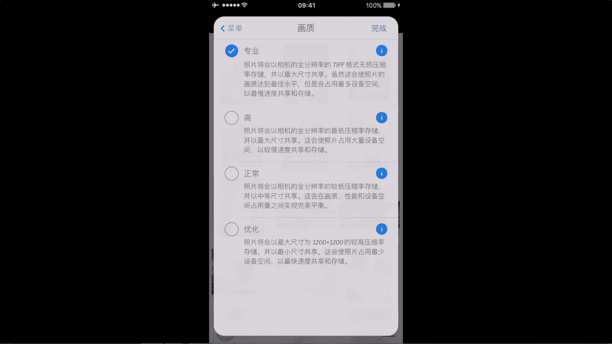
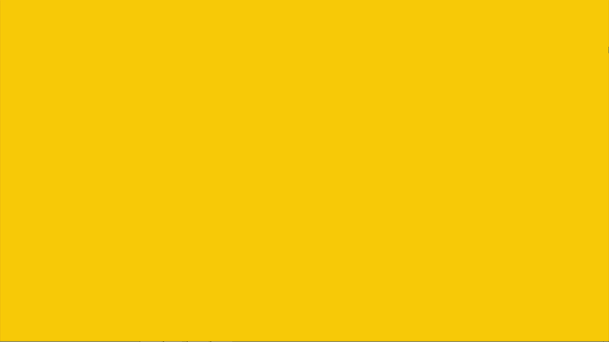

# 何雄-手机摄影教程：第05课·用手机做后期：课时3 · Camera+ 

好吧，我们现在分享的是呃我修图的第二个第2个APP是啊是抗美佳的。大家看到就就是中间这一个的呃这一个软件，我们会在屏幕上首先点点击进入。他你看我这边导入的一些照片啊，点击右手上角的那个加号。

我们进行嫌弃照片。这会嫌起这个显片的一些段。那照片或者选得随便写择一张看横的。是的吧。嗯这样下面看点击它那个点上勾以后，然后右下角有一个道入，我们点导入进去。OK它就可以近期的照片。

你看它下面有几个图标，一个编辑共享储存在有个信息信息点进去可以看到照片的一个你看简单的一个参数，什么手机拍的啊，然后后面有一个尺寸啊，对多大的容积下，你看勾P机的它这个默认的一个东西。

它以及它的呃快门速度跟那个AS有那个高杆的一个参数或者是加减曝光，看它一个地方，啊因V0。51这样的一个简单的一个参数，这个是对照片的一个一个观看。然后我们就进行它一些剪辑的编辑的话呃。

剪击就我们要进行照片的调试，或者是修图片，我们就就编辑。他就把照片掉倒入进去了。然后下面有一个你看有个清晰度，自动闪光、肖像啊，美食以及逆光、一个夜光这些呃大家画都能看到的有日光的很多这些是一个场景。

就相当于相机的一个呃场景模式的，自动或者场景模式的一个一个设置上。这个一般我很少用的，可以到清晰度，我们可以看一下的点清晰录进去，它就会一个自动的一个映射。但这个调不了。这个很很调不了。

这个东西我不擅长大家用他这种你看他就调不了或者自动的行。他是调不了的东西，我们就把它关了。他最好的一个东西就是他说的是他这个在旋转上面很棒，下面你看个裁剪，有个这个英文怎么说，我还说不。

这样的一个叫下面有几个特效，有边框的，有有一个我点给大看看的一个裁剪啊，然后裁剪它里面有很多的一个呃有沿图，一个黄金分割的，它就有一个对，后面呢有方框方方图的，这也是裁剪的一个东西。

当然说这里说它的优点的话，它是在旋转上面。我们就尝试一下，现在我刚刚这张片子，给我裁成一个方图吧。好，我们可以给它家回原到起，这个很特别亮。回到方土，我们回到眼前屋没有裁剪，然后我们进行一个呃。

这个一个旋转这旋转跟snap胜跟那很多软件不具备的东西转旋转。你看它下面有个左右，我们可以就点击下面那些东西来尝试一下。你看它是这样的，这样，这个是很常见左右是吧？

这个是一般的地址的那些一些软件都可以做到。嗯，这个可能对。左右颠倒，这个很能就就很多软件不可能的这。这个是很强大的一个东西，不可以这样子的这就一个一个行业进像这一样样那个这样偏偏幅车这样的感对吧？

这样的一个东西是吧？但它下面有很多也有像很多东西在拉直的对，这个东西也是一个就最照片的一个修复的一个水平线的修复。这样子对吧可以这样子去进行一个调整。我这样子这样的一个就拉着他一个行的，还有它色彩啊。

或者色调这东西也很特别，这个就非常强大。它还有个更强大的地方，我跟大家演示一下，你看我们你看这个还可以拍照，它这个有像机这个地方拍照，他拍照的很特别地方，还得说一下，他可以我们演示一下。

他可以有一个那个。测光跟对焦的一个一个一个一个呃分开分期。你看我们现在这样子，你看它是一个这个是一个曝光。你看我们最黑的地方。啊，我们对这个暗的地方的话，你看它的光线就亮的地暗亮的地方的话。

它光线就会那样子。这个焦点我们要这里清晰。他很清细，然后我们测光给测到这里的。可以分期，它会有个变化。你看。在最亮的地方，测光的话，它就显得很暗，在暗的地方测光它它就整体很亮，这个是一个拍摄的地方。

唯一这个软件里面很特点的一个地方，我们拍的时候可以进测光跟那个跟对焦分开来操作它。这是软件的一个优势。最要说的就是设置上面最重要的一点就是左右下角的这个三个横线这个标志啊。

它就是一个一个就是你这个整体的这个软件APP的一个设置啊，或者商店购买。大家看到这音量的开关，网格的一些添加水平线。以及地理坐标都给打开，就是它一个1个GPS定位的定位的一样的东西。

流程他的一11个一个轴面的东西。最要说的话，我们要说的就是这个画质。大概那个画质这，画质的话，我点到的是一个。对你看专业画质，我们后面一个小的感叹号，我们就给他点击看下。

它专业画质的话是将分辨利的TF格式无损的压缩促成，这是非常非常关键。大家记住一点的很强的一个地方。都知道，应该巷子里面有个TF或者room格式这样的这样的格式的话，它是保证了招聘的最大的原始数据。

为什么这样保存呢？他可能会占很大的容量，但他在你后期输出上。是有非常大的一个优势。咱们可能照片会到一个输出，专家地方打印输出的放大这样的一个过程的。这个保存的话，还有一个很强的地方就是它。

无论你怎么转存它，从手机短导到电脑电脑导到，再导到其他的软件，在其他的那个U盘或者硬盘的话，它重复导的话，它不会对你的照片进行一个一个损失。但呃这个JPG的JPG的那种格式的话，就肯定会越导越损失。

很厉害。对吧？他可能以前三兆会导致后面后面导多少的时候会一兆2兆这样的一个减释的，它有三个选择的有个优化。它下面你看点单的它有时候至000现的一个长边。然后正常他后面点开看。

它是一个将照片压缩为的储存的格式者。这个一般你的分享网上分享啊，这样的话它会占在空间。还有高的话高的话它也是从一个没有压缩的最低的压缩力的一个东西就可能就像咱们电脑处理的时候。

它有一个机细的或者是终端的995%的这样一个这样效果的。但是我如果好照片的话，我建议就这它相调我就把它转成为专业专业它就替合格式者可能占的空间多点。但它在保证的那个。

照片的质量或者画质是最完美、最细节、最多的最丰富的一样的一个东西。好。

🎼。