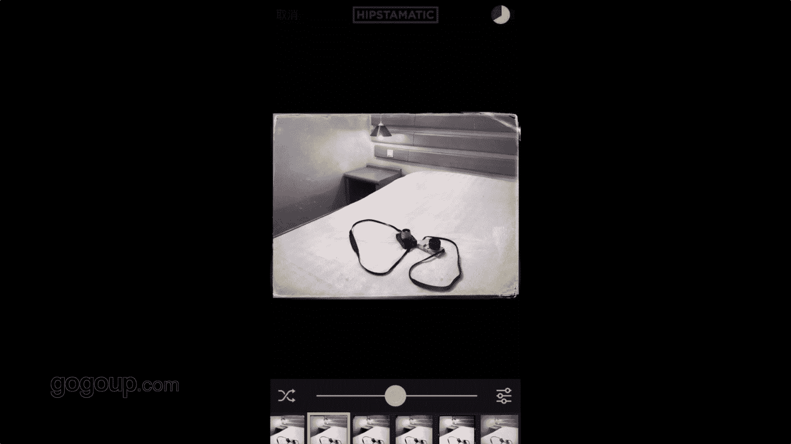

# 何雄-手机摄影教程：第05课·用手机做后期：课时5 · Hipstamatic  

好，现在咱们就说到这个叫胶片模拟相机。最后一个第6个的哎，我我一般仅能到HAP的这个大家都知道他应该中文翻译是胶片模拟相机，这也是很强大的一个软件。我们打开以后，它也可以同样可以拍照，看同样可以拍照。

但这个有个缺点，拍照的话，它不可以测光，不可以对焦。钱是全自动的。你怎么触摸屏，它都不会有个东西，对对，它可以放大。这个对焦，它对焦的话其可以对这种有点相机感，它有个长定焦的形式。

你看你看这个下面这个图它也可以对。点到这里一个下面有个M站，就应该是像像子的M档，然后他有个你看演出的风景，最顶上的风景这样这样的一个东西，我就不细演示了。在随后的修图里面会跟大家说。

大家去下到以后去研究。对，还有一个东西它这里拍摄的话，它有1比1、5比47比53比啊这样的各个尺寸的一个比例的拍摄，就是左下角它有一个图你看我的拍的头库。啊，打开进去以后图库里面进去以后。

他我就选一张照片吧啊这样写一张照片进行一个。他你看这个也很很很呃很棒的一个软件，它下面有一个什么拍的，它有一个记录。然后看到一个全部照片，下面一个删除加薪，这个就是应该收藏。然后有3个小圆点。

这个它是一个滤镜。这个的定金这化就他有很强的一些。一些特效，这特效它有几上百种的一个镜头跟胶片的组合。但我们根据我们自己习惯进行设置一些最爱看，这个他没给我们变换一下它的影调。它这个好的一点的饮调的话。

你看啊它会有一个特好的一个东西。它我最推荐的里面的是一个饰板。他的一个石板的一个一个效果。啊，对，释放效果就很大的很很很传统很很古老的一个效果是。点到点进去后咱们示办效果的话。

我们可以看到它上面点进去示板它有的。啊，一个一个一样的效果的。回头可能我后面的那个一个书图上面是吧，会跟大家带大家怎么去一步步的去修来完善。嗯，跟大家更直观的分享这个软件它的呃每步的操作的详细那个过程。

🎼Yeah。

