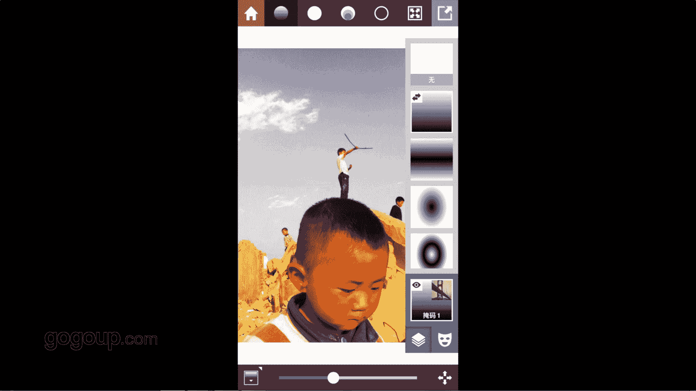

# 何雄-手机摄影教程：第05课·用手机做后期：课时7 · Stackables 

。

好，这现在跟大家分享的这个最后一个软件，就是我常用的软件，这个叫suckible。这个这个软件是非常冷门的这。可能大家好多人没用到啊，但是我最近也在用它，我们进去看一看它这一段一个一个特效东西。

它也很棒的一个软件。啊，点开以后这个作边一个图片，你在加我们就选一张照片进去。对形状像我早期拍了一张很棒的一张影片，这样进这个软件的特点再说一下非常冷门。

但是也它有个很强大这个对图层叠加或者种这样的一个东西跟PS里面还这个每个图层的叠加可以分开和合并这样的一个功能很强大。点点开咱们看到屏上么屏障你看上面有一个有个JPG偏机以及T下这个更牛的地方。

我再说一遍，后我再说出图片上一直很重视照片打出来的样子触摸到那个JPG片机以及T然后右边打勾。他下面还有一个一个很强的东西，你看他有那比例。原片，然后1比14比33比2，然后16比9。他瘦了就会以竖的。

它很很很很智能，竖了就给你竖了裁，很着就给你很多材质，它就很智能这，你可以自由裁的。你可以这样子，它有这样的一个一个一个功能，一般我连片，然后打TF就打勾。进行一个显择性展。

你看它这边有上面有很多一个滤镜啊啊这些一些特效，一些头层啊，一些这锐度啊，颗粒加点东西的。还有一个，它有还它还有一个最后面倒数上面的一个右上角的第二个这边的一个像瓶子一样这样的图，它是一个艺设。

这个预设是咱们也可以进行回调的，它它是预设，有些好多的经典的一些艺设东西，像就像乐视鲁麻之类的一些多一些。它有你看这个石板的艺式。很多很多这个力境里面非常的强大。嗯，是这样的一个东西，我们可以尝试一下。

对吧，就随便。做一下这个东西，它的拖然叠加，你看这左下右下角它是有一个你看内镜的一个强度，你可以进行它一个一个左右滑动。一个强度的一个加减是吧。然后右下角靠上面有个小脸谱跟加号这一方，你看点开加号。

它有个添加图层，你可以再重复重复在一张照片进进行叠加它很多特效质感啊纹理啊的特效的东西样，可以复制图层，也可以删图层这样最后把它合并所有图层成为一张像PS面的一张啊。你做好了一张片子。

这小脸谱它是一个对一个一个一个阴影东西的一个五的阴影的一个一个引照的一个。你看所谓的一个一个一个变换。反正这里最强大的这个软件就很冷门，大家可能用不到，但它里面的很多的纹理东西。

以及最后面处理成保存确的一个一一个一个一个一个那个效果是非常非常强大的是吧。好，这个软件就随后的呃后期里面我会跟大家再也是进行一个演示，保存或者怎么修修一张照片，怎么立即叠加的这样的一个。

过程。

Yeah。