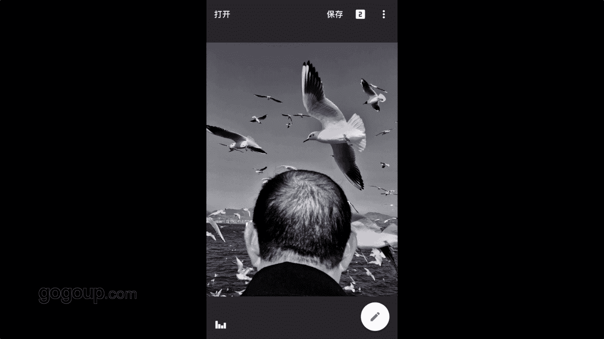

# 何雄-手机摄影教程：第05课·用手机做后期：课时8 · 黑白影调

。哎，好吧，我们现在进行就是后期一个黑白。对第一部黑白的一个一个。作品的一个。囚徒。好，我们就还是回到。我们APP的第一个n send里面点开以后。啊，好，这张片子是我刚刚点写进去的一个片子是吧？

呃一张当初我们一起就是外拍的时候，一个海鸥的呃，这张片子是中午拍的。然后我这戏里鸟人戏里面有很多一个人跟进景一个鸟人鸟跟人的一个对比的这些戏里爷爷的一个背影跟头上很多鸟非东西，我会让他来。

这种呃让他来做成一个黑白的是，这个黑白我会一及到他看到照片的话，我这个思路就一直到他把它做成一个高对比。呃，对一个。后期的一个黑白障效果。这是我对这张照品的一个叫赋予他的我的一个一个一个思路。好。

我们可能就这样子看到之后，我就会进行。一个。这个为什么要给它做成黑白的一东西？因为它我的鸟人器里面就啊有很多黑白，的黑白的话很纯粹。这种高光很过火的对比的情况的话，黑白的话让感到是一种。呃。

更纯粹的一个调子啊或者一个展示的一个非常。啊，有那种简单或者是纯粹的一个味道的1个111个效果。好，我们点开我们现在就点到右下角的一个这个图标里面进行一个。好，这个我思路里面有会用到电影黑白效果。

黑白电影的这样的一个滤境。第一步好，大家看到同这个点点进去以后，他是默认到我01呃H01H02可这这两个是我非常推崇，它的影调可能有一些变化。你看第一个时候它会一样。

我不喜欢我喜欢一种纯粹个人的一个思路据，它是一个呃有颗粒高对比的一这样的这样的一一个一一个影像，但这个效果里面它的高光很很重，我可能会把它那个颗粒感不要，因为这个里面的这个软件的颗粒感我不太喜欢。

它对照片有些很很损伤很大，我把它颗粒感到底为啥这到里面上。就看到画面，咱们看到画面就没有颗粒感了的他有一种嗯很很滑丽感觉的很。好，我们就把亮度减一减。再把这个为什么柔柔焦它这个很特别东西。

你看我看到柔焦画筒的话，它有一个柔和的一个引料的一个过渡，明暗灰度的过度是吧？一般这种情况的话，我不会动它，这个给大家演示一下，不会动它。因为这张片子我需要的是一个高对比。

所以说用到电影颗粒这个东西就它非常适合我要的效果，然后打勾。好，我们现这张这张照片，现在是我们处进第一步是用到那个高对电影电影黑白电影效果的一个一个滤镜。好，我们按照照片上面看的这个就它是原片。

这个很特别的颜片它它还原到一沿片的去，手放开的时候，它就导致我调好的效果。好，这一步弄好以后，我会进行。因为咱们看到画面的高光有点过或者有点比较跳，还不够那么那么厚重。好。

我来进行一个啊咱们攻击栏里面的图片调整。图片投整的话，我们手放到屏幕上进画动，它一个有一个亮度跟还是重复一下亮度氛围对比啊。高光刚刚咱们在软件里面说过一些。尽张它的它的一些功能。好，我们在氛围里面。

这个跟HDR向氛围里面去进行一个加。他会把暗部的细节，你看也也有这个领领口的部分的细节就会有一个很明的一个对比亮了。然后他的高光顾，专门请到叫高光姐。一定把它高光这个剪，进行高光镜剪。咱们看到它变化。

还的那个海鸥度呃服部的一个变化就会没那么的那么那么刺眼这样的一一个一个一个简便一个变化过程这。好，这个就是一个我要做的黑白的目的，但这还不够达到要求。

我们还会进行它一个呃阴影的一个一个一个看我们放阴影的一个对比。我要强烈对比，刚刚说过，我要给它一个做一个高对比的一东西，我就把阴影减到30减减向右边滑左边滑动减下来。这样对比更强烈一点是吧？好。

这张照片就可以说这个是一个呃简单的这个步骤在里面已经做成了，我给它保存，但还没有完成没有完成这，我还要给我相应的一个东西。啊，保存副本。好，我们现在这个是没有完成的。

我们就把这张照片这个做到最后完整的一个保存或者到输出的一个效果。我退出。我打开。我有一个那个抗美家这个软件咱们也提到过是吧？好，右上角的一个加号里面进行器。把刚刚这张修好的这张照片进行一个导入。

点击以后导入点点击照片进右下角的一个导入。好，导里面讲我们看一下参数，我们也讲这个本人的反应，可能是我的一个习惯。他会告诉你，那有这个照片有三照，他多大尺寸，然后什么拍的，这个也是习惯看一下的。

他们有没有变化。好，OK我们点到编辑。并下的这个一个编辑。这里很关键编辑的话，这个为什么我这里说到这，它下面有一段有这个我们尝试一下它一个清晰度。第一个就是场景，就跟相子里面场景的说的。

灯们收到过一些什么子环境啊、灯光啊，或者是自自动啊、闪光啊这样这样的一个，咱们可以点击看一下这个你看这一个清晰度。这个太清晰，这个有这种它不可调的，我们不用打，我会进入第下面第最下面的这个简接。

后面这个一个滤镜的一个第三件器微调里面去把这个这很关键，把饱和度。本来看到黑黑白的家就没箱保住是吧？我把它这到对里，这个是对照片的一个还言。黑白的一个环颜的OK。这样的一个谎言。对？好。

这个很关键的步骤来了是，咱们说的关键步骤来了，就是就是到一个一个照聘的锐化好姐姐。我们刚说到高对比一定要颗技一下，这种氛围才够强烈。我们之前。没有用到那个snapson的颗粒，就它不够好。

我觉得这个强景的颗粒，它的这个抗美家的里面的颗粒感，或者它这个有一个电影颗粒胶片颗粒非常好，非常牛。然后我把这个锐化，首先来锐化好，这个锐化可以加到10%左右，看变化，它也可以点大来看大家大看这个。

有还很细，当时叫对着天空的。这这个这样的一个一个锐化好打勾。然后进行一个胶片颗粒，这非常关键。这个有一个很让画面非常结实的。好，我们看一下那个十7这样的画筒。这点了看。明显变化，它的颗粒就非常的紧密。

他的输出状的话就放心，它它跟那个输出纸张的一个部稳，它就非常一个吻合是吧？这颗粒板非常机密。OK我们这样子一做一个呃一个高对比。然后我们再就得他他那个高光还是开过，我们这里有个曝光补偿。我们不动它。

我们来动它一下，不它，我们动了一个一个高光和阴影。看没，右下角高光镜，这个点进去以后。它这个可以细细化的变化，你看阴影的，我们向右减上加，向右加的话，就阴影就很很很厚重，就阴影了。

然后我们下面阴阴阴影的细节在暗部的细节这样的一个一个加减的。All down to I hope。这张照片就算一个完整，我们知道说到过刚刚好，我们加个框，这个我是一个习惯的，可能会加一个框。

或对它框的显性很强。刚刚没说这个照片的框，他这个加框很牛的地方，它是在你作品。对外围加框在你原有的800万上面进行一个扩加，就不止800万的照片的。它不是像康美家啊，像那个n的很多照片，它很多软件的。

它是在你照片的原有数据上进行拆拆解。去加康保持验的视度那种的就损失了你画面本来的一一个一个呃一个那个。啊，尺寸好，再加框的话，这个是一个啊我习惯它很多框，咱们看着删除角的有这种黑像框，还有一个模拟。

很喜欢这模拟的一个一个像装裱或者框的。咱们进来放大看的它一个装裱的模拟的一个线的框，这个是个软件的，刚刚没收到很强的一个地方，它是在你看它一个模拟的这一个框装裱的框。

这个时咱们可以说一个照片需要呃一些效果的话，对这个框来做下的。我们装出来效果会什么样的效果，这个是一个东西。我不这个但照片可能很小气。我就用第一个来进行一个好完成。完成了以后，这个就完成这过后。

我们还记住还会到那个地方要一定要看一下，或者设置的时候，看右下角有三个线这个地方我们还回头刚刚也提到过再重复遍一个场景专业画质的问题叫我们来看看。好，他是专辑的TF格式的。好。

因为这张照片我很喜欢我要把它这样重这样的话，给他保证无损的TF格式的话，因为我想说出它，这是4张觉得我认可的一张作品。进行一个初转。好，我在康伟家里面加了一些锐化跟电影颗粒。以后啊就发现了一个对，因为。

一些高光溢出或者是它没有那么啊跟sniipson的调的就有些变化。OK我就来这里来进行在他这个软件com夹里面进行一个调整，进行高光阴影部分的一个控制。然后。为什么这条呢？因为我这里要保存tf格式。

在snap里面，它保存不了tF格式。😡，在这里保证性不可说掉，这也是还有回到家。刚刚为什么会把饱和度降低，也是就是他这个经过软件的转换，它变到另外一个软件里面，从康美加到。😡，呃。

从那个sniip到康美加这个这过程中的，它的两个算法计算方法肯计算方法肯定不一样，可能会有一些差差别的。所以说我要保存的话。

就这里再重复一些曾经他在sipson里面的一些一些操作的一些一些效果来保证他这种照片的这。啊，更好更完整的更纯粹的一个效果。所以说我选择在这里面来动一些高光，或者是引以那个颗粒感加。来保存这张照片。

