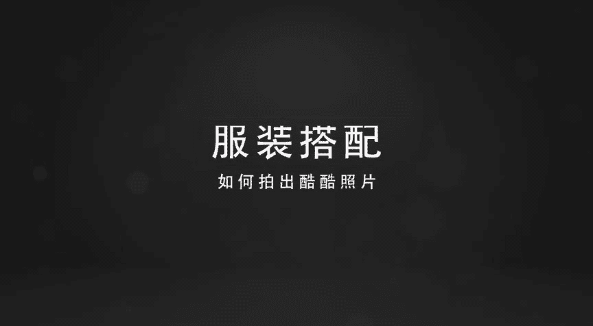
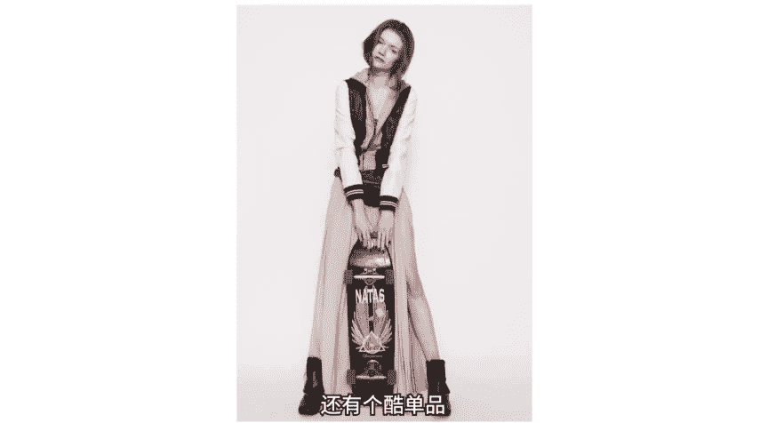

# 小北-《小北手机摄影课堂》：手机摄影正课：11期：11期、综合实战：教男友拍出酷酷的自己！

🎼hello，大家好，欢迎来到新一期的小北手机摄影课堂。我是想和大家一起帅三代美三代的小北。上节课呢我们一起学习了文艺清新风格照片的拍法和修法。这节课我们换一种风格。

我将跟大家聊一聊如何拍出酷酷风格的照片。那么拍酷照核心分为两个部分。第一部分呢是前期准备，也就是从我们站到镜头里到按下快门之前，应该做好的全部准备工作，我将从服装搭配酷照pos方面切入。

带你看足够多的酷照拍摄套路。当我们这些前期工作都做充分之后，接下来的拍照或者说按快门，也就变成了一个再简单不过的事情，而后期修图方面则更加侧重于图片色调风格的调整。我会将具体的修图案例，穿插到视频中。

🎼当你在拍得一张照片后，通过调整照片的色彩、色调获得一张酷酷的照片。好的，下面我们就一起进入课程的第一部分服装搭配。

🎼说到服装方面，那么我们怎么穿才能拍出酷酷的照片呢？首先第一点要说的就是要穿黑色系的衣服。有人说酷女生一般都只穿黑白灰这三种基础色，其中黑色尤其能体现出裤劲儿。🎼因为黑色显得内敛和神秘。

既帅又酷又显气场，有气场有气势的大场面，大多数情况下还都是黑色穿搭的功劳。所以想要耍酷，家中常备一袭黑衣还是很有必要的。如果我们抛开颜值，即使不露脸拍照，单凭一套黑色系的搭配，也能够拍出酷酷的照片。

🎼除了黑色系搭配以外，以棒球服、连帽衫为代表的运动风衣着，也能体现出少年感，穿上这些运动风的衣服，分分钟帅过男朋友，在拍摄时可以让模特面无表情的把卫衣帽子戴上，注意一定是面无表情，然后按下快门。

一张卫衣裤照就拍好了。🎼我们还可以利用卫衣上面的金属元素，甚至帽子上的细绳来辅助我们扮裤。当然，如果你身材比较好，你可以直接选择穿着健身衣，怎么拍都很酷。🎼oversize男友风是最近非常流行的元素。

穿上松松大大的衣服，除了能拍出酷酷的照片，更能给你很大的安全感，或者你还可以找一件酷酷的黑色大衣披在身上。🎼由于和里边的白色卫衣有长度差，在视觉上还能够提高我们的腰线，本身的大长腿就会显得更长了。另外。

我们在拍摄裤照时，如果没有合适的背景，只是普通的砖墙怎么办呢？很简单，我们只需要从人物的前侧面45度进行拍摄，就可以营造出纵深感了，而纵深感可以将观看者的视线聚集到人物身上，起到突出主体人物的作用。

🎼除了刚才所展示的搭配以外呢，其实还有很多各式各样的裤服装。比如说破洞牛仔裤啊、机车、皮衣啊、牛仔外套啊等等。这里我就不再一一列举了。那么接下来呢我再给大家推荐几个半裤单品。第一个是鸭舌帽。

鸭舌帽通常与时尚风结合。许多时尚达人都喜欢用鸭舌帽来进行时装搭配。🎼除了鸭舌帽以外，墨镜也是半裤必备单品。以前墨镜更多是为了遮挡刺眼的阳光，但随着潮流的发展，太阳镜更成了大家心中潮人的时髦利器。

如果你觉得自己没办法摆好最适合的眼神。那么墨镜就有自带冷酷的功能，即使是一身休闲随意的打扮，搭配上时尚的太阳镜也能立刻拥有明星范，戴前戴后，判若两人谁用谁知道？当然了，如果你觉得太阳不强烈的时候。

戴墨镜很傻，可以选择戴一个时尚的大镜框，戴一个大镜框，不仅可以帮助我们半裤，它还能够修饰脸型，我们可以看到，这是没戴眼镜的时候，和之前戴上时对比差别还是很大的。说到常用的半裤单品。

牛仔衣也是一种很好的选择。只需要把它披在肩上，分分钟就可以变酷。虽然很常见，但是真的是难得的正面拍，背面拍都可以扮。🎼酷的单品。除此之外呢，还有纹身，纹身可以说是个性十足了。如果你拥有漂亮的大花臂。

随便拍都会显得很酷。你说妈妈不让我纹身怎么办呢？很简单，使用纹身贴就可以了。还有个酷单品是滑板，它代表着年轻力量，勇气自由。

🎼每当我们说到拍照pose，那肯定就不得不说剪刀手。🎼剪刀手可能是这个全世界使用人数最多的拍照pos了。但是呢我觉得用多了也会伤身体。咱们可以想象一下，在多年以后，当你翻看自己走遍过大半个地球的照片。

🎼发型在变，衣服在变，笑容在变，背着书包在变，风景在变，天气在变，甚至在画面中在你身边意起合影的男朋友、女朋友都在变，但是剪刀手却是永恒的。所以在这里。

小北希望大家能够从下面的这些pose中挑选出一个你最喜欢的成为你新的拍照标志性动作。🎼。🎼第一个pose是面瘫同学们的福音，因为他完全不需要摆，不会笑或者不擅长做各种表情的同学们。

只需要像平常一样面瘫或者面无表情就OK了。对于爱笑表情丰富，不表演会死的同学们想要做冷漠脸，其实也很简单，只需要注意一点，那就是憋住不许笑，一笑就破功了。做出抬高头仰视一切的pos，是拍酷照的一个捷径。

居高临下的冷漠脸，让你分分钟变为一个哭狗。冷漠脸，我们可以做低头不开心的表情，或者在拍摄现场，我们可以让模特面无表情的转向镜头，然后在转过来的同时进行抓拍就可以了。🎼除了正面冷漠脸以外。

侧脸好看的同学们也可以选择侧对镜头，抬头pos会显得人比较高冷，而摆低头pos时用头发遮住大部分的侧脸，人物仿佛在思考照片会带有一些文艺的气息。在实际拍摄时，你可以选择在人物的正侧面拍，拍摄冷漠的侧脸。

或者我们可以适当的站远一些，拍摄半侧面，把人物置于整个画面的左侧3分之1处，这样的照片会更加有情绪。有的同学在拍照或者上镜时会比较羞涩。🎼那么我们可以先抓拍，捕捉一些瞬间的自然状态，比如转头甩起头发。

使模特先进入拍照状态。我们需要给他们一些指导，让对方慢慢放松。🎼对于表现的太僵硬，太呆板或者实在无法驾驭面瘫，冷漠脸的同学们也不用担心，你可以把脸挡起来，选择不露脸的拍法。最简单的办法就是用手机挡。

不管脸大脸小通通挡住再说，或者用我们上面提到的帽子作为道具，简单慵懒的动作，让你不需要把任何的表情，简简单单的就可以酷起来。🎼う。🎼我们在拍照时还可以不经意的抬起手来。

正是由于这个动作在日常生活中太常见了，所以抬手动作相比于凹其他造型而言，看起来会更加的自然。同时抬手的动作也会增加照片的动感，上镜效果很棒，当然，动作要小，这种浮夸的抬手还是要不得。

🎼当你不想露脸的时候，不妨试一试背影拍摄，把人融入到环境里，形成一道风景，做不到回眸一笑摆媚生，至少可以当个背影杀手嘛。拍背影会给人有故事的旅行这种感觉。因为猜不到主人公是用什么样的表情在望向远方。

而且最大的优点是主人公不需要再有任何的表情管理，不需要担心拍出表情不美的照片，所以也是很多不喜欢出镜的男生首选的拍照姿势。🎼那么除了上面的几个pose以外呢，下面针对日常的站姿坐姿和蹲姿。

我教大家三个半裤口诀，那就是站姿歪头，坐姿翘腿，蹲姿双脚撑，首先是站姿歪头，你可以根据个人喜好，选择向左或者向右歪，同时身子和头部向同一个方向倾斜。这个姿势在时尚摄影圈非常流行，尤其是对女生而言。

酷感十足。如果我们不知道怎么歪，怎么倾斜才好看。那么可以在拍摄时让模特比较随意的晃动，寻找最自然的状态。除此之外，我们还可以依靠环境略微倾斜身体做出比较慵懒惬意的动作。还有以前学过的蹲下拍，显腿长。

不要忘记了。坐姿翘腿就是翘起二郎腿，翘二郎腿是反击淑女的一个最直接pos，而且可以不。🎼不动声色的秀出你的小细腿，耍酷中带着一点点小心机，而蹲姿双脚撑是指当你在双脚着地蹲着或者坐在地上。

搭配上冷漠脸拍照时，好像在说我最酷。这种蹲姿也给了你在帅气和冷酷之间随意切换的机会。🎼う。🎼除了上面的pose以外，我们还可以借助道具，比如香烟摆出抽烟时独有的酷pos。经过抽烟的朋友亲身测试。

像平常那样吸烟肯定不行，必须要吸一大口，攒足够烟气之后，配合一个酷表情，在缓缓吐出。除了借助香烟摆pose以外，我们还可以借助环境，捕捉环境的阴影。🎼只要有光就会有阴影，正确的处理好光线和阴影的关系。

照片会更加的有故事感，并且阴影有时会比拍摄人物本身更能够表达情绪。另外，我们还可以人工的制造阴影。借助窗户的纹理，借助花朵，借助丝带，借助头纱等等，都可以轻松的获得漂亮光影。而我们的照片看起来也会更酷。

🎼好了，刚刚我们说了半酷所需要的服装搭配和拍照pose。🎼大多数情况下，在我完成好这两步之后，剩下的只是按快门了。而对于护照而言，按下快门则只是刚刚开始。那么接下来我们就一起对照片进行后期处理吧。

那么我们首先打开美图秀秀。🎼好，点击人像美容。🎼好，当我们打开这张照片之后，首先观察一下这张照片的问题。第一个问题是我发现人物的肤色整体比较暗，然后整个的画面也比较暗。

🎼那这里的话我首先对于人物的肤色进行一些提亮或者美白。如果你比较懒的话，你可以直接点击一键美颜，它就帮你把所有的东西做好了。我们可以看一下对比。🎼好，我们打勾就可以了。

那么这节课的重点不在于美颜或者说肤色调整。这节课的重点在于瘦脸瘦身。🎼我将教大家通过瘦脸瘦身功能塑造出一个更加完美的体型。那么首先我们观察这张图片，我觉得人物的肩膀还有后背位置显得比较臃肿。

那么我们就可以通过瘦脸瘦身功能去优化这个部分的体型，去获得更好的身材。那么我们首先从手臂入手，我们选择一个瘦脸的范围，我选择第四档，然后双指放大。首先呢我们需要把这一块的手臂往下推，把下边的手臂往上推。

这样显得你的手臂会比较细。这里我们尤其要注意手臂上其实是有光影存在的。🎼我们在往下推手臂的同时，还要注意要往上推一些这个光影，这样会显得你更加的真实。因为当我们推手臂的时候，光影其实也在往下走。

那其实你人手臂变瘦了之后，不会有这么大面积的光影。所以这里我们尤其要注意，不光要推形，还要推光影。那下面我们就开始具体的操作，首先呢就是比较简单。🎼往下推这个手臂的形状。🎼我们可以注意啊。

美图秀秀的力度是可以控制的。当你拉的很远的时候，它会使劲往下推一下。🎼当你比较微弱的时候，它就轻微的动一下。🎼不过一般我建议大家可以一步一步来。🎼好，这里我要把下边的手臂往上推，然后再注意一些光影。

光影可以微动。🎼好，我们修图的时候一定要注意随时对比。我们可以看到手臂的位置有了明显的变化。那么接下来我们对后背进行一些调整。首先双指放大。🎼我觉得后背部分我们可以向右推动一下。🎼当然你推的时候。

这个肩带会会弯掉。🎼所以。🎼所以当我们向右推了一部分之后，要注意肩带一定要让它是直的，不然的话就会很尴尬。🎼好，我们向左推回来一点。🎼好，再向右推。那么在我们推的过程中，可以双手放大。

对于这些弯的地方再给它推回来。🎼好，这个时候肩带差不多推直了，那么我们缩小一点，再进行对比一下。🎼我们可以看一下，这时候手臂还有背部显得比之前瘦了很多。🎼那么左侧的手臂我们同样向左推。🎼呃。

注意在向左推的时候，我觉得手臂这边有一点往下塌，所以我们可以适当的向上提一提，显得人更加的精神，然后往里收一点。🎼再往上提。🎼再往外提那注意啊，当我们往外提的时候，这个外边的墙本来是直的，它现在变弯了。

那么我们就需要双指放大，把这个墙慢慢的推回来。好，再缩小。🎼我们对比一下。🎼好。🎼看到最明显的地方是这个手臂，还有后背的部分。🎼好，我觉得这个手臂其实还可以再塑造一点。🎼我们往上推。🎼然后这边往下推。

🎼肩膀的地方往右。🎼主要是这个地方非常的突出。🎼好，我们往下。🎼向下。🎼这个肩带又弯了，我们还是要推回去。🎼好，因为时间关系我可能推的不是很仔细，大家推的时候可以慢慢来。主要的形体就是好。

我们通过对比看一下，这样就瘦了很多。那么接下来我将对头发部分进行一些修饰。我觉得这个头部头发有点太多，显得头也很肿，所以我希望头稍微瘦一点，那么我们就往下推。🎼再往下往里收，显得头部没有之前那么的重。

然后呢，同时我们可以往上提一些。🎼往这边缩减一些。🎼好。🎼好，这样我们对比一下。🎼我们看到头部也没有之前那么肿了，这样的话人也会比较有精神。🎼其实我们对于人物的修饰，不光只是修这一个人的体型。

我们刚刚讲了牛仔外套会显得人很酷。那么我觉得牛仔外套其实也可以通过我们的修饰变得更加的酷。🎼那么我们怎么进行修饰呢？🎼我觉得牛仔外套其实它可以向两边再去扩散一点，使画面整体的张力更大。🎼好。

我们双指放大。那这样的话我们就可以使用大力度。比如说使劲往外拖，那它就会移动一大步。当我们细微的拖的话，像这样，它其实没有太大的变化，所以我们力度要大一点。🎼包括这边，我希望左边。

🎼也是甩起来甩起来的感觉。那我需要往上提一点，把衣服整体往上提一点，然后外边的边缘再往外拉。🎼好。🎼同时我觉得衣服整体上一点，显得人更加的瘦。🎼好。🎼我们对比一下，这样的话，不光人变瘦了。

🎼并且衣服也更加的有张力，整个画面会更加的酷。这里由于时间关系我就不再演示了，大家在修图时一定要注意，修饰人形，不光是修人，同样服装环境都要修饰进去。好，下面我们就进入下一个环节。🎼好，对于调色来讲。

我们首先打开一张原图，然后点击编辑。🎼在编辑界面的话，它默认会进到滤镜选择里边，我们这里不用管它，我们进行基础调整。🎼那首先我觉得整体的画面有点太暗了，所以我增加一些曝光补偿。

我们可以看到增加减少的效果，我稍微的增加一点，增加到2。🎼那么对于裤照来讲，一个很关键的参数就是对比度。🎼当我们增加对比度的时候，照片的反差会增大，减少的时候反差降低。好。

我们选择一个比较大的一个位置吧。2。5。🎼好，对比一下。🎼之前之后。🎼这样照片的对比会更加的强烈。那么接下来呢还有一个护照必备的一个调整工具，那就是锐化。当我们增加锐化的时候。

照片会看起来更加的清晰和锐利。这里我增加到5。1好，打勾。这个时候我们对比一下，这是之前比较暗的情况，之后比较清晰的情况。🎼我们可以看到，通过锐化之后，人物的发丝都变得非常的清晰了。

🎼那接下来呢还有一个关键操作，就是褪色。🎼褪色的话会使你的照片更加有胶片感。🎼这里我大概找到1。5的位置，好，打勾就可以了。那么接下来我们要对照片整体的风格进行调整。首先我们点到色温。

当色温往右滑的时候，画面会变暖，往左滑会偏冷。🎼这里我希望画面更加的冷一点，所以我降低一点色温打勾。🎼那么接下来我们进行色调调整，向右滑的话会偏紫，向左滑的话会发绿。好，接下来我们可以为图片增加暗角。

🎼当你向右滑的时候，照片的四周会发黑。🎼这样的话可以让我们的视线更加集中到主体的人物身上。🎼好，这样我们就完成了调色操作，点击保存即可。好了，今天我们主要讲了欧美风裤照的拍摄和修图方法。

从服装搭配到拍照pose，再到后期修图，希望大家能够根据本节课的内容，好好实间练习，以后拍照面瘫可以，但请不要再比剪刀手啦。在课程之外，大家也可以到我的微信公众号人民公社上与我进行交流和沟通。

我们共同学习，共同进步。好的，感谢大家收看，我是想和大家一起帅三代美三代的小北，我们下期再见。