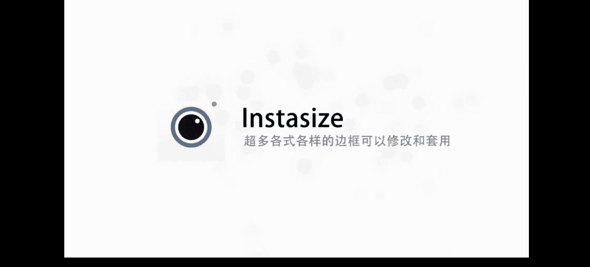

# 小北-《小北手机摄影课堂》：手机摄影正课：第10期：第10期、拼图排版APP攻略

hello，大家好，欢迎来到小北的手机摄影课堂。我是想和大家一起帅三代美三代的小北，欢迎大家和我一起学习手机摄影。😊，🎼这节课是我们的第五节P图课本，我将教大家如何进行图片排版。

如何用手机排出精美的杂志效果。以前当我们小时候习惯于用日记记录自己的学习和生活。而现在随着智能手机的普及，我们不光能写字了，而且还可以用精致的图文去记录生活的点滴和精彩瞬间，未来的某一天，让我们回看时。

这些精美的图片日记。是我们最宝贵的财富。首先我要推荐大家一款我非常喜欢的。叫做17，它可以记录你每天的生活可以插入。视频。甚至最终你可以制作出一本属于自己。生活制。好的，我们。出てる。

这款软件的界面非常的干净，是黑白系的。底下有4个菜单，我们一个一个来看。首先我们先看一下它的样。他这里。一种不同风格的书籍的事例。比如说这里有。进入其实他就是一本书。这个所有书中的内容都可以自定。

比如说标题啊、作者啊，还有这个封面的图片。好，我们分开。写的是我的旅行日记。然后谁谁谁作者，然后时间。还有一个头像，这个头像其实就是。上传的那个头像。好，只是做着也。然后这里有一个。

关于什么出版自书页数的这个介绍页，这都是他自动生。下面就是重点了，重点就是说。大家看到这个一个时间。这个时间就是。可能就是201。9月30号你写的。这天。然后呢，通过实期。自动生成了。

就是把你所有的日记放到了一起，生成了一本。所以这里我们只需要做的就是每。え苦しいれ。然后用时。更生成一。我说过。れはれ。说しののすね。作者想。这做的是空。然后就是。这个的数字风格是大概是这样。时间。

然后。其实非常简单，那么下面我们就来自己。作一本。读自己的书。我看到这里有一一只。写下生活一见成册。我们。呃，很简单，只需要选择一个标题。然后底下输入你的文字，呃，这里可以插入图片。一位地步来。

时间有限，我就直接插入一个图片好了。比如说这张图片。おタ子？这张图片就插入进去了。那我来粘贴一段文字好了。我前天已经断。这一段重庆。那我这里标题。打上。这样的话我们就生成了一篇比较简单的标题。

有图片还有文字的出了。点击保存。会片。就已经存下来了吗？我们还可以再次点击画笔，再写一本。比如说我这里再插入，我插入3张图。我的小狗的。好，插入图片之后还是一样，我可以加一点文字。

时间关系我还是随便粘贴。之好了。嗯，标题就叫做错。这里有个点击保存就可以了。这篇宠物的日记也保存下来了。为了演出方面，我再写一篇。同风格的这里我就快速的操作了。那天我就叫到他。这変ち做。啊。

同样也是针灸。つ保し。🎼这样我们就制做了三篇。如何把这三篇日记？变成一本书了。首先我们要点开黑日记，然后点击修改。在这里我们有一个添加至出册。我刚才没有选，其实我们每一次写完一。

日记之后可以选到一个它适合的地方。比如这一篇我就选到生活杂志里面。実際で？好，这本书就记录了中国杂技里。那这个有什么用呢？点击保存。🎼它就会提示你是否将本篇文章同步至生活杂技，我们点击确定。呃。

这里我们再找到一下角的书架。书这里你会看到一本生活杂技的书。当我们点击进去之后，你会发现哎它自动生成了一本生活杂志的书，作者是小北。然后跟刚才我们看到的示例书很像。也是头像。还有作者。还有这个介绍业。

然后有一个。我只有。重庆的森林，也就是只有我们刚刚添加的这。そすと。好，我们看到是不是我们刚才加的。好，就是我们刚才所制作的这本书。那么我们可以再次把。下一篇，比如说宠物日记，我们也给他修改。

添加至书册。生活打季确定。然后保存。好，这样的话。我们再次进入生活的杂境。依然是。你发现。有了宠物日。我往下滑往下滑。好，这样其实我们每一天写完日记之后，我们都会同步更新到这本书里边。

那么你可以随时的翻阅你的日记，这里进入目录。可以直接快速的跳转到每一天的。我跳转到宠物记。直接到了这个页。所以非常的方便，这是我们日记的方式。另外还有一种方式，如果你说我每天没有那么多时间去写日记。

每天都是发朋友圈或者发微博。那么这个软件非常强大的一个地方在于我们点到这个制作里边，它有微信书，有微博书，有豆瓣书，有QQ书。我们以微博书为例。当我们点击微博书的时候，它会让你登录。

这个时候我们只需要登录自己的微博。登录之后，他就会在书架上生成一本有你的所有微博内容的一本书。根本就不需要我们再重新写。这是我刚刚为了节约时间自己生成的那本书，大家可以看一下所有东西你都可以自定义。

比如说封面。标题啊。还有封面的图片啊，还有作者啊，所有东西都可以给义。好，我们往右滑动。啊，这是我的微博头像，把它自动变成了作者的头像。然后注意从你的第一篇微博开始，我的第一篇微博是16。好，这是第一。

然后包括所有的时间，还有你的文字，还有你。全部都被保存下来了，而且全部都是自动生成的。根本不需要我们自己再去做任何的操作。你还可以向右滑动。我大概发了有。三枚ど。那他可。也就花一两分钟，就所有的我取。

书这里你还在点。可看到啊。一个时间段的。我跳转到最新的，比如说2017年的。好，这是我们最近发的一个微博。好，这是他非常强大的。一键生成微博书。一键生成微信书。那么这个AP。

我们就可以记录自己的生活点滴。记录自己的这个。记录自己的读书笔记等等这些珍贵的记忆。多年之后，一定是我们最宝贵的财富。接下来这款APP不是拼图。🎼而是可以帮助我们切图。

它是一款能够将一张图片拆成九宫格的软件。操作非常简单，而且有多种模板供我们选择。好，我们点击进入九格切图。这里有一行字，美图秀秀的荣誉。我们点击下面的按钮，打开一张。我随便选一张，比如说这张图片。

9张图片就我已经划分好了。底下是一些特效。比如说我们。可笑。它特效效果一般。所以我不太经常用，但是它有一个好处就是说。点击次它会自动随机的给你套用一个特效。你可以再次给。再次点击之后。

他会把那个特效换掉。换位置。比如说这个LV。他本来是LOV这量排列。如果点一下。他就换了一种方式。你可以选择一个你比较喜欢的方式。我一般不太用。奇怪。除了底下的这种。电影特效以外。呃，他还有一个功能。

就是说左上角一个形状。你去选择你喜欢的形状。就说我选择个人中。把他就切成一个圆形。我选择和苹果。变成了苹果的形状。非常简单，那情侣一般可以使用这个爱心。好，当你拍了一个比较文艺的情侣照，然后。

你把它切成新形的形状，发到朋友圈。直接简单粗暴的发秀爱的自拍会好很多。呃，如果你觉得这样OK的话，我们就点击保存。然后他会告诉你，请按1到9的顺序分享这批照片，即可有如下效果。啊。

其实我们分享到朋友这边的效果就是。🎼我截图的这个效果。好，这款APP是美图公司出品的，叫做海报工厂。它拥有杂志封面、电影海报、美食菜单、旅行日志。超作海报模板。好，海报工厂这款APP。是非常的简单。

我们点击开始制作。然后随意添加几张图片，我就添加这两个孩子的照片。然后开始制作，他就套用自动去套用了模板。然后底下有三个选项，清新时尚简约，我们随便选就可以了。啊，所有的都是李建涛用的。呃。

同时呢你可以拖动这个。这张图片往这个大图上拖，哎，就可以换顺序。改变位置。啊这都非常的简单，这里我就不再多说了。呃，如果你觉得这些不满满足不了你的要求，那我们。更多素材。就会发现哇好多好多车。

各种各样的航空布板。你喜欢这个的话。じゃで一下来。然后马上就可以。我就马上套用到了这个效果。嗯，同时其他的也是一样，都是一键套用。我再换一个，比如说这张。右下载。使用。好。

比如说这1个500下我要做一些。其他的改动呢，比如说除了更换顺序以外。我还可以调整这个图。他出现在。ここにさ。比如说他不。🎼可能是两个牌子没有出现全，那我只需要拖动一下，把孩子放在中间就可以了。

那么另外我还可以通过单机，它还可以为这张照片。添加一个滤镜效果。如果你懒得去P图。比如说你拍了很。的照片一天下来。啊，你想拼一张图。你又不想一个月去修，那，只需要。嗯，比如说我们全部都套用M3的。没静。

那你的照片风格也会比较统一。这是海报工厂，它就是这么的简单。我们可以随便的。更换模板，最后选择一个你喜欢的点击薄护。好，这款软件我就说到这里，大家可以有时间的话。件ちら。所以下来可以做的比较到。说留白。

他更像是。记录一个段。内心独白。一张张优雅的留白照片，记录平淡生活的精彩。好，我们打开牛白。我先不着急自己写诗。我们先看一下别人是怎么写的。我们找到广场，在广场里面我们可以看到。其他用户上传的一些图文。

这一个排版非常精美的。就是使用牛白制作的。你可以轻松的把它。下载下来或者是分享到朋友圈。好，看过了别人的。下面我们来自己制作，首先点击加号。选择一个50板。它的模板都非常的简洁。

基本上就是3号文字配合一个。我选择居中的好了，然后点击下一步。点击相机。接着我们就可以在相册里选择一张图片。这一张插卡圆弧的照片。他可以选择。我就选择一米一米好了，打勾。打入之后你还可以添加。ち？呃。

但是我觉得。这种调色操作我还是放到专业的调色软件。好，其他的这些这些我就不用了。点击下一步。这样我们的。就已经插入进去了。那么接下来就是为图片插入文字。こさ？好，就可以输入自己想要写的文字了。

我随便写一些好了。你好。我就写这两行字。打勾。好，这张图片就是我们刚刚用留白制作的。那么留白还非常适合制作黑白风格的照片。比如说我们能换一个木板。选择这个模板。我们插入一张黑白图片。

我从相册里选择这张图片。呃，我们可可以换一个比例，我换成这种4比3的。下一步。啊，文字内容也是。随便写。我就随便打。整个过程可能不会超过30秒。🎼我们可以使用牛白每天生成一张精美的图片。

然后与刚才制作电子书的17AP结合，制作出属于。最精致的会议。下面这款APP叫做简拼。人如其名，操作简单，只需要几步就可以拼出自己喜欢的图片。我们点击进入简屏。好，他的首页有非常非常多的各种各样的。

这得让我们选择。还有这种特殊工风。🎼滑动解锁类似锁屏的这种。好我们随便点一个。一ちを。好，进入之后，我们看到的下边有一排简约便签封面拼接。名片、明信片等等。它不同的类别对应的是不同的风格。

比如说长途里边，那就非常适合这种化妆教程啊。把酵成了这种。🎼呃，一张图片配以合一段文字，一张图片配合一段文字，可能这张图很长，所以这种是可以做那种杂志效果的。好，其他的比如说还有一个比较特色的是。

封面的话有点。海报。类似于一这种时尚杂志的。这些的话也可。非常适合人像，就是。账号。看的照片这个。其他的比如说。但这种是适合加二维码。方式或者是作为自己。一个比如说这个摄影师。

他通过剪拼制作了一个还有自己头像啊，还有一些个人经历，还有二维码和作品。建築？别人可以通过这张图片快速的了解这个人并且。し方式。还有明信片啊这种好，这里我就不再演示了，我随便找了一个好了。

我找一个简约的。比如说这个旅行的吧。こしら？那我就选几张。这好。三张4张。好，我选择的是4张。及下一步。在录之后，那这个就已经。自动買うよは。他かい？给你更换位置。好，那我们可以选择这个。颜色？

包括背景的花纹。啊，这个就凭借你的喜好吧。这里我就不再。えつは。其他的。50也是大同小异。我们再换一个好了。我们换一个。嬉て。芯片的话。那就这一张号。挑选点。我和这个反差比较大。てさり込。

这这两个字拼起来有点奇怪。那如果有问题的话，我们可以选择这个换一张。我还是换成这种软。然后再换一张。这样这两张图片还算比较合适，比刚才要合适很多。这里我就不再演示了，简拼其实很简单，而且功能也很多。

大家可以根据自己的需要去使用它。说到拼图模板，下面这款APP是我见过的拼图模板最多的APP。有选择困难的同学，最好不要打开它。这块软件的模板多到令人发指。下面呢我们就来一起看一下。

首先它分为了拼图和杂志。我们点到拼图里面。可以看到各种各样的。不同类型的。公文版。然后你就滑吧。是非常非常多，后面会还有高级的。这个是需要买的东西，我价时。概了10多块钱。哦，这是高级的。那就是。

基础里面就有180种各种不量的模板。比如说随便。就他了。然后这里面你就可以。按照这个选择一张图片，插入张图片就可以了。这里我就不再演示了。那么这个是他的基础基础模板。它还有一个杂志模板。

杂志模板里面也是非常的多有，100种各种各样的杂志模板。比如说刚才我们看到的简评里面是一些简单初级的这种海报啊，或者是。长途。他这里面就相对于是那种杂志级的排版，就很精美。用他做任何的事情。

随便打开一个不好了，打开这个模板。你就可以看到他已经把板是固定好了，我们需要做的就是按此插入一张图，按此插入一张。直到把这裤插满，然后。🎼就可以了，这里我就不再演示了。

如果你觉得刚才那些简单的APP满足不了你的要求。那你就可以试一下这款软件。你看过了太多的拼图模板，挑到眼睛跟花瓣的时候，可以试试这款由inpro公司制作的APP。他也许就是为了简单日生的。好。

上面一款APP的模板非常非常的多，而下面这一款刚好与它相反。打开之后，你几乎看不到老师的模板在哪。那么我们随意选择4张图片。好，上面就会出来了他所有的布局模板，总共也就这几个。

而且是非常非常基础的一些模板。这个其实就是从上到下并排排列。那这个就是1234并排排列。那他有一些简单的功能，几乎简单到不能再简单。第一个是替换图片，也就是我换一张图。第二个是镜像。

我把两个人的位置互换一下。其他的也是只是上下翻转。然有最后生成一个边框，就是这么简单的。正是因为太简单，所以你非常适合拍完就用。我拍完直接就拼好。然后分享到朋友圈就可以了。除此之外呢。

这个软件它还支持一张图片。比如说我选择这张图片。让我们看到上边他还会有。很多很多的。图方式。那，这个是其他软件所不具备的。比如说最后有一个。这个直接就是做成了9张。然后还有这种。

他可以直接把人变成这个样。那结合他的镜像图。百人。玩起来。而出很好玩的个效果。好，这里我就不再演示了。这款软件非常适合即拍即用，有兴趣的话，大家可以去尝试一下。下面这款APP除了滤镜调整。

拼图排版的功能以外，还有超多各式各样的边框可以修改和考用。

好，我们点击进入。那他的主界面就是直接让他你选图片。而且这个时候选只是选一张图片。我就选这张图给你好了。选完之后，他会让你去调这个滤镜啊，还有其他的东西。不管他，我们点击这个第二个。比如说我要添加。

四张图片。那我选择这个四张的50板。然后。双击加号键就可以加入下一个的。双击加号键提加入下一个。再双击。我们再挑了一个。就这个吧。这个软件的好处在于它可以精细化的调整每一个。比如说我这张图。

因为我加了白框，所以它显得很小，那其实可以选到这个里面。然后双手扩大。然后和这个整体的。那么另外他还可以精细化操作到，我可以为这张图片添加一个滤镜。那么这个其实其他软件里。他的厉害之处在于。

他可以针对每一张图片。进行亮度啊、对比度啊、饱和度啊等等一系列的调整。比如说我选择这张图片。比如说我把它们的量给我减零，然后打勾。这里还可以增加它的饱和度。如果你觉得这个填不出蓝。好，这是可以针对。

一张图片。及细致的调整。那么这个其实也是很方便的一个功能。这样的话我们可以。拍完图片直接导入进来啊，这个是它针对于每张图片的调整功能。🎼另外它还有一个非常酷的功能叫做叠层。那叠层是什么意思呢？

比如说我们随便。给他选一个。比如说我们添加一个这个。那就他同意。为照片加入了这样的一个特效。还可以添加其他的特效。那这个东西。他同样可以进行精细化操作。比如说我觉得这个特效放第一张图不好看。

我就可以恢复他。这张图不好看，我回复他。如果我觉得这张图适合这个风格，我就给他选择一个这个贴层。说吃了这个风格，我给他换一个底层。我觉得这个贴层不是很好看。那其他其实他有很多好看的一些叠层可以叠进去。

有了这种。黑白的。可以为你们的图片增加质感的。啊，我的图片。因为统一都太亮了，所以不太适合这个网上在叠东西。你说这种暗调的图片再叠一种有质感，有纹理的东西的话，会显得非常的好看。好，这里我就不再叠加了。

那么接下来他还可以添加文本，还有各种各样的字体供你选择。比如说我可以在中间加入一些文字，这里我就不加了。呃，T恤就是贴纸。那贴纸其实这个更多的是针对于人像的贴纸，我这里边没有人，比如说你插了4幅图是。

四张大头贴，那你就可以使用这些贴。🎼每一张图片增加一个贴纸。这款软件还有一个功能是增加边框，还有更换内景。那么它的背景非常非常的多，我们怎么制作出这个背景呢？首先点到拼贴。

刚才选择的是田字格分割四个画面。我们再点。当我们向一6拖动的时候，这量边框就出现了。比如说我选到三打勾，打勾之后，我再选择边框选项就可以为这张图片。增加边框更换背景。我们选择最基础的。呃，本来是白色。

我点一下黑色。那么黑色的框，其他颜色也一样。还有其他的，比如说这种旧种边框。这种新型的变化。就比较适合情侣。好，这些东西大家可以根据自己的需要去选择。他光一个情侣里面就有非常非常多的背景。还有很多朋友。

比如说呃纹理质感啊、黑白啊或者其他的。大家可以。都需要。去使用。还有这种豹纹啊。物的皮肤等等，选好之后我们就可以保存了。这个软件对于。🎼外出拍很多照片的，而且又想修图，又没有那么多时间的人，非常适合。

你可以一次导入很多。🎼然后对于每一张图片进行精细化的操作，并且最后批量导出，使用起来非常方便。有兴趣的话，大家可以下载来试一下。这节课我们针对于拼图排版给大家推荐了几款AP。其实小北希望大家通过这节课。

如何学会拼图排版，更重要的是可以利用所学记录自己生活的点。希望大家都能够真的将生活过成诗一样。好了，感谢大家收看这节课，我是小北。下期再见。

