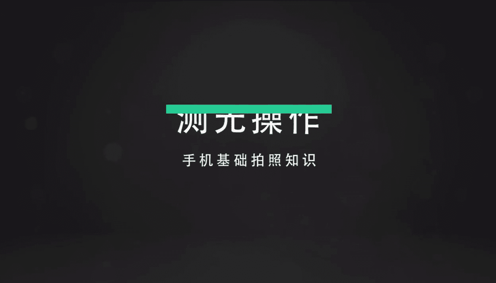
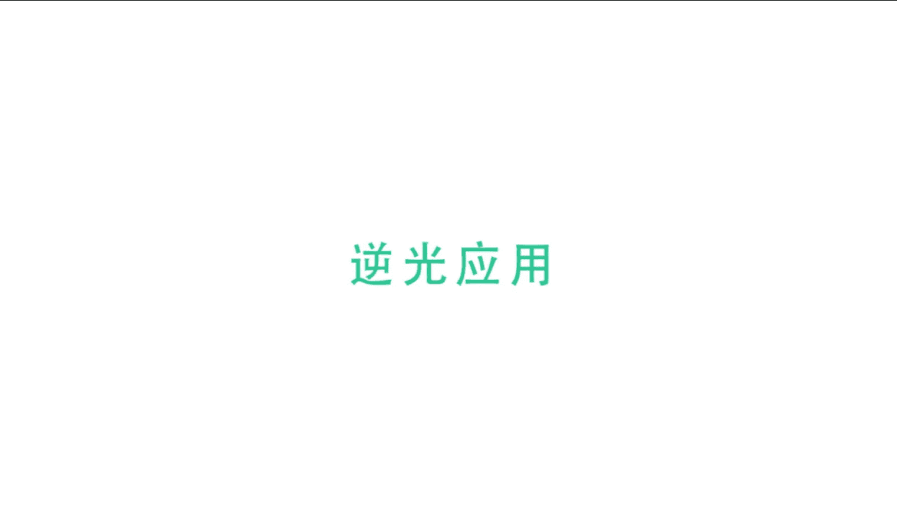
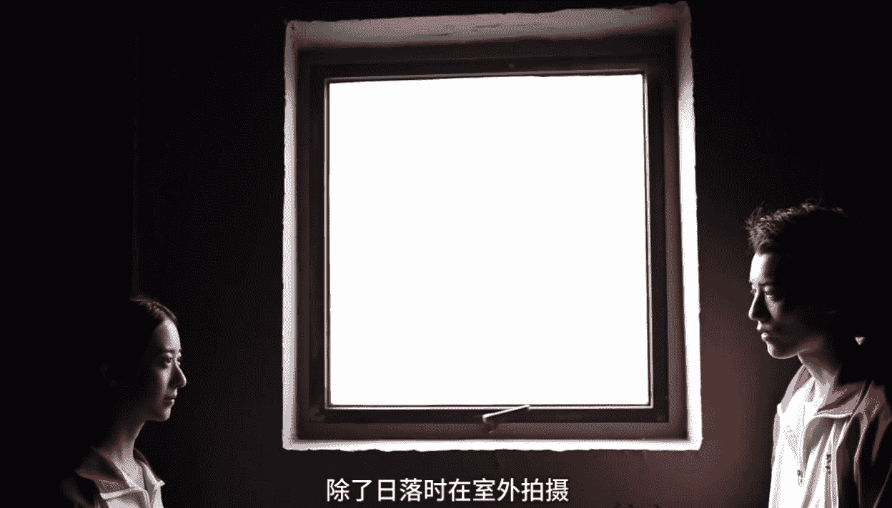
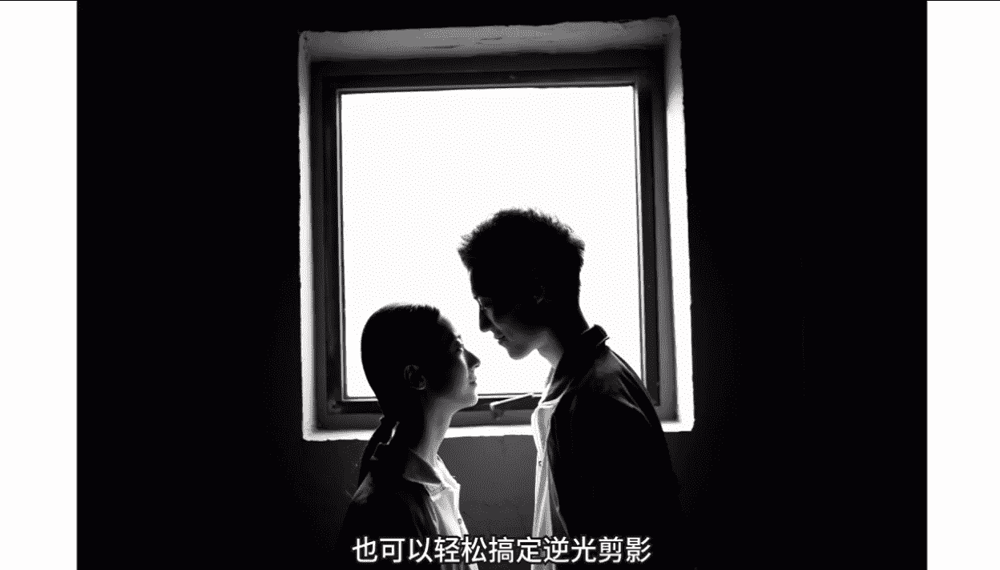
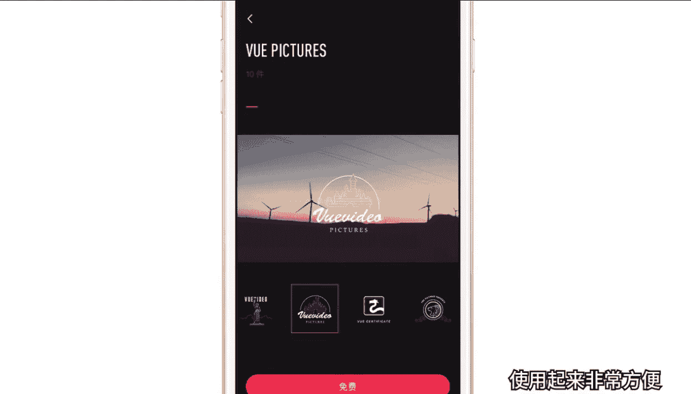

# 小北-《小北手机摄影课堂》：手机摄影正课：第1期：第一节

🎼hello，大家好，欢迎来到小北的手机摄影课堂，我是小北。大家应该以前看到过我的视频吧。🎼大家应该以前看到过我的拍照视频吧，好看好真的吗？躺在我桌子上，这位呢就是我的助手小猪，左边呢是我的新浪微博。

小北帅三代。我都已经这么帅了，总得给别人留条活路吧。🎼好了，不说废话了。首先呢手机拍照大家都已经非常熟悉了。那么讲道理的话，手机发展到今天，像素啊、画质啊、宽容度啊等等都已经非常的给力了。

那么而且手机拍照又方便又快捷。iphone呢现在都成了一些专业摄影师的创作工具，相信也有很多人在地铁看到过iphone摄影作品的广告。有些独立导演呢甚至用iphone完成了一整部电影的拍摄。

而国内像小米oppo vivo等等，都在镜头功能上下足了功夫。华为moto甚至上了莱卡、哈苏的镜头组。虽然设备啥的，咱都有了，但是随便翻翻朋友圈呢依然是被游客照啊、路人照啊，丧心病狂的自拍照啊。

还有令人霸着情侣照充斥着。那么小北想在这里告诉大家的是，我们有了好手机，并不等于能够拍出好照片。前期后期。🎼照技巧等等，都是衡量一张照片质量的关键因素。

那么接下来欢迎大家和小北一起从零基础开始学习手机摄影这些精心编排的课程，从基础课到专题课，最后还会有将所学融汇贯通的综合实战课。你将学到最实用的手机摄影技巧，还有修图调色方法，都说摄影穷三代。

那么希望学完课程呢，大家可以和小北一起帅三代美三代，至少得成为朋友圈的一股清流，你说是吧？那么第一节课呢我们主要熟悉手机的操作，看看我们手中的这台手机到底能够拍出什么样的照片，到底有哪些的功能。

是不是以后出门就可以不用再带这些大家伙。

🎼对于我们日常拍照记录生活来讲呢，最基本的要求就是把主体拍清晰，也就是对焦准确。那么有人要问了，小贝老师什么是对焦准确呢？其实对焦也叫对光聚焦。通过相机内的对焦结构变动物距和相距的位置。

是被拍物体成像清晰的过程就是对焦。通常我们都希望我们所拍摄的主体是实焦清晰的。那比如说我如果这样给你们讲个20分钟，你们是不是要把我打死。好消息是。

现在几乎所有的主流的智能手机都可以通过点击屏幕的方式进行对焦，哪里清楚，点哪里，妈妈再也不用担心对焦不准啊？比如前后有两个人，当我们点击到后面的人时，手机就会对焦它，前面的人就会虚化。

我们再点回前面的人，后面的人就会虚化。🎼下面我以桌面上的前后两台相机为例，教大家不用单反，不用相机，只用一部手机就可以轻松拍出具有虚实对比的照片。🎼我们先回顾下对焦过程。当我们用手机拍照时。

点击哪里就对焦哪里。我们两指滑动屏幕放大一些，便于观察。点击后面的小白，小白就变得实胶清晰了。点击前面的小红小红石胶皮革的质感清晰可见。而这时小白就虚焦了，看起来就是模糊的。明白了石胶虚焦之后。

我们要做的很简单，就是点击屏幕进行对焦，然后按下快门拍照即可。🎼利用这个功能，我们可以轻松拍出具有虚实对比的照片。🎼那么是不是一定要对焦准确的照片才是好照片呢？当然不是。

有时候呢我们故意制造一些虚焦效果，照片也会很出彩。🎼比如晚上出门吃饭时，饭店外面的灯光在虚焦效果下会变成色彩斑斓的光斑。这种虚焦效果可以把平常不起眼和杂乱的场景变成另外一种截然不同的虚化感觉。

我们看这两段视频，左边的是实焦拍摄，右边的是虚焦拍摄，实焦和虚焦是两种完全不同的感觉。如果大家平常看够了实焦的清晰世界。偶尔试试虚焦的模糊世界，也会很有意思。那么说了这么多，手机如何拍出虚焦效果呢？

下面我给大家介绍两种方法。第一种方法实现起来很简单，适合有专业模式的手机。🎼第一步，打开手机相机准备拍摄。🎼第二步，一般点击右上角选择进入相机的专业模式。第三步，找到焦距选项，然后横向拨动焦距划杆。

这时候画面就会因为我们焦距的变化而产生虚实的变化，清晰或者模糊，我们可以轻松改变。如果放大画面效果更明显，周围环境的灯光也都变成了彩色光斑。🎼我们再一起分析一下下面的横杆，左边端点写着近，右边写着远。

🎼当我们从远拉向近时，画面就虚化了。这是因为此时我们的对焦点在近处，近处实焦，而灯光在远处，远处就是虚焦，自然就变得模糊。当我们由近拉向远时，对焦点就到了远处，远处就是实焦，那么远处的灯光就变清晰了。

搞明白了这些，我们就能够很轻松的拍出虚焦图片了。实际拍摄时，我们只需要在相机的专业模式里拖动远近改变焦距，即可实现虚实变焦，目前oppo vivo、华为、小米、努比亚等部分机型都内置了专业模式。

如果我们用的是iphone或者没有专业模式的手机，可以尝试下面的这种方法。🎼第一步，打开相机，这时候画面中的灯都是实焦的。第二步，让小伙伴把手放到手机镜头前很近的地方，我们点击屏幕，对手部进行对焦。

然后做一个关键操作，用手指长按屏幕1。5秒左右会锁定对焦。第三步，我们把手移开，放大画面就会看到，原来实焦的灯光变虚了，不用专业模式也可以搞定虚焦照片。整个过程的关键点在于长按屏幕，锁定对焦在手上。

当我们移开手时，画面对焦点其实还是锁定在近处。因此，远处的灯光就虚化了。🎼对焦功能结合近大远小的原理呢，还可以拍出好玩的错位照片，比如近处放置一个水瓶，远处一个小伙伴假装踢到水瓶。🎼拍摄错位照片时。

手机尽量保持在低角度。比如我在拍摄这张照片时，就是找到了一个台阶从下往上拍的，还可以手推水平，但一定要注意对焦点一定要在人物身上，不然拍出一个实在的水平和虚化的人物，那场面就很尴尬了。除此之外。

我们还可以让一个远处的小伙伴原地举起1吨空气，近处的小伙伴脚跟撑地，拍出要被踩死的图片。当然，我们还是要保证对焦点在人物身上，不然你就会拍出一个令人懵逼的大鞋子。

如果我们从摄影的前景和后景再分析一下这段视频，在拍摄错位照片时，前景后景之间必然会有距离存在。手机摄像头就会不可避免的虚化。因此我们将对焦点设置到哪里就很重要。所以我们要尽量保证对焦点在后景人物身上。

保证人物是清晰的照片才会。🎼错位的比较真实对焦还有其他很多很多玩法。比如我们在前景放置一只恐龙，给小伙伴们设计好动作，这样我们就可以愉快的打恐龙了。在我们掌握了对焦和错位拍照技巧后。

平常可以多积累错位拍照创意，大家还可以在我的公众号人民公社中回复错位，即可获得一篇小北呕心沥血整理的，拥有N多错位拍照创意，妈妈再也不用担心我拍不出好玩的错位照片，被人笑话的文章了。累死我了。好了。

每个章节结束，我都会给大家整理一个重点知识的思维导图，方便大家课后复习和总结，也欢迎大家自己整理笔记和小北交流。

🎼说完了对焦呢，我们再讲讲同样能够决定照片成败的光线。我们经常会遇到光线过亮闪瞎眼或者光线过暗，吓死人的情况。那么其实你的手机呢就可以自由的控制光线，我们只需要点击屏幕进行对焦。

然后拖动旁边的小太阳对光线进行调整，光线不足的情况下，我们向上拖动，可以补光。而光线过亮时向下拖动可以减弱亮度。虽然手机可以调光。但是我们拍照时呢，还是要尽量避免在大光笔的环境下拍照。那么有人要问。

小北老师什么是大光笔，我们看这张图就是一个典型的大光笔环境，太阳的光线太强了，而人物的光线太弱了，如果我们按强光确定曝光，弱光处就一片死黑。

🎼按弱光处确定曝光，强光处就一片死白，死黑和死白的意思就是后期也救不了了。所以我们尽量避免在大光笔的环境下拍照。如果你说小北，我就是要拍，不在大光笔下拍照，我浑身难受，既然你诚心诚意的问了。

那我就告诉你，你有以下几种办法。一等宽容度超高的iphone17或者oppo R19出来。别打脸，2、把过量的部分从画面中避开，或者用树木建筑等等，把天空挡住光笔就没有那么强了。我们观察这两张图片。

右边错误版的图片中，太阳和人物的亮度差别非常大，中午的天空亮度极高，而地面和人物相对于天空的亮度就会显得非常暗，画面光壁极大，左图中，我们通过借助树木将天空遮挡住。因为树木和人物的亮度差别。

🎼远没有人和太阳的差别大，所以画面光笔也就不会很大，人物和背景数目的亮度都会比较正常。第三种方法。🎼3、戴个墨镜不是给自己戴，是给手机戴。我们观察戴上和拿掉墨镜的区别效果还是比较明显的，不带时曝光过度。

戴上之后分分钟解决过曝问题。🎼除了大光笔，我们需要避免外，我再给大家介绍几个常用的光线照射角度。那么大家可能有意或者无意的都听说过顺光啊、逆光啊、测光啊等等。顺光就比较简单。

就是光照的方向和摄影机的方向是一致的。那么逆光呢逆光同样很简单，我们在家只需要用五毛钱就可以。🎼就可以拍出漂亮的逆光照片。我们只需要打开手机闪光灯作为逆光光源，然后移动到人物的正后方。

这样人物的头发就会被打亮，我们就得到了漂亮的逆光发丝。我们还可以选择相机的黑白滤镜，调整好亮度，拍出逼格更高的逆光一寸照。

🎼除此之外，我们经常看到的剪影图片就是应用了逆光原理。在生活中，我们利用逆光，也可以轻松拍出漂亮的剪影照。最简单的场景就是在日落时让被摄主体也就是人物背对太阳。由于被摄者后面的光线非常强烈。

使前景与背景的亮度相差非常大，所以人物黑天空亮，我们就获得了剪影风格的图片。

🎼除了日落时在室外拍摄，我们在室内找一扇朝阳的窗户，也可以轻松搞定逆光剪影，拍摄逆光剪影照。和我们平常拍照不同的是剪影着重强调被摄者的曲线或形态。用这招拍闺蜜照或者情侣照也是一个比较独特的视角。

唯一比较遗憾的是，剪影看不清脸，简直浪费了观众老爷们帅三代和美三代的长相。好了，不开玩笑了。逆光剪影ts奉上多多练习，拍完了，别忘了交作业哦。

🎼那么测光照怎么拍呢？我们只需要把光源移动到人物侧面，测光使被摄主体一侧受光产生强烈的明暗对比，被称为质感照明。同样的，我们可以上下滑动屏幕，找到最酷的效果。🎼对于测光，我要特别补充一点。

平常吃饭时光线从窗外照到一边脸就会使这边脸很亮，而另一侧就偏暗，形成阴阳脸。解决办法也很简单，往里边做做，使光笔没有那么强就OK了。那么除了逆光测光，还有顶光。🎼在日常拍摄中，我们应该尽量避免使用顶光。

顶光顾名思义就是从头顶照射下来的光线，又叫骷髅光，它会使人物的眼睛鼻子下方出现很难看的阴影。这里我插一句，如果你恨他，请给他拍顶光图片，与顶光相对，底光是从人的脚下垂直照上来的光线。

它往往会使被摄主体显得残暴。🎼底光容易形成阴险恐怖刻板的效果，因为再高颜值的人也架不住底光的摧残。比如我，所以如果不是万圣节或者拿来吓人，咱们还是少用底光吧。最后总结一下就是摄影师用光的艺术。

测光一小步拍照一大步。

🎼好，在解决了对焦和光线之后，接下来就是怎么拍了。你说这还不简单吗？不就是按快门吗？还能按出花来给你的花，谢谢，好像还真能按出花来。🎼比如我们在单手自拍时按快门键，有时会比较尴尬。

大拇指短的按起来就比较吃力。有没有什么可以高效自拍的技巧呢？有没有什么可以高效自拍的技巧呢？当然有，这时候我们可以使用音量键快门，大拇指轻松按下音量键拍照，非常方便耍酷。对于大家的神经病朋友们来说。

简直是解放双手，解放生产力的科技革命。🎼我们在拍摄运动物体或者抓拍瞬间时，可以一直按住快门键不放，轻松捕捉小伙伴跳跃的瞬间。这种方法拍出的完美跳跃照成功率很高。🎼如果你的朋友人美腿长跳得高。

你们可以尝试一些高难度动作。但作为摄影师的你一定要注意从低角度拍低角度拍，低角度拍，不然你们费了半天劲，图片上还是跳不高。大家看左图姿势和动作都很优美，结果照片就像贴地飞行一样。

主要就是因为拍摄角度不够低。而右图则是蹲在地上，从低视角向上拍摄。你的小伙伴分分钟就上天了。说到低视角向上仰拍，我再给大家做一个示范，在树林中，我们只需要把视角仰到与天空平行，就会发现另外一番景色。

拍摄过程非常简单，手机举高，摄像头朝着天空即可。生活中我们只要用心观察就会发现身边处处都是美景。🎼手机除了有捕捉瞬间的高速快门，还有慢动作，这个功能可以将原本很快的动作放慢。

比如刚刚的高速跳跃就会变成另外一种感觉。那么在日常生活中，我们还可以用慢动作捕捉水流。🎼我知道大家不管看我的视频，还是吴彦祖的视频，看久了之后都会很饿，你们饿不饿？我说我饿。

那我就奉献一段吃铁板烧时录制的慢动作。🎼大家有机会的话也可以录一段试试哦。🎼那说到录像呢，现在微信朋友圈也支持上传自己拍摄的视频了。🎼那我们就不光要学会拍照，还要学会录像了。

在这里我推荐大家一款视频神器VUE这款软件操作简单，我们只需要轻轻点击即可拍摄一段短视频，同时还有非常多的滤镜风格可以更换，不需要我们自己调色视频，也可以轻松拥有各种色调，除此之外。

我们还可以自由的调整画幅比例，比如圆形画幅、方形画幅电影画幅等等。选好后点击即可录制这种比例的短片了。下面我给大家演示一下，利用VUE拍摄短片的过程。首先同拍照一样，我先点击人物进行对焦。

然后向左滑动屏幕挑选一款我们喜欢的滤镜。这里我选择的是橘次郎的夏天，这时候引导模特就位就可以点击拍始视频记录了，视频拍摄重在引导和沟通，以下是拍摄实录，省略1万字。🎼OK第一段OK了，然后再往前走。😊。

🎼好，停停停往这边一点点啊。🎼没关系。好好，这个位置啊，你先是看着我的，然后往前走两步撩一下头发，再回头看我再往前走。另外，VUE的商店还有很多免费的滤镜，比如M系偏欧美和复古T系的色彩风格化显著。

还有F系等等。我们挑选自己喜欢的即可。另外还有很多免费贴图，可以动态的植入到我们所拍摄的视频中，使用起来非常方便。最后我再补充一个视频录制小技巧，可以拍出朦胧的画面，实现起来很简单。

我们只需要找到塑料纸，比如烟盒的塑料纸等等，把它套在手机摄像头上即可，或者只是放置到摄像头前面也可以。我们的画面就会变得朦胧，不光录像拍照，同样也可以使用。

🎼手机的全景模式除了获得更广阔的视角以外，还可以拍出很多有意思的照片。比如我们在拍摄全景过程中制作分身照，拍照时，手机缓慢横向移动。小伙伴在手机移动到下一个位置前提前跑过去，摆好姿势。

等拍完后再从左侧绕回去。每次的姿势可以不一样，还可以顺便加个围巾，换个衣服什么的，这样我们就获得了一张分身照了。🎼小贝老师，如果不从身后绕，直接让他横着跑过去不行吗？还是那句话，恨他就让他直接横着跑吧。

跑完千万别说你认识我，我怕被人打死。🎼小贝老师，如果拍全景照的时候跳起来呢，跳起来的话，我只能说身体和灵魂总有一个会上天，还有千万不要用全景模式从下往上拍大长腿，会把腿拍的更短。

🎼这节课呢主要给大家讲解了手机拍照的基础功能，希望大家能够好好的实践练习下。因为再复杂再漂亮的照片，也是通过这些基础的功能拍出来的。🎼像课程中出现的错误示范，同样也是很有用的。以后谁要是惹你生气了。

你就用这几招保证分分钟拍到没朋友。最后呢希望大家能够相信自己，相信自己手中的手机。没有什么照片，是我们拍不好看的。如果有，那就赶紧看下节P图课吧。还有如果大家有什么问题，或者想学习更多的拍照小技巧。

欢迎关注我的微信公众号人民公社。当然了，如果你有什么家里马桶堵了，怎么通啊，灯泡坏了，怎么换啊。还有什么母猪的产后护理等等，都可以后台向我提问。🎼，🎼くて。

🎼我们将一起针对于不同类型的手机修图APP进行学习。我们先一起了解一下常用的手机修图APP有哪些，然后再举一些实例，详细的给大家演示如何从零开始修出一张好看的照片。

