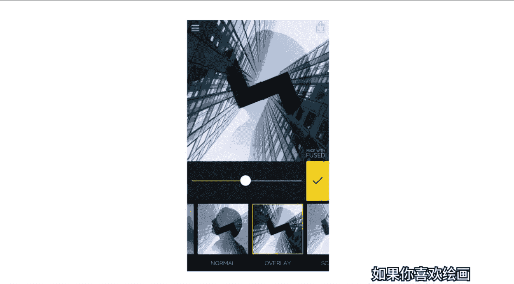
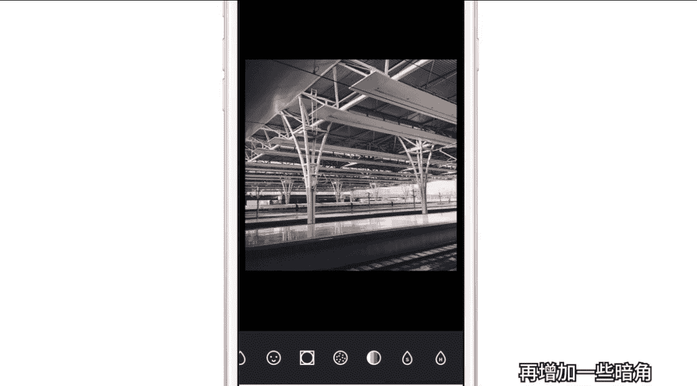

# 小北-《小北手机摄影课堂》：手机摄影正课：第2期：第二节

🎼大家好，我是想和大家一起帅三代美三代的小北。🎼欢迎大家和我一起学习摄影。两年前，当我还是一个孩子的时候，我整天沉迷于photoshop，lightroom等等电脑端的专业P图软件。

每天跟身边同样中毒很深的病友们讨论的都是图层啊、蒙版啊、通道啊、高低频双曲线等等。直到有一天，我和同一个幼儿园的小天约上了袁花小青下课一起拍照。那拍摄过程有我在的啦，当然很顺利的啦，小case的啦。

🎼你干嘛？🎼不装逼不装逼。🎼在回家的路上，我想起了小青对我说的话，那么小北小天撒马照片就拜托给你们了。一想到这儿，我感觉胸前的红领巾更鲜艳了。胳膊上的一道杠仿佛也闪着光，一定要快于小天把照片发给小青。

想着想着，我不由得加快了脚步，最终的结果却是我回家不到一个小时，小青就发朋友圈晒瞳了。🎼并附上文字，急速出篇。我只认小天。后来我才知道，原来小天回到家之后，噼里啪啦的用手机就把图给修了。

而且每张图的效果还都很好看。从此以后呢，我决定苦练手机P图大法。如今在俺们村的红星第一幼儿园也算是有了我尼古拉斯北的一席之地。那么接下来的这几节修图课呢。

我们将一起针对于不同类型的手机修图APP进行学习。这节课也就是第一节课，我们先一起了解一下常用的手机修图APP有哪些。然后再举一些实例，详细的给大家演示，如何从零开始修出一张好看的照片。

那么接下来我们就一起走入手机修图APP的世界。

🎼朋友，你听说过安利吗？这节课的第一个主题就是好玩好酷又好用的手机修图APP安利大会。很多小伙伴的手机里塞满了各种APP。但是可能常用到的也就那么一两款。其实小北想告诉大家的是。🎼空气多。🎼的安静。

🎼P图软件不在多，而在精，功欲善其事，必先利其器。🎼我把常用的修图软件分成了五大类。第一类是滤镜调色类，比如风靡全球的胶片风调色软件visco谷歌的强力修图工具。

snap seed还有mix滤镜大师mca等等，主要用于照片的色彩色调风格调整。我们只需要简单动动手指，就可以获得风格多样的调色效果。第二类是美颜自拍类APP常用的有商店卖25块钱。

但是超级好用的face tune日本的自拍清流软件B612，还有国产P图美颜界的扛把子美图秀秀美妆相机等等。这类APP主要针对的就是人磨皮美白瘦脸瘦身祛斑亮眼增高补妆。

无论你是要迪奥还是YSL的任何口红色号，通通不在话下。今天先给大家做一个简单的案例，之后还会有一节详细的美。

🎼美颜瘦身专题课敬请期待。🎼第三类是贴纸标注的APP常用，而且效果很酷的有模板超多，一个比一个文艺，并且字体贴图多到选择困难的黄油相机，还有超大号的遮脸神器一o几相机，有了它妈妈再也不用担心我长得丑了。

当然，估计看我视频的各位，每个都是颜值爆表的，你们也用不上。还有可以给照片加个酷酷的相框的VOUN它也算是贴纸标注界的一股清流了。最后还有能够一键给照片自动加贴纸的in。

而且印的贴纸是真的够多够全文艺逗逼啥都有无聊的时候光贴纸，我们就可以玩好久。第四类是特殊效果类。这类APP成百上千。我们常见的有，比如能够轻松制作二次曝光效果的fieldel的。

不光能够用自己的照片合成，它还内置了很多漂亮的模板。另外，如果你喜欢绘画，那可以尝试在2016年风靡全球的。

🎼一个模仿大师和艺术作品的pririsma。但是这里我会特别安利一记pix arttAPP。如果用一个词概括，那就是全能。这个APP几乎可以完成我们能够想象到的一切效果。pix art人如其名。

有时候你会觉得原来修图这件小事，真的是门艺术。最后还有一类是拼图排版类APP。

🎼拼图类首推这款有300多种模板，可用版是多到让人眼花缭乱的APP同时它还配有超过100款的精美杂志模板，最关键的是我们可以小手一挥，轻松套用。所以有没有精通八国语言的大神告诉我他的名字到底该怎么读。

🎼还有一个既可以修图，也可以排版的版式啥的，随便换。当然，国产的简拼留版APP等等，同样也很好用。尤其是在我们排中文版式的时候，随便点点屏幕就要轻松搞定啦。那么对于我们日常修图而言。

不需要每1个APP都安装。实际上下载了太多，我们根本也用不过来。每一个分类，我觉得保留3到5款最好用的就足够了。那么接下来的这几节课，我将会从每一个分类中挑出最值得使用的APP进行详细的操作演示。

如果大家有什么私藏的好用的APP也欢迎到我的微信公众号，人民公社上安利给我。🎼第一节课，我们一起来学习P图界的扛把子品类滤镜调色类APP这类APP数量众多。那我们该怎么选择呢？

我认为衡量滤镜调色类APP最关键的因素有一滤镜的数量，也就是能否提供丰富多样的滤镜，以适合用户不同风格的调色需求。2、滤镜的质量，也就是APP内的滤镜素质是不是足够高，有没有让我们觉得足够漂亮。

遇到那种一种滤镜一个风格。而每种风格你都想要保存下来的APP果断去下载吧。3、留给用户的操作空间是否够宽。这一点是指APP在提供滤镜之外，还提供了哪些功能和参数，能够供用户自主进行调整。

以完成滤镜套用后的个性化自定义操作。那么这里我要重点推荐的这一款APP就是vissco。它是一款集合的相机功能。🎼相册管理还有多种不同风格的仿胶片调色滤镜的APP。🎼如果手机里只让我保留一款修图APP。

那么我会先心疼自己一秒钟，然后把其他的通通删掉。好了，不说废话了。接下来我们就一起从零基础开始学习vissco调色吧。🎼我们先打开软件，首先进入的是相册面板。如果你是第一次下载这个软件，那么打开之后。

我们可以通过点击右上角的加号进行导入图片操作。wesco可以进行批量导入，随意选择多个需要修改的图片，点击上方的对勾图标就OK啦。🎼这里小北想告诉大家，导入到vissco相册里的图片是独立于系统相册的。

如果你手机空间不是很大，也可以挑选喜欢的照片导入vissco，然后将系统里的照片删掉。当然了，我这是说给手机内存和我一样严重不足的吃土青年们呢内存就是4G以上的土豪，请尽情的无视我。

还有呢我们使用微sco管理图片，不光是为了节省空间，更多的是可以提升效率。微sco的相册虽然设计的比较简单，但是图片的查看和管理却很容易。我们可以通过双击查看图片，滑动浏览图片。

两根手指可以放大或者缩小图片。除此之外，我们还可以直接从相册里面快速预览图片，只需要长按图片，即可查看大图，松手时自动回到相册。🎼那有的小伙伴要说了，用这招看图，不是和之前双击查看图片的方法差不多吗？

其实每个功能躺在那里的时候，我们看起来都一样。但实际上要看我们会不会好好利用它了。这里我就教给大家一个利用vissco相册功能，进行照片批量导出，批量管理的方法。🎼当我们外出拍了很多照片。

想要选几张发朋友圈时，我们双击点开第一张，然后向后浏览，感觉这张不错，这张也还可以，这几张好像都差不多。如果看了好几张图片，当我们返回相册或者打开微信发图时，可能已经忘记刚才选的是哪几张图了。

到底是哪个电线杆呢？这时候小北推荐大家使用刚刚的第二种方法，长按直接预览，觉得好看的图片，点击即可选中。🎼然后还可以继续预览其他图片，vissco可以选中多个我们喜欢的文件。

如果发现旁边有比我们选的更好看的图片，还可以再点击一下，取消选定，筛选完之后，点击右下角的省略号。所有刚刚挑选的图片，就批量保存到手机相册了。当然，我们还可以选择不好看的图片进行批量删除。

只需要点选不想要的图片，同样点开右下角的省略号，选择删除即可全部删除。🎼接下来我们进入正式的调色环节。首先呢我们来一起了解一下wsp的调色面板以及基础操作。🎼我们双击进入一张图片，点击下面第二个按钮。

进入调整面板。首先下面会有很多很多滤镜供我们选择。我们先不着急套用滤镜，先看看vissco还有其他什么功能。🎼我们点击屏幕最下面的小三角会弹出一个底部菜单，再点击一下就会缩回去。

我们同样还可以在屏幕上上滑调出底部菜单，下滑返回底部菜单的第二个按钮可以进行具体的各项参数调整。比如亮度对比度，更改照片比例或者裁剪照片，添加暗部或者高光色调等等细致操作。我们稍后会在具体的案例中。

对这些功能进行详细的解答。接下来是底部菜单的第三个按钮，这个按钮可以进行撤销操作，不用担心做错了，无法返回。最后一个是操作记录面板。我们可以看到，所有对于这张图片进行的修改操作。

并且我们可以针对其中任何一项进行再次修改。底部还有一个全部撤销。而在安卓系统里，第四个按钮简单粗暴，直接就是全部撤销。最后在vissco中还有一项操作是没有具体按钮的。也就是查看修。

🎼修改前和修改后照片的对比，我们可以通过长按图片进行对比，长按哪里都可以。我们在修图时时不时的进行前后对比，也是一个比较好的习惯。还有我再告诉大家一个隐藏的小技巧，那就是visco的滤镜，除了内置以外。

我们进入商店还会有几个免费的滤镜包可以下载。滤镜收集库门赶紧下载下来，压压惊，我才不会告诉你们，里边的HBE滤镜还挺好用的。🎼好了，调色面板和基础操作我们就讲到这里。

接下来我将和大家一起进入wsco调色，给大家演示如何调出日系小清新风格的照片。🎼在开始调整前，我们首先要把思路理清日系小清新风格到底有哪些特点呢？简单而言，我们所说的日系小清新风格的图片，一般来讲。

画面比较明亮，整体反差小，比较柔和，色彩较为清淡，颜色看起来不是很饱和。而这几个特点我们可以一个个有针对性的进行调整。🎼画面明亮这个特点对应的是vissco中的曝光度，曝光度一般控制画面的明暗。

当我们向右滑动曝光度时，画面就会变得越来越明亮。向左滑动，画面整体会变暗。除了曝光度以外，阴影补偿功能可以使画面中的阴影部分变亮。我们观察图片可以发现，画面中两旁较暗的数目发生了变化。

而较亮的白色衣服几乎不受影响。通过这个功能，我们可以对暗部进行有针对性的提亮。小清新色调的第二个特征，反差小，画面柔和，我们该怎么理解呢？其实反差小对应的就是画面中的对比度比较低。而对比度简单来讲。

就是画面中亮部和暗部的差异范围到底有多大。🎼当我们增加对比度时，画面亮度和暗部的反差加大，衣服会越来越亮，而数目则会越来越暗。我们可以这样理解，增加对比度会使画面中的亮度更亮，暗部更暗，整体的反差增大。

与之相反，减少对比度会使亮度和暗部的反差减少，亮度没有那么亮，暗部也没有那么黑，画面更加柔和。所以当我们想要得到比较柔和的小清新风格时，降低对比度就可以了。除了对比度以外，我们还可以使用高光减淡。

来压暗高光的亮度使亮部没有那么亮，图片整体的反差减弱，画面也会更加柔和。那么日系的色彩清淡不饱和的这个特点，我们可以通过调节饱和度达到效果，但是饱和度一般不宜大量增加，会显得颜色很艳丽。

色彩与真实情况相比，看起来也会比较失真。下面我要安利大家一个轻松，让色彩不。🎼饱和的方法就是对褪色功能进行调整。当我们滑动褪色时，可以感受到图片色彩的变化没有之前饱和度调整那么明显和强烈。

褪色使画面看起来蒙上一层灰色，降低颜色的鲜艳程度，画面的反差也随之降低，看起来更加柔和。🎼好了，在我们掌握了日系小清新图片的基本特点之后，就可以有针对性的进行调色了。大多数人在修改图片时。

一般都会按照从滤镜到调整的过程进行。也就是先加个滤镜，然后再进行其他的细致调整。实际上我认为这个方式可能并不适用于所有的情况，如我们日常P图时可能会有这样的经历，就是无论我的图片用哪一款滤镜都不好看。

但是有的人随便他套用一个滤镜，照片怎么都好看。🎼是哪里的问题呢？是滤镜的问题吗？我认为不是，因为大家用的滤镜都一样的嘛，那到底是哪里出了问题呢？我认为是图片本身的问题。因为每个人拍摄的图片不同。

图片的各项参数也都各不相同。而大多数时候手机所拍出来的照片或多或少都存在一些问题。可能曝光啊对比啊啥的没有那么准确。因此，在我们套用滤镜时，就会发现用哪一款都不好看。

🎼所以我建议大家手机修图可以尝试从原始调整到添加滤镜到最终调整的工作流程。🎼以这张图片为例，我们首先将图片朝着我们想要的日系风格做一些基础的调整，然后再加个我们喜欢的滤镜。

最后再对加滤镜后的效果进行适当的修饰即可。那么首先我们要做原始调整。回忆之前所说的日系小清新风格特点，对于画面明亮这一点，我们首先要将曝光度调高，为画面增加亮度是整体的感觉是轻快明亮的。

接下来找到这个S图标也就是阴影补偿，将图片中的暗部提亮。这张图片的暗部主要是草原部分。这样调整之后，我们就基本完成了针对画面明亮这一特征的调整。第二步就是降低反差，我们主要通过对比度和高光点淡来实现。

我们先选择对比度，对比度增加时，天空和草原的反差变强，画面整体的反差变大。🎼我们通过降低对比度的方式获得小反差和相对柔和的画面。接下来我们再找到H图标，也就是高光减淡。🎼将图片中的亮度减弱。

这里亮部主要是天空部分，通过增加高光减淡，使天空和云彩没有本来那么亮，与暗部的反差也就相应降低了，画面也更加柔和。第三步，我们降低一些饱和度，使画面色彩稍稍变淡，再找到褪色功能，适当增加褪色。

让画面看起来更发灰一些，颜色也没有之前那么饱和，图片整体上看是柔和淡雅的。🎼通过以上几步调整，我们发现画面看起来有些过于柔和了。我们可以找到清晰度功能，增加清晰度，会使画面比之前更硬一些。

我们稍微增加一点点就可以。对于清晰度。小北想特别补充说明一下清晰度的原理是通过增加局部的对比度，使画面显得更加清晰。我们在处理人像照片时，尤其要注意，千万不要增加太多的清晰度。

不然高清晰度会使人物脸部变得很脏，脸部的皱纹痘痘也会无限的加重和突出，所以不要贪心，我们少量提升清晰度就够了。🎼接着我们再找到清晰度右边的锐化，锐化主要增加边缘的对比度，稍微增加一些，会使画面更加锐利。

到这里，我们的原始调整部分就做完了。这时候我们再回到滤镜面板添加滤镜时，会发现比之前套用哪个滤镜都丑的情况好多了。🎼所以我建议大家养成一个好的修图习惯，在修图前先不忙着添加滤镜。

首先应该对图片进行一些基础调整，然后我们再添加滤镜。这时候你会发现好像每款滤镜都还不错，终于用上了传说中别人家的怎么套用都好看的滤镜。那么在完成了第二步添加滤镜后，先不要急忙导出。

我们还需要进行最终的收尾调整。因为有时候我们添加滤镜后，照片有可能会发生变化。🎼所以我们再返回参数调整面板。比如我们觉得画面还需要再稍微亮一点，那就适当的加一点曝光度。想让天空云彩再恢复点亮度。

那就适当的降低一些高光减淡，然后还有个温度计样子的图标，它代表了色温，可以控制整体的画面风格是偏暖还是偏冷。这里我不太想让画面偏黄偏暖。那我们就稍微降一些色温就可以了。🎼在最后的环节。

我们还可以增加一些暗角。在这里我补充一句，像色温调整，增加暗角这类对画面整体性进行的修饰操作。我们尽量留在最终的环节来做，否则可能加个滤镜就意境全无了。🎼接下来还可以调整阴影色调，我们每换一种颜色。

画面中的暗部，也就是草原部分就会变换一种色调。你会发现每种色调还都算比较小清新，这主要归功于我们前面针对小清新风格做的基础调整。所以大家可以多留心观察不同图片的风格，然后提炼出特征，模仿并掌握它。

这才是修图调色的关键所在。最后高光色调同理，画面中的高光部分，也就是天空会变换颜色。这里我稍微增加一些蓝色高光。🎼至此，大家就和小北一起走过了一个相对完整的调色流程。这里我再总结一下。

首先我们分析并提炼出了日系小清新风格照片的三大特征。然后我们按照从原始调整到添加滤镜到最终调整的工作流程进行了调色操作，获得了一张日系小清新风格照片。最后我再告诉大家一个vissco实用小技巧。

当我们出去完拍了很多图片时，我们只需要P好其中一张，然后点击右下角的省略号，选择复制编辑。🎼再把需要应用P图效果的图片选中，同样点击右下角选择粘贴编辑之后。

我们刚刚调好的色调就会完美的复制到其他图片上了，非常方便，而且图片的风格也会比较统一。我们讲完了小清新调色。小北在分享大家一个相对暗调一些的城市风格调色思路。

🎼首先打开一张我在火车站等待排队出站时随手拍的照片。我们观察原图和处理后的图片，可以发现原图整体看起来画面比较发灰，也比较平淡，没有什么质感，而我们希望把图片处理成暗色调，反差较大，颜色不鲜艳。

但是比较厚重的城市风格。那么第一步，我们还是先进行原始调整，先点击进入曝光，通过降低曝光，压暗一些画面的亮度，使整体感觉偏暗。接着我们要解决照片发灰的问题，进入对比度调整，增加对比度，使画面的反差增强。

然后再找到褪色按钮，稍微增加一点褪色，让画面的暗部没有那么的发黑，再适当增加清晰度和锐化操作，使建筑看起来更加硬朗，轮廓也更加清晰，最后稍微降低一点饱和度，让色彩不那么鲜艳。🎼原始调整完成后。

我们进行第二步添加滤镜操作。经过第一步之后，我们再添加滤镜时，效果也会相对比较好。这里我推荐大家试试F2滤镜免费的，而且效果也不错，还有酷酷的HB1和HB2滤镜，非常适合暗调城市照片的风格。

如果你想进一步了解一下vissco每个滤镜的特点和风格，可以搜索消费的微信公众号，人民公社，回复vissco即可。小北曾经写过一篇详细的文章，来介绍各个滤镜的风格和使用方法。🎼好了，加完滤镜还没有结束。

我们还需要进行第三步，最终调整。我感觉画面还是稍微有一点亮，那我们再降低一些曝光，压暗画面，对比度适当调整一下，跟着自己的感觉走，感觉还是稍微增加一些吧，增加之后看起来画面有点过重了。那我们再找到褪色。

适当增加一点褪色，缓和一下画面。最后再增加一些暗角，把画面四周压暗一些，更有暗调的感觉。好了，到这一步就差不多了。对比一下，效果还是挺明显的。

🎼所以我们掌握了方法之后，调色其实一点也不难。大家平常多多观察，多多练习，分分钟就能搞定P图调色。除了vissco还有很多优秀的调色软件，这里我再安利大家一款苹果安卓都有的调色软件。而且它很好用。

叫做mix滤镜大师。这个软件操作起来同样也很简单，底部三个菜单分别是裁剪滤镜和编辑，在裁剪里边我们可以进行旋转更改长宽比拉伸改变透视等等操作。在滤镜菜单里面有不同的滤镜类型，每个分类下，滤镜也不少。

和vissco不同的是mix不是用数字或者字母去标注每个滤镜，而是用具体的名字去标注像反转胶片、电影色、人像lomo等等，方便大家去挑选和使用。🎼第三个编辑工具箱里边也是一些具体的参数调整。

在效果工具箱里边还可以加入一些滤镜。不过我个人感觉口味偏重，我就不加了。在纹理工具栏还可以添加一些光效。比如为图片增加炫光或者加入一些漏光效果。这里我觉得后边的雨滴和天气效果还挺好玩的。

雨滴里面可以直接模仿玻璃上有水珠的效果。而天气里边我们可以添加下雨、下雪等等特殊场景。后面还有一些虚化曲线、色相饱和度，色调分离、色彩平衡等等功能。这里时间限制我就不展开了。

大家如果还想学习哪个软件或者哪个功能，可以在课程下方留言告诉我，我会挑选一些热点问题和软件，在接下来采用直播或者视频教程的方式给大家解答啊。最后我们简单的回顾一下这节课。首先我们一起聊。

🎼解了常用的手机修图APP的分类和特点。接着我们一起学习了ws科的操作和使用，一起修出了日系小清新或者暗调城市风的图片。最后我还给大家安利了一款同样很好用的修图软件mix。希望大家能够多多练习。

如果你需要课程中的图片素材，可以到我的微信公众号、人民公社中回复微co素材即可。做完了之后，别忘了给我交作业哦。

🎼袁花小青一起拍照。🎼当然顺利的啦，小case的啦。🎼学习摄影两年前，当我还是一个孩子的时候。🎼我整天。🎼我想很快shop来次room等等电脑专的。🎼如果。

