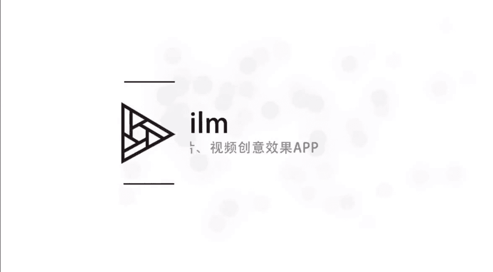
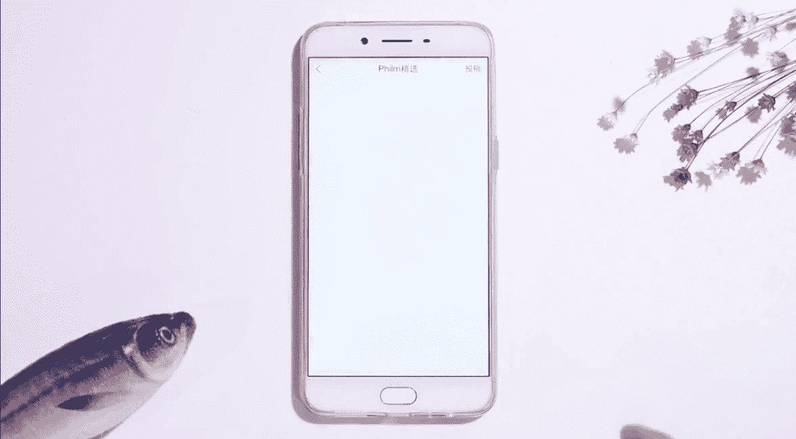
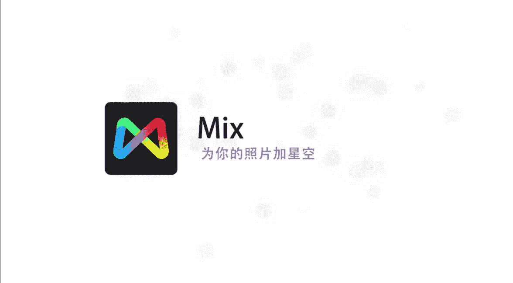

# 小北-《小北手机摄影课堂》：手机摄影正课：第8期：第8期、特殊效果类APP修图全攻略

🎼hello，大家好，我们又见面了。我是想和大家一起帅三代美三代的小北，欢迎大家和我一起学习手机摄影。这节课是我们的第四节P图课，我将教大家一些为照片增加特殊效果的P图技巧。

特殊效果类APP只需要你动动手指，就可以为照片变出各种酷炫的效果。由于需要照顾苹果和安卓两种不同的机型。所以我尽量选择了两种平台上都有的APP双重曝光是很多人喜欢的一种特殊照片效果。

而现在有了fuse的APP只需简单几步，就可以轻松搞定各种二次曝光效果。🎼好的，我们点击进入这个软件。首先这个界面很简单，这里有一排调整的菜单啊，我们主要选择左下角，左下角是一个选择图片的。

🎼我们首先选择一个背景图，呃，这里有一个它默认内置的一些背景图。比如说这个人物肖像的一些剪影，我们比如说选择这个人物肖像，这里可以选择是方形还是它原始的一个尺寸。呃，一般来讲我喜欢选择一个方形的尺寸。

你可以挑选嗯，这个大概的比例，然后比如说这个图片这样打勾就可以了。好嗯，这样我们左下角就已经选择好了人物的剪影。🎼那么这个剪影你可以不用它内置的，你用自己的剪影都可以，或者你自己的图片。然后呢。

在右下角我们选择第二张图片，选择一个前景。🎼嗯，比如说我们选择一个。🎼城市的图片，这些全部都是它内置的，呃，基本上大多数都是免费的。我们选择一个这张图片，也是有两个选项，是选择它原始尺寸还是一个方形。

我们选择方形。🎼好，这样这两张图前景和后景就叠在了一起。那么我们怎么进行调整这个图片的效果呢？很简单，它可以通过上滑或者下滑来调整这两张图的叠加的不透明度。

我们可以通过点击菜单栏的第一个按钮来调整这两张图片的混合模式。那么什么是混合模式呢？呃，其实很简单，我们只需要这样理解。就是这两张图以什么样的方式进行混合。🎼呃，比如说默认情况下，呃。

我们看人物内部包含了这个后边的图片。🎼看这个是后边的图片，然后这个是我们的前景图。那么当我调整到中间的时候，他们俩是以50%的一个混合比例进行混合的。这个是默认模模式下。但是比如说我们选择三个模式。

我们会发现人物以外的所有部分，它没有背景图。🎼也就是说这个模式是把黑色以外的部分全部过滤掉了，只保留黑色部分，黑色部分就是人物的轮廓。那么他把后边的图片和前边人物的轮廓保留了下来。

那么剩下的这些模式他们都有各自的特点啊，我就不一一展示了。比如说我们就以这个模式。🎼好，选择一个你觉得不错的一个混合比例打勾就可以了。那么第二个调整菜单。🎼我们发现这个第一个选项是对比度。

第二个是曝光度，第三个是亮度。啊，比如说我们选择这个对比度，它这里会显示对比度的一个数值，默认的是16。当我增加对比的时候。🎼你会发现黑色的地方更黑了，而而亮度更亮了。🎼但减少的时候。

这个图片嗯对比就很弱，就会看起来是柔和的一种效果。🎼那么我们可以选择一个。🎼50左右，然后就可以打勾了。好，调整菜单我就不一一再演示了。呃，还有一个隐藏的功能，我们可以通过向左滑和向右滑来调整前后进。

我们默认的刚才的情况是这样的一个情况。当我把这个往右拉的时候，它就会变成了这样的一个融合。然后我们还可以进行去选择。🎼他们怎样去叠加？🎼可以选择一个这种，然后去调整他们的混合程度。

那么二次曝光除了这种城市风光的图片以外，它还非常适合另外一种自然环境的图片。比如说我们找到这个自然环境，然后你会发现这个右上角写的是免费。我们可以直接点击下载。🎼我们等待它下载完毕之后，呃。

就可以使用这些素材了。这里还包括了两个视频素材，等一下我们会去讲。🎼好，我们找到这种树枝。🎼这些素材它已经帮大家内置好了，我们只需要给自己拍一张呃轮廓图就可以了。🎼嗯，好，我们选择一个混合模式。🎼啊。

比如说我把他俩位置换一下。🎼当这个人物在左侧的时候，然后再选择他们的叠加方式。🎼找到。🎼我们还是选择这个屏幕吧。🎼可以拉到一个位置，比如说这个位置我们觉得还不错，然后再选择第二个进行调整。

调整他们的对比度。🎼选择到这里，然后选择这个亮度，把整体的亮度加大。🎼好。🎼我们还可以进行点击右侧的图片，进行右侧图片的调整。比如说我希望右侧的图片背景变亮。🎼那我就把它增加一些亮度。

或者把它变暗稍微增加一些。然后右侧背景图的对比度。🎼这些都可以分开进行调整。🎼好，大概这样就可以了。好，在这里我再补充一句，由于这款软件内置了非常多的各种各样的素材，我们只需要给自己拍一张轮廓图。

然后选择合适的素材进行拼接就可以了。它几乎可以实现你任何的创作想象。比如说这种现代感的图片，它也内置了。还有这些城市风光和自然风光的素材。🎼其他的话我们基本上也用不到，像这种非常意识流的图片，它也都有。

所以这个究竟大家怎么去制作二次曝光图片，就靠你的想象力了。如果你不满足于对图片进行双重曝光。除了图片，我们甚至还可以对视频进行调整。如果要把背景的图片变成视频也很简单。

点击这张图然后选择还是到它的素材库里，呃，有的素材库会内置一些视频，这种图标的就是视频素材。我们也可以自自己导入自己的一些视频。呃，它有一些这种自然风光或者什么。呃，后边我刚才买了一个也是免费的。

它里有它这里也有一些素材，比如说这个素材，我们播放一下。🎼可以看到是一个烟囱在滚滚浓烟。🎼我们如果使用这个素材的话。🎼就可以打勾。🎼好，呃，这时候你会发现这张图片的上边的中心有一个播放。

我们点击播放的时候，这个左图是作为一个轮廓存在，而右图的视频是一直在冒烟。那么这两张图就结合在了一起。啊，如果我们想要进行自定义的叠加操作，比如说还可以换，我们换一种风格。啊，换成这种风格。

然后你点击播放，你可以实时进行预览。呃，这个风格不是很好看，我们换一种。🎼好，这样这种风格下也是呃人物是在中间不动。🎼然后后边的背景素材一直在动，感觉还是刚才的这个模式比较好。

🎼你可以选择这个哎找到这个位置差不多。呃，这个烟筒的烟。🎼我们让烟囱的烟更加实在一点。🎼好，打勾就可以了。我们甚至还可以把两个视频叠在一起。比如说我在这里找到一段视频，这个视频。🎼呃，播放一下。

看一下是这种小方块在动。🎼然后我右边再插入一个视频。🎼插入到。🎼嗯。🎼比如说就这个视频。🎼是一个自然风光，这两个截然不同风格的视频。🎼呃，点击播放。🎼他们俩就叠在了一起，你可以上滑，把它滑到顶的时候。

是右侧的这个视频，滑到底的时候是左侧。你滑到中间的话，它俩就叠加在一起。我们还可以选择这这两个视频的呃混合模式。🎼好。🎼我们还可以选择之前提到的snap z的这款软件进行二次曝光操作。首先打开软件点击。

然后选择一张图片，我们还选择刚才的轮廓图。🎼然后点击右右下角的一个调整的一个小画笔。只要你是升级到了最新版的snap seat，你就可以发现在滤镜的最下方有一个新功能双重曝光。我们点击进入双重曝光。

🎼然后呃左边的第一个是一个添加图片的按钮。🎼也就是你找一个自己喜欢的图片跟它叠加。🎼比如说我找一个嗯建筑的图，然后这两张图就叠加在了一起，那么我们怎么进行调整呢？呃，首先看到呃中间的这个呃小图标。

这个图标有点类似于刚才那个软件的混合模式，可以选择不同的，而且它非常的简单，它基本上没有那么多的选项，底下就三个。比如说我们选择加那在这两张图就加在了一起，我们选择剪就是这样的效果，重叠调亮调暗。好。

比如说我们选择调亮，那么第三个是调整不透明度，这个软件就是很清晰的一个，我们可以随意的去拖动底下的不透明度，找到一个你觉得不错的位置。好，打勾就可以了。🎼这样它就混合在了一起。

使用这款软件的一大好处就是它的功能非常的强大。当我们进行了二次曝光的混合之后，点击这个画笔，我们还可以进行其他非常多的调整。比如说滤镜菜单里边，我们找到一个随便找一个吧呃戏剧效果。点击戏剧效果之后。

就可以随便的给它增加滤镜，然后也可以从通过左滑右滑调整不同的效果。🎼所以呃这款软件就是很强大的功能，然后能够帮助你做任何呃你觉得你喜欢的一些操作。🎼那么当它这款软件你合成了一张图片之后。

你还可以再点击进入双重曝光，再增加一张图片去叠加。比如说我随便再加一个，那么就相当于是三张图片一起叠加，还可以调整这个不透明度。🎼好，这里我就不再继续演示了。🎼大家有兴趣的话，你可以叠加1万张。好。

不光进行二次曝光的合成，还有滤镜的调整。这款软件还有非常多的其他自定义功能。比如说我们找到这个视角，当我们选择的是一个建筑图片和自己合成的时候，呃，视角这里我们比如说向上拖动。

你会发现这张图变成了另外的一个很雄伟的一个视角。你可以进行很多很多的自定义操作，并且它会自动的去识别，帮你去优化这张图片。🎼所以大家有空的时候可以去试试这款软件。最后呢我们还可以为图片增加晕影效果。

晕影其实就是。🎼有点类似于按角，我们可以通过压按。🎼周边的一个亮度使大家的目光聚集在中心的人物身上，你还可以上滑调整内部的亮度。内部的亮度就是中间人物的一些亮度。比如说我们调到这个位置。

它可以通过内外部的亮度调整一下大家的视角，使大家的目光集中在人物身上。好，更多有趣的玩法，等着大家自己去发现。🎼接下来这款APP可以套用超多艺术特效，图片和视频都可以轻松搞定。

🎼好，我们打开这个软件。🎼这里可以选择照片或者视频，我们选择照片。🎼点击相册，可以从相册里边导入一些。🎼好，比如说我从相册里选择这张图片。🎼然后前面是一些日常的正方形原始比例裁剪或者是旋转这些东西。

🎼然后打勾打勾之后，你发现底下全部都是各种各样的特殊效果。我们一个一个来看，比如说第一个它就变成了这样，然后这是素描效果。🎼还有其他的一些效果，有的是模仿名画的。🎼比如说这个你再点击一次。

你可以选择这个滤镜或者是这个效果的程度。🎼呃，程度数值越低，那么它就原始的照片会露出的比较多。那么越高的话是这种特殊效果会比较多啊，这些大家可以随意设置。🎼好，这里可以添加一些贴纸。

那么照片我们看到这个贴纸是会动的，但是加到照片里它是不会动的。呃，这个软件有一个非常好的地方，就是它它是动态贴纸，可以加到视频里。等一下我给大家演示。🎼好，这里我就不加贴纸了。

那么接下来是这个软件的核心功能，就是它的视频功能。我刚才已经导入了一些视频，比如说我们选择这个视频。🎼好，它会自动给你配一段声音啊，这个视频原来是这样的效果，就是点击播放之后，云才会飘。

那么我们可以在这里加入一个。🎼动态的贴纸。🎼嗯，这个贴纸它会自动跟随，这里有很多的贴纸。🎼比如说我选择一个也是云彩好了。🎼呃，我跟踪当我拖动的这个贴纸的时候，就发现有一个十字。🎼识字在这个贴纸中心。

那当我定位到一个云彩的时候，因为这个云彩会飘，所以当我点击播放的时候。🎼哎，它会跟着动，可能我贴的位置不太好。🎼我找一块云彩比较密集的时候去贴吧。比如说这个地方我把它删掉。🎼好。🎼当这块云菜在动的时候。

那么它会自动跟踪。🎼我点到这个云菜有点稀疏，所以可能会影响一定的效果。好，找到这里，然后点击播放，就发现这个云菜就跟着它的云菜飘了。🎼好，呃，这里还可以加入文字，文字我就不加了，还可以换歌。

🎼所有很多的歌可以选择。好，这是它的动态贴纸功能。🎼嗯，比如说我再找到这个，这个是旋转的，只要你录制的视频会旋转。好，然后选择一个。🎼哦，换一个好了。🎼选择美食吧，比如说这个汉堡。

我想让这个汉堡跟踪到这个翅膀上，那点击播放，它就跟踪上去了。好呃，最后还有一种比较复杂的，比如说这个呃小鱼小鱼一直在游。🎼那么我可以给每一个小鱼身上加一个动态的贴纸。🎼呃，其实也很简单。🎼啊。

这个我们可以拖动这个滚动条，看你的这个贴纸的位置。比如说呃我在最后的时候加入的贴纸，然后点击播放这个鱼身上就带着它动。然后从开始的话，我如果希望开始就有。那么这三条鱼，我每一条给它加一个。🎼嗯。🎼嗯。

这个给他你只需要随便找到一个位置就好，它会自动识别。🎼比如说这个鱼。🎼在这儿它等一下要游出去，这个东西可以调整它的位置。🎼好，再来一个。🎼嗯，换一个好了。🎼换到。😔，🎼这个。🎼这种贴纸好了。🎼好。

我们点击播放。🎼他们三个就带着走了。🎼啊，后边还有一些鱼，我还没有加到。🎼比如说后边这三个鱼，当第四个鱼出来的时候。🎼好，这里我再加入一个随便加好了。🎼哦，这个彩虹。🎼可以往他的身子上加。

往哪里加都可以。🎼这彩虹时间有点短。🎼那我再给他增加一个。🎼这个吧。🎼好。🎼那我们现在开始点击播放。🎼那这个鱼的头上的贴纸会动会变换。🎼好，这是我们之前加的那这样的话，这个动态贴纸就加到了每个鱼身上。

你只需要点击保存，就可以把这段视频保存下来了。这款软件还可以进行几部视频的合成操作。嗯，这里我就不演示了。那么它它的跟踪功能是非常非常强大的。比如说这个视频。🎼我们随便加一个特效。

比如跟到一个非常细微的这一片。🎼位置你点击播放，它都可以跟住。🎼就是很微弱的地方，它都可以跟住啊，这个跑偏了。🎼好，这些功能大家可以自己去实践。🎼我就不再一一演示了。🎼当你需要寻找一些拍照灵感。

或者不知道这个软件还能怎么玩的时候，我们可以回到这个主界面，然后点到上边有一个灯泡的图标。

🎼我可以看到这个社区里边其他人的玩法，点击播放。🎼你发现这些。🎼各种各样的贴纸都是可以跟随的。🎼啊，大家可以随便玩。比如说你的宠物也可以。🎼嗯，这种贴纸就是随便加的。

🎼有一些社区里边的跟随效果还是很好的，可以。🎼可以搞成一些故事性。🎼好，具体的玩法我就不再演示了。如果你想要更精致一些的名画效果，可以选择pririsma。🎼好，我们点击进入。🎼左下角是相册面板。

我们点击进入相册，选择一个你想修改的图片。比如说这张图片。🎼我们可以看到下边是它的不同效果，更多的是名画的效果的预设。我们可以点击进行套用。比如说这个。🎼这个软件唯一的缺点就是制作起来非常的慢。

需要你耐心的等待。🎼好，嗯，它的这个效果没有之前那个APP那么多，但是都是非常有意思的一些效果。🎼其他几乎没有任何功能，只有一个裁剪和一个套用不同滤镜的功能。大家有兴趣的话可以去下载试用一下。

接下来是一款功能多到爆炸的APP也有人把它称为手机版的photoshop，借助pixar artAPP。我们可以轻松实现各种不同的特殊效果。🎼我们点击进入这款APP好，点击下边的加号选择一张图片。

🎼这个APP的功能我们讲三天三夜讲不完。所以今天我们一步一步来呃，先讲一些基础的不用我们动脑子的一些特效效果。🎼好，我们选择这样一张的图片，点击这个效果。🎼嗯，左边有超多的效果。

它基本上每一个选项都顶别人1个APP就是功能特别的多。我们先看一个特殊效果，就是大家可能会看到一些人做的一些极坐标或者一些旋转地球的一些效果。啊，比如说这个我们只需要轻轻一点，它就实现这个效果。啊。

当然这个效果我们可以进行调整，比如说再点击一次呃，看到四个选项，我觉得这个星球有点小，那我就把这个缩放放大一点。那刚才一个平的一个海边的图片，它现在就变成了一个圆形的。

🎼然后我们还可以通过这个去看它的圆度。嗯，这个我就默认好了。🎼50好，然后还有一些模糊效果。🎼就是你可以进行调整，看这个圆的一些比例。啊，比如说这个底下的菜单挡住了，你，你可以把这张图往上挪一挪。

🎼然后你还可以让他转，比如说嗯你觉得。🎼嗯，我觉得这样会好看一点。这这个大的帆船在中间。🎼好，这样就是通过随便点几下，你就获得了一张这种嗯极坐标的一个旋转地球效果。🎼好，我们打勾就可以保存。

🎼但是大家要注意一点，就是旋转星球不适合于每一张图片，它适合于这种水平线比较明显的图片。比如说我们选择一个这种图片。🎼还是找到效果里边的扭曲。🎼然后小小星球，那它就会瞎旋转。

这张图片就不是我们想要的那种旋转效果。🎼好，呃，除了选择这种水平线很清晰的图片以外，我们还可以选择另外一种这种色彩非常鲜艳和丰富的图片。那么它会旋转成什么样的效果呢？我们点击效果，找到扭曲。

🎼还是注意看啊，小小星球当我点的时候，那么这个色彩就会完美的融合在一起。🎼同时呢你还可以进行缩放旋转的操作。比如说我想让它。🎼让它充满画面。🎼好，那我就把它缩放到这个位置，好像没有变。🎼然后可以旋转。

🎼就是当色彩非常接近或者有渐变的颜色的时候，那么旋转出来的效果会非常的好看。我们打勾就可以保存。🎼像这种功能比较多的APP有一个非常大的优势，就是它可以不止应用于刚才这样一种效果。

刚才我们把一个平的图片变成了圆的，那么接下来我们还可以再次点击效果，应用于其他的效果。比如说我们找到这个流行艺术。🎼好，点到这个关闭网络，它就变成了另外一种图片，又应用了第二种效果。那我可以进行调整。

比如说尺寸我想要这个网格的尺寸要小一点。🎼然后它的颜色。🎼呃，大概这个，然后溶解溶解代表什么呢？就是呃这个空白的格，还有这个显色彩的格有多少？🎼呃，渐暗大家可以注意。

渐暗的话会把这个融合的程度融合的程度变得比较好。🎼就是呃有点类似于这种网格边线的不透明度。比如说我把这个拖到最高，那么这个网格线就消失了。🎼那么我找到一个合适的位置，好，打勾就可以保存了。

那么我们还可以再次点击效果，为图片增加其他的效果。🎼好，随便点一个。🎼好，这里我就不再继续演示了。大家有兴趣的话，可以找到你自己拍摄的海边的图片，或者是色彩有渐变感。

或者色彩非常丰富的图片去实践这种极坐标的旋转地球效果。这里我再给大家演示一个魔法效果。刚才我们用的是效果里边，这次我们点到魔法，还是这张图片，那么这个魔法有点类似于刚才的那几个APP就是添加艺术效果的。

🎼APP比如说点到这个效果，其实这么一款软件就可以把所有的东西都搞定。好，这样的话这个图片就应用到了这个新的效果。那么这个键案就代表着不透明度。🎼好。

你就可以发现我们本来是一个这样单一颜色的黄色和红色组成的照片，变成了一个彩色的照片。🎼好，这里上边有一个橡皮擦，这个橡皮擦代表的意思就是。🎼我们可以试一下啊，它代表的其实是PS里的蒙版。

那就是比如说我觉得这个中间的紫色我不喜欢，还是原来的黄色好看。那我只需要点到刚才的橡皮擦，然后去涂抹。我可以把之前的东西恢复过来。好，其他的特效也比较类似。嗯，我再随便点一个好了。比如说这个。

它就变成了一个金黄色的一个效果。那如果我不喜欢，我还可以继续擦。我觉得刚才的这种黄色可以融入出来，露出来一些。好，我把它黄色擦出来。那么你如果擦反了，我想让这边露出来，我们不需要重新擦。

我只需要点到这个有一个反向色彩。比如我点到反向，那就是嗯他们互相颠倒了一下。刚才我插的是这边，点击反向之后，就相当于我擦了左边，那左边的地方就漏了出来。好，这块软件非常的强大。

我们以后还会继续再讲它的更多合成功能，可以做出非常有意思的特效。

好，还有一款我们之前提到过的APP叫做mix点击进入。嗯，这款软件也是非常非常多的功能。呃，我们先选择一张图片，今天我教大家制造星空效果。比如说这张图。就是一个很普通的一个建筑，然后有天空。

这块软件有一个功能，可以自动识别天空，然后把天空变成一个，你看这里有一个魔法天空的效果，我们点击进入，你可以选择各种各样的魔法天空特效。好，我们一个一个来啊，这样它就自动识别了云菜。

就把它套用成了一个天空的特效。嗯，后边有这种。黄色的。云彩，然后这个有一个非常好的，就是它的星空效果很好看，而且可以把这些建筑自动也套成了蓝色，就是比较真实的一个效果。然还有极光的效果。呃。

其实实现起来很简单，我们只需要在晴朗的天空或者有云的天空去拍一张图片，拍一个天空的图片，最好带一些建筑物在里边，你就可以去套用这个模板了。呃，当我们选择了这个模板之后，你再点击一下，可以调整它的程度。

🎼呃，这个数值越大，它的魔法天空效果就越明显。比如说我弄到90%。好，这样的话我们就获得了一个比较真实的魔法天空。这款软件还有一个很真实的功能，就是它可以把素描效果做的非常的真实。

比如说我们打开一张图片，点击这个描绘。🎼这里就是各种各样的素描效果，它的笔触是非常细腻的。嗯，之前我们也给大家展示过前两款软件，但是它们的笔触是很粗的，就是有点粗糙。那这个软件是非常细腻的一个笔触。

大家可以自己去试试，同样可以调整不同的程度。🎼mix还有一些非常非常酷炫的特效。呃，刚才我们展示了一个魔法天空，那这里我们再点击编辑工具箱，然后找到效果，点击进入效果，然后一直往右拉。

🎼你会发现适用于不同题材类型图片的各种滤镜。我们拉到后边有一个天空，这个跟刚才的魔法天空不太一样，这个天空是更多，而且它的效果你直接套用，就是凡是有天空的地方，它会自动识别，并且给你安置一个新的天空。

🎼比如说这个银河也可以一秒就搞定。然后我们可以比如说它太蓝了，显得有点不真实，我们可以往往下边拖一点，然后它就会和你现在的天空去融合。🎼总之非常就是识别非常的精准，只要大家拍了天空，尤其适合海边。

就可以直接点击进行套用。🎼而且特效的种类也非常的多。🎼比如说有时候你出门拍了一个白白的，很啥也没有的天空，你可以直接回来就套用，可以假装在北极南极都可以。然后这个是星空极光的一些特效。

🎼也是直接就可以套用，大家可以自己去试一试。🎼还有一个很好玩的功能，就是它可以单独保留某一种色彩。比如说我选择这张图，这张图主要是以呃天空背景的蓝色和灯的黄色为主。

那么我们如果要强调灯或者强调蓝天的时候，我们就可以使用这个效果，我们点击进入效果，然后一直往右拖动，找到一个单色模式，我们看单色模式底下，它是一个人打着各种各样的伞，然后伞的颜色不一样。

就是比如说这个是红色的，然后这个是绿色的，这个是蓝色的，它是什么意思呢？比如说我们点击这个蓝色，就相当于把蓝色保留了其他部分的颜色全部去掉。比如说我们刚才灯是黄色的，现在就变成了一个单色黑白，啊。

我们选择这个保留黄色，那么灯的颜色就保留了。而蓝天和其他部分全部就变成了单色。这个功能。🎼那有什么用呢？其实这个功能可以有选择性的去强调某一部分。🎼比如说我们选择我们换一张图片吧。

这张图片没有一个很直接的一个主体。🎼呃，我们选择一个。🎼比如选择这张图片，那么这张图片有一个人，人是一个红色的衣服，我们还是点击进入效果，然后向右拖动。🎼找到单色。🎼如果我们要保留这个红色的衣服。

那我们只需要点击这种红色的伞。🎼那么这个人就红色就被强调和突出了出来，其他部分全部去色。🎼好，比如说你点击绿色，那这个图片中绿色比较少，那么它就所有的除绿色以外的颜色全部变成黑白。

那么我们这个图片里又没有很多的绿，所以就图片就变成黑的。你如说我们保留蓝色，那么天空就会带一点蓝色。🎼好，这个功能可以帮助我们有效的去强调主体，去突出和表现某一部分。我们特别想想要大家看到的。🎼好。

最后我再给大家演示一个mix的胶片效果。呃，比如说我们打开一张图片，还是找到编辑工具箱，然后在下边找到一个曲线功能，那么曲线功能，我们可以自己去调整红绿蓝曲线呃，或者你直接选择它的一些预制的胶片效果。

那么第一个是彩色副片，就是副片的这种效果。如果你喜欢这种风格，你可以进行自己的去选择。然后其他还有一些就是呃模拟胶片的一些特效。比如说这种你点击进去，它就会有一些非常像胶片的感觉。

但是它又不同于之前我们讲到的vissco的那种胶片感觉，它是完全的模拟胶片，而且你还可以选择之后进行自己的调整。所以你如果喜欢这种比较偏欧美的复古风格的胶片感，大家可以使用mix的曲线。

🎼今天我们主要介绍了几款特殊效果类APP的操作和使用。这类APP已经被设计的非常傻瓜了。我们更多的是要发挥自己的创意，为图片增加各种酷酷的效果，更多有趣的玩法，等着你去发现。好的，感谢大家收看本期课程。

我们下期再见。