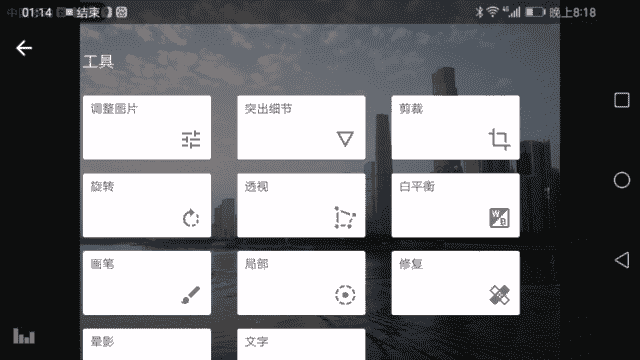
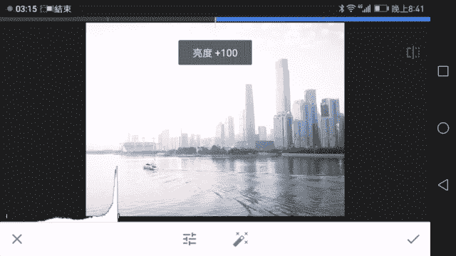

# 木西-用普通手机拍出专业级照片（完结）：01.手机摄影基础知识

OK大家好，我是摄影师木西。今天由我给大家带来手机摄影的教学。那么开始之前认识我的朋友，你认识了不认识我的朋友呢，我给你们自我介绍一下，我是一名90后风光摄影师建筑摄影师。

是个半路出家的经济学背景的摄影师。那么在我玩摄影这么5年中取得了一定的成就。比如说我是中国创意摄影展的十佳创意摄影师。然后我有CN的签约摄影师。然后呢。

我的作品广泛的发表在比如说摄影旅游摄影之有中国国家地理中国国家旅游这样的一些和摄影相关的或者摄影业内专业的杂志。然后我的一些作品也被厂商，或者说一些企业所选用。那么从今年初开始，我尝试使用手机拍照。

传统意义上来，我们认为啊想要拍照的话，都要使用这样的一些很大的器材。然后翻山越岭去拍摄。但是自从我使用手机之后，我发现。随着科技的进步，手机能够给我们带来非常不一样的拍摄体验。

同时最大限度的保证了我们拍摄的画质。那么在手机拍照领域呢，我今年也取得了一定的成果。啊，比如说我参加美国国家第一的全球摄影大赛，手机组获得了小小的优秀奖，很惭愧。

然后今年也参加了华为mate9的全球发布会样片的拍摄，并且选中了不少照片。然后今年整个一年呢也测评了10余台不同品牌的旗舰手机，所以说在手机摄影领域呢，还是有一定的影响力的。当然了，更别说在知乎上。

可以说也是手机摄影领域的一个小专家了。那么从这个角度上来讲呢，我来给大家上一下这个课，应该是可以值得大家去信任。那么我们的课程呢将覆盖了从拍照的基本原理。因为手机和相机毕近，从根本上来讲，它都是相机。

所以我们要学习手机的相机的拍摄的基本原理。然后学会如何操作手机，然后在实战中去学习如何拍摄风光，如何拍摄城市的建筑，如何拍摄人如何拍摄美食。那么在使用的过程当中，我也会告诉大家有哪些配件是我们需要的。

有哪一些小玩意儿能够让我们拍的更好。那么这就是我们整套课的，大致的一个安排。那么在上完了这么几节关于原理，关于实操关于实战案例的这样的一些课程之后。

我会有一个答疑的环节来解答大家在学习过程当中遇到的一些困难。那么我们也会以根据实际情况是否许可来进行一些直播来给大家展示我真实的一个拍摄状况。

那么下面呢我给大家介绍一下手机摄影到底可以拍到怎样的一个画面。说这么久没有照片拿出来，没有说服力。那么我们就来看一下我本人使用不同品牌的手机，在今年之内拍到的一些作品。记下我用手机拍到的一些作品。

第一张看到的是张广州的夜景啊，我们可以看到在这张照片中，我们整个城市流光溢彩的一个状态。我们几栋楼的表面幕墙的反光，然后地面的一些车流路灯以及其他的附近的一些城市或者远一点的一些城市的细节。

楼层的细节都很清晰，这都是用手机能够拍下来的画面。我们继续往下看。啊，这一张香港的彩虹村，那么这是一张很典型的对称式构图，在后面会给大家讲对称式构图。然后这样的一张画面呢很清新很漂亮。

对称呢给人一种很安稳的感觉。这张照片呢是在挪威奥斯路拍到的一对，不知道是妇女还是师生吧，应该是来这边游玩讲解挪威市政厅，也就是诺贝尔奖颁奖的地方。和平奖啊颁奖的地方。然后可以看到这张照片的明暗啊。

颜色啊都很舒服。暗部的地方都有细节，没有没有很黑，都能够看到人能够看到壁画，然后亮的地方没有特别的亮。人物的高光表面呃，人脸上的反光也都很很好，很平衡，整个画面给人一种很。温润像油画一样的质感啊。

这也是用手机把抓拍到的一张小蜜蜂在我们的荷花上采蜜的一个画面。这是在去色达的路上，格尔登寺的一个酥油茶坊。早上起来之后，僧侣们在这边熬酥油茶的一个画面看到一盏灯，照过整个蒸汽啊，一个僧侣从蒸汽中走出来。

另外一个真把他们另外一个桶给装满。另外一个僧侣。所以这样的一些画面都可以使用手机去捕捉到。同时这张照片在今年的美国国家地理全球摄影大赛，手机组中还拿了一个优秀奖。然后这张是在贝加尔湖拍摄到的一只小猫咪。

一个下午非常舒服的阳光下，一只小猫咪在那边。挠着自己的脸很可爱。这张同样是在刚才看到的奥斯路的市政厅。然后一个很漂亮的门，和它的花窗，还有大理石的门框，我觉得这幅画面很美很美，所以希望把这个门记录下来。

但是既然它是一扇门，那就一定会有人从里面来来出回回的进出。我就故意在那等了一会儿，正好有一个人进入这扇门，给画面带来了一些动感。这是来自冰岛的著名的斯科加瀑布。啊，这个人和瀑布的一种对比很明显。

人是非常渺小的在大自然的这样的。很高的很大的水流面前，以及它激起的水雾面前，人类显得非常的渺小，但是它仍然向着瀑布的方向在进发，而且画面中只有一个人少，及时多，能够很好的展现出人类和自然的对比。

这一主题。那它往前走可能是代表了一种奋发的精神。这张是来自于意大利谢纳的街拍啊，一个牵狗的路人和一个骑自行车的路人一动一进，他们的头正好重叠在一起过去一点点，而且朝向一个方向。

有一种动静对比的趣味在里头。那这张呢是上海，大家一看都知道。南尾路高架和延安路高架的一个交界处，那个龙柱啊，注明的那个龙柱都还在里面能看见。

那么这样一张画面是今年入选了华为mate9的全球发布会的样片的。是在他们的发布会上展示过。也是可以看到这样的一个城市有着非常平衡的光线的对比啊，我们可以看到它的高光部分。

那些亮的灯和它的暗部呃建筑的表面。都有了很好的一个细节，很好的光线平衡，立体感也十足，建筑的质感也很好。而这一张呢是利用类似的手法和技术在东京。

在东京的世贸中心的观景台上拍摄到的东京铁塔和整个东京的一个城市的面貌也是一样，有着很精细的细节。啊，这是另外一个方向的东京。然后这也是东京，对，这三张都是东京。可以看到东京的夜景非常漂亮。

他们的城市的建设，城市的规划配合上一个非常好的空气。就可以呈现出一种非常科技感十足的城市业景。那这张呢是我在川西的时候拍到的流水中的叶子，非常晶莹剔透的流水啊，几乎没有污染的山间流水，配合上几片落叶。

给人一种非常岁月静好的感觉。这张是著名的九寨沟的景点静海。那是一个正好下了一宿。一首雨的秋雨的一个。早晨一个早晨，然后下完雨之后呢，它的山中间就会有这种云朵飘来飘去。

然后我使用了一个模仿长曝光的一个工具来进行拍摄，那就获得了这样个云雾缭绕的效果，看起来仙境一般，非常的漂亮。啊，这张呢就是很少拍的一些人像，因为我们的课里面也会给大家讲人像课。

所以也是专门拍了一位姑娘啊，一个人像的作品，也是使用手机拍摄到的。好了，那么大家看了这么一组作品之后，可以看到，从风光自然风光到城市的夜景。甚至是很难拍到的夜景啊，到一些街拍街头的人。

到一些黑白的比较有味道的自然风光，到一些建筑，到一些生活中的小品趣味的中的小景啊，或者一些很特殊的光线条件很暗的条件下才能够拍下的一些场景，或者说一些很难去抓拍到的打鸟打虫打荷花的细节。

都可以用手机来完成。好，刚才已经看到了一些很神奇的难以置信的手机作品，都很难以让人相信啊。那些照片是用手机拍到的。那么什么时候手机拍不到什么样的场景，我们必须使用这样的大的相机去拍摄呢？

下面也要给大家介绍一下手机摄影的一些局限。充分体现了我们这个课是非常实诚的。好了，那么说到了手机的局限。对，这是一定要讲的。而且要在第一节课就跟大家讲的非常清楚啊，不然误导大家以为手机可以上天入地。

无所不能，那这就是在坑大家了。那么手机在什么情况下拍不到，拍不好拍不了。呃，这里要给大家讲一下。首先第一张照片。首先要说的是，这里所有照片都是我本人使用。使用相机拍摄的也是我个人的作品。

那么这里给大家举一下例子啊，这样的作品我们是用手机拍不到的。比如说第一张啊这种大规模的银河星空的。照片可以看到这些画质相对而言还是比较好的。在漆黑的夜里，伸手不见五指。要想把银河星空拍到这么纯净啊。

不是拍不到，手机也能拍到，但是拍到这么纯净，这么舒服的一个画质，手机是做不到的那这张也是一样的。在这样的一个夜晚使用中焦段镜头拍摄到了这么美的夜空山脉树林。和血手机是几乎不可能做到的。那么这里是一个。

第二个呢就是这是张由我使用。大疆无人机拍摄的一个空中的画面啊，当然了，这个相机它也拍不了，手机自然也拍不了，就是使用航拍仪航拍器无人机拍摄到的空中的画面，手机是做不到的。这张呢可能会更著名一些。

许多朋友都看到过这张照片，包括在国家地理。美国国亚地理是华夏地理上也有，它也是一次征稿。那么。看到这样一张照片是使用超长焦镜头，从这个山谷小镇的对面那座山的山坡上拍到的大概焦距已经在400毫米左右。

很长的一个长焦，那么使用手机是没有办法达成这样长的一个焦距的拍摄的。哪怕使用附加镜头。现在市面上的附加镜也是做不到的。所以这也是手机没有办法拍到的一个场景之一。第三个场景啊，超长焦。

这个呢是使用了两张16毫米超广角接片而成的一张城市的风光作品之广州啊，爬楼拍到的。那么这么广的画面。这么广阔的一个画面是用手机，哪怕你用全景模式去拉它，哪怕你装上手机广角镜，再用全景模式去拉。

也是无法拍摄到的。并且这是一张夜景，并且这是张夜景的接片。那么这样广阔的非常广的场景，也是手机拍不到的。所以我们可以看到，这是第四个手机拍不到的东西，超广角，这是超长焦，这是空中，这是很好的夜景。星空。

那，这张同样也是极其微弱的光线，可以看到。只有一盏只有一盏蜡烛啊，照亮了这样的人脸人眼，就是我使用了一个光圈高达1。2大的这么一个全画幅像机和镜头拍摄到的一个场景。

这种手机同样也是难以实现的把烛光拍到资本量。所以综上所述啊，当然还有其他很多场景。比如说一些人像，一些体育摄影的抓拍，手机都很难达到同等的一个画面。那么手机有它的一些局限性，绕开这样的一些。场景。

比如说一盏蜡烛，那你你点个灯好不好？或者说这样的一些很广的场景，你往后退一点，或者我们换一个地方拍，或者咱们就不拍了，咱们只拍局部以及这样的超长焦场景。拍不了之外，我们的手机平时在我们的旅途当中。

在我们的生活当中拍拍人。像刚才看到的拍拍城市的景观是完全没有问题的。那么这就是手机的一些局限场景。好了，刚才给大家介绍了手机拍照的一些基本功能。那么我们知道在学习摄影的过程当中。

我们光是了解相机的拍摄功能还远远不够，我们总需要购买很多很多的配件和镜头，才能够实现更好的画面才能够拍到更好的东西。那么比如说我们在用相机拍照的过程当中，为了让我们拍到更远的画面。

我们需要这样的一些长焦镜头，为了拍到更大的虚化程度，我们需要这样的大光圈的镜头。然后呢，我们还需要使用三脚架来稳定我们的画面。那么在使用传统相机拍摄的过程当中，这些配件的重量，常常重到案的华疑人生。

尤其是三脚架。那么在使用手机拍照的过程当中呢，为了实现更好的画面，我们也需要类似的一些配件。那么是否也会像相机的摄影当中这么复杂这么沉重呢？我们下面来看一下。okK大家现在可以看到两边的对比啊。

实力是非常的悬殊。这边是相机对啊，这边是手机对，我们可以看到相机的脚架分那么大，手机的脚架。只有这么大，可能比手机。长那么一点点，这边是相机的镜头，这边是手机的镜头。你看到手机的镜头。

相机镜头的大小的对比非常的悬殊。所以我们知道，哪怕手机拍摄的过程当中需要一些配件，需要用镜头，就让它拍的更远或者更广，需要用三脚架去提供稳定。那么我们也可以看到手机对它的整体的体积和重量都远小于相机。

对，别说跟脚架比，啊，这台这边所有的手机加脚架加镜头都可能没有一只我们相机对的长焦重。所以说如果我们使用手机并且配上这样一些配件进行拍摄，它仍然在体积在便携性上，相比于相机有着巨大的优势。

OK那么现在给大家具体介绍一下这样的一些配件是如何使用的。当然了，这节课只是简单介绍。然后我们在后面的实战课程会给大家具体讲如何使用这样一些配件。最最最重要的毫无疑问是这台三脚架。

三脚架能给我们提供一个稳定的视角，不管是相机还是手机都非常的需要使用三脚架。你看到这样一台小小的三脚架，我们把它先展开。三只脚。嗯哼，然后他现在可以放稳，在一个平面上，并不能把它再往上拔一点。

它就可以放稳。它的中轴啊，这是三脚架的中轴给它升起来一点点，它就可以放平在桌面上啊，或者是其他任何平的地方。然后我们把手机。🎼放在这样的一个三脚架的夹子上啊，这是跟相机的三脚架很不一样的一个地方。

它使用的这样一种夹子的结构，把我们手机放在中间。O。看到。这样的一个三脚架加手机的设置就完成了。手抖的客厅啊，当你拿着拿着一台手机在这样不停的晃动的拍摄过程当中，嗯。

有三脚架的人已经完成了非常稳定的画面拍摄。所以这就是三脚架的一个使用方法。OK那么给大家讲解了手机三脚架的使用方法之后，我们知道手机的镜头是不能够实现推拉变焦的。我们知道在相机上大家经常会看到。系。

这种对吧？可以伸缩的镜头称之为变焦镜头。这样的镜头通过镜头组的推移，可以实现画面的放大和缩小，并且不带来什么。画质的一个损失。但是我们在手机上通过这样直接搓屏幕的这种放大。

其实是对拍下来的照片的直接放大这样的一种放大会带来画质的损伤。所以手机并不能直接实现啊相机这样的光学变焦，那要变焦怎么办呢？它放大或者说要拍到更广的画面，我们要采用什么样的办法呢？

手机的附加镜头就起了这么样的一个作用。那么手机的附加镜头常见的无非就是变长的长焦和变得更广的广角，对吧？甚至还有一些特殊的鱼眼啊，或者说微距的镜头。那么怎么去使用这些镜头呢，其实方法非常简单。

这样的一些手机附加镜头，往往有两种方法。第一种是万能的夹子。用这么一个夹子把它夹在手机上啊，举个例子。我们可以把它夹上去。好了，把它对准我们的某一个镜头。然后再进入手机拍照的APP。

然后我们会发现视角发生了惊人的变化，正是这个小小的附加镜头所带来的那还有一种呢。是把它套在手机上的。这样的一种镜头就无法实现万用了，它就只能在特定的手机夹子上使用在特定的手机上。你看到这个地方卡口型的。

卡住了好，然后我们把这样的一个结构套在手机的上面。但他们俩其实不是特别配他的手机上面之后呢。他就能实现一个。镜头焦段的变化，所以这就是手机附加镜的常见的使用方法和两种手机附加镜不同的结构。

OK我们现在知道了手机的一些配件的一些基本使用方法。那么回想起刚才教的手机拍摄的过程啊，我们发现手机好像基本上就是一个快门按一下，尤其是我们IOS系统的某phone手机啊，它只能直接拍照。

那么对比相机各种各样复杂的专业模式。比如说我们常见的光圈优先啊，快门优先，甚至是纯手动设置参数的拍摄方法。手机上总会有一些欠缺。那么下面就首先给大家介绍一下。

在手机上可以下载安装的一些帮助我们拍摄的前期拍照APP。好，那么现在来给大家讲一讲这个前期的一些拍摄类的APP哈。拍摄的APP也是很重要的，尤其是在我们的水果品牌的手机上。

它因为没有像一些安卓手机拥有各种各样很神奇的一些拍摄的模式，尤其是最基本的所有安卓手机都可以使用的手动档拍摄，手动设置拍摄参数来让我们达到一个比较理想的参数。那它是没有这样的功能的。

所以尤其是在遭遇了夜晚暗光条件下，它会自动的把SO调到非常非常高的一个数值上去，这样会获得一些噪点比较大，细节不够好的照片。那么这样一来就会使得。iphone变得很被动。

拍摄的时候很难去调节好这个夜晚啊，或者说一些特别的特殊场景下的参数。那么我们就必须要用用到一些前期拍摄的APP。那所以这样就给大家介绍一下前期拍摄的一些APP。首先。

是最重要的是这个叫做procam专业相机的1个APP它最主要的一个用处。最主要的一个用处啊，大家可以看到。是可以进行。进行手动调节了，这也就是弥补了咱们iphone上。没有的这么一个功能啊，它可以通过。

比如说这里ISO，我可以人为的降到最低啊，降到100降到50。然后我再在这边调节我的曝光时间，相应的把它延长。然后这个提升真很烦哎。相应的把它延长曝光时间啊，最长呢也只能到4分之1。

跟我们安卓相机上长达30秒的曝光也没有办法去比。可是这已经是iphone上能够做到的最好的一一款相机了，所以有些时候没有办法，不得不可能会提高一些SO，比如说200来配合一个4分之1的曝光时间。

然后它上面有一些两个摄像头的选择啊，然后有一些关于如何保存是否打开HDR，然后格式是TF呢，还是ro呢？然后还是自动的一个包围曝光呢，快速抛快速包围拍摄呢。这个包括这个大小啊，相机的图片的大小啊。

都可以有，都可以都可以手动的去调节，已经算是一款非常人性化的1个APP了。那么在一些特殊的拍摄模式下，比如说我们需要HDR。那我们知道苹果的HDR是纯粹自动的啊。

是我们我们通过点击点击拍摄上的那个HDR3个字，就可以让这张照片成为了HDR照片。然后我们却并不能选择曝光的3张照片合成。然后我们现在需要去。选择每一张照片的曝光。

那么怎么样能够非常自主调节照片的曝光呢？那就要进入这个叫做pro HDRX的这样的一个APP。它能够让我们人为的去选择三张照片的曝光程度，让它最后合成一张我们比较理想的照片。

cortex cameraa就是一个可以模仿长曝光效果的一个camera。它这个APP呢是可以像我们在安卓上能够看到的一些。类似于长曝光，类似于30秒，对不对？它可以个30秒的计时。

它还可以选择TF或者GPG等各种各样的一个模式。然后它可以拍一些光轨的效果，那这就是。前期拍摄的3个APP是我们在iphone上经常会用到的3个APP。那么下面给大家介绍一些后期的APP。

让我们知道平时在拍完照片之后要怎么去处理。

OK我们已经学会了使用不同的前期APP帮助我们在没有那么多拍摄功能的手机上实现很多在相体上才能实现的拍摄模式。那么当我们获得了一张照片之后呢，大家都知道这个年代啊，是个人就会把自己的照片拿来P1P。

那么如果你们不会正确的使用一些手机后期APP来处理照片的话，你们的照片在朋友圈在社交网络上是是比较吃亏的。所以呢从现在开始呢，我给大家介绍一些常用的手机后期APP，帮助大家实现自己照片的美化。当然了。

更多的内容会在后期课里面单独的去讲。那么今天呢第一课给大家简单的介绍一下我们常用的APP有哪些。好了，那么我们来介绍一下关于后期的两个主要的APP。一个呢是我们的snap seat华纸修图啊。

我现在已经选择一张照片，并且已经打开它了。然后我们看到了这样的一个界面，我们已经进入到这APP里面了。然后它的右下角有这样的一个标志啊，这个标志是可以选择各种各样的调整，调整分为两部分，第一部分叫工具。

也是我们学习的重点。第二部分是滤镜啊，也是我们学习的一个需要去忽略的东西。因为滤镜大家都明白，就是一些实现一些一键特效的这么一个选择。能通过一个按钮啊，一个选项就能让你的画面出现一些风格化的变化。

那么在认真学习手机摄影啊的这个过程当中，我们要尽量的去忽略掉滤镜的一些用处，尤其是风格化的滤镜，而着重于在工具这一块啊，我们学习如何手动的一步一步的独立的去调整出一张照片的感觉。

OK那么这是stepap C。的一个简单的介绍。那看一下工具里面有什么东西吧。

今天都讲到这里了，我们来看一眼啊。第一个是调整图片，调整图片它分成了这样几个选项。它之所以叫滑纸修图，就是因为它简单，只需要简单的滑动手指就可以实现修图。

这里有亮度、对比度、饱和度氛围、高光阴影、暖色调啊，一看就是比较专业。和一些正式的修图软件啊，或者说APP比较相似的这样的一个界面。

那么这就是他的第一个功能叫做基础调节。调整图片。之后突出细节，顾名思义，就是对画面的细节进行增强。那剪裁呢更简单就是裁切画面喽，旋转旋转画面啊，如果我们拍的时候。

手机的陀螺仪没有正确的识别上下左右的方向，那么我可能需要旋转，来后画面放在一个正确的。方向上嗯透视，那就是调整一下画面的一些。一些上下左右的比例来实现1个3D变换啊。

让我们看到画面可以把它变得更加的自然。白平衡就是对白平衡进行调节喽。就是调节画面中的冷暖两种色调，在画面中的分布啊，通过白片上进行调节，画笔是一个对画面进行非常精细的局部调节的工具。

然后局部呢是一个自动识别画面内容进行局部调节的工具啊，这两者是有所不同的。我们在之后的后期课上会专门教给大家修复啊，主要用在人像和一些。特别多的人流啊，或者粗糙表面的拍摄中。

可以模仿周围的纹理来对某一个点的污点进行修复。晕影，其实说的很高级，其实就是暗角。大家有时候喜欢在画面的周围加上暗角啊，突出主体，突出中间的人文字就是加文字。那么我们在滤镜这部分可能会学到的是。

魅力光晕的使用，色调对比度的使用和复古中间某一个滤镜的使用，那其他的就可以忽略掉啊，可以忽略掉。美颜并没有什么卵用，咱们不去管它。所以滤镜中的这样的一些功能，大多数时候是会对画面造成一些破坏的。

我们在正常情况下都不去考虑它们。然后这里的课程也不再交给其他滤镜的使用了，大家可以自己去去感受OK那么这就是snap C的整个工具的一个界面。然后右上角有一个。

菜单点开了之后呢，我们可以应用上次修改啊，就是把之前那次调整的内容重新施加在新的一张图片上。这很很方便。我们在批量出一些图片。比如说我们同时拍了好几张照片，我们调好一张之后。

发现另外一张或者后面一串照片的大致的一些曝光啊，色彩条件都和第一张差不多。我们就可以反复使用这个功能。应用上次修改这样的一个选项来同步之前的一些调整，然后是分享自然而然就是分享到其他APP里面去。

然后对可以看到分享方式，然后导出就是把照片导出保存的意思。然后呢，就是图片的详细信息，我们可以在这里查看图片的EEXF信息，可以看到这用什么相机拍摄的啊，什么相机拍摄的，然后它的参数是什么？

曝光时间啊、光圈啊、SO是多少，帮助反馈也没有什么好说的。好了，然后就是设置啊设置可以调整一些照片导出的格式和大小，这个倒不是特别的重要，不是特别的重要。然后左上角的打开呢，刚才已经看过了。

就是选择照片左下角有一个东西很神奇。大家可以点开看一个，好像是正态分布曲线图一样的东西。然后点回去呢又好像是一个信号，这个东西呢叫做直方图。在这里先提前给大家讲了，直方图是在摄影中非常常见的一个辅助。

我们进行判断画面曝光状况，记住是曝光状况的一个工具。右直方图右边表示亮最亮的部分就是画面一片惨白，是最右边这条逐渐亮度由又向左慢慢变暗，到了最左边就是全黑，纯粹是黑的彩物人道一片漆黑的黑。

然后中间这些波动的白色部分就是整个照片的像素分布，是不是很好理解，是不是很好理解，就是说可以通过这个直方图来看在整个画面的亮度分布。比如说我们看到右边比较多一点，说明这张照片有大量的部分是分布在亮部的。

是分布在亮部的是比较亮的。我们也看到画面的最左边就是最最最左边那一小部分是空白的，没有白色的这样的一个面积覆盖着，说明最左边是没有东西的，说明最左边是不存在纯粹黑色的画面的。所以每一颗像素。

哪怕你看起来很黑的这些这些地方啊，其实它都是有亮度的，它都不是零，都不是零。那么这直方图的一个功能。那么随着我们的一些画面的调整，直方图也会发生相应的变的话，比如说我在这里调整的亮度。

大家可以看到直方图随着画面亮度的不断提高，它不断向右挤向右靠，然后到亮度百分之百的时候，全部挤在最右边，大部分面积挤在最右边，然后之前很暗的地方也变得很亮了。然后画面最左边就更加没有东西了。

最左边就更加空白了。那么当我们降低亮度的时候，我们可以看到哎。到这个地方的时候，好像就比较集中在中间了，说明画面中没有特别亮，特别。快要过曝的部分也没有特别暗，看这里没有特别暗，快要欠曝的部分。

那么这个时候的曝光状况就比较理想。所以我们在后期的时候会根据直方图的一个分布来调整画面的曝光。当我们把亮度降的很低的时候，你会发现大量的像素集中在左边。但是并没有完全贴住，像刚才集中在右边。

这样要完全完全贴在最左边，说明什么呢？说明画面还是没有欠曝。因为这张画面本身是原来是比较曝光比较偏右的。所以即便我们把曝光比较偏右的，比较偏亮的。所以即便是我们同样的降低100的亮度。

画面的最左边也没有达到最暗，但是我们如果加100的亮度，就看到最右边是完全过曝，达到了一个很亮的状态。所以直方图呢是指导我们在调整画面明暗的时候，可以告诉我们一个比较准确的关于整个画面像素分布的信息。

关于整。

整个画面像素分布的亮度信息。因为我们在调的时候，很多时候只见树木不见森林，对吧？我们可能注意力在我们想要看的起启栋楼上，或者说是在画面中比较突出的部位啊，比较突出的部位。

没有去顾及到其他的这样的一些暗部阴暗的部分或者说天空中那些比较频繁的云，但一不小心就让他们过曝了或者爆了。所以这个时候点开直方图点开左下角的直方图就能够帮助我们知道整张照片的明暗状况是怎么样的。

所以这是中的直方图。那么这样介绍完了工具啊滤镜。然后右上角的一些选项可以去选择去设置，可以去导出，可以去应用上次修改的这样的一些按钮，大家都看到。那么下面给大家介绍的是的介绍。

。好了，那么给大家介绍完了我们的snap see的这样的一个重量级的APP之后。迅速来到我们下面另外一个重量级的PP就是vissco。vissco呢跟stepap seat的设计逻辑会很不一样。

snap seat是进去之后，立马打开照片开始修，而vissco则需要导入一部分自己已经拍到的照片，然后再通过滤镜来一个个的逐步调整，我们进来看一下。好，那么已经进入到这APP里面了。

它有两个可以选择的界面，主界面，一个向右滑。这边是可以看到vissco主动推出来他们的自己的杂志啊，世界上其他摄影师用这款APP进行调色之后，上传到vissco里面的一些美图，他们主动推的。

哎你可以看到很尊重版权，所以每一个摄影师的名字都是知道的。而且如果说有些选中，我们是可以在邮件里看到vissco发过来的通知。因为我本人有两张照片被选中过，上了vissco的这个杂志。

所以说也是知道这个情况，然后向左推，就回到了我们的自己的创作空间。哎，回不去了。好，回来了。好了，然后我们点左上角的加号，可以选择一堆照片，然后把它导入到我们的这个。APP当中好选了一张照片。

然后我们点击右上角的这个圆圈。导入成功。好，我们可以看到已经导入一些照片的这个图库，就有了我们最新导入的这张照片了。双击它我们就可以看到这张照片。然后我们怎么进行调节呢？

我们要在这么多照片中首先选出一张。好，比如说这张照片，然后我们看到下面有一排这样的一些选项，点叉就是退出这张照片回到主界面，然后点击这个调节的标志，就来到了一个选择滤镜的一个。一个一个一个页面里面来。

然后我们点击不同的滤镜。这些M3M5P5啊TI呀、TXE啊，这些都是为了区分这些不同的胶片。的风格胶片的名称而命名的不同的胶片。然后最后有一个购物车的标志是说你还可以在vissco的商城中去购买付费。

购买一些其他的更丰富的胶片预设，用来一键调节好我们的这个画面。OK当我们进入到这个页面之后呢，我们可以双击双击某一种预设，然后来选择这个预设中。施加在这张照片上的强度啊，就好像这个预设。

让这张照片变成了一个很有感觉，暗部提的灰灰的这样的一种画面。然后你可以通过下面的这个调强度调节的进度条来选择它的强度，右边就是最高，左边是最低。可以看到这边是最高，这里是最低来调节它的一个强度。

然后下面还可以点开菜单，继续调节画面中的各种参数。就像我们刚才看到在vissco，不对，在snap see里面有各种各样的亮度啊，对比度啊的这样一些调节选项一样，vissco也有这样的一些选择。

只不过vissco的调节没有snap see那么的精确，那么的精确，比如暗角。对他有一个这样的一个调节。然后比如说这里有一些对阴影和暗部进行单独。增强的一些选项。这实在snap six里面也有。

那么snap在visscoca里面也可以去调节，所以这样就是一个调节的过程，调节的一个选项在最下面下方的第二个。然后第三个就是导出，然后把它发布了，这样才能够让这张照片。

让这张照片出现在我们的照片的相册当中。然后我们需要登录啊，现在好像已经不是特别好用了，不过我们还是可以把它保存到相册，保存到相册，就是最右边的一个选择。保存到相册它就会存在我们的相册中，就是它被导出了。

我们可以在我们的相册中找到这张照片，然后把它再发到我们自己的朋友圈里去。而这个第三个发布则是只发布到投稿到visscocam的这样的一个杂志里面去。然后它有一定的机会会像这些照片一样啊。

出现在visscocam杂志的一个精选当中。当然了。我们都知道一些。不方便直说的原因啊，我们的。我们的网国家的网络和visscoca官方的网络是有一定的问题的。所以我们大多数时候只能把一张照片点开。

调节到自己满意的状态之后。打勾打圈，然后再保存到我们的相册。而不能够轻易的发布。好了，这就是vissicalcam的一个介绍。通过这样的一个介绍，我们知道了snap seat是调节。画面明暗。

调节画面的。色彩风格调节画面的这样的一些基础设置的一个首选APP。调节完了之后，我们进入到vissco里面之后，我们对画面进行一些风格化的调整，增加了一些胶片的味道在里面啊，让它像一些电影啊。

像一些老胶卷啊，这样的一些风格。最后我们通过导出这样的一个选项，让这张照片，让这张照片能够出现在我们的相册当中保存到相册哈，这就是一个常规的修图流程，也是我本人最长使用的。

但然我就99%的时间用的只用snap。我很少用vissco风光摄影要求比较准确的色彩去这样做出的一个选择。

好，那么我们第一课接近尾声，我们学了手机可以拍到怎么样的画面。我们学了如何去使用手机的拍照功能。然后我们了解了一些拍摄的前期APP和后期美化图片的APP。然后我们也学会了。比如说像三脚架这样的一些附件。

如何正确的使用。那么在这一课最后这段时间里，我给大家谈一下我们使用手机的一些感受。我觉得手机作为未来的一个影像器材的发展方向，这是一个历史的必然。因为我们可以看到摄影器材，是100多年的发展历程。

它从只能放在实验室，只能放在室内进行长时间曝光的巨大的器材，到逐渐能够唉挂在摄影室的胸前。然后背在背上，到到街头到山野里面去进行一些拍摄工作，到后来可以让普通人也能够拿在手上进行简单拍摄的一些傻瓜相机。

自动对焦相机，哎，直到我们数码时代的出现。我们不用洗焦。片我们就可以直接看到我们拍摄的成果。而到了今天，我们使用手机能够快速的上传我们的照片，分享我们的照片。这一切其实就正好符合影像器材的一个发展史。

能够带出去拍，拿出来就可以拍，拍了可以看看了可以传这样越来越便捷，越来越方便的影像器材。那么这正好符合我们人掌握信息的一个规律。我们希望越来越便捷的获取信息生产信息。然后在跟他人分享我们的信息。

所以手机摄影它正好符合这样的一个历史发展的方向。我很期待有一天能够随时随地用这么简单的器材拍出和刚才展示的那些打单反打相机一样的画质，以这样的一种便捷快速的。方式去生产图片去生产影像。

OK第一节课就到此结束了。我们这节课只是学习了简单的功能和附件，但是我知道你听完这节课仍然网络不会。所以说下一节课我将给大家带来非常详尽的如何使用手机正确拍照的课程。我们将从最基本的摄影原理入手。

一步一步学习拍摄。