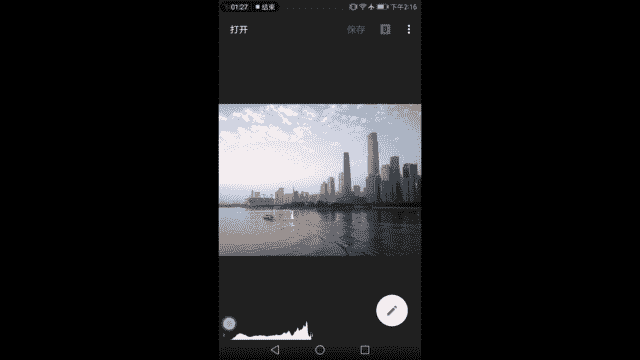
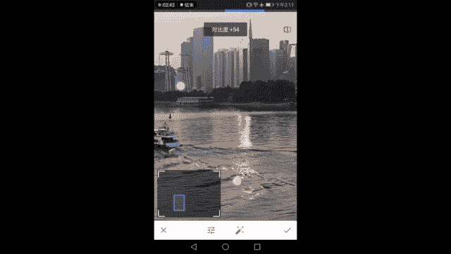
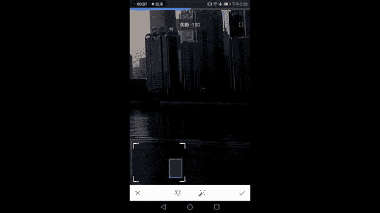
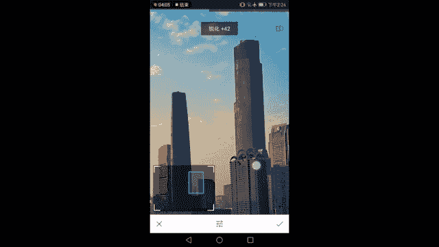
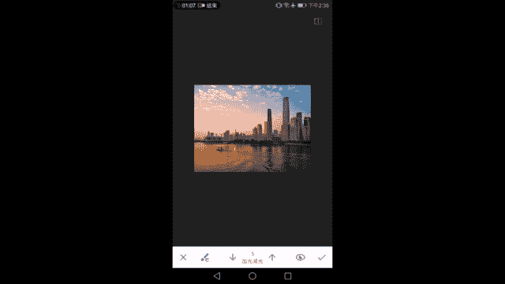
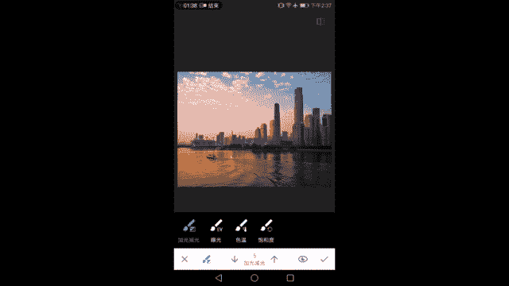

# 木西-用普通手机拍出专业级照片（完结）：03.手机照片后期处理（1）

好，欢迎大家来到第三课。嗯，我们回顾一下前面的两节课分别讲的什么啊。第一节课简单的介绍了一下手机摄影的优势啊，为什么要手机拍手机可以拍成什么样？然后我告诉大家手机基本的操作和配件。好了。

然后第二节课我们深入的学习了曝光摄影的相关的一个基础知识。然后我们也学会了正确的用光啊，包括控制光线的强度，包括控制光线的方向，包括了解光线的一个温度，会对画面产生什么样的影响，啊，我们算是学会拍了。

第二节课技束之后，那么第三节课。显而易见的是，应该学习如何修一张照片。我们拿到的图，拿到了画面，我们要怎么去处理它，让它更好看，让它更美观。那么这就是我们本节课即将带来的内容。

那么对于手机后期修图的APP我这里郑重推荐给大家两款APP第一款叫做ap中文名叫华修图，通过这样一款APP，我们能学会最基本的关于画面的明暗关于画面的亮度对比度，关于画面的色温的一些调件基础知识。

我们能够很清楚的了解到一张照片的后期应该从哪里开始。然后通过这样的一个很基础的学习了之后，我们了解了后期的基本知识。然后呢我们想对画面进行一些个人化个性化风格化的调整。

我们就来到好像没有中文名字这样的1个APP上，就画面进行一些胶片风格的调整，大概是这样两款P会在今天的课程中出现。我们一起开始吧。大家好，欢迎来到修图课啊，我们来到了我该如何后期这么一个课程。

首先呢要给大家介绍一下这两款主流的APP的使用。然后呢我会以非常详尽的例子，既然是修图课，我就不能像前面一样简介了。

来给大家讲解城市风光自然风光以及常见的在环境中拍到的人像是怎么样使用和这两P进行后期的好了，话不多说，我们先进入还记得这张照片吧，对吧？为了让整个课程有延续性我仍然使用我们之前出现过的一张照片的画面。

这也是我在猎德大桥广州猎德大桥上黄昏的拍摄准备的时候拍到的一个画面可以看到这样一张照片以及sap的页面已经呈现在我们面前了。左下角啊著名的直方图已经讲过一次在这里再给大家讲一讲它分为左右。

右两端左端是最暗的部分，那么最左边这一点就意味着没有任何光线信息，右边是最亮的一部分。最右边这一个点就意味着所有的光线信息都达到了最高值亮度达到了最高值就不再爆含任何细节，它让整个像素都完全过曝了。

中间从最暗到最亮，这是一个逐渐的一个过渡的过程，那么这些白色的像小山一样的东西就是整张照片中的像素，那么他们按照从亮到暗从暗到亮这样的一个顺序分布在我们的画面当中，有些地方很亮，有些地方很暗。

但是他们明暗的分布呢本身是按照我们画面内容来的对吧？有有有建筑有阴影，有高光。但是他如果按照明暗本身的过渡标准，来参考的话，它就应该是像下面这幅直方图一样的。

从暗到亮这样我们就可以明显的知道画面中的暗部。多少画面中的像素更多的集中在亮的地方还是在暗的地方。那么他们需要怎样的调整，让画面变得更好看。好了，现在说一下大的原则啊。第一个就是让明暗协调。

我们叫明暗协调，协调这个词本身就模棱两可。那么协调的概念在我们的风光摄影建筑摄影当中，就是指直方图的左右，啊，都不要完全顶死了，像右边这张就有点顶死了，导致画面中像比如说这些阳光的导影啊。

天空的白云有一些信息的丢失，我们不让海面暗都顶死，让我们的像素比较均匀的分布在整个亮度的区间中，这是其一其二要有立体感，整个像素均匀的分布是不是就会造成亮的，不够亮暗的不够暗，整个照片灰蒙蒙的对吧？

那你说不要太亮。你说不要太暗，那整个画面不就灰了嘛？像我们把对比度降低，它是不是就很灰，那所以这样也不行。😊，我们要保证一定的适度的反差，整体反差和局部反差，整体对比度要适量，然后局部的对比度也要适量。

让画面变得更加的有立体感，更加的有质感。那么这是我们修图在明暗调节上的两个原则。第三个就是我们的色彩，要协调协调这个画也是非常的对吧？非常的模棱两可。那么到底是什么意思呢？

首先协调第一个标准是指符合人眼的观察习惯。比如说这样的一个黄昏的状态。你把它弄的这么冷，这就不对了啊，这是个人看着就会觉得不协调，不舒服，你把它搞的这么黄黄的发律也不协调。所以协调第一点。

毕竟我们拍的是照片，不是画画，那么他要反映真实世界的一个状况，所以他对真实世界要有一个参考，要像一点点，我们人为的观察到的这个世界是什么样的一个状态。第二个就是色彩本身的色相啊，饱和度啊，要协调。

你看如果饱和度特别的高哇，都蓝炸了，黄的黄炸了，这就很不好看啊，我们的色调本身出了问题，特别夸张，这也不协调。那么具体比如说你说好，老师我这么夸张，我不会我我知道这是错的，但是到底是看调到这儿呢。

还是调到这里呢？哎，这两个好像就没有那么大的一个正确错误的区别了，没错，这就要因人而异，因你的口味而定了。而我们每个人的口味都有点不同，有些朋友们喜欢浓一点点啊，喜欢弄完一点点。

有的朋友们喜欢稍微冷一点点，这就是摄影可以进行创作的部分啊，再让我们的画面大致符合真实观测的场景。这个这个大致的框架上限制之内，你可以按照自己的喜好，甚至自己的心情，在拍这张照片的时候，你是内心。

充满了啊欢乐的气氛，充满了温暖啊，希望看到一个很温暖很昏黄的黄昏，还是你内心其实有点伤感啊，这座城市有很多你的不开心的故事。你希望它写的冰冷一点点也可以。但是就像我刚才讲的啊。

它的上限和下限都要保证好啊，不能太夸张，同时呢要具有一定的真实性。所以这是我们在调色上的一个一个原则。刚才讲明暗的原则，现在讲调色的原则，那么之后一些细节上的处理，比如说建筑我们需要把它调的正一点点。

这些都不能称之为原则性的东西了啊，这是一个个人喜好基础之上的一些技巧调节，OK话说了这么多，我们就来参照着直方图来以这张照片作为一个范本，我们来调一调。好了，已经看到了直方图啊，整个画面是比较偏亮的。

左边的暗部没有太多的东西。然后我们首先来进入到调整图片打开工具。😊。

这个在之前的课程中已经完全给大家介绍过了哈，介绍的非常清楚。所以我们现在就来看我们的步骤。首先进入基础的调节，既然这个照片比较偏亮，我们稍微往左减一点，让它的画面得到一个比较平衡的状态。哎。

是不是我们可以看到直放图的两端都空出来了，大量的像素分布在画面的中间不那么亮又不那么暗的地方。但是画面是不是偏灰，偏灰之后加对比度。好，加完对比度之后，我们可以看到这个画面该黑的黑该亮的亮啊。

同时呢最亮的地方又没有像之前那样过曝的感觉。同时呢给大家介绍这个按键啊，右上角这一块，右上角这个按钮。😊，它是可以用来进行对比的，按住它啊，就是没有施加调节之前的样子。松手之后就是调节完之后的样子。

你可以通过这样快速的快速的闪动，按这个按钮来对比调节前后的状态。来吧，我们继续。然后饱和度很明显，画面有点惨白，我们从来没有看见过这样的夕阳，这种一点点金的夕阳，这是不可能的。夕阳都是很黄的对吧？

非常的黄。所以我们哎加错了，应该加饱和度，适当的调整我们的饱和度。好了，让夕阳有金色，让天空有蓝色，而这样的蓝色它并不过分啊，我们在生活中经常看到有这样蓝色的天空和这样金色的夕阳。好了。

到这里我们再来观察一下画面中的一些明暗的细节，是不是暗部有点太暗了呀。

是不是看的不够立体啊？我们适当的加一点点氛围，氛围使高光，记住氛围使高光亮的部分不那么亮。看这是调节前置调节后不那么亮了，使暗的地方本来是比较暗的，不那么暗了。它起到了一个平衡画面明暗对比的一个程度。

让画面的建筑更加的有立体感看再对比一下，这样子和这样子是不是画面就又有颜色又有立体感了呢，没错，那么这个时候高光阴影分开调节，如果调节到这一步，你觉得你个人觉得哈。

这就是我们刚才说的在大的原则之下可以有个人的发挥余地的时候就到了，你觉得高光还不够亮，你希望制造一种远处很亮很亮，这里有种被阳光照的很很刺眼的感觉，对吧？我们也说有这样的生活经验啊。

阳光会把云朵照的很亮，很刺眼，那你可以再加一点高光，或者你希望天空中呈现出更多的云彩。细节让云朵更立体。你看这样子是不立体的，是很白的那这样好了，云就有了明暗，云里面就有明暗对比就显得立体了。

所以你可以又可以降低高光。那让云变得更立体，所以这完全是参考自己的喜好了，阴影也是同样的，你觉得暗部这些窗户啊，这些幕墙很漂亮，你希望给它加一点点光让它呈现出来没有问题，你或者说觉得他们太亮了。

你想要一种城市比较暗暗部比较暗的一个画面你也可以降低阴影。好了，来突出我们的亮度这一部分。当然了，降低不能太过分。你看如果阴影加成这样的话，画面左边就完全丢失了细节，看直方图啊。

画面的右边就完全丢失了细节，看直方图也知道大量的像素贴在了最左边，大量的像素贴在最左边会导致它完全没有细节了。我们不提倡这样子的一个做法，就把阴影稍微的向右一点点，不要这样这么多，看到没有？

这个直方图发生什么样的变化。大家看左下。

找，然后我先把阴影往右边加，把阴影的亮度加起来之后，渐渐的最左边的像素就没有了。它就向右边移动了。这样我们看到画面的右边就能有一些细节了。OK那么这就是高光和阴影分开调节的一个效果，最后暖色调。

暖色调很顾名思义的一个事情，让画面变的暖一点，还是它偏的哎冷一点点。都可以按照自己的喜好进行一些真实范围内的调节啊，不能太夸张，这样天空都发绿了就不对了，是不是OK到这里差不多嗯。

这样的一个很正常的状态。OK好了，我们现在按住屏幕。按住屏幕可以对比。长按屏幕啊长按屏幕是中的照片可以对比调节前和调节后的样子。但你不一定按照片按照旁边空白的位置，也可以看调节前和调节后的效果。好了。

这一部基本完成了一张照片的。基础调整基础调整之后我们来突出细节，突出细节，很重要的一个事情。如何让照片看起来更高级。很多时候我们羡慕啊单反的照片拍的好清楚，像素好好，其实没那么简单。

很多时候手机像现在主要的1200万像素的手机已经跟单反是一样的。那很多时候要进行一些细节的调整，让它看起来更加的清晰，那么我们就要来到锐化这一步啊，锐化分两种，一种是结构，增加它的局部的反差。

让它变得更加的立体，更加有质感，另外一个是无差别的增加画面的颗粒，让画面的每一部分都看起来更加的尖锐，更加的锐利，那么在看大图的时候就会觉得更加清晰。

你看调节前调节后调节前调节后是不是会觉得这些水面的波纹啊，这些建筑物表面的线条啊，就会看起来更加的锐利了。所以很多时候要进行锐化。锐化是让你的照片从一个新手级别变成终极水平的很重。

那一步你发到朋友圈里面就后大家就哇，这边好清晰好厉害，对吧？那锐化这一步一定分不开。细节调节中结构有一个问题啊告诉大家，加多了，天会烂。看到了吗？因为它加的是边缘的反差。

所以我们可以看到这种较暗的建筑和较亮的天空之间。如果你的结构加太多的话，它就会烂掉，就会有很明显的白边。那这样的话就适得其反了。适得其反了。所以说加结构的时候，千万要注意。

同样结构可以剪剪结构那就是跟加刚好是反过来的，会让画面的边缘变得不那么清楚了。画面的。边缘变得模糊啊，一些云朵啊，建筑物表面的线条的细节都全部丢失，制造一种像油画笔触一般的效果，像油画笔触一般的效果。

所以我们可以善用这个结构的左右调节一些特殊的情况，比如说降噪啊，降低噪点的时候，这画面时噪点很大，对吧？SO很高噪点就很多，我们大家都学过的，那你可以使用降低结构的方法，让噪点不那么明显啊。

但这幅画是不适用的，这张照片是不适用的。那么我们继续轻微的调整一下结构，以不破坏画面的细节不制造白边为上限，我们加一点点结构就可以了。然后锐度相应的也增加一些锐度相对来讲对画面的破坏，没有结构那么厉害。

加多了就会给这种颗粒感很强的样子很粗糙，那么我们适度的加一点锐度，让我们感觉到这个珠江新城东塔呀，刚好比以前清晰点，嗯，就可以了。好了，那么结构的调整也就完成了。这样。

张照片跟原图比起来它又不一样一点，因为建筑的边缘感觉更锐利，那么我视觉上就会觉得更加清晰。然后裁剪嗯剪裁的话，这张照片我们通过我们经典的构图，已经学过了一个三角形的构图，没有什么太大的问题哈。

同时有一艘船给画面带来了一个动感。一条斜线沿着对角线的方向，朝这里拉过去，应该说在构图上没有什么大的问题。但可能朋友们都发现了。

楼它并不垂直于我们的水平面，它有点斜。在我们的生活经验当中，楼它本来就应该是对不对？应该是垂直于地面，对它并没有，所以我们要进入一个叫做透视调整的环节。

而透视调整在安卓手机和iphone手机上都是不一样的。在安卓手机和iphone手机上都是不一样的，所以我会分开给大家介绍两个版本的snap seat。这里先是这样讲安卓的安卓的这个透视调整啊比较自由。

嗯比较自由，所以同时也容易调坏，它是怎么调整的呢？我们知道这不仅仅是一个透视的调整，不仅仅是一个水平面有没有摆平。我们手机是否平行于地面的问题，有时候也会有手机本身仰拍和俯拍的问题。在我们生活当中。

我们知道我们的移栋楼很近的时候，我们抬头看，所会发现楼顶比我们楼的底部看起来小很多，因为近大远小嘛，对吧？楼顶离我们远，哪怕在你家。

你靠着墙往上一抬，你都会觉得哎我们家的房顶是不是比我们家地板要小，但实际上我们都知道在一个方形的空间中，它两个是一样大的。那么因为透视的原因，所以会出现近大远小的现象。那么我们要把这个现象给校正过来。

就不仅仅是通过像我这样的一个一个一个左右摇晃调水平的这么一个调整了，而需要对画面进行一些立体的变换。像这样进行立体的变换，然后让画面获得一个正确的透视。好了，话讲完了，我们来进行一些调节。

在安卓版的ap中啊，这张照片完全是可以让你随意的去拉伸的随意的扭曲拉伸的，它好像变成了一一个立体的照片放在一个三维的空间当中，让你去随便拉扯。所以他这样随意的调节，方便了能够很很懂透视啊。

比如说我这样的高手或者是老手去调节它。但是咱们的新手朋友们用的时候，确实会比较痛苦，他已经没有规矩了，随便让你像你。胶一样去捏它，反而太自由，不太好。我们要精确的去对照好两个东西。

第一个是我们建筑本身的线条。第二个是它给我们呈现出来的这些网格参考线，我们尽量的去拖动一个角，不要去动一个角以上的位置，我们找到一个角画面中的一个角，然后拖动它，通过左右和上下左右和上下的拖动。

但然以左右为主来让我们画面中的这些移动又一动的建筑，尽可能的顺着我们垂直参考线的延伸方向排列。嗯，然后手很巧啊，手很巧悄悄的慢慢的那不用悄悄的慢慢的就可以了，来调节画面中的几个角。

一个脚一个角拖不要两个角一起拖会很崩溃。好了，扭曲一下这个画面。然后轻轻的放手，让它实现了一个变化。哈。大家可以看到调整之前很明显，我们的西塔是向左歪的。弯的很厉害啊，东塔也是有点像左歪。

然后右边的那群建筑也是斜着的，调节之后哎呀现在大家都立起来了，都立起来了，很直，很挺拔。而且我们看地平线上，珠江的这个水面基本上也是平的，没有什么大问题。调节结束之后，我们可以打勾，就是一个事情。

第二个事情是下面有一个这个东西，最下方看到这里这个东西呢就是说它会自动的把我们扭曲之后丢失的部分给你填补出来，什么意思？因为我们扭曲的画面嘛，那这张图正好是被拉到了外面去，所以你看不到丢失的部分。

有时你看比如我这样调呢？那右下角是不是黑掉了。这张照片本来没有拍到右下角这块黑色的区域，那么它根据周围的临近部分的这些东西给你填补出来，我们看一下哎补了一坨东西补的很烂。

它会根据如果漏一条小缝缝在这里哈，它会根据你周围的内容，就这一小块它左边的这些内容，左边的这些内容来来猜你这右边没。没有拍到的画面应该是怎么样的，他给你补一块，在这里大多数时候补的并不好。

我宁可去把它裁掉，所以我都关掉这个功能，关掉这个功能之后，我们可看到右边就是黑了，黑了就是黑了啊，没有任何挽救的余地，没有人去帮你把它填起来。所以前期构图很重要。一定要拍好，尽可能的拍好它。好了。

我们再把它调到刚才刚才调出的那个角度，捏胶捏一样的把它捏直，把楼捏直。好了，基本上捏直了地平线也平了，地平线不平，可以转一转嘛，先把楼捏直再说。好了，捏指了之后，我们看一下。变化哎呀呀呀呀。

你看你看手残了吧。拿回去。看一下之前之后之前之后OK打勾完成了我们的这样的一个透视的调节。可以看到啊跟原来照片比起下已有很大的变化。细节，光影明暗色彩以及整个照片的透视都完全变了个一样。

然后呢我们来到了下一步啊，白平衡白平衡的调节会跟我们的冷暖色调有所不同。冷暖色调是直接对画面的冷暖进行调节，而白平衡将冷暖分成了色温和色调两个部分啊，着色其实就是色调色温调节黄和蓝色温调节黄和蓝。

着色将从品和绿两个方向来改变我们画面的色彩。所以说我建议大家不再冷暖色调里面调节，当然是安卓手机用户的哈，苹果并没有在我们的色温里面，嗯，你想它蓝一点，你就加蓝一点点。

你还记得如果在刚才的暖色调里面调节的话，会让画面很容易就变绿了，对吧？而且变绿也没有。

抢救过来。所以我们在这儿的话把色温向右边进行一个增加，可以看到画面变得越来越昏黄，更有黄昏的感觉了。如果它变绿了之后，我们可以在着色中向右调节，嗯，让它变红，而不是变绿。

他通过一些补色的原理来进行了这样的一个调节，那补色是比较复杂的东西，在这里就给大家讲了，那么在色温中依然可以按照大家的喜好，像我刚才说的最开始说的调色原则，还记得吗？对吧？大致符合生活经验的色彩。

然后按照自己的喜好进行一些轻微的协调的这么一个调整。好，我希望它黄一点好吗？我内心充满了阳光，我很温暖，所以我们让它黄一点点好了，然后完成了这次调整。好了，那画面已经变得很很出彩了，可以这样讲。然后呢。

画笔是个什么东西呢？画笔是一个很高级的工具啊，它允许你对画面中的任何一个部分进行涂鸦式的调节，可以看到先介绍一下这个工具。它有。

三种画笔加光减光和曝光不一样，曝光是直接增加画面的亮度的，对画面的调节会非常猛。加光减光呢有点类似于咱们PSphoshop中的加深减淡，这个概念就更复杂了。我还不不这么讲。

总之就是对画面的明暗进行一些比较轻微的调整。而曝光呢会对画面的明暗进行很明显的调整，色温刚才大家也看到了，也就是改变画面的冷暖。它偏蓝偏黄发生这样的变化，饱和度顾名思义，对画面的饱和度进行调节。

他们调节的方法呢很特别，不像之前的调整都是针对全局的针对整张照片呢，他们有这么大的一个，你看到这个小圈了吗？这就是你画笔的大小画笔是什么？就是你的手指。

那手指指着任何一个地方进行调节进行涂抹就能够给画面带来变化。我们试一下。比如说我们曝光吧，曝光比较明显。好，然后我们调曝光啊，看到没有？这这边就变亮了。就变得很亮了，然后我们把它取消掉这样的一个调节呢。

把它擦回来擦回来。所以它是一个很任意的工具啊，很随意的工具，让我们用自己的手去去改变画面的局部，对也是非常的难。一开始我都不会推荐大家去用它，不会推荐大家去用它不好用，那还是要介介绍一下这个工具啊。

刚才你介绍四种画笔，然后画笔有它自己的强度，对吧？有些时候想调的多一点，就是调的轻一点点。那么右边这两个按钮上下两个按钮就是调节画笔的浓度浓度越高，它一次性调节的效果就越浓，浓度越低。

一次性调节的效果就越不明显，看到了吗？0。3和0。和1。0的曝光差很多。哎。然后因为曝光有加减，色温也有高低，饱和度也有降低或者升高。所以如果你想要降低的话，就向下剪了，向下剪曝光了哇也很明显。

所以这两个按钮是调节画笔本身的浓度的，以及它调整的方。方向的顺着调，逆着调就要向下剪啊，右边这个眼睛是什么意思呢？他是告诉大家，不要老老玩手机，不然会得近视眼。开个玩笑了，他是告诉大家调节的范围在哪里。

看到了吗？当我打开眼睛了之后，我就发现啊，我刚才调过的剪过曝光那一部分变成了红色，而我使用橡皮擦，把刚才的调节给去除啊，还原啊，我刚才乱加的曝光，我不喜欢把它还原了。那么看到没有？画面还原了。

跟原来一模一样了，点开一下没有变化了。看右上角，那么我们的眼睛也会告诉我们画面中没有红色的调整的部分了。那么画面中的所有的调节都被我用橡皮擦擦掉了，擦掉了。那么我们的眼睛也看不到了，这很重要啊。

因为我们很多时候调节都不会那么夸张，有些轻微的调节我们自己也看不出来。比如说我加光简单，我加一点点暗部，我觉得它太暗了，乱画几笔，先把眼睛关掉，乱画几笔。让他自己调一调。

让他自己亮一亮亮一亮亮一亮亮一亮，你们可以亮一晾，太暗了，不要一个人在黑暗的角落里默默无闻。好了，加起来了，我们看一下啊，那我不知道我这。我不知道画面有没有加过啊，对吧？我这样一对比了之后哦。

我知道这里加过到底是哪些地方加了这个东西呢？点开。点开这个眼睛，我看到啊，这块红色区域就是我使用加光减光画笔去调整过的区域。那么很重要了，它是提示了我们我们调整的区域在哪里。

所以这个眼睛是一个提示区域的功能。同时呢之后啊会给大家介绍一个叫蒙版的工具，它能允许我们之前看到的所有调节。

比如说刚才说到的调整图片，突出细节，然后白平衡这样的一些功这样的一些对全局对整个画面进行调整的调节功能都变成局部，都变成局部调节。所以很有趣。待会给大家介绍。现在大家记住这个画笔和这个眼睛。

就正好是我们待会儿会学到的东西。好了，画笔已经看懂了，大致是这么回事儿，而且不太好使。

大家知道就可以了，平时可以自己多去尝试一下。那么关掉画笔啊，不用画笔调，然后局部局部跟画笔有个区别。画笔是人手画到哪里，就是哪里。而局部呢它有一个自动识别的功能，还记得红色部分就是覆盖的部分吗？

还记得红色越深，就代表着我们覆盖的。

强度调整的范围越大吗？越彻底吗？没错，那么这样的一个局部调节功能，你看似它是调的一个点啊，你觉得它可能就只调这个圆圈范围内的东西，并不是这么蠢，它会进行一个智能的内容识别，根据画面的亮度啊。

边缘的结构啊，它会自动识别出它需要调节的内容。你看即使这个圆圈已经这么大了，它左下角这一点仍然没有被完全的覆盖，所以它并不是调节到整个圆圈覆盖的范围中去。

它只调节它自己的智能识别出来的红色的那一部分内容。你看这个亮度的变化，你可以人为的通过这样这样的一个控制点来调节画面中一部分亮度。你看非常的智能啊，它并不是改变了一个圈。我再强调一次。

它并不是严格按照这个圆来调节的，它会自动识别一下内容。这些地方也是在圆之外啊，这地方在圆之内，它也不会去调节它，它会根据你放的那个点，你放置的那个点。的一些特征，比如这个点的亮度。

那他就去识别跟这个这个红色的点所在的那个亮度差不多的像素把它们识别出来，然后覆盖上，然后开始调节。所以这个调节也很智能啊，进行局部的调整。那么刚才说了，我们在调整画面中的时候，参照那些原则。

那些明暗的原则，让画面不过曝不欠曝，让画面有一定的反差，有一定的局部反差，让画面的色彩有一定接近真实，同时呢又按照个人的喜好进行一些。进行一些变动。那么局部工具正好是这样一个让我们允许我们用自己的喜好。

对画面中的明暗和亮度进行调节的工具。它是通过这样放置一个点的方法，放置一个点的方法可以看到。这里有一个点啊，写个对，说明放的很好，不是这个意思，是对比度的意思。然后就是亮度对比度和饱和度。

通过放置一个点对某一个区域，某一个区域这区域可以通过伸缩屏幕来选择某一个区域进行明暗亮度对对比度啊，反差和饱和度的调节，饱度调色彩对度当然会有一些影响，更多的是光影亮度也是会对色彩有些影响，更多是亮度。

所以允许我们对画面的局部进行一些调整啊，我觉得这里是太阳照过来的方向。我希望它更亮一点，哪怕它有点过曝，也符合我们人眼观测啊，对吧？我们看着太阳的位置，我们人眼也会过曝啊，也会一片惨白啊。

那我允许过曝可不可以可以或者我觉得哎这里应该很亮啊，江边嘛，就是夕阳落下的方向应该特别的黄好啊，我就让它黄一点，所以这就是局部工具的调节。我们也可以看到啊这个眼睛呢就让我们看到这个点和看不到这个点。

有些时候点可以打很多个看到这个加厚。😊，这个眼睛的吗？这个加号就是在有一个点之我还可以再加一个点，我还可以再加一个点，到处去加这个点，然后来调节画面，加这个点的调节画面，然后来影响我们画面的局部。哎。

一个点覆盖它自己的一定的区域，都是可以的，你看把这个点打在了蓝天上，它调节的范围就蓝天了。哎，白云就不会被覆盖了，发现了吗？它调节的是个蓝天亮度差不多的位置，包括但不限于蓝天本身，以及建筑好了。

那么我们知道了这个局部调节的点啊，怎么打哈，你要调节某一个亮度，你就打在那个亮度上，它就会自动识别类似亮度的画面。比如说这里你看覆盖的画面就多一些了。那如果是这里的话，它覆盖的就要少一点点。

如果你打在了黑色的地方，它就覆盖黑色区域看到了吗？看到了吗？它就覆盖颜色比较深一点的部分，你打在建筑上，它就覆盖建筑上，亮度接近的部分，你打在了隔壁的天空中，它就覆盖跟天空。😊，空亮度接近的部分了。

所以说它是一个很智能的识别范围，千万不要觉得局部只是调这个框，这个圆圈中的那么一些东西。OK局部我们也学会了，通过局部的调节呢，那一部分亮度接近的画面中的一些东西。比如说云，比如说建筑的阴影啊。

比如说水面来对他们进行单独的明暗对比和色彩饱和度的调节，ok那么这就是局部工具的一个使用。

