# 木西-用普通手机拍出专业级照片（完结）：05.手机照片后期处理（3）

好，那么在学完了城市建筑风景啊，城市建筑风光的这样的一个后期之后呢，我们又来到了自然风光。之前的建筑后期呢，因为我们介绍了一下snap see的整个工具的各种各样的功能。所以我们花了很长的时间。

很大的篇幅。那么等我们到了风光这一块的时候，因为它和建筑有很多相似的地方嘛，对吧？都是一些宏观的巨大的一些物体，然后它配合着日光配合着天气现象。啊。

然后配合这些我们我们无法人为去改变的一些它自己的山也好，建筑也好，自己的形态啊，建筑们之间自己的排布啊，就像我们的山里的林子，我们也无法改变一样。

那么在后期自然风光和后期我们的城市建筑这两个角度上来看是非常非常相似的。😊。

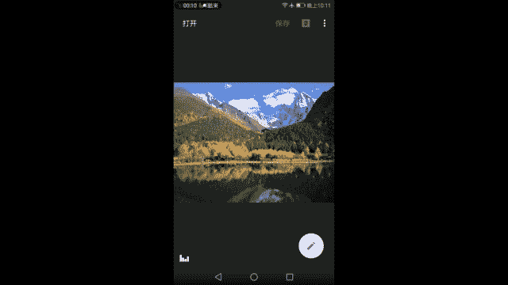

所以简单的来回顾一下刚才学到的建筑这一块啊。首先我们管明暗明暗管。

第一是画面的一个亮度。第二是画面的一个对比度反差。然后我们管色彩色彩的冷暖，色彩的饱和度是否协调。然后我们知道在调节他们的时候啊，我们都要以亮的不要太亮暗的不要太按同时画面有对比，有反差。

同时又保持了细节这样的一个标准去要求我们的调节，那么在色彩方面也是一样的，要让他在接近人眼观测的真实世界的同时，哎保有一些个人的风格，但不能太夸张，不管是在冷暖的变化，还是在色调的变化上。

还是在饱和度的变化上都不能太夸张。那么这个不能太夸张，就要依靠我们不断的看别人的照片，不断的去学习更加优秀的摄影作品，自己不断的拍摄，不断的去练习后期来得到这个不太夸张。这个不太夸张。

到底是什么样的一个度，自己要去学习去把握。好了，话说了这么多，我们开始吧，点开。😊。

下角这样的一个工具菜单，看到了工具啊，调整图片，我们点开它。首先是亮度啊，观察直方图，别忘了整体比较暗，整体比较暗，我们往右加一点点。好了。天亮了。刚好，那么这个时候啊可以看到高光这一块的这个山啊。

这是在碧棚沟拍到的。那么非常的惨白，非常的灰。坦白道也说不上灰是一定的，所以对比度很重要。但是加对比度之后，我们发现。我们发现不仅。不仅啊该白的变得更白的。我们看一下。你点一下，哎，看一下，不仅该白的。

该压一点的地方变得更加白了，而且黑的地方。暗的地方变得更暗了。所以这是很麻烦的事情。我们在使用全局对比度搞不定的时候，我们应该怎么样？我们应该使用色调对比度，但是色调对比度我现在先不提它。

因为它是后面的步骤，那么在这里面能够选什么呢？这里面能够加氛围。通过加氛围来平衡光底啊，我们之前已经说过了，如果画面灰，我们就加对比度，但对比度加猛了怎么办呢？对不对？加的亮太亮，暗的太暗，怎么办？

用氛围这个功能来平衡一下啊，让亮的稍微暗一点，让暗的又要亮起来。大家仔细感受一下这个变化，这座雪山和周围比较暗的山体以及倒影都会因为氛围的增加而渐渐的变得更加的平衡。我们看到直方图也从。😊。

一左边一坨右边一坨这样的一个原来的样子变成了向中间集中了，就说明我们的画面的明暗对比在减小。然后饱和度显然啊这比我当时看到的这个蓝天啊哈，川西的蓝天可没有这么小清新。😊，高原上的蓝天是非常的蓝的。

去过高原的朋友应该知道啊，远远不止这么一点点蓝，但这个蓝它薄度是一定要加起来的。然后彩铃相对而言也要。相对的高一些。好了。然后高光嗯可以看到我们的云彩有一点点，这块有点看不清楚它的细节了。

然后我们需把高光剪一下来。好，高光相应的剪一点之后，这一块云朵你看它的阴影就出现了，它的一个对比也有了。但是同样我们要注意啊，这边如果你剪多了高光之后，看到没有？就会出现一些很假的边缘。

很假的边缘要一定要提防这一点，我们的高光调节到刚好。刚好降了40点高光的时候啊，我们能够让我们的云朵细节多一点。同时呢。这样的一些假的边缘刚刚出现啊，刚好了，到这样子刚好看不见这个假亮的边缘。

同时呢云朵又比刚才好一些，高光降到这个程度就差不多了。差不多了，然后暗部。嗯，可以看到画面的暗部左边是比较缺失的，所以让整个画面觉得该黑的地方不黑啊，该黑的地方不黑，有可能是氛氛围加过了，该黑的不黑。

然后我们稍微降一点阴影，我们又降一点阴影，让黑的该黑的地方黑一点点，这样才有立体感嘛，对吧？我们都知道立体感是靠明暗对比体现出来的。OK啊，好了，刚好在左边一丢丢的位置。

不要让它贴在不要让它贴在了左边的墙上，这样子暗部就没有细节了。这样你看刚刚好黑的虽然黑一点点，但是你仔细看它还是有纹理，有细节的。好了，那么我们的这样的一个调节明暗和饱和度的调节基本结束了。

暖冷暖色调呢需要变化吗？我个人不建议在这里进行一些冷暖色调的变化啊。这个白平衡在大白天的时候是很准确的，没有什么太大的问题，打勾进入下一步，顺着来突出细节。😊，还记得上一课吗？

在加结构的时候一定要看清楚啊，把画面加脏了就不好了。虽然说我们已经学习了蒙版功能，但是蒙板毕竟要用手去去擦掉它，也有可能一些擦不好的地方。所以。

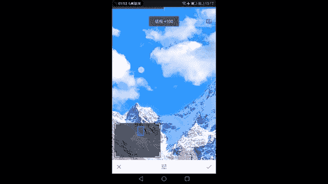

所以在照顾好整个画面的质感的情况下，我们尽量不要把结构加的太厉害了啊。可以看到从0，我们把它加的高一点点，加到3040嗯，加到40。刚好天空中的蓝色部分出现了些许的一些。一些色块。或者再降一点点吧。

好好，可以了。降多了，降到13了，降到30左右。然后待会可以用魅力光晕来抵消它，对不对？刚才你上节课不是上节课上一个例子已经讲过了，然后锐度相应点加一点点，这样让画面看起来更加的清晰。

加之前加之后加之前加之后加之前加之后很明显OK。很快速的调节完了一个我们的细节问题。

然后进入我们的裁剪和透视。

很明显，这张照片并不需要怎么裁啊，我已经很尽力了，用这个28焦段，我们也学过焦距了，对不对？所以28这个焦距就只能拍到这么多，往后退也退不掉，也没有路，这是条很窄的步道，所以说根本不需要裁啊。

已经是这样子的构图上还记得吗？三分法构图这条线啊，上面3分之2是主主要的部分，也没有办法去调整它。如果一定要裁呢，可以把水再裁掉一点点，让我们的雪山成为画面的主体。

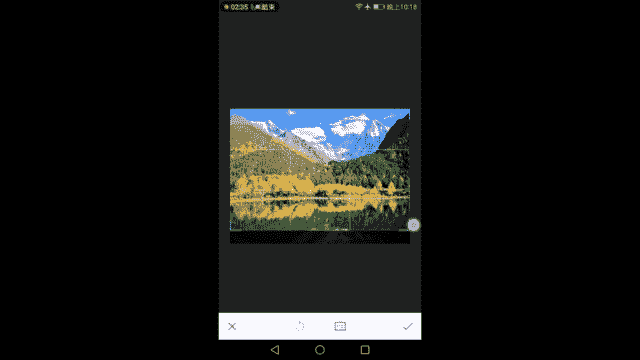

这是唯一可以进行调整的地方了。所以旋转地平线平吗？地平线基本上还是平的，所以说没有什么太多可以调节的地方，这样可能看起来更自然一些OK。

下一步透视，这不是建筑啊，这山怎么长，它还有它自己的规律。山一般来说我们不会去校正它的一个透视。因为山本身远处离我们更远的地方，也就是山间，它就是尖的，它不像楼，楼是这样竖直的往上长。大家可以看到。

而我们的山本来就是顺着高矮的顺序往上越往上走，它就越尖就越小，这是一个自然的状态，就不用去调节透视了。然后看到白平衡，白平衡跟刚才的色调差不多啊，我们都讲过，跟它冷暖色调差不多，没有太多可以变化的地方。

嗯，然后就是画笔了，画笔我们暂时不讲它。

局部可以对我们的山体进行调节。刚才有说过，山感觉比较灰，对吧？我现在对山这一块的对比度进行一个加强。好了，接下的山就不灰了，一点都不灰，我们点掉小眼睛。这就不会了，但是没有饱和度过强啊，有没有太蓝了呀？

有啊，那么我们就调节一下这个饱和度降相应的降低一些。记住刚才操作加了一下对比度，降了一下饱和度。如果你觉得山还不够立体，我们还可以降亮度，亮度降低之后，这个山就已经非常的有立体感了。

饱和度就可以加回来一点点喽。我们点掉它看一下。就是加之前加之后加之前加之后，我们可以看到的什么是什么呢？哎，等一下，先不要不要动嗯不要动放大这个画布，好像很难放大这个画布的样子。好了，放大了。

我们加之前我们的高光是这么亮的，暗部呢要亮很多。我们加到对比度之后呢，高光山的高光这一部分基本上还是这么亮，还是这么亮。但它的暗部明显降低了很多啊，降低了很多这样明暗对比，一旦出来了之后。

山体就显得非常有立体感了。山有立体感了之后，我们看一下这座山有了那隔壁有没有呢？我们可不可以扩大范围呢？可以这样就会让隔壁的这座山也受到了一点点影响。那么整个天空就有了一个。😊，以及受到的一些变化。

就有一个不错的反差，不错的立体感。我们还可以再加一颗加在左边。这个位置。然后可以看到大概覆盖了这么大一些山。我们一样通过刚才的操作降低一些亮度啊，降低一些亮度，然后饱和度可以适当的去减少一点点。

因为我们家对比度饱和会增强。再这样一些okK好了，我们点掉小眼睛啊，不要看到他们两个不要看他们两兄弟。然后我们看对比一下前后。前后前后前后通过局部调整，可以看到。

除了这两座山和它附近的一些同等亮度的天空以外，照片其他部分都没有任何的变化，没有任何的变化。这样对山进行了一个局部调整，让山更有立体感了。嗯，不错。

好了，局部完了之后修复啊，你要去修复这些人吗？理论上讲是可以的，是可以把他们都擦掉的，但是也会带来许多的bug。我们尝试一下吧。景区的游客确实是一个很恼人的事情啊，这个帅哥在那站着，把它抹了，嗯，没了。

还不错。😊。

也有一个很显眼的。么了。还有这个谁，你为什么要在这跪着抹了？好吧，好像还真的可以抹掉，因为人实在是太少，太小了。那么以后大家也学会了，可以在。😊，拍摄景区啊，这就很好笑要出现两个一模一样的人。

所以要注意一下这些bug。那如果你旦抹的面积过大的话，也会出现一些问题。啊，机器人就这样被我们无情的擦掉了。消失了，但是下面的影子还有就很恐怖。

所以除人的时候呢要千万小心修补工具不是那么好用的那我在这里就暂且决定不管了晕影加一些暗角。

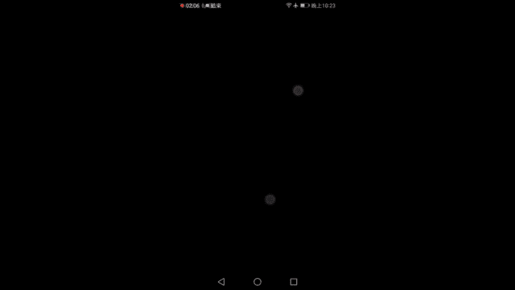

哎，好像晕你这个功能有点bug。点bug我们看一下。加一些暗角，嗯，我觉得是可加可不加的，而且暗角还可以在复古12号里面加，还记得吗？所以我觉得不用管了，云影。

文字啊，现在就就大家知道它的功能，我就不再不再讲了。

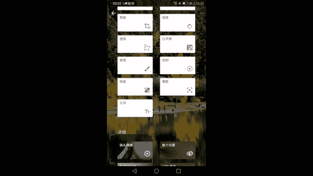

色调对比度来了，我们要通过色调对比度来局部增强我们整个画面的质感啊，通过指加高色调让云朵的反差变大，同时不能太大，不然画就会画质就会烂掉。阴影加暗部的这样的一个对比度。然。

局部的这些阴影的这些部分的山体和树林的立体感增强。大家可以看到这个差别啊，这个差别还是明显的，可以来一点点。合适就好。好了，我们看一下加之前加之后，加之前加之后还是有不少的变化的。

最后魅力光晕适当的魅力光就可以这样这样照片就变成油画了啊，或者说那种虚焦的画面也没有必要加这么多一点点让我们天空中我还是那句话啊，该变得自然的柔顺的过度变得柔顺一点。就可以了。

其余的部分我们不需望它变得那么的柔软，毕竟森林树叶应该是很清晰的一个状态，一个质感加的太夸张就不好看。当然了，之前我们可以看到天空和水面的某一些部分的过渡显得有点生硬。

所以我们还是要有1个44左右的面体光晕加在上面会让画面变得更加柔软一些。最后一步。的复古好的，这下来可以加N角了，复古12号啊，加一强一些复古12号，然后画面的。反差对比立体感达到一个更好的状态。

你看刚才是是不是太亮亮太亮暗着。不够暗，那么整体来讲，现在降了一下画面的亮度。然后平衡了一下我们画面的立体感，让它看起来更舒服了。OK了。一张风景照就是这么简单，看原图，灰不溜秋的原图。

然后通过了对比度的加强，通过了暗部高光的平衡，通过了饱和度的加强。然后我们来到了。😊，突出细节，增强了它的暗，增强它的不是暗部，增强了它的整个画面的锐利的状态。然后我们又来到了剪裁，随便裁一裁，旋转。

随便旋一旋啊，这都不重要。然后局部，我们用局部来让我们的让我们的这两座山发生了一些变化。看到了吗？这两座山的立体感明暗发生了变化。最后色对比度增强了增强了暗部和高光的立体感啊，单独增强魅力光晕。

让我们的画面中的这样的一些细节的过渡。😊，明暗的过渡变得更加自然，然后加上了复古，让整个画面的立体感得到了一次提升。OK那大家可以对比一下，前后还是很不一样的哈，可以这样说，很不一样的两张照片。😊。

那你说哪个更真的更假呢？我觉得来过这里现场的人都知道，川西的天一定不是这么清淡的，一座座雪山也不可能这么灰，离我们这么近。所以。

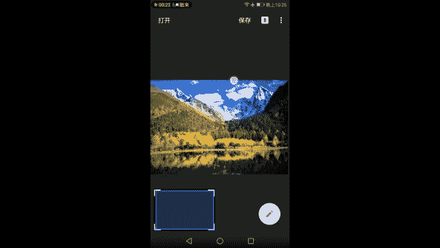

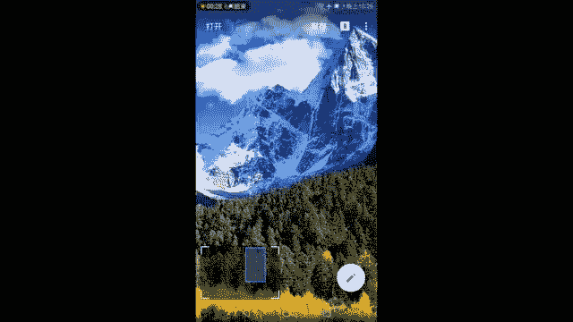

所以照片的后期很多时候是为了弥补我们相机的不足。毕竟相机不是人眼，它捕捉光线，它对于同等亮度，一份亮度的光线，它的反馈跟人眼是不一样的。他拍下来的画面往往不如人眼看到的好看，或者比人眼过度好看。

我们需要通过后期这样的个东西呢把它调的更加真实一些。这是第一步。第二步在此基础之上呢，按照我们个人的喜好，啊，就画面进行一些符合人眼视觉规律的调整，请注意这句话，你把天调成绿色的那就是乱来打破规律。

符合人眼视觉规律的一些调整，比如说把天变得更冷一些O啊，我觉得有些时候天就是看起来很冷，对不对？把天调的暖一点，把夕阳调的更黄一点。没错，夕阳本来就是黄的。

那它再黄一些还O你不要把夕阳调成蓝色的那这就是违背了人眼视觉的一些规律。那么符合人眼视觉规律进行个性化调整，大家都觉得可以接受，那就是这个阶段大家要学习的后期的一些精的标准了。

那么在以后的创作过程当中可以人为的打破这样。😊，那些规律来让我们的画面更好的为我们的思想和表达服务，这也没有问题啊，先有规则，最后再打破规则。那么这就是今天的风光摄影。后期这一步。好了。

我们讲完了城市的建筑。我们又讲完了自然风光。最后来到了一个木西老师最不太擅长的一像啊，叫人像摄影，说是不太擅长的也不是很正确，应该叫做我所设立的比较少的一个门类吧。使用手机可以拍到这样背景虚化的照片啊。

但是一般来说可以可以买一些啊后面有两个摄像头，但我不能说明了品牌，后面有两个摄像头的手机会比较容易拍到这种虚化的照片。但实在不行啊，那什么7plus啊，也可以好了，那这是一张当然是我拍的。

首先你们会在第五课看到的一个姑娘。然后我们来讲讲人像的简单的一个后期。首先人像的前期就非常重要啊。这个前期包括光线的使用。

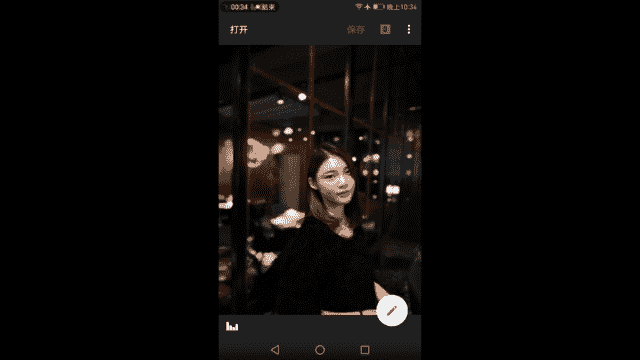

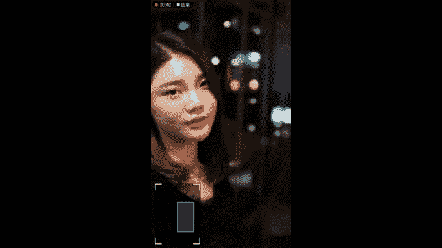

他脸上的这束光，你是在后期没有办法给他打上去的，至少是用手机拍的东西是不可以。再一个就是姑娘的姿势，姑娘的神态，姑娘的造型，姑娘的衣服，姑娘的情绪，这一切的一切都要依靠前期，这就是人像和风光。

这就是静物和建筑，这两者之间最大的区别。人在拍摄风光和建筑的时候，你只有两条腿，其他都得看天都得看城市规划局，得看建筑设计师得看大自然的鬼斧神工没有一样是你说的算。

所以你只能靠这条腿去走去找好的角度去等待恰当的时机恰当的季节，那么人就不一样了，静物就不一样，人是活的，你是活的，被你拍的东西常常应该也是活的。所以在这个时候你需要不断的去调整在前期去调整模特的状态。

姿势，调整他的妆容，调整他的衣着调整你们所处的环境，以及所处的环境中的光线。所在这个时候呢，大家生活中很容易拍到这样的一些画。面我以此作为一个例子讲一讲他的后期。

那么他的前期更多的还是会在第五课的实战当中展现给大家。好了，老规矩进入了我们的基础调整，看直方图，人像的直方图就跟风光的直方图完全不是个概念了。因为我们拍风景，拍建筑拍的是个大场面。

而拍人任何时候都没有他这张脸重要，或者延伸一下，他这整个人重要，其他东西都可以退让啊。你说老师照片欠爆了，你看这么欠所有的像素都在左边，我是不是要加亮度啊加到平衡为止啊，他脸全部没有细节，没有立体感。

姑娘这鼻子是挺是他都不知道，你就回去等着跪搓衣板吧，所以丢掉直方图，盯着美丽的姑娘的脸蛋，和她身上的暴露出来的皮肤部位，以此作为我们标准。你看题材一换，我们后期的标准也发生了变化，甚至我再这都还不错。

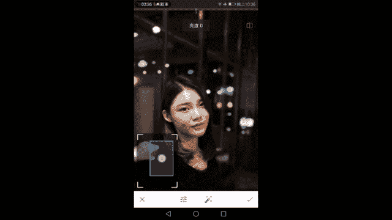

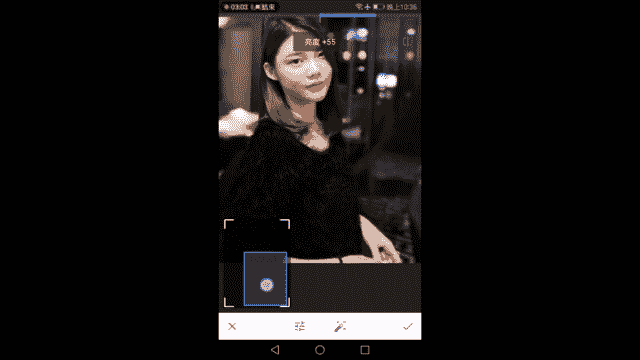

你说老师这个脂肪图完全是屎，我知道是屎，但是这个姑娘的脸很好看，她就不是屎。所以说很多时候参考的对象不一样，目标不一样，拍摄的目标目的不一样。那么我们的后期标准也会发生很大的变化。好了。

以妹子的脸为一个标准一样的，脸不能过曝，更不能欠薄。这两者之间如果一定要选一个宁可过曝，为什么过曝显白，过曝显白欠爆显黑。所以说宁爆不欠。如果说一定要过一个哈。正常情况下。

当然是细节必现最好略微显白就可以了。很好了呀。然后饱和度对比度也是一样的，对比度过高，丢失细节啊，就是细节，很多人喜调成这样，坚决反对对比度过低，画面太灰，没有立体感，五官不好看。

所以对比度适当的加一点点就好。😊。

接着饱和度饱和度太高啊，什么鬼？所以千万盯好姑娘的脸，饱和度一定要合适。她擦了红色的红色的一个口红嗯，唇彩，希望她能够带来一个比较鲜艳的状态。然后我们看好了她其他部分的皮肤有没有变得特别的难看。

没有的话好，那我允许她这个口红变得再红一些，还想再红一些。那她的皮肤就爆掉了，就炸了其他的部位。脸颊脖子一手就变得过黄了，那么没办法就要把这个饱和度给收一点回去。所以人像调整每一步都是小心翼翼的啊。

看着这个姑娘的皮肤来进行的。好了，饱和度我们稍微退一点点加一点点就可以了。但这是另外一种味道，你要调成黑白也可以。但是我们再说调彩色嘛，你不能太低了，太暗淡了就不好看了，加一点点适当的饱和度。

因为姑娘专门涂了烈焰红唇，你给人搞成黑白那她为什么要涂涂这颜唇彩呢？没有意义，所以加一点点突出一下她这个特点好了。

然后进一步突出细节，这也一样的啊，千万小心，不要把姑娘的脸给夹烂了啊，你看看这什么情况，回去等死吧。

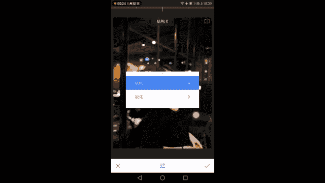

所以结构不要加太多，让他的五官上，比如说眉眼这样的一些需要很锐利的细节，对不对？你眼睛总部的一片模糊，眉眼这样一些细节显得比较漂亮，有反差就可以了。然后锐化相应的提一点点，不要提的姑娘满脸麻子啊。

这也不好，所以提一点点就可以了。

然后在这里要告诉大家一个很重要的东西，就是我们说过结构是可以反着调的，结构反着条可以降噪，对吧？当时我是这么讲的那同样的结构反着调也可以让女孩的皮肤更好看，相当于磨皮了，对不对？所以记住结构顺着用。

可以让画面有立体感，整体看起来你看她的发丝也更加有立体感更好看了，对吧？那么结构反着用，那给姑娘磨个皮，但是后面这些楼啊，这些框架呀、建筑啊，背景一塌糊涂怎么办呢？永远不要忘记你还有一个叫做蒙版的工具。

随时随地的使用蒙板来对女孩的脸进行局部的磨皮，而保证周围的环境不受到影响，这是很重要的一个特点。好了，我们还是让结构加一点点，待会再帮姑娘的脸从这样的一个。

很夸张的颗粒中解救出来，同样使用蒙板反着调就可以了。错的一个状态，我们继续往下走，可以看到。

已从原来比较暗淡的，比较色彩比较淡的这样的一个状态哈，画面不是很清晰的状态，变成了人很清晰，色彩也比较漂亮了，反差也还适中。紧接着啊裁剪这个没什么好讲的啊，按照黄金分割的玩法，按照。

我们之前讲过的把人放在区味中心这样的裁法来裁剪就可以了。那能不能多裁一点？老师，你是说这样刚好，对不对？那手不能裁出去了，手不能裁出，人的手非常重要。学过素描同学都知道手是人。

像动态肖像中的一个灵魂一样的东西，的手体下人的身份，体现了人的性格，所以手不能裁掉，那你裁太多环境就不好看了。所以如果要按照一个黄金构图的方法去裁裁到这里比较合适。那这就是前期没有考好构图。好了。

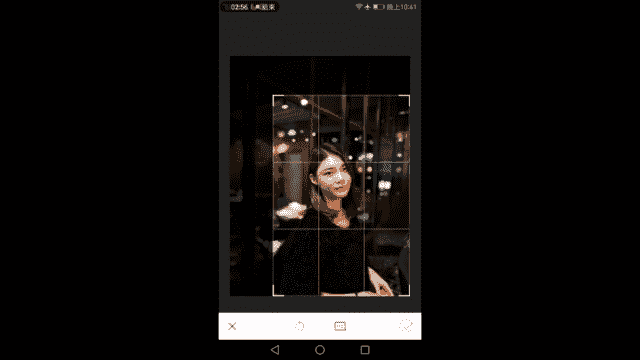

这样就是一个大半生的人像了。

但然你也可以不这么踩，没问题，白平衡调节有个很重要的点是往左走会显白，会显白，往右走呢会有红润。你一定要再把握好这样的一个平衡，往左走，姑娘的脸会显得更加的白一点，白白一些啊，白一些。

往右走呢会显得有血色，显得气色好，你到底怎么调，大家千万要把握好自己手中的进度调。

调节调OK我往左走了一点点，会娘显白一些。

紧接着画笔啊，这个就很复杂了，还是不讲。

修复嗯，这个在人脸中就会起到很大作用了，有一些不太好看的啊，一些小瑕疵，没有遮好的痘痘。

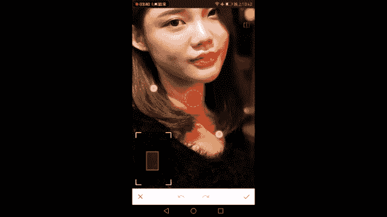

没了。没了，是不是这和美图秀秀的一件磨皮很相似，小痘痘磨一磨，哎，该磨的磨掉磨掉，都把它痘痘磨掉啊。头发上一些不好看的位置甚直接可以磨掉这块脸上的小阴影呢也可以尝试着去磨它。但是一旦没有磨均匀。

那就会出大事了，就出大事了。

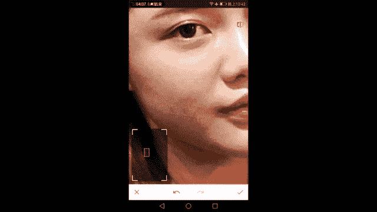

当然你这样磨一下，也还可以，可以尝试去磨一磨这个姑娘的脸上那一块小阴影啊，显得脸显得更加圆润一些。但是这样的话就或多或少会有一种不均匀的感觉。大家发现了没有？

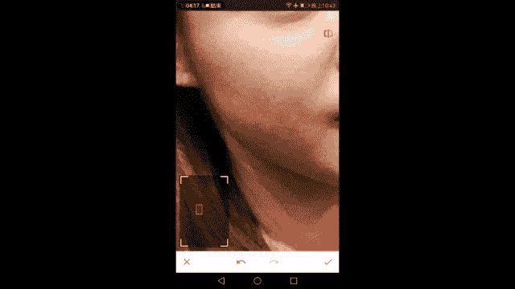

这一块太大的这部分会显得不均匀，所以看自己见仁见智吧，我觉得还是看到自己的需求去调节。好了，修复了一下皮肤，让皮肤变得更加的无暇了。我们进入了晕影，局部就不说了，没有什么用到的地方，暗角很重要。

在拍人像的时候，为了更好的突出主体，尤其是光线条件没有我这张这么理想的情况下，更要使用暗角，让环境变暗。

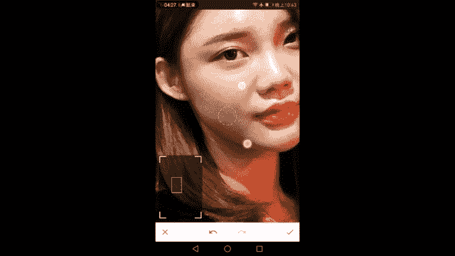

让人变得更突出。那么我这张是没有必要的，我这张的光是很好的，所以就不再需要不再需要很强的按角一点点就可以了。这样一点点啊一点点。How。然后以人脸为中心，这以点点方面的亮度，基本上看不出来变化的。

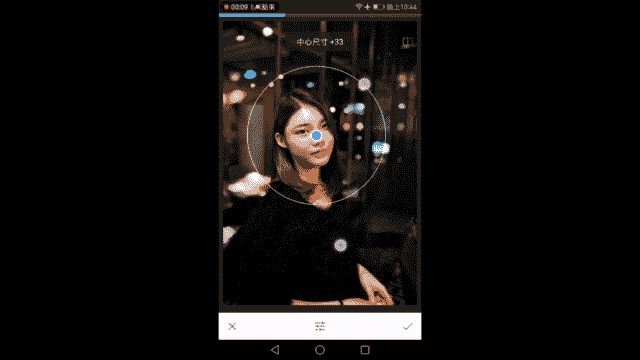

一点就可以了。OK。

我们文字就没什么好说了，来到了魅力光晕和s对比度啊。色调对比度是一个增强画面立体感的东西。不管是人像还是风光建筑，我们都可以使用，它可以看到头发这部分的质感，因为s对比度的中间调的增强而有很大的变化。

有很好的变化。你看加之前加之后加之前加之后，那么头发变得很有质感。那适当的加一些加一些中色调啊，让头发的质感凸显，但是高呢不能加太多，因为高光我们知道是姑娘的脸啊，你这么强对比度，不管你打死才怪。

所以把高光的色调降到最低，暗部当然可以加一些喽，它的衣服这样的一些毛料的质感可以相应的往前提一些，以及包括我们的背景中的暗部的建筑物表面的砖墙的质感都可以通过加低色调的色调对比度来得到一个提升。好了。

可以了，在对比度加完了之后进入魅力光晕啊。😊。

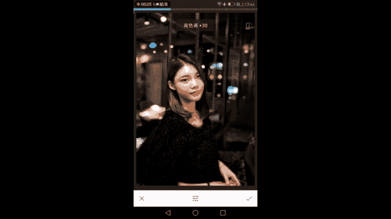

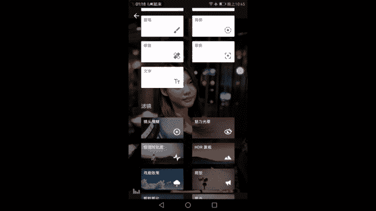

魅力光晕非常重要，对人像来讲，美力光晕让姑娘的脸变得更加的柔软，让她脸上的明暗过度更加的自然。当然你一旦加了媒底光晕之后，就意味着你的画面中很有可能其他地方会被搞得一塌糊涂，会被搞得非常糟糕，无法直视。

所以我们需要通过蒙版工具对媒力光晕进行调节，对锐度，刚才记得那个细节吗？进行调节，对刚才的色的对比度进行调节，这都需要通过局部调节的，是不是很麻烦。麻烦就赶紧关掉吧，对吧？没有办法调戏你们一下。

是一定一定一定要通过蒙版对画面进行局部调整的OK我觉得到这个程度差不多饱和度降一点点，不然脸会太红。好了，打勾。

好了，有了这样的一张状态，我们看下原片是怎样的，哎，还不错，还不错个屁哈，乱说的，为什么为什么为什么没有很好？首先突出细节。

我们不应该给人脸施加这么强的效果。

先点反向啊，现在我们看到突出细节是没有的，反向啊，突出细节的效果覆盖全画面，然后关掉红色的部分，把突出细节选为零拯救姑娘的皮肤，哎，可以看到我擦了之后，效果非常的明显，有没有？就是擦掉了。

左边的脸是擦掉了。哎，使用这款蒙版化妆品，把左边脸擦的很白很嫩右边还是很粗糙，我们继续擦继续擦好了，把右边的脸给擦出来了之后，看到整个皮肤脖子和胸口的质感就完全不一样了，就完全不一样了。

就回到那个白白嫩嫩的感觉了。但是她的头发呢因为加了细节，加了结构，它仍然比之前这样的一个模糊的状态更加立体。嘿，这样一看，蒙版一上马上就不一样了，大变样了。姑娘的脸就干净的非常非常的多。

紧接着我们进行我们之前有说过要调我们的3度。

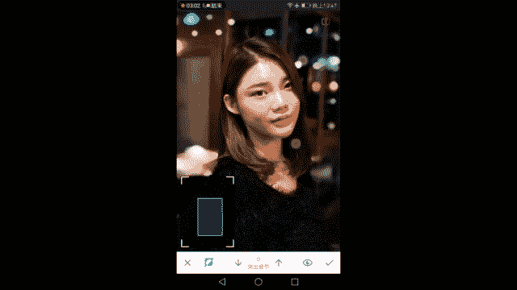

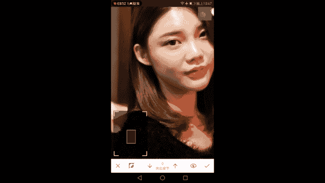

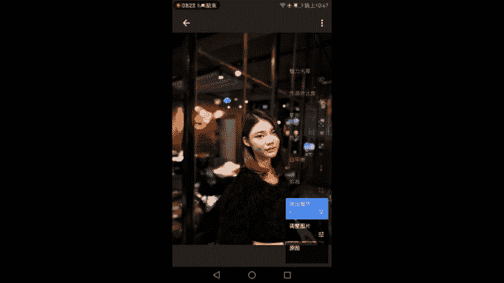

对不对？因为加了四角对比度，女孩子脸又有一点粗糙了，没问题，我们先让四角对比度覆盖全画面百分之百，然后把画笔调为0，然后擦擦擦使用蒙版的这个子的一个这样的一个工具。

擦出来，把妹子的脸擦出来，拯救出来。OK那调整画面的大小啊，然后很细腻的去擦他的耳朵。不要碰到头发，头发是需要四要对比度来增强立体感的。然后手相应的，哎呀，一不小心残掉了，把我把旁边也搞到了啊。

100画笔重新把旁边补回去，把手留出来好了。你看。你看这个脸又回到了萌萌哒的状态了，是不是？

这样练回到萌萌哒的状态，但是他的衣服上的毛料的质感和头发却变得非常的细腻，打勾完成蒙版调节魅力光晕魅力光晕是不是要反过来的呀？

魅力光源要反过来，你看这样子的面力光源已经不会让画面很夸张了。那么反过来把不需要魅力光源的地方给擦出来大多数哈。背景。以及我们的头发不需要太多魅力光晕。那你说老师我觉得脸还有点太过了，没问题。

我给他个50到75的魅力光晕。

不给他脸百分之百的魅力光晕可不可以？可以，不要忘记啊，蒙版不是只有零和100两种的。它还有很多种，所以根据我们的需求，它的浓度可以发生变化，你说觉得零呢肯定不好，女孩子的脸要有魅力光晕。

会看起来更有魅力一些，对吧？100呢有点过我，好像又太没有立体感了。那好啊，我可以给7数。

对不对？我们来擦出75的这样的一个魅力光晕或者75不75还不行，50可不可以当然也可以。所以说我们可以调节好魅力光晕的这样的一个浓度，让他的脸刚刚变得美美哒。好了，完成了这样一个典型的典型的人像。

手机人像是影的调节。我们来对比一下前后啊。

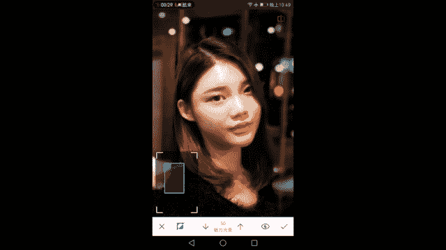

我们可以看调节之前，女孩的脸比较苍白，练红唇也不够红，然后她的头发的细节不太好，头发的细节没有那么的有质感，没有那么的一丝丝的分明。然后。

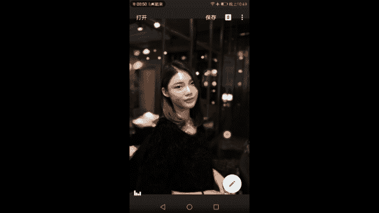

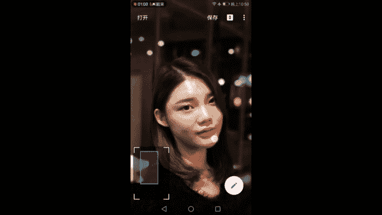

衣服上毛料上的质感也要差一点，比较暗沉，显得没有光泽。那么通过这样的一一系列的调节，我们一步步来从原图到调整图片之后，我们调整的画面的明感，让女孩的脸稍微亮一些显白，然后增强了一些饱和度。

然后烈眼红唇红一些，要环境中的一些比较缤纷色彩的光芒更加的突出，然后增加了突出细节，让画面中需要有质感的背景中的墙面和她的头发和毛料都有了一衣服上的毛料都有一些变化，就是裁剪突出一下人物。

然后白平衡稍微偏冷一点点，几乎看不出来，让皮肤显得更白一些，通过修复工具啊，修复掉她脸上的一些小的瑕疵。看一下很小的瑕疵啊，没有遮好的一些瑕疵，然后调节她脸部的一个阴影。

最后通过晕影轻轻的突出了一下人物，然后色调对比度再一次强化了背景和头发的细节，然后面力光。

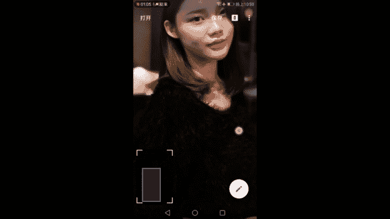

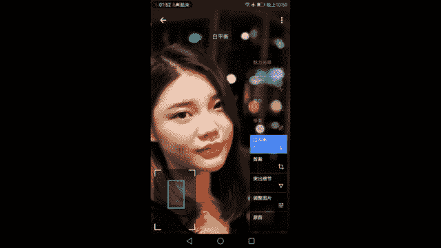

晕让脸部变得柔嫩啊，变得过度自然，变得美丽动人。好了，这样人像的调节就结束了。是不是很简单，非常轻松，美食静物参照人像没有什么多的可以讲的。OK我们现在通过学习了解到了如何对画面的明暗。

我对画面的对比度，对画面的一些细节进行调整。那么现在我们已经可以通过这样一些基础调整获得一张比较满意的曝光不错，色彩和细节都还可以的画面了。那么如何要进行风格化的调整呢？

现在比较流行的胶片风格将交由viss这个APP来实现。那么下面我们来试一下viss这个APP。

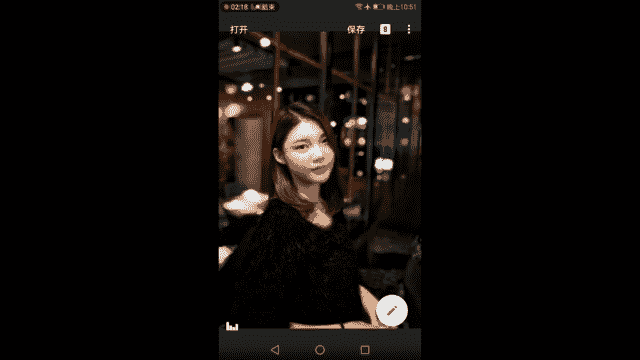