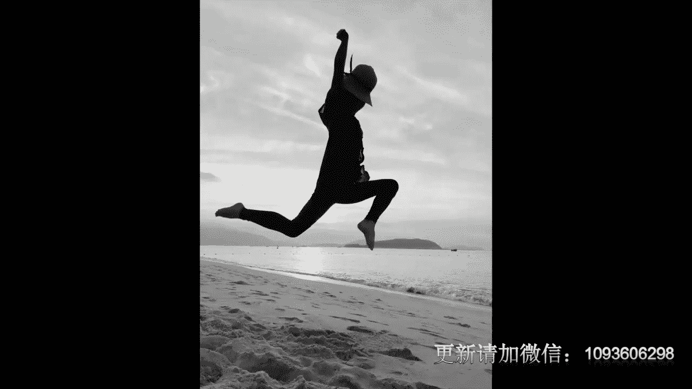
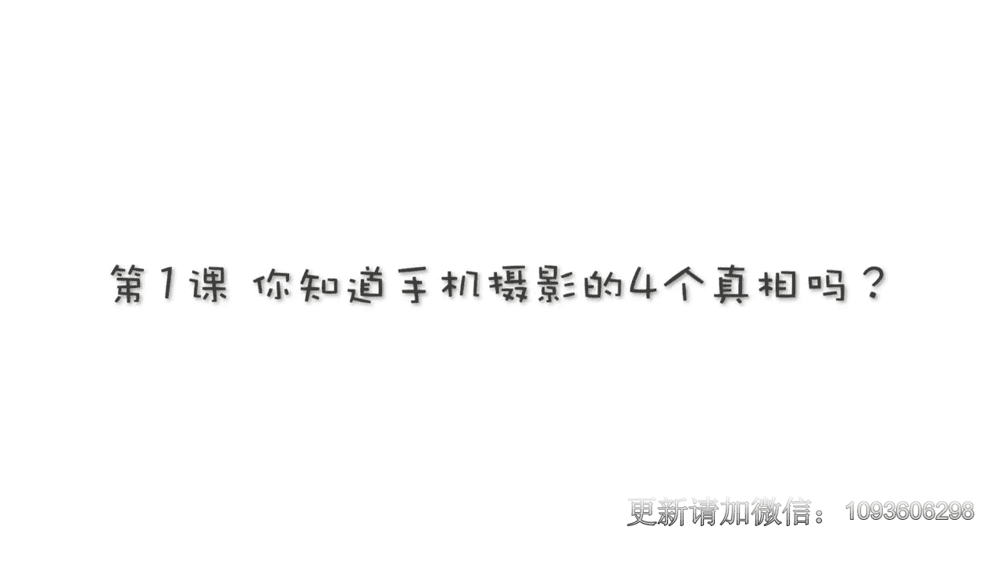
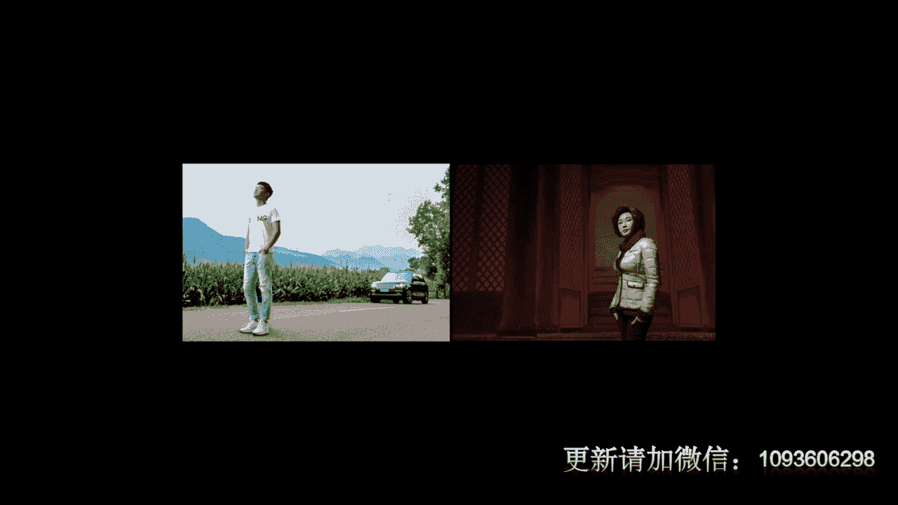
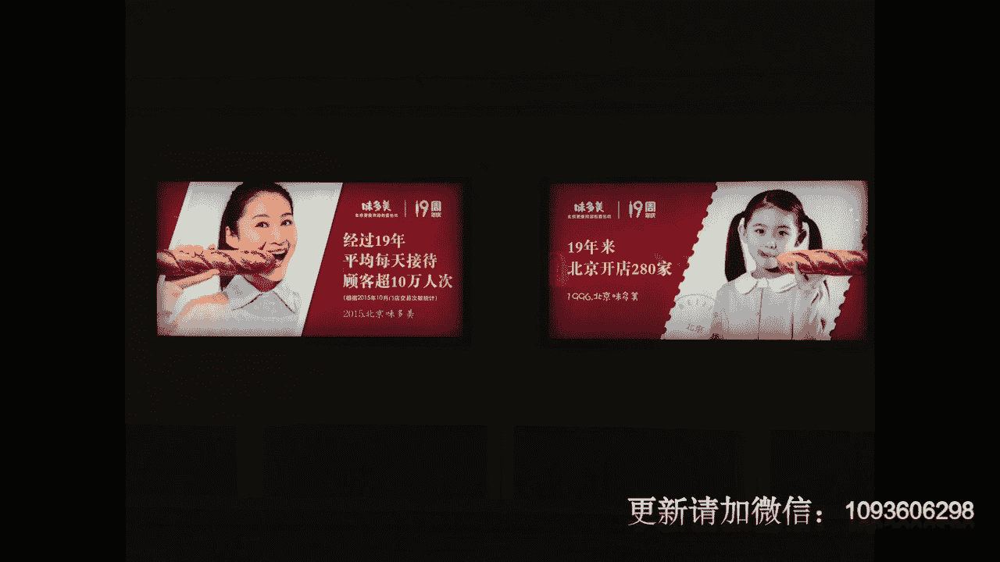
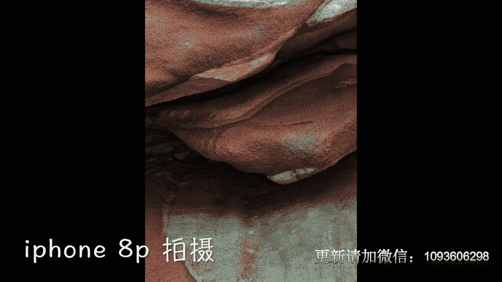
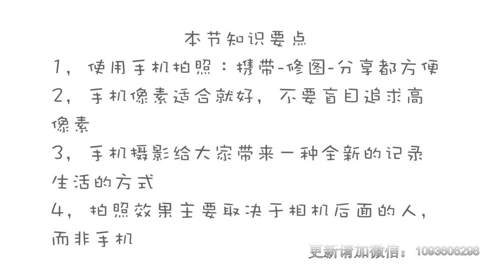

# 贾树森-手机摄影高手（完结）：1.【0基础】手机拍摄功能详解：第一讲  你知道手机摄影的4个真相吗

。

🎼。

🎼大家好，我是大叔。现在开始今天的分享。😊。

我先说一说用手机拍照的优势吧哈。那用手机拍照片啊，最大的一个优势呢就是它方便。首先呢他携带那肯定方便。我这个我兜一揣，是不是就拿走了。但是这个单反。大家看。就没有那么方便了，对不对？啊，他需要。

把这个单反呢装到一个大的试用包里面，然后每次出去拍照也备一堆东西，除了这个一个机身，一个镜头，还需要带很多镜头以及闪光灯，我们才可以工作啊，那自从有了手机呢之后我有很多次出去旅游，那出去旅行都不带单反。

而只带手机。所以呢它的携带确实是特别特别方便的啊，当然你需要多备一个充电宝啊，不然它的电很快就耗没了，对吧？第二个手机，它的方便之处呢就是。拍完了，我们就可以在手机上马上就进行修图啊，进行分享。

发给朋友，互相的进行啊交流。这个就特别的方便。它传播是很方便的。那么我们用呃单反来拍照片，我们要把这个储存卡拿出来导到电脑里面，然后在电脑里面再修图，然后呢再传到手机上然后来进行分享，这就比较麻烦了。

所以呢手机最大的优势就是方便。那么它的这个缺点其实也是比较明显的啊，除了刚才说的这个比如说我们这个电好的特别快之外，然后呢，它的这个反应速度也是没有单反快的啊，就是快门的响应速度啊。

这个单反肯定比它还要快得多。另外一个就是画质上，那么。单反的画质肯定要比手机的画质要好很多。手机在弱光的条件下，那么它的这个拍照能力呢要稍差一些。大家应该有体验。我们在暗处拍照的时候呢。

颗粒就会比较粗了啊，但是相机呢肯定要好很多。那么用手机拍照它的另外一个短板呢就是对于运动速度特别快的物体抓拍上稍差。还有一点呢，就是北方的小伙伴们有没有这个体会，在冬天的时候。

在室外用手机拍照片实在是有点动手啊，对吧？时间长了，这个手指已经动僵了，那么这个也是他的一个小小的缺憾吧。自从手机呢被装上了摄像头啊，从最初的这个只有200万像素啊，初代的iphone只有200万像素。

那么到现在啊1000多万像素。那么各大厂商呢在分辨率上已经展开了特别特别强的一个竞赛啊，互相攀比啊今天比你高了多少像素，明天我比他高了多少像素啊，我记得手机上最高的像素4100万啊，诺基亚的有一款手机。

就号称4000多万像素，然后我去拍过啊诺基亚的当时的一个总裁，他还给我演示过他的那个手机，当时最强大的像素最高的那款手机啊，当然现在诺基亚已经昔日狂花了啊，但是这是啊智能手机拍照的啊，达到最高的像素值。

那么到今天为止，我们看并没有市面上流行起来4000多万像素的像手机啊。所以呢主流的还是1000多万。那这就说明呢啊它其实是有个极限的啊，因为手机本身设计上的缺陷，它的CAD很小。

所以呢把呃这个单纯的把这个分辨率做的非常非常大啊，非常非常高是没有什么意义的。所以呢我们不要盲目的听从厂商的宣传啊，说是像素一定要高到啊多多少才可以啊，1000多万啊已经足够用了。

目前这个像素值我们拍照这个平衡感是不错的。그。最近几年智能手机的拍照功能呢越来越强大哈啊首先呢像素提升的比较快啊，同时呢也出现了一些双摄像头的手机啊啊，它可以进行一些虚化效果的拍摄。

那么原先的时候这个用手机拍照的一个跟单反相比啊，最大的一个区别，就是手机拍户虚化的照片，对吧？那么现在啊很多手机添加了双摄像头，那么也可以拍摄一些啊虚化背景的照片了。那么这个时候大家就觉得哎我属机。

已经可以秒杀单反了啊。据我所知啊，以当下的这个技术手段啊，是没有办法把手机的拍照功能做的比单反还要强大啊，那些广告商的宣传语呢。听听就好，千万不要当真。其实哈每一种器材都有自身的局限性。

就像我们每个人一样，有优点，也有无法克服的缺点。你比如说我在给石尚芭莎去拍摄明星名人肖像的时候呢，或者是。我给其他的一些机构公司拍摄这些个商业拍摄。那我呢只能带着单反。

虽然他很沉，但还得背养。因为它的这个画质好啊，它的这个像素也高啊，人家可以制制作画册呀，或者是做这个大的广告画呀，印刷杂志啊，对不对？都是需要这个单反的这个层级才能满足的。

但是你像那个平时记录生活，比如说拍摄小树啊，我出去这个啊旅行拍点风光啊，拍点街拍。那这是手机是完全足够了。手机摄影呢它其实给我们提供了一种全新的一种可能哈。这是在摄影史上从来没有过的手机摄影呢。

现在可以说是全民街摄影啊。自从手机有了拍照功能之后，大家都成了摄影师，对吧？那么手机摄影呢让。更多的人有了。记录生活感悟生活啊，发现生活当中的美啊，并且把它拍下来啊，这么样的一种可能性。

我以前的一些手机摄影的学员们呢也经常会跟我反馈哈，就说他们上了这个手机摄影的课之后，不仅仅学到了拍摄的技巧啊，让拍照水平大大的提升。也让他们对生活呢有了不一样的看法啊，不一样的感悟。

就说他们以前从来没有从这个角度啊啊以这样的方法去看待生活啊，去感受生活。我记得特别清楚，课上有一位呃70多岁的这个老爷爷啊，他当时学习就特别的积极。他后来呢是这个班的优秀学员哈，毕业之后呢。

他仍然呃孜孜不倦的去自学哈，他经常跟我进行互动哈，他那个在家附近啊或者出去旅游，拍了很多特别漂亮的照片。呃，那这位老爷爷他以前其实没有任何的适应基础，那么手机适影其实啊给他提供了一个特别便利的条件啊。

就是让他很容易就能。跨入适应的这个。阵营里面去啊，那么手机它有。很强的这个便携性，对吧？有可玩性啊，很容易上手。那么手机摄影呢等于为它打开了一扇门，一扇呃观察世界啊，感受生活这么一扇神奇的门。

他也经常会跟我说，说老师您的课讲的特别的通俗易懂啊，我一基本上一学就会。其实这位老爷说呢一点儿都没错。我呢是把我以前在电影学院上过的那些特别枯燥的专业啊摄影课程呢。

这里边的知识点和我二十几年的职业摄影生涯的。体验和经验。以及我最近几年用手机记录生活的感悟糅合在一起。因为我在这里跟大家分享的呢都是那种特别简单实用。G地气的干货。有很多朋友呢特别纠结纠结什么呢？

就是说。我这照片拍不好，肯定是我手机不行。就是说我这个手机我得换个更好的，换个更贵的。啊，老师你用什么手机啊？你用iphone，我也用iphone，其实并不这样的啊。

那么现在就是1000块钱左右的手手机啊，拍照功能都是很强大的。呃，我之前用的这个是iphone5S。后来换的这个扒皮，那么当然了，肯定要稍好一点，但是这个没有质的差，就是没有差的那那么多啊。

我曾经也用过小树老爷的那个小米啊，拍过一张照片。大家看一下这张照片，我就是用这个拍的。如果不说我用什么手机拍的。我相信大家也看不出来说这个是用小米拍的啊，这个是用苹果拍的，没有没有差别那么大。

其实呢拍照片啊，最重要的不是手机的好坏啊，最重要的是啊手机后边这颗脑袋，我们可以通过更多的学习和练习，让我们的拍照水平拍照技巧。

大大的提升，这样呢我们才能更多更好的拍出。美美的照片。

🎼今天的分享就到这儿，我是大叔，我们下次再见。😊。

