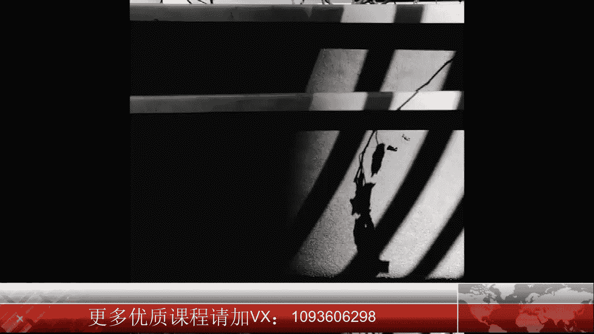
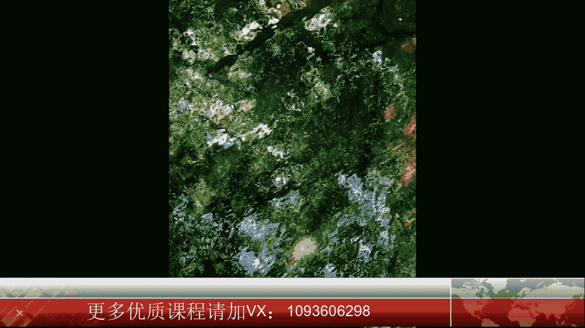
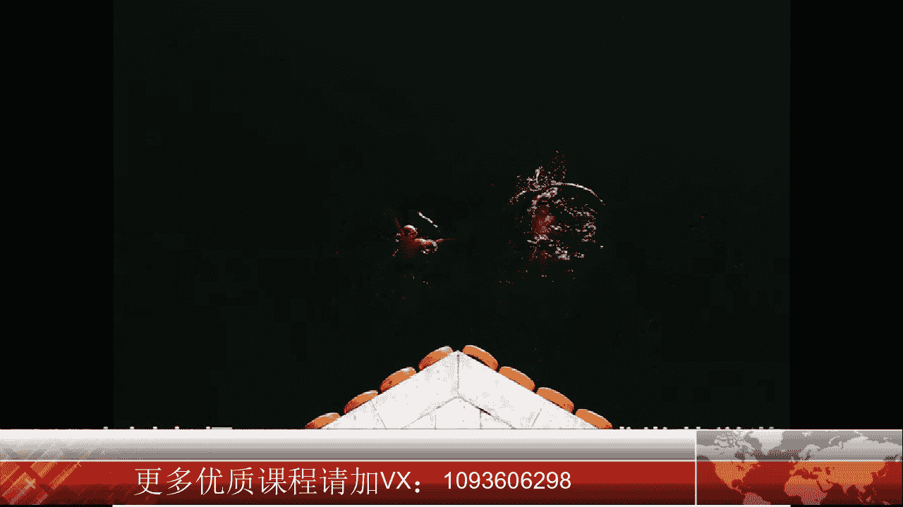

# 贾树森-手机摄影高手（完结）：1.【0基础】手机拍摄功能详解：第二讲 手机摄影要准备哪些辅助道具？请加微心：cj14yg

。

🎼大家好，我是大叔。现在开始今天的分享。😊。

关于这个问题呢，我们要说一点小数据哈，就是手机它配的这个镜头呢啊我们换算一下啊，跟全画幅的单反相机比较一下它的焦距，镜头焦距啊大概是24毫米左右，听起来有点晕哈。

那么这个镜头呢它是相当于一个小一点的广角。

啊，不是超广角。那么这个镜头呢能满足我们日常拍摄的绝大部分需要。那么既然说是能满足绝大部分需要，也就是说不能满足所有的需要，对吧？有的时候我们可能需要一个长焦距，有的时候呢我们可能需要一个更广的镜头啊。

来拍摄更大的场景。在这个需求下呢啊就产生了这个手机的附加镜头啊，就是装在这个摄像头上啊，能满足我们的一些需求，那么7P和8P呢，这种出来之后呢啊它又多了一个摄像头，啊。

那么另外一个摄像头呢是可以把焦距大概变到50毫米左右啊。那这个时候呢就略略微呢有了一个中焦镜头的感觉。所以呢像7P和8P，它多了一个人像拍摄的这个功能，也就是说可以把人拉的比较近一点。

在遇到这种场景比较大的情况呢，我会用相机的全景拍摄功能来记录下，我想要拍。这的画面。所以呢我之前并没有给手机配一个附加镜头，因为我觉得啊手机原本的镜头呢其实大概也是够用了的。

那么大家是不是需要配大家根据自己的情况啊，根据自己的爱好。比如说喜欢拍风光啊，觉得那个手机的镜头又不够广，可以配个广角啊，也可以配一个微距镜头，喜欢拍微距的朋友，然后呢喜欢拍人像的。

而又没有双摄像头的手机，可以给手机配一个啊人像镜头啊。比如说我刚尝尝先啊买了一个这个s睿的人像镜头啊，结果呢我这个手机壳，他给发货发错了，我只能给大家稍稍演示一下。稍后呢等着我的新手机壳来了呢。

我会在后面的人像这个环节里面跟大家啊做一个示范啊，看看这颗镜头的表现是怎么样子的。手机镜头的价格呢也是从几10块钱到几千块钱不等。那么大家如果想买的话呢，建议大家买个两30百块钱的就可以了。

跟手机一样啊，自拍杆的品类也是特别特别的多。大家容易眼花缭乱，不知道到底哪个适用。那么大树老师常用的呢就是这一款啊啊它除了可以当自拍杆用之外呢啊它还可以把下面打开作为一个三脚架来使用。在很多时候呢。

我们可以啊给自己拍个照片呀，可以离他很远啊，把人拍的小小的景拍的特别大啊。但是这个三脚架呢它还有一个哎。这个东西就是一个。无线遥控快门啊，这是非常好用的，可以自己来按快门。我等一下呢给大家来演示一下哈。

😊，这个赛架上部的这个卡手机这个卡子，它是带弹簧的，所以呢它能满足不同手机啊，不同大小的手机。手机的角度呢也是可以通过旋钮来调整的。我们把它抻长之后呢，它就是一个标准的自拍杆啊。这款自拍杆。

它配备了一个遥控快门，这个遥控快门通过蓝牙跟手机啊互相的连接，可以呢远距离去按快门进行拍摄。比如说像我这些都是用遥控快门来自拍的。但是这个东西呢有一个致名的缺点，就是一定要保持它的电量充足啊，当然了。

大说老师还有一个重型武器啊，就是。在需要稳定性特别特别强的时候呢，我我会用这一款啊比较重型的啊。好，大家看到这个其实呢它就是一个标准的三脚架哈呃这是原先的11款就是用来架摄像机的一个小三脚架。

我把它拿来怎么用呢？怎么能架到手机上呢？你看这个固定不了手机，对吧？那我们可以买一个叫。😊，夹子啊这种是专门可以单卖的这个架子啊，这个夹子可以加一个手机，或者加一个ipad，然后呢，它下面有一个螺纹。

然后可以拧到这个三脚架上面，这个螺螺丝上啊。那么这个时候这个三脚架呢它就比较稳定。我们可以拍一些啊需要稳定性特别特别强的。但是它的一个缺点就是它的便携性稍茶啊，稍稍有一点点大。随着手机拍照技术的提升呢。

手机现在能拍摄的题材其实是相当广泛的。比如呢号称手机摄影界奥斯卡的一个摄影比赛啊，叫做IPAA。那么它对于拍摄题材的划分呢。大概是这样的，有抽象、动物、建筑、儿童。

花卉风景。生活方式啊生活方式这个我还获得了2017年的一个荣誉奖哈。

然后还有这个自然。全景人物肖像系列。静物、日落旅行和数木等等。那通过这个摄影比赛，它的参赛的这些品类呢，我们能看到，其实手机能做的能拍的题材确实是很广泛。

当然手机对于快速移动的物体暗光情况下的这种拍摄条件呢是有短板的。不过呢我们也可以采用一些拍摄技巧啊，这些技巧我们后续都会讲啊，比如用这个连拍呢去抓住快速移动的物体，然后用追随拍法拍摄夜里面的汽车。

如果选对了时机，用对了技巧，那么用手机拍月亮也不是一件难事儿。

对于喜欢用手机拍照的我们来说呢，手机的容量是个大问题啊，我们不断的拍不断的拍，那么很快就装满了，很多照片又特别喜欢又舍不得删。所以我们需要经常的把手机里的照片导到电脑里面保存起来。

首先呢我们要把手机和电脑用数据线把它连接起来。如果是用安卓手机啊连接苹果电脑。那么呢它直接会弹出来一个安装的程序啊，我们按照它的提示呢，把这个软件安装到电脑上，然后用这个软件呢把手机呢打开。

在手机的这个。目录里面我们去找这个DCIM把它点开，再找这上面有个camera。点开之后呢，就能看到你的照片了，然后呢可以把它复制到电脑上的文件夹。

当这个安卓手机连接到windows系统这个电脑上的时候呢，我推荐大家使用360的手机助手。当我们把这个软件打开跟手机互联，那么它会有很多的提示，我们可以按照这个提示呢一步一步的进行设置。

包括手机上的啊USB的调试啊，包括电脑上的一些调试。啊，这个自动播放呢就没什么用啊，建议大家就把它关了就行了。调试结束之后，我们可以进入管理照片儿。然后就能看到我们的照片了。在这里面呢。

我们可以勾选我们想要导入电脑的照片，然后呢给它导入到电脑里面就可以了。当苹果手机连接苹果电脑的时候呢，我们需要在电脑上把照片这个程序打开。然后呢，点击左侧栏里面的我们自己的那个iphone有个导入啊。

那块把iphone点开，点了之后呢，我们把自己手机给它解锁，解锁了之后呢，才会手机的照片才会在这里显示出来。然后呢我们把要导入的照片给选择。然后再点右上角的。选择选项啊，导入后删除项目。

然后呢再点导入所有新项目。那么这个时候呢，我们的照片就可以导入到这个。照片里面了，导完之后呢，我们还要把这个里面的东西呢再转存到电脑里面。如果是苹果手机连接windows电脑。

那么我们需要下一个软件叫做苹果助手PC版啊，下载之后呢。我们就可以打开我们的苹果手机里面的照片了啊。进来之后呢，我们可以勾选我们想要导入的照片，然后呢点导入，再选择导入的文件夹就可以了。

🎼今天的分享就到这儿，我是大叔，我们下次再见。

🎼。