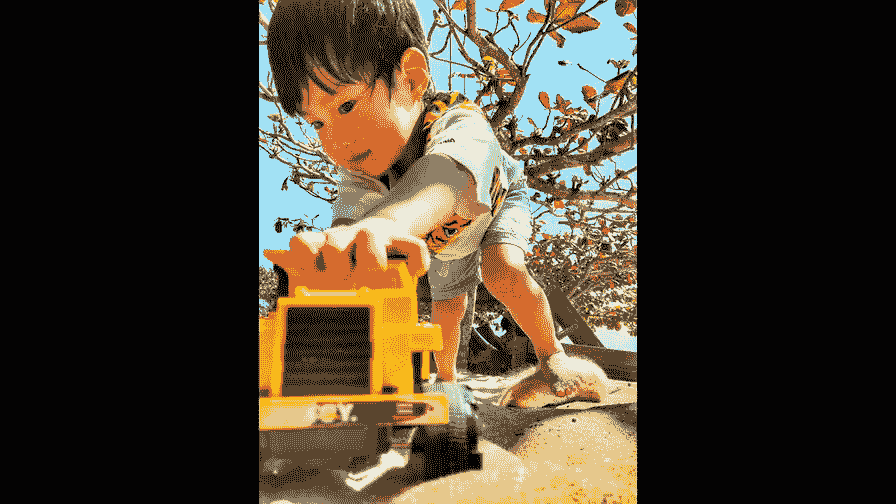
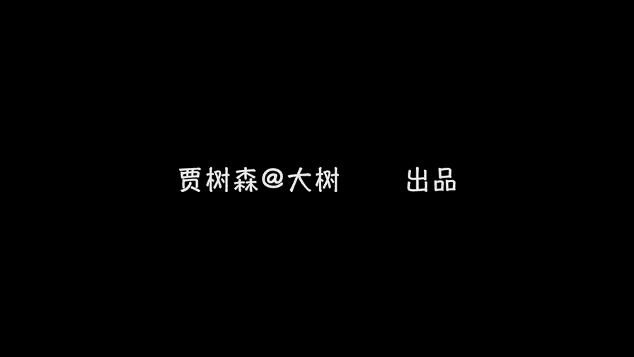

# 贾树森-手机摄影高手（完结）：1.【0基础】手机拍摄功能详解：第五讲 你知道手机拍照的基础操作吗？（上）

🎼大家好，我是大叔。现在开始今天的分享。😊。

拍照是正确的，持机方式有这么几种。第一种呢就是单手拿手机啊，单手按快门，也就是说单手操作。那么单手操作呢，它的缺点是稳定性稍差。那么他的正确的姿势呢，建议大家把手机拿平啊，拿竖值。这指平拍的时候啊。

至于说什么是平拍，后面会讲到。那么在俯拍的时候呢，比如说有这种鞋的时候拿的。也可以。啊，当然单手拿手机呢，除了竖着拿，我们还可以横着拿啊，单手横握手机啊，这是我经常用的一个方式啊，它比较便于抓拍。

一只手呢也是可以操作的。至于说这个快门怎么摁，我卖个关子啊，后面会讲到。啊，空出来另外一只手可以拿东西啊，也可以去操作手机上面的这一些界面啊，比如说去调整一下曝光呀，然后调整一下焦点啊，都是可以的。

那么比较稳定的拿手机的方式，当然是双手啊。大家看一下左手啊，三个手指在手机上形成三个点。右手呢同样也是三个手指三个点，这样呢两边分别有三个点来固定住手机。那么这个手机呢是比较稳的啊。

再加上胳膊肘跟身体靠近。那么我们拍照的时候就很少会抖动。那么大拇指呢可以按快门，也可以进行一些啊对焦呀调整曝光的一些操作。在屏幕上。那么这种方式是我们拍照时啊最稳定的一种握持的方式。

但这种方式的缺点呢是可能抓拍的时候呢啊就不是那么方便了。尤其对于那种快速移动的，比如说像拍孩子啊，拍什么，就抓拍可能稍稍没有那么方便啊。啊，手机的快门呢大家都知道哈用的最多的就是这个大牌点哈。

应该是用手机拍照的人都知道啊，每次呢也都用这个来拍照。那么其实手机还有隐藏的快门。比如说手机的音量键啊，放大音量或者缩小音量都可以啊。我们用音量键来拍照是比较方便的，尤其是在单手横握手机的时候。

还记得我刚才卖的关子嘛，答案就在这里，我单手去拿手机的时候呢，我很方便用手指，然后呢，一只手操作啊，用手指就按这个快门，那么这个时候进行抓拍就比较方便。然后呢不用去费力的去购那个快门啊，单手就可以操作。

非常的便捷。😊，当然我们上节课也提到过啊，有些安卓的手机呢需要在设置里面去更改这个设置啊，把这个比如说音量键可以作为快门来使用啊，这一点呢，安卓和苹果是有一些不一样的。

那么既然手机的音量键是可以作为快门来使用的，那么我们就可以延伸一下哈。那么我们的耳机线上也有音量键，对不对？那么这个时候呢。手机的耳机线是可以作为快慢来使用的。那么它的音量键。我们按。大家看一下。

画面上就会进行拍照。那么这个耳机线它的好处呢啊就是我们在按快门的时候。可以神不知鬼不觉的啊进行抓拍，偷拍，隐蔽性比较强。

另外一个就是如果我们在拍摄夜景或者一些其他的慢门拍摄的时候呢啊使用这个耳机线做一快门，可以避免手机的晃动啊，保证画面的清晰。在正常的拍摄的状态下呢，大家想要拍一张照片啊，就需要把手机拿出来。

然后呢呃输入密码，对吧？把手机解锁，然后呢找到照相机这个应用，然后打开照相机才能进行拍照。那么一旦有这个突发的状况，我们需要抓拍啊，需要快速的打开照相机怎么办呢？呃，首先我们来看一看苹果手机是怎么样。

快速打开照相机的。首先第一步呢，我们要按亮屏幕。按亮屏幕之后呢，我们可以用手指在屏幕上任意位置向左滑动，那么就打开了手机的照相机。是不是非常的快？我们呢再来看一遍哈，怎么操作的啊。

首先呢第一步咱们是按亮屏幕。用手指向左滑动屏幕。两步打开照相机。那么这样呢有助于我们抢得拍摄的先机。当然了，这是苹果8P以前的机型，它的照相机快速打开的快捷方式。

那么已经升级到苹果X的同学呢啊它的打开方式发生了变化，请注意一下哈。他是把屏幕按亮之后呢，我们需要用手指去长按一下。在屏幕下方的这个照相机的标志。按一小会儿松开，然后呢就直接进入了拍照的模式。

那么以前用惯了8P啊或者7P的同学呢，可能需要小小适应一下。安卓手机也有类似的操作啊，也同样是按亮屏幕。然后呢看到右下角有个照相机的标志，那么向上滑动啊，这个跟苹果不一样。

那么其实安卓本身可能有很多型号啊，有很多这个品牌。那么呢它的操作都略有不同。但每一款手机都有它独特的快捷键的操作。那么大家呢仔细的去研究一下啊。手机的连拍呢其实非常简单，通常就按住快门一直按着不放。

那么就是连拍啊，那么连拍有什么用呢？哈呃最简单的一个例子就是大家都可能去拍跳跃啊，在海边啊，尤其是大家伙特别喜欢跳起来。那么我在海边看到这几位在拍跳跃的时候，哎呀，我看的是真是累死了，我都累死了。😊。

他跳了好久，然后也拍不成一张，他跳下来一次，只拍一张，那他怎么能成功呢？对吧？那么这个时候你如果使用连拍功能的话，就很容易成功啊。那么从开开头它的起跳开始，一直到它落下来。

那么这个动作都可以完整的被记录下来。你像我给数妈拍这个跳跃的时候，就跳了两三次，没问题，就可以把这动作记录下来了啊。当然首先你得调整好机位啊，比如说像锁定焦点呀，呃调整曝光呀，这些都操作好。

然后呢你就开始连拍，这个时候你可能完整的就把这个动作都拍下来了。还有呢比如像用手机来抓拍孩子啊，抓拍孩子的一些动作和瞬间啊，多多的使用连拍呢，就有助于抓到更加精彩的瞬间，比如像这个水珠建起来的啊。

使用单次拍摄呢，可能就成功率就大大降低，还有像这个小脚丫把沙子扬起来这个瞬间呢，也是使用连拍呢拍摄。

起来就比较方便。

🎼今天的分享就到这儿，我是大叔，我们下次再见。

