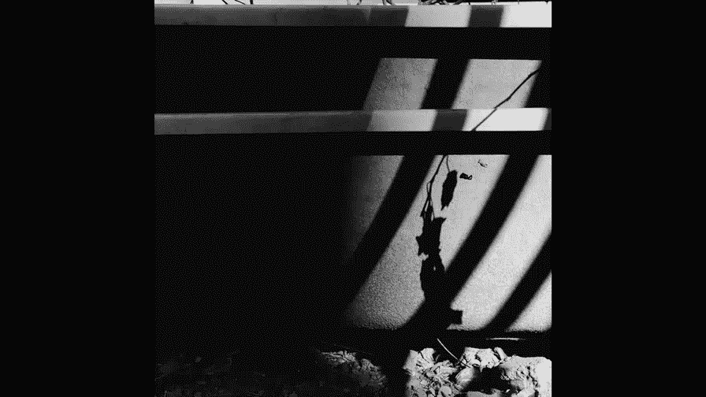
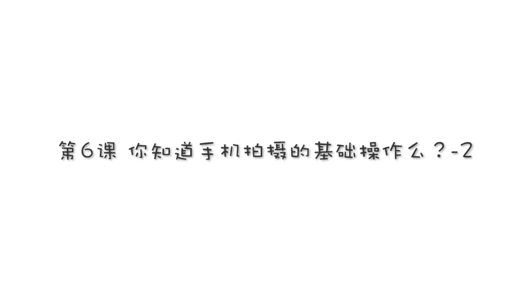
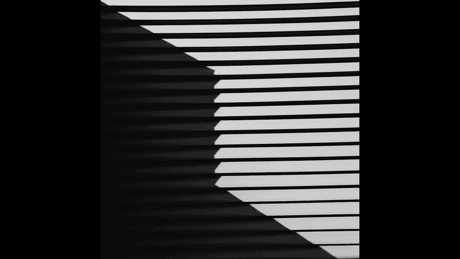

# 贾树森-手机摄影高手（完结）：1.【0基础】手机拍摄功能详解：第六讲 你知道手机拍照的基础操作吗（下）？

。

🎼大家好，我是大叔。现在开始今天的分享。😊。

传统的胶片相机以及后来的这个数码单反相机呢，都能够非常准确的进行对焦，以及非常方便的去调整曝光。那么手机可以吗？答案是非常肯定的，而且手机的操作是非常非常容易且迅速的。在大部分的拍摄时间呢。

手机是可以进行全自动的智能的对焦的。在一些特殊的情况下呢，我们可以进行手动操作啊。比如说我想让焦点放在某一朵花上啊，那么我就用手指再去点。那么这个时候焦点呢就会随之而改变。

在这个焦点标志这个圆圈旁边呢有一个小太阳的标志。这时候如果我们用手指呢去按住小太阳上下去滑动的时候呢，画面的亮度也随之而改变。那么呢这个就是调整了画面的曝光。手机的特点呢是所见即所得。哎。

在屏幕上看的合适了，那么这个曝光就合适了。如果想要锁定焦点和锁定曝光，那么就用手指在屏幕上长按。那这时候会出现两个圆圈啊，同心的中间一个有太阳的这个标志圆圈呢，它是测光点，它可以决定画面的亮度。

另外一个圆圈呢它是焦点啊，我们把它放在焦点的位置，把测光点放在让画面曝光合适的位置。当然了，这是安卓的一款手机的操作啊，其他型号呢呢可能略有不同啊。苹果手机也是啊用手指在屏幕上随意去点。

就可以更改对焦点。它的这个对焦点的标志呢是一个小方块，然后呢，旁边也有个小太阳。啊，用手呢去上下滑动，是可以改变画面曝光的。当我们用手指在屏幕上长按的时候呢，就锁定了曝光和对焦点啊，用手指滑动小太阳。

可以更改画面的曝光。所以呢大家能看到我在正常的拍摄状态的时候呢，会经常用手指在屏幕上去摁呐搓呀，这就是在调整曝光和对焦点啊。那么一旦你调整好了曝光和对焦点呢，你可以控制画面的曝光量。

然后呢也可以锁定焦点之后呢，进行重新的构图。但这个时候你不要离这个主体啊呃远近不要发生变化，可以横向的去移动，保持拍摄距离不变。这个操作呢会使你拍的照片的焦点更加准确，以及曝光会符合你的这个创意的想法。

现在越来越多的手机呢配置了双摄像头，并且呢具有虚化背景的功能。比如说这款吧，然后它的操作是这样子的，在拍照的界面下呢，把它的这个大光圈功能给打开，点击一下这个光圈的标志。那么呢我们可以去更改光圈的数值。

把这个光圈数值给它。数值变得小一点，那么就相当于呢它的关孔开的大一点。但然这个也不用费太记啊，就是你要记只要记住这个时候它虚化的程度是最厉害的就可以了。只不过呢它的虚化效果呢没有单反那么厉害啊。

在拍摄的时候呢，也要去前后左右去找一找啊。那么这个苹果的7P和8P呢，它也是配置了双摄像头。那么呢它也可以拍出背景虚化的照片，它有一个功能叫做人像功能啊。

不过呢这个人像功能呢对于拍摄距离有着非常高的要求啊，在只能在一定的范围内同时呢它对于拍摄的这个光线啊，它也希望它是比较明亮一点的暗光情况下效果就不太好了。所以在用人像模式拍摄虚化背景照片的时候呢。

需要有一点耐心，尤其是对于拍小孩抓拍来说，可能难度就更大一些。另外一个目前来说，这项技术还不是特别的成熟。有的时候呢，该续的地方没虚，不该不该续的地方却虚了。

然后再一个就是人物的边缘部分过度的不是那么自然。但我相信呢，随着这项技术的越来越进步，以后会做的越来越好。

拍的照片不清晰呢，首先可能最大的问题就是在暗光情况下拍照，然后呢又没有端稳这个手机，所以就很容易造成虚。另外一个就是。拍摄快速移动的物体，而且还是在暗暗光情况下。那么这个时候照片八成都是续的啊。

像我能拍一张这样的就不太容易，即使是我也是不容易的。解决的方法呢就是尽量寻找光线好的地方来拍照。另外一个呢就是尽量把手机端稳，不要让它进行抖动。还有呢就是背后。拍那种特别快的运动。

第二个可能造成照片不清晰的原因呢。就是你的摄像头可能该清理了，这个摄像头大家看一下啊，可能非常的脏，手指印儿灰尘特别多。那么呢我们在拍摄之前，然后最好呢找一块软布啊，或者眼镜布等等。

那么呢把它给它清理一下啊，给它擦干净。那么这个时候拍照片的清晰度呢会大大的提升。那第三个造成不清晰的原因呢，可能是你在拍摄的时候呢，特别快速的，特别匆忙的就去按快门。

这个时候啊手机的这个对焦还没有反应过来，还没有对焦好，没有合上焦。那么这个时候按快门了，所以呢就是对焦不实。另外一个我们在拍孩子啊，比如说孩子动的特别特别的快。那么这个过程中去按快门呢。

也容易造成对焦不实。呃，这张照片吧，它就是即使对焦不实，然后呢，也有它动的特别快，凝固不下来。所以呢就是很多时候照片不清晰，也是综合原因的啊。还有一个呢就是在拍摄的过程中呢，过多的使用了数码变焦。

那么数码变焦会让照片变得不清晰。所以我们要解决这个是尽量的使用。光学变焦，比如说像8P，它可以按一下两倍变焦的时候，就是光学变焦。再往上了呢，它就是数码变焦。我们可以用这个光学变焦拍完了之后呢。

再进行剪裁啊。这个时候这花儿呢就会变得比较大一点。

🎼今天的分享就到这儿，我是大叔，我们下次再见。

。