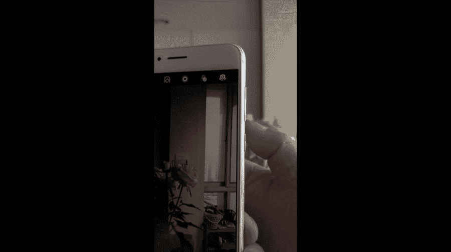

# 贾树森-手机摄影高手（完结）：1.【0基础】手机拍摄功能详解：第四讲 手机拍摄界面的各种符号如何使用？

🎼大家好，我是大叔。现在开始今天的分享。😊。

虽然这是一个苹果手机的问题哈，但是我建议使用安卓手机的大家呢也听一听。因为后面有一些比较相似的符号呢，我就不再重复了。咱们开门见山啊，这是苹果手机的拍照界面。咱们首先看一下左上角这个标志啊。

它就是闪光灯的开启符号。当我们把这个点开之后呢，里边有三个选项啊，一个是自动，一个是打开，一个是关闭。另外一个呢，第二个。这个叫做实况啊，这个东西可以记录啊，你按下快门那个瞬间的一前一后啊一系列的照片。

当你去长按你拍下来的这张照片的时候呢，它会有一个播放啊，有一个动态的显示。在实况的右侧像表盘一样，这个符号呢叫做自拍。在安卓手机里面也叫做定时拍照。我们在相机离自己比较远的时候。

然后或者给家人拍全家福的时候呢，用自拍啊，这里面也呢可以选择3秒或者10秒以后来按快门。那么选好之后呢，按一下下边这个快门按钮，它就开始计时，然后进行拍照。好，大家留意到这块儿连续拍了10张啊。

这是苹果手机的一个小功能。那么。这个呢便于抓拍我们在这个当中的一系列瞬间。但是苹果手机这个就是说呃如果你把这个实况如果打开了的话，那么它只能拍一张啊。这一点呢大家要留意一下。用完自拍之后呢。

建议大家把自拍关上啊，不然的话你下回摁快门还是自拍。右上角这三个叠加的圆圈呢啊是照相机的一个滤镜的一个设置，就是拍照的时候可以直接啊用一个滤镜的设置。比如说各种颜色啊，它已经预设好了。

这里面呢你可以选啊也有黑白彩色的不同的色调。一般来说呢我都是用原件来拍摄的。这样呢给后期制作后期修图呢留下一个空间，有留下一个余地。拍照界面最下边这一排呢，一般我们进来直接呢默认的是照片。

就是一个拍照片的一个状态。在照片的右侧，我们用手指往右一滑，就是一个人像。人像呢也分几种光效啊，这是8P以上这机型才有的那它拍出来的效果呢呃也是比以前有些升级啊。人像右侧叫做正方形。

正方形呢也是拍照模式，它只是画幅比例不一样，可以直接拍摄方形的图片。最右侧全景功能这个全景我们在前面的课里有过介绍，就是附加镜头的时候有说过拍照的默认界面啊，就是照片，左侧第一个就是视频。

那么就是拍视频。再往左呢是慢动作，这个可以把人的动作搞得很慢啊，像慢镜头一样。最左侧叫延时摄影。这个延时摄影呢，我们会在后面的课里面详细的给大家介绍。苹果手机的拍照界面设计的还是比较人性化。

也比较简单啊，大概就这么多符号。那么除了这些符号之外呢，还要跟大家说一个就是拍照的一些设置问题啊。首先呢我们要找到啊设置。然后呢点进去往下翻，一直翻到有一个叫做相机的项目，把它点开。好，相机点开之后呢。

它的一些项目大概这样网格打开二维码打开录制视频的以及慢动作的这些东西呢啊按照我这个来设置就可以了。下面有一个这块要说一下自动HDR。啊，这个地方呢建议大家把这个打开的给它关闭啊，关闭了之后呢。

在我们的拍照界面上会有一个显示。大家记得我刚才的时候。那个拍照界面是什么样子的吗？现在来看看这块多了一个符号。它叫做HDR。那么HDR这个功能是干嘛用的呢？嗯，它是在我们遇到一些就是光比比较大的情况啊。

比如说逆光啊，反差特别大啊，那么把HDR打开，可以呢记录更多的层次。它这里面有三项啊，一个是自动，一个是打开，有个关闭。如果是不嫌麻烦呢，就是根据情况自己呢手动打开。如果嫌麻烦，就选自动。

这个HDR在连拍的时候是不起作用的。安卓手机当中的某一款啊，我只有这一款给大家举个例子。那么它最上面这一排图标的左上角第一个呢就是闪光灯。打开之后呢，这里面有自动关有开有常亮。

那么这个常亮光源呢打开之后就是一个像手电筒一样的，它会一直亮的。那么我们用它来拍照片呢，就不会像用那个闪光灯就砰的闪一下，那么刺眼啊，那么这个长亮光源会比较柔和，比较适合用来拍。比如说小朋友呀。

或者拍美食。第二个符号是用来开启大光圈的，就管背景虚化的，打开之后，屏幕上有个光圈的标志。我们把这个屏幕上这个光圈标志点一下，有就可以左右滑动呢去改变这个光圈的大小。那么把它划到最左边的时候呢。

光圈数值最小。那么这个时候光孔是最大的。也就是说它的虚化效果是最大的。那么我们用这个呢就可以拍出那种背景虚化的照片。那第三个符号是一个美女的头像。那么根据这个头像就能看出来它是完美的啊，它是美肤的。

那么可以通过屏幕上的这个同样的美女头像啊进行调整。美肤的程度的大小，那建议大家不要调的太狠啊。调整方法呢跟那个打光圈的一样。第四个这个圆形的符号叫做动态照片。

它跟iphone的那个实况说能打造的效果是一样的。好，三个圆圈叠加在一起的这个符号呢，它是一个照相机，在拍照时直接添加滤镜的这么一个选项。这里面呢有好多种的滤镜可以选。

那么最上面这排最后一个就是前置摄像头的切换，下边这个照相机旁边的这个叫做录像机。这款手机它在拍照界面上的符号就这么多，但其实它还有一些隐藏着的，它藏在哪呢？当我们在拍照的状态下，用手指向右滑动屏幕。好。

它的模式是藏在这块的，有很多啊，我们来看一看它都有些什么东西。这个猛的一看呢，还真有点眼花缭乱的感觉哈。那么这里边呢除了拍照之外，它有一个专业拍照。那么这个专业拍照呢是可以调整啊，像快门速度啊光圈啊。

色温呢，是不待会听起来有点晕，对不对？那么这个呢建议有一点就是原先单反使用技术的人呢啊来使用这个不然的话肯定使用晕的，再往下还有专业录像啊，美食HDR那么这个HDR呢在苹果那边讲过了啊。

这里就不详细说了。再往下呢还有一个叫做超级夜景，那这个是比较实用的。那大家拍夜景的时候呢，可以用这个模式来拍照。具体呢我们在后续课程里面会给大家介绍夜景的拍摄。还有一个叫做流光快门。

那么这个呢是适合拍那种汽车，像那个灯光呀划过的轨迹啊，很漂亮的。那还有一个延时摄影，这个在后续里面也会讲什么叫延时摄影。那么像超级夜景灵光快门和延时摄影都需要把相机放在三脚架上来操作的，不然就会虚掉。

那再往下呢，还有像慢动作呀，加水印呐，有摄照片，就是拍照片的时候记录声音，还有这个黑白相机，直接拍黑白的，还有3D动态全景。以及全景哈。那么由此看来呢，其实安卓手机的可玩性还是比较高的。

在拍照界面的左边呢是模式，那么在右边呢就是设置，我们看看有哪些项目需要设置啊，第一项呢叫做分辨率啊，分辨率建议大家设置成为最大的12兆。另外一个比例呢14比3。那接下来这个参考线呢。

建议大家在初学的时候是要打开的，为什么要打开？这个呢我们在后面的课程里面也会讲到。那么接下来拍照静音呢也建议大家开启，这样呢便于抓拍和偷拍。定时拍照呢通常可以选3秒5秒来进行自拍，声控快门呢比较有用。

你可以设置一个。比如说你大声说茄子它就会给你拍照片。是不是还蛮好玩的？触摸拍照就是随屏幕上随便按一个地方就能拍笑脸抓拍谁以很容理解了。但你笑的时候他就拍了这个目标跟踪呢，我们可以设置一个目标啊。

给它锁定。那么他就会把这个东西自动去跟踪焦点，便于抓拍，尤其像拍孩子可以比较有用。长按快门啊，一定要选择连拍啊，这个在我们连拍的时候跟大家说过，连拍的作用，对不对？音量键的功能也是在这设置的。

这个要注意，那么很多安卓手机需要在这里面设置一下，才可以把音量键作为快门来使用，还有这个息屏快拍啊，这个也是它的一个快捷键的设置。啊，我们设置之后呢，就是在黑屏的情况下连按两次音量键。

它马上会打开照相机，并且直接拍照，便于抓拍，甚至是偷拍。

🎼今天的分享就到这儿，我是大叔，我们下次再见。