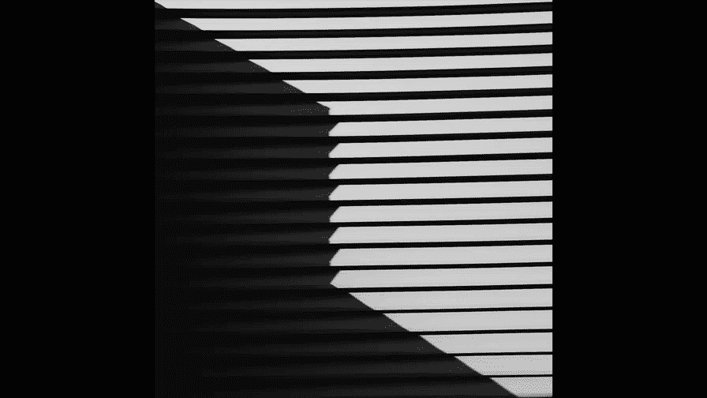
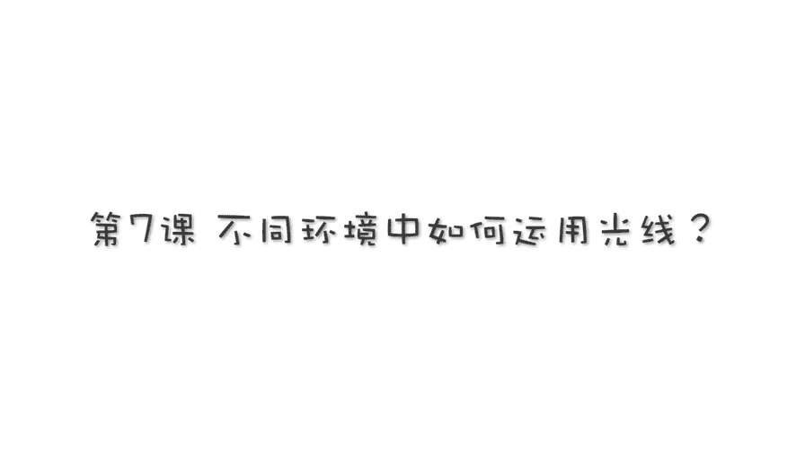
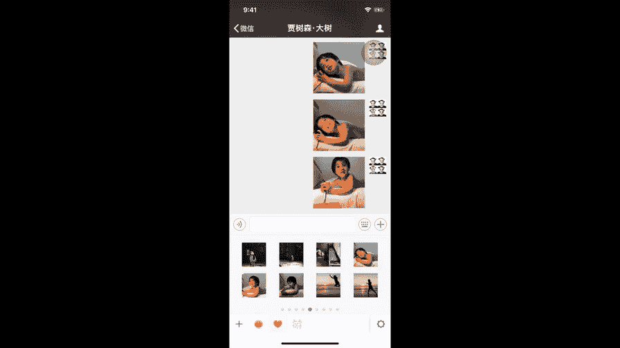
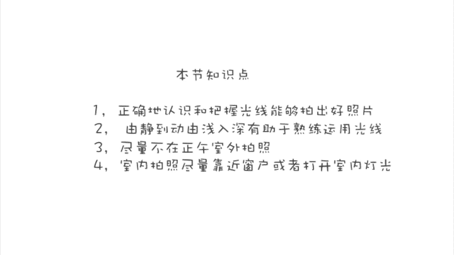

# 贾树森-手机摄影高手（完结）：2.【入门】揭秘光线构图视角运用技巧：第1讲 不同环境中如何运用光线？

🎼。

🎼大家好，我是大叔。现在开始今天的分享。😊。

关于这几种光线呢，我会给大家做一个演示啊，简单的演示。那么这个演示呢，它有一个前提的条件，就是假定你就是拍照的人啊。那么呢我就是模特。好，那么现在呢我给大家演示一下光线的方向问题。第一个呢。

我们先来说一说顺光。好，顺光呢就是如果你现在拍我好的，光线就是这样照在我的脸上的。平的照过来，那么这个光呢有可能是灯光，也有可能是太阳或者是窗户照进来的光。总之它的方向就是这样的。

就是跟跟你拍我是一个方向来的光。这个光源有可能在你身后，有可能在你的前边，那这是真实的顺光的情况。顺光呢它的好处是能使我们拍的东西呢获得比较均匀的照明，没有什么阴影。正因为它没有阴影，所以呢它就比较平。

它没有立体感。那么测光呢就是同样的假定啊，测光呢就是从。模特的侧面照过来的，有可能是正侧面，有可能是稍稍往浅一点的侧面。由此可见呢，测光它是一个大概的范围，不是某一个固定的角度啊。

测光拍照的好处是什么呢？它呢容易使我们派的人或者物，它有立体感啊，大家可以注意观察。另外一个呢，我们用测光来拍照的时候呢，会使照片比较有质感。也容易使我们的拍摄物啊跟背景去脱离开。

这样的话呢比较有效的能突出主体。什么叫逆广？逆光就是这灯上了模特的后面了啊。但这个光没有那么强，看不了那么明显啊。啊，咱们画一个亮度大的，还是看太阳哈。那现在太阳呢位于我的身后。当然呢呃位于我的正后方。

那肯定是逆光了啊，稍微再偏一点也是逆光。那么用逆光来拍照。它的好处是什么呢？逆光呢就是比如说容易拍摄剪影。啊，逆光拍照片呢是容易使照片具有一定的气氛啊，它容易营造气氛。至于说怎么拍剪影。

我们在后面的课程里面会专门给大家讲。还有一种光焦的顶光。哼就在我顶上。这种光呢我们在一些比如说室内啊有一些筒灯它照下来，有可能是这种光。大家注意现在看我脸上，这个光很难看。在另外一个就在室外的时候。

中午那个太阳直射下来，太阳特别高，我们脸上就形成了这种光。这种光呢俗称叫做骷髅光哈，很难看这个顶光。啊，我们在拍照的时候呢，经常面临一些比较复杂的情况。呃，比如说吧我们拍一个东西，如果它是死的，它不动。

或者是我们拍一个成人，我们可以在那慢慢摆，慢慢去寻找合适的光线来拍照。但是我们举个例子吧，比如说像小树在这个游泳池里边这样去玩。那么我们来拍照的时候，那么对于光线的把握，可能确实有一些困难了。

那么怎么样来解决这个问题呢。首先呢我还是建议大家就是先拿一些不动的东西来练习。那么去生活中去发现一些比较有趣的光啊，有趣的影子。那么用这些东西来做练习。慢慢的呢呃熟悉了之后呢，再拿一些成人。

然后呢去做一些光线的练习。比如说看看顺光拍摄的效果呀啊测光拍摄的效果呀啊逆光拍摄的效果，以以至于呢在呃有意识的去营造一些光线哈来拍摄。练习自己对光线的把控能力啊，观察能力。

当你对光线的认知认识以及把控的能力呢有了一定的提升之后呢，哎你在慢慢的练习呢，用比如说在这种复杂的情况下去拍摄孩子。那么那么这个时候呢，你也不要着急，因为毕竟孩子他动的特别快。啊，一会儿转到这边来。

一会儿转到那边来。如果呢你完全随着他去转，那么你肯定会被转的晕头转向啊。呃，你先呢把自己定下来。在这个区域内呢，比如说这个游泳池啊，咱们先去观察这个方这个太阳在什么位置，它从什么地方照过来。好。

我先暂定一个一个角度，比如说我就在这等着他孩子看向我的这个时候呢，我比如说我去看哦这个光就是顺光，我就拍一些顺光的，而不用跟着孩子到处转。比如说呢那你再转过来好，站地，我在这个地方我练习一些逆光的。

比如说怎么去在逆光下去对焦，然后在逆光下去控制曝光啊，这个咱们前面都讲过，对吧？那逆光的时候肯定要把曝曝光控制一下的。当你对这些哎你有了一定的认知之后呢，你可以慢慢的动起来，跟着它动的这个节奏。

把握了它动的一些规律，以及跟光线的配合。那么这个时候你可能就会在这个运动当中呢比较容易去把控光线了。拍照黄金时刻通常是指日出之后的两个小时内和日落之前的两个小时内，它是一个时间段啊。

那么这个时候太阳它升起来不是很高。它形成的光线呢相对来说比较柔和，不会像中午啊太阳顶在头上，然后在我们脸上形成那么浓重的阴影啊，形成骷髅光。

所以呢这个这两个时间段呢通常会被啊摄影师们称为拍照的黄金时刻啊，或者叫做甜光。那么这个时候无论我们用顺光啊，用测光或者逆光去拍照，啊，基本上都能获得啊比较好的照片。当然了，这个时间段它不是那么绝对的啊。

呃，比如说呢可能会因为季节的不同而不同。那你冬天和夏天肯定是有所差别的。另外一个。南方和北方也不一样。小树的这组照片呢拍摄于海南三亚，是属于南方了，拍摄的时间段呢大概在下午四五点钟的时候。

那么这个时候太阳就快落下去了。啊，没有那么热。啊，然后呢角度也特别好，光线很柔和，再加上水面的反光，我们可以看到它的脸上的光线呢不管是逆光也好还是测光也好，还是顺光都非常的美。

所以我们拍照片呢就尽量选择啊拍照的黄金时刻去拍照片。那么这个时候我们不管是拍人啊，拍物或者是我们拍风光啊，都能获得非常好的光线。当然了，也不是说中午的时候就绝对无法拍照了啊。因为有的时候我们出去旅游。

那么就恰巧中午的时候就到了这个景点了，怎么办呢？呃，如果说硬拍啊，就是这种骷髅光，那么这个时候我们肯定要想些办法的哈。那么像这张风景照片呢，也是。在中午的顶光情况下拍的，我们可以利用一些影子啊。

利用一些巧妙的构图啊来做一些拍摄。同时呢如果我们想拍人啊，我们可以呢把人放到这个比如说树荫下呀，阴影里面去拍照。那么这个时候人脸上的光线呢，它的个这个条件就改变了啊。

小树的这一组照片呢都是在这个树树林子底下拍的。那么大家可以看到，其实呢这个时候。景光并没有过多的影响到它。当然了，我们在树底下或者阴影里面拍照呢，有的时候会有一些反差问题啊，那么可能背景比较亮。

或者是脸上会有一些呃树影投下来的这个光斑啊，这些都是需要我们注意的啊。对于光斑呢，当然我们尽量的能避呢，就尽量避开一些啊。如果避不开呢，我们可以利用它啊拍出一些比较漂亮的感觉。漂亮的影子。

那么对于这个人和背景量差比较大的情况呢，我们可以通过曝光补偿以及呢把HDR打开。那么这些措施呢啊。把照片曝光合适。在室内拍照，我们通常面临的问题就是比较暗。没有光。这个时候呢我给大家的建议呢。

就是大家尽量去寻找窗户。那么在白天的时候，窗户基本上是我们在室内能找到的最明亮啊最稳定的光源了。我们尽量呢靠近窗户去拍照啊，也尽量呢把窗帘给打开，让更多的光线进来。如果由阳光直射到屋子里面的时候。

我们可以把纱帘拉上啊，让光线变得更柔和一些。那么利用窗户来拍照呢，就是它的特点就是越靠近窗户的地方越亮。呃，当然利用窗户也可以营造出很多光线，比如说逆光拍呀，然后测光去拍呀。

顺光去拍呀啊都能拍出不错的照片。那么小树呃在床上的这一组照片呢，是我们在越南旅行的时候拍的啊，白天那么屋里面整体亮度比较高，呃，主要光源就是。窗户照进来的光线。那么通过其他的这些墙壁的、顶棚呀。

以及被单，它这些反射之后呢啊小树的脸上的光线是非常的均匀柔和啊。嗯。拍出照片呢整体的感觉呢比较舒服。那么白天醒到了晚上呢，就比较糟心了。但是到了晚上呢，我们即便是把所有灯都打开了。

那看拍出照片还是这样乌吐吐的，而且呢质量也不高。因为光线确实太暗了。那么这个时候大家看看这几张照片啊，那么这个感觉是不是马上就不一样了，跟刚才那个乌突突的感觉比就是不一样了，对吧？

那这就是因为啊让他呢靠近了一个灯。大家可以想象一下是什么灯啊。那么而且这个灯的颜色又不一样了，不是通常那个我们说说那个管灯，日光灯能够冷色掉。那么这个灯它偏暖。

所以呢我们其实呢在晚上的时候要多想一些办法啊，然后让孩子呢尽量的靠近。光源也就是灯。那么这个时候呢我们拍出不错的照片。那么这几张动图呢呃是小树跟那个灯互动的。我连拍之后呢，我自己做的啊。

但然这种怎么做呢？我们后面课程会给大家讲啊，这个呢实让大家看一下它跟灯的互动的真实效果。那通过这个其实也能看到灯亮和不亮，他脸上的光线的变化。那这几张照片呢是给大家还原一下刚才拍照的那个场景。

啊，就是这么一个灯啊，就是这么一个场景啊，拍的这个照片。

🎼今天的分享就到这儿，我是大叔，我们下次再见。😊。

