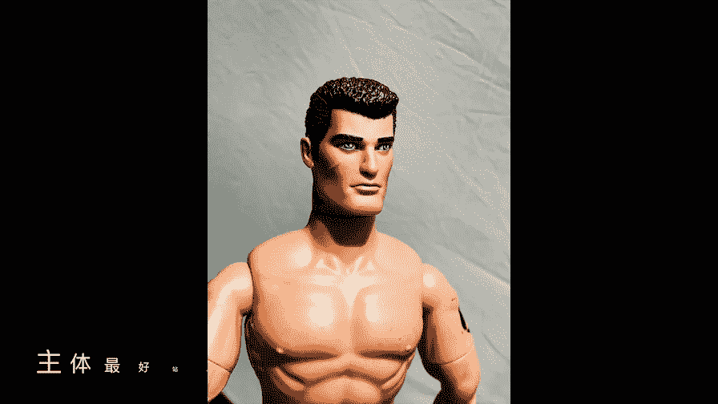
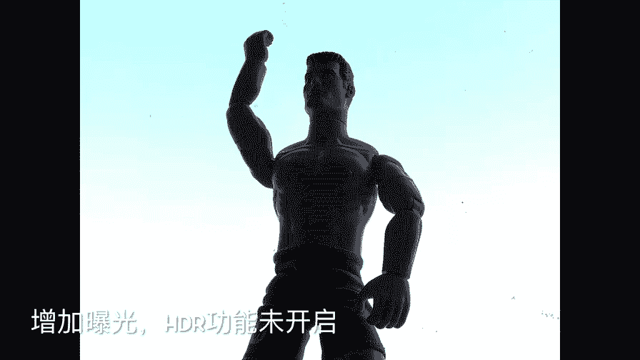
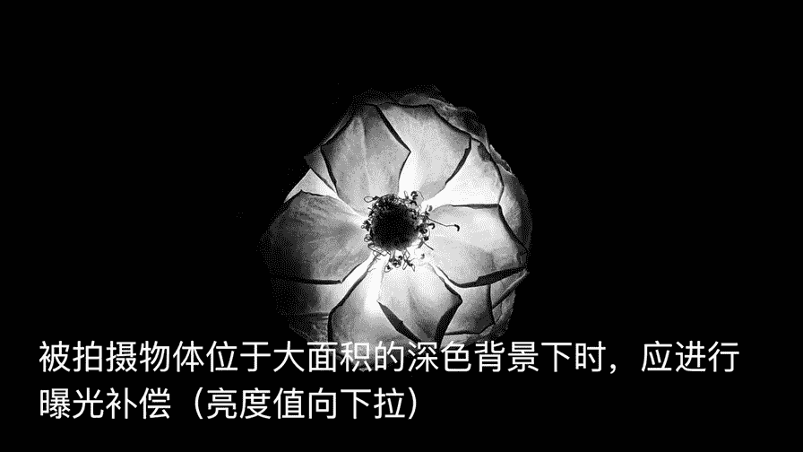
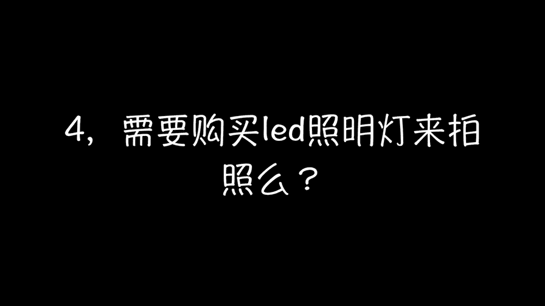

# 贾树森-手机摄影高手（完结）：2.【入门】揭秘光线构图视角运用技巧：第2讲 光线暗的时候怎么拍？

。🎼大家好，我是大叔。现在开始今天的分享。😊。

为了更好的给大家示范哈，我们花重金，请到了非常健美的非常著名的模特M先生哈。那么M先生现在处于这个位置。我们通常上眼一看，光线很好，但是拍出来呢。确。跟我们看到那感觉是不一样的。

帅哥M先生成了黑脸包公了，对吧？那么他的脸就变成黑脸了。呃，大家看一下，它现在其实是处于呃一个阴影当中，没有被太阳直接照射到。所以呢我们首先呢要把啊它给挪到太阳光的底下。哎，那么这个时候呢。

它的亮度就提高了。如果这个时候我们来拍片儿，那么就不会像刚才。那样成为黑点包公了。不过这个时候其实啊也还是要注意一下，因为毕竟它的背景是白色的。这个像我们平时在雪地里拍摄啊。

或者是人位于特别大面积的浅色背景当中，我们都要进行曝光补偿啊，把这个曝光呢向上拉一点，并且让人呢尽量站在阳光底下，否则呢容易造成脸黑的情况。还有一种状况呢就是现在M站的这个位置是完全处于。

背光，然后呢还是落在一个特别明亮的一个天空上哈，就是逆又逆光又是明亮背景的。那么这个时候一拍，那脸基本上还是黑的。其实这样的状况是比较适合配剪影的，剪影这课还没上，已经说了好几个剪影的了。

那么这个时候我们如果去拍照的时候呢，其实应该啊把曝光去。好好调一下。那么首先像iphone的话，想先要进行这个对焦和曝光锁定。那锁定的曝光。之后呢，我们要把这个亮度值稍微往上拉一点哎。呃拉一点之后呢。

像现在这样，天空如果直接拍出来，天空就没有层次了。那么其实呢同时还需要把HDR打开。HDR打开之后啊，它记录的层次范围就广了。

呃，他可以把脸拍的没有那么黑，同时呢天空也是有层次的。呃，在这里呢在这个问题的基础上我给大家拓展一下。其实我们在日常拍摄当中还会遇到这种啊背景色是大块面积的黑色啊，比如说人哪花啊都可能遇到这种情况。

那么像这个时候我们也是需要进行曝光不偿来调整的。像相反的方向调，不然的话呢，这个花呢就会白成一片，没有任何层次。

呃，要回答这个问题呢，其实里面涉及到一点点的啊摄影专业知识。不过呢我争取给大家说的稍微简单一点哈。那么我们呃不管是用相机还是用手机来拍照片的时候呢，我们需要啊三个因素来决定曝光。我们把它称为曝光三要素。

我们或者是我们把它叫做曝光的三个兄弟吧。那么老大呢就叫快门速度。老二呢它就叫做光圈，还有一个老三，它叫做感光度啊，也叫ISO。那么这三兄弟一块来决定曝光。在光线好的时候无所谓了。大家你出一点力。

我出一点力就可以了。那么光线不好的时候，这老大和老二就力穷了。我们的手机的这个快门速度和光圈呢啊没有那么大的余量，所以呢在光线不好的时候，它的光圈只能开那么大啊不像单反我光圈可以开到一。4，对吧？呃。

快门速度可以实劲的调手机呢就受这个局限了。那么这个时候只能靠老三靠感光度了，那老三这个感光度呢标的很高，呃，画面的亮度呢是提起来了，不过呢它有一个副作用，就是呢它的噪点和颗粒都增加了。

虽然说单反它的噪点和颗粒也会随着感光度的增加而增加，不过呢我们的手机在这方面呢受硬件的局限，啊，它的衰减是很厉害的。😊，所以我们用手机的拍照片，尽量选择那种光线比较好的时候。比如说你能在室外就在室外拍。

能在阳光下就在阳光下拍。实在不行，在室内啊，我们靠近窗户，靠近灯光啊，这个我们前面也说过了。在很多时候呢，我们万不得已，非要在这个光线不好的时候去拍照，呃，又不想噪点太多，颗粒太粗怎么办呢？

那这个时候我们就只能求助于闪光灯了，对吧？啊，使用闪光灯的方法呢也很简单，把闪光灯打开啊，让它闪光就可以了。通常我们拍出来之后呢，发现就是这个主体很亮。比如说我们的模特M先生非常的明亮。

但是呢背景却特别的暗，漆黑一片，没有什么层次了。在使用闪光灯的时候呢，建议大家尽量选用就是背景比较明亮的。这个时候来使用闪光灯。那么这个闪光灯有几种情况，对吧？如果我们在这样的情况下使用自动闪光。

那么通常它不会闪光，一定要留意。因为它测出来的亮度比较高，所以它可能不闪。所以在这样的情况下，我们尽量使用这个强制闪光，那么这个时候我们拍出来照片啊，主体和背景呢都会得到很好的平衡。

关于闪光灯的使用呢还有一个有关距离的问题，我们手机闪光灯呢，它这个强度没有那么厉害，所以一般建议大家它的最佳使用距离是1米到1。5的样子。啊，太近了，就闪的过强呃，主体过亮。如果太远。

基本上起不到太大的作用了啊，大家看一下这个这个时候我就往后退了一下。那么呢对这个M先生进行手机闪光哈，大家看到这个闪光灯的作用减弱的非常的快。几乎没有多大作用了啊。

啊，这个LED灯啊，如果你正好有啊，那么你就用一用是可以的呃。如果没有，我其实不太推荐大家去买，因为这东西稍微大一些，对我们拍照携带不太方便，就是有点有为。手机摄影的这个便捷性了。

其实我们手机上本身就有手电筒，对吧？那么呃在一些情况下，我们可以用它来作为辅助照明，就是另外一部手机把手电筒能打开，然后呢可以给我们照明，那这种手电筒它的优势呢，就是呃打什么光都能看到啊。

比如说你打顺光呀啊，测光呀呃在这个。

屏幕上能看到的效果是直观的啊，如果这个拍摄主体的亮度啊，比如说这M先生它的它上面的亮度和背景的亮度平衡的比较好，以及呢我们打光打的比较好的时候呢呃能拍出不错的作品。但是呢手机的手电筒啊，它的亮度有限。

所以呢拍照的时候，手电筒不能离这个M先生太远，不然的话呢它能起到的作用就比较小了。其实生活当中呢有很多可以用来照明的东西，那像这个呢就是小树的玩具啊，有一个闪光棒坏了啊，露出这么3个LED的小灯泡。

它的一个特点呢就是比较聚光，尤其离的距离比较近的时候，稍微远点啊才会散开一些。那么用它如果来做手电筒来照明也是可以的。只不过呢要控制距离啊，距离如果太近了的话呢。它的这个局部亮度就过高。

那么我们拍出来照片呢就。人特别亮啊，甚至都呲了啊啊，周围背景会特别黑。呃，其实这个有点跟用闪光灯那个一样啊，就是尽量还是让背景上有一点亮度。那么我们前面呢不管是打手电筒呀，还是像这个LED的啊。

那么它呢整体上平衡感会比较好呃，这个主体M先生和背景呢都有很好的亮度。那么像这个LED呢它其实是它的颜色是偏冷的啊，那么照出来之后呢，会跟背景的颜色呢还有一定的这个小对比啊，那么这就是小惊喜了。

在拍摄的时候我们留心去观察，就能拍出有趣的照片。前面在讲啊手机拍照界面的符号的时候呢，提到过有一个闪光的功能叫做常亮光源，这是安卓手机的。那么我现在用的这款手机是苹果的。啊。

我选用了其中里面vissco这款软件啊，里面的。拍照功能，那么它里面的是一个闪光灯呢是有一个常亮光源的啊，打开之后呢，就相当于一个手电筒是带在自己手机上的，就不用另外一台手机来照明了。啊。

这个时候呢我们来拍照片啊，也能拍出那种就是打了光的这种感觉啊，唯一不同的这个光呢就只能是打出一个顺光，而且是偏平的顺光，那下面有几个小例子都是使用手电筒啊来照明的例子。

像小树叔这样照片呢是在傍晚的室外啊，用另外一部手机作为手电筒来照明的啊，这个蓝墙的呢是在地下车库啊，里面比较昏暗，也是用另外一部手机的手电筒来做照明的。那么像这种情况下，即使是有手电筒照明。

那么它的亮度还是比较低的。大家要留意，如果孩子动作太快呢，是拍不下来的。同时呢在拍照的时候也要端住手机，不然的话，照片也是容易虚的。最后这张黑白照片是使用真正的手电筒啊，作为主主照明来拍的照片。啊。

所谓的主照明，他还能看到他的脸那个中心有一个特别亮的区域。那么这手电筒呢它比较聚光啊，周围的亮度呢是路灯啊，这些光照明的啊，没有手电筒的亮度高。

🎼今天的分享就到这儿，我是大叔，我们下次再见。