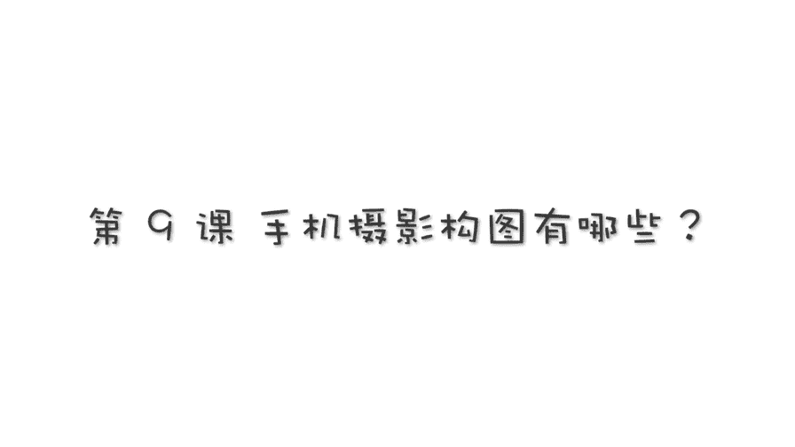
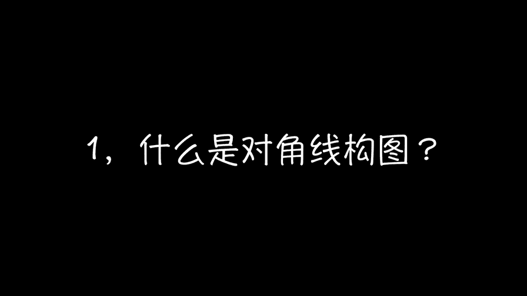
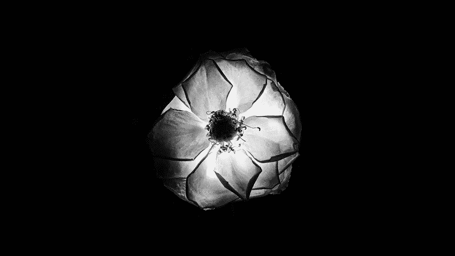
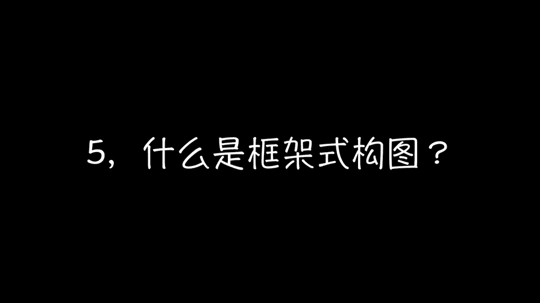
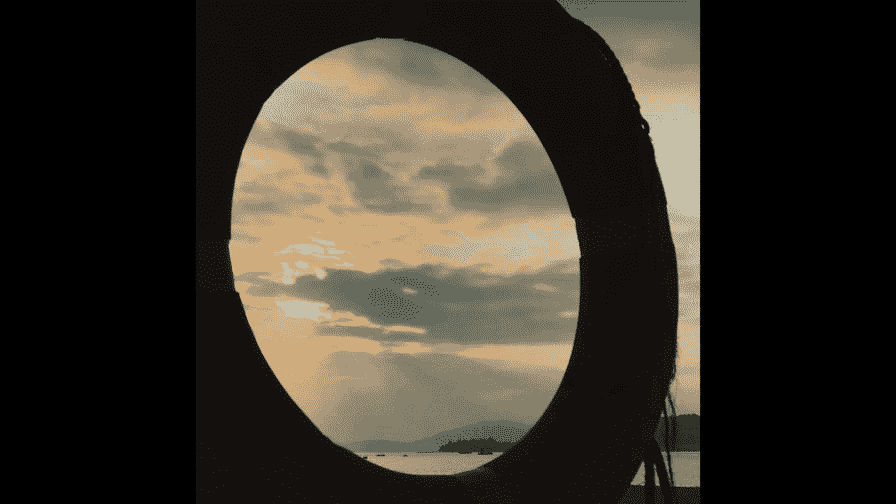

# 贾树森-手机摄影高手（完结）：2.【入门】揭秘光线构图视角运用技巧：第3讲 手机摄影构图有哪些？

。🎼大家好，我是大叔。现在开始今天的分享。😊。

好的，我现在在海边，然后呢我们看一下对角线构图。对角线构图呢它是指看我们屏幕上啊，就斜对角，两个斜对角都是可以的。啊。我当我们的主体在这个曲景框里面是以这个对角线的方向来排列的时候呢。

我们拍出来的这个画面呢啊它会有动感，有那种不稳定的感觉啊，或者是能体现出生命的力量。对角线构图呢，它看起来不是很稳定，它能让看照片的人呢觉得画面呢更加的舒展更加的饱满，从视觉的角度看啊。

它的视觉体验会更加的强烈。那么大家看一下，我在倾斜的啊，把手机来拍这海浪，我想让它更加的具有律动性。所以呢我用对角线的这种取景呢来拍摄。那么在这当中呢，我们最好呢是把啊焦点给锁定曝光呢调整好。

然后呢啊来抓拍这个浪花啊，这海浪打在沙滩上这种感觉这几张照片呢都是我在刚才的这个海边来拍的啊，所有的呢都是利用了对角线的构图。那么呢确实是体现出来，表现出来海浪啊在这个沙滩上肆意狂奔的这种感觉。啊。

生活当中其实很多啊这种啊对角线构图的，但是呢不一定完全是对角线啊。像这个呢就是完全是对角线的。那么有的呢是稍微差一点，有的呢是各种形状，以各种形状来出现的这些呢都是没有问题的，大概的感觉。

是对角线的以这么一个方向就可以了。不是说必须啊这个两个对角要对上啊。那么对角线呢是不管是拍摄物体或者是拍摄人，它都有很好的强调动感啊，使画面更加的活跃的这么一种感觉。我在这个沙滩上哈赤角闲逛啊。

反沙滩上有很多这个呃这样的小小的贝壳，它静静的躺在沙滩上哈。那么我们还有欲望把它拍下来。当我拍它的时候呢，我的第一感觉呢，我就直接把它放在了这个啊，画面的中间啊，处于一个中心的位置。这样的话呢。

这个构图呢其实就是一个叫做中心构图，我们就把这个主体是放在画面中心来进行拍摄的，这样做呢啊会把这个这个主体呢最大化的进行突出啊，非常的明确，对吧？啊，我要突出这个贝壳。还有像沙滩上的这种瞭望塔。

我在拍摄的时候呢，不知不觉就把它放在了画面的中心。像这种构图呢是非常明确的，就突出这个主体啊，毫无疑问。还有像沙滩上的一棵树啊，然后花园里面花丛中的一个消防栓。啊，或者是沙滩上的这个小树和树妈。

以及小数啊，那么我其实拍的很多片子用的都是中心构图法。那么中心构图法其实是我用的最多的啊一个构图方法。呃，其实这个中心构图法呢，它是比较符合我们创作的一个原始冲动的。

就是呢我们希望把主体啊放在画面的中间，希望我们的主体是最突出、最醒目的位置上的。不管是我们拍人还是拍像花卉啊像树木啊等等。我们呢这个用中心构图法，都是最直接最简便的。

也能最大限度突出主体的啊这么一个。构图方法。好，大家来看一下这张照片啊，如果把这张照片左右对折，那么其实呢啊这两艘双体帆船呢是可以重叠在一起的啊。大致啊那么这种构图的方式呢，其实是叫对称式构图。

那么呢其实它中间呢是有条轴线的啊，就是无形当中有条轴线。我们左右是啊一样的，那么这种构图方式叫对称式构图，细心的朋友刚才会留意到哈，在我的画面左边有一位穿白色浴袍的老爷爷啊，差一点就介入了我的画面。

其实我摁快门摁的很匆忙啊，不然他进入画面之后呢，一个是有爱观瞻。另外一个呢他就不是对称式构图了。不过呢现在在沙滩上呢，他又给我充当了一个模特啊啊那么我把它这两个人拍下来之后呢，它也是一个对称式构图。

那其实像这辆特别泥人画的车的前脸啊，也可以拍出。啊，对称式构图的照片，还有其实我们的窗帘，比如说窗帘缝啊左右对称，还有呢像美术馆屋顶上的两个天窗啊，也可以拍出对称式构图或者是呢以人为中心啊。

左右两个桶是对称的，那么这也是对称式构图。对称式构图，其实呢不完全是左右对称。像这样照片呢，其实是上下也可以对称的啊。啊，这个大家要多开一下脑洞啊。在前面的时候呢，跟大家提到过，希望大家在拍照的时候呢。

把手机啊这个网格线打开啊。那么网格线打开之后呢，会在拍照界面上有两横两竖这么四条线啊，那么这四条线相交，那么就有4个交叉点，啊这四个交叉点呢啊被我们称为这个构图的黄金点啊。

那么它啊这四个点会比较容易吸引到视线。那么这个构图法呢被大家称为三分法构图。这四条线相交呀，除了这四个点之外呢，它还有9个小格啊，它把画面分成了9个小格。所以有的人把它叫做九宫格啊。

那么它又有点像汉字的一个景字，所以呢大家也把它叫做景字构图法或者是九宫格构图法，那么都是指的这个那这是我刚才利用三分法拍的。照片大家可以留意到海平面呢其实是位于画面的下3分之1处的。

或者是海平面位于3分之2处。那么像这种就是把画面一分为3，它占其中的一份或者两份。那么这种构图呢啊都是三分法构图。还有呢这一尊小雕像啊，它位于画面这。四个点的其中右面竖的两个点上。

那么这是也是一种啊三分法的构图，它拍摄的成片是这样的呃，我这里呢也给出了网格线的这个构成。大家可以看一下，它在画面中所占的位置哈啊其他的比如像这个消活栓哈，它也是跟雕像的那个构图方法是一样的。

就是位于其中的两个点上啊，或者是像我们拍人的时候啊啊也可以是这样的一个构图，就是位于其中的两个点上其实像这朵花呢就是比较典型的位于其中的一个点上啊，第四个点任意一个点上都可以，或者是小树的这张照片。

小树的脸呢其实是位于其中的一个点上，或者是这个点的附近啊，有的时候并不一定是那么的准确啊，一定要在那个点上。在其中一个点的附近就可以了啊，比如舒妈跳起来的这张。那么数妈就在其中的。一个点的附近。

在这个沙滩上拍了几天的照片之后呢啊我对于只拍这个大海呀，然后蓝天呀就有点失去了兴趣。所以呢我就想寻找一点有趣的东西，挂在这个瞭望台下面这个救生圈呢就引起了我的注意哈，我就钻到这个底下去了，钻下去之后呢。

我用这个救生圈啊，作为一个框架，我把我要表现的这个日出的这种感觉呢，框的这个救生圈里边啊，拍了一张照片，通过救生圈作为一个框架啊，把周围的不想要的东西呢给它排除在画面之外啊，把我想要重点表现的东西啊。

放在框架里面呢去重点突出。啊，就起到了一个强调的作用啊，给大家有一种那个能跨过这个框跨过这个圆圈而走进这个画面的这种感觉。这呢其实就是框架式构图能带来的最大好处。一个呢是能屏蔽掉那些杂七杂八的东西。

另外一个呢，他也把大家的视线引到了你想要强调的这个主体身上，比如呢这张我在澳洲拍的照片啊，它是通过一个桥洞子个拱平的桥洞子啊拍的。那我把桥洞子啊，作为一个框架来展现啊外面的这个风景。

如果我只拍一张风景呢，就感觉比较平就不像现在这样明暗对比，有这么一个框架有意义有感觉。还有这张呢就是。

树妈拍的啊，我跟小树给他剪指甲啊，小树小的时候会被这样的一个，我们把它称为小马圈的东西，栏杆给拦起来。那么这个栏杆上有一个新形的图案，数妈透过这个拍的一张照片。呃。

这样呢把里面的这些乱七八糟的玩具呢都给屏蔽掉了。大家看起来这个地方很干净，重点突出。同时呢这个图案呢，它的心形又暗示了我们这个特别有爱的这种感觉。

🎼今天的分享就到这儿，我是大叔，我们下次再见。😊。

。