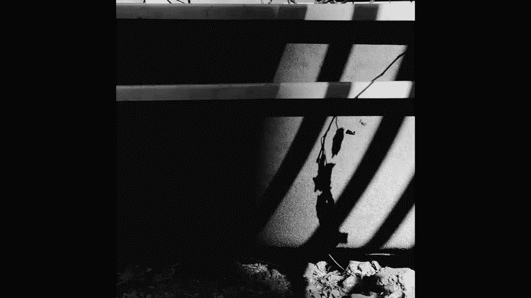
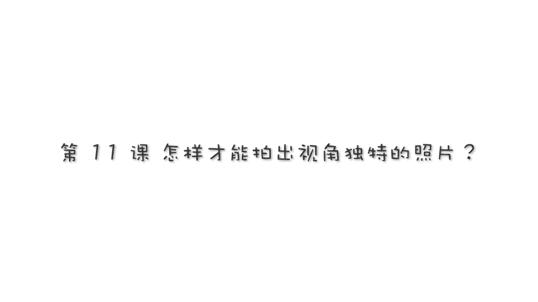
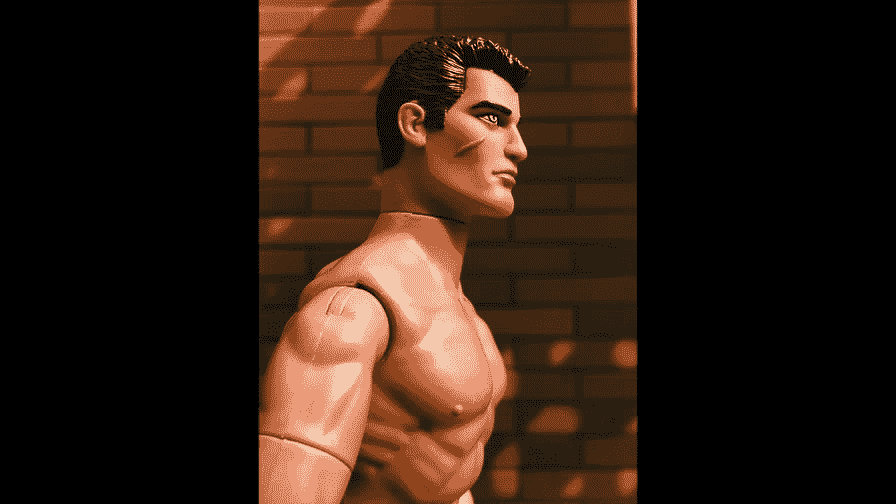
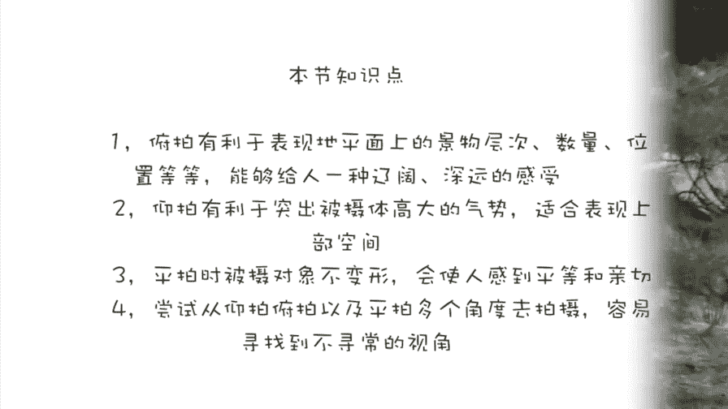

# 贾树森-手机摄影高手（完结）：2.【入门】揭秘光线构图视角运用技巧：第5讲 怎样才能拍出视角独特的照片？

🎼大家好，我是大叔。现在开始今天的分享。😊。

除了又帅又健美的M先生之外呢，今天又请到了一位新的模特，我们叫他小红帽吧。跟M先生比起来的话，小红帽实在是太矮小了，是不是？呃？当我们在M先生这个高度呢去看小红帽的时候呢，嗯这样的一个角度。

通常就是一个俯视的角度。当我们用呃相机来拍照的时候呢，我们拍出照片，就叫做俯拍。😊，用俯拍的角度来拍人的话呢，会把人拍的比较矮小。那么像这个小红帽呢，从俯拍的角度去这么一拍啊，本来他就矮，对吧？

用这个俯拍一拍呢，那么他就更加矮了。同时呢因为帽子的缘故挡着，然后都看不到他的脸了，对不对？看到这个小红帽呢，我就会想起小树哈。那么像这张照片呢，我也是采取了俯拍的角度。那俯拍在这里面呢。

除了拍到孩子的脸。拍到了这个泡泡，然后也拍到了孩子身后的一些景物。所以呢才去俯拍呢，除了拍到人，还可以拍到后面很多地面上的景物。所以由此可见呢，俯拍它的特点呢就是。

有利于表现地平面上的这些景物的层次、数量、位置等等。能够给人一种比较辽阔和深远的感觉。所以可能俯拍就是相对来说比较适用于拍摄一些景物以及风光等等。因为他在拍摄人物的时候呢，容易压缩人物的高度。

把人拍的特别矮小。所以呢我们用俯拍这个角度来拍人的时候，一定要注意这个问题。好，现在换小红来拍M先生了啊，大家能看到，其实他俩差的很多，对吧？那么小红如果想把M先生拍全的话。

那他只能采取仰视的这么一个视角。那么这样的一个。低出拍高处的方法呢叫做仰拍仰拍之后的成果就是这样的。那么它有利于突出被摄体，也就是说M先生特别高大，很很有气势的感觉，对不对？所以由此可见呢，就是仰拍啊。

它能够把像树木啊啊这样的像上生长的景物在画面上充分的展开，跟俯拍有利于表现地面上的景物相反。那么仰拍呢是有利于表现天空的，或者是屋顶顶棚总之上部空间的景物景色。

贴近地面的仰拍呢还能够用于表现一些夸张的运动。比如说像跳跃呀、飞翔啊等等。那么仰拍人物的时候一定要注意，就是如果脸部比较胖的人呢，就尽量不要仰拍了。平拍那么就字面意思了啊，就是平的啊，为了公平起见。

公平起见哈，我把M先生放倒了。😊，只有M先生放倒了，他才能够跟这个小红帽达到一个平的一个状态啊。😊，我们先来看，如果现在是小红帽来拍M先生，哎，那么这个高度看过去平拍。水平的。再换过来。

然后让M先生来拍小红帽。那么呢这样的拍出来也是一个平的一个状态。那这样的拍法呢就叫做平拍。通过M先生和小红帽之间的这个互拍啊，这个互相平拍。我们能大概看出来哈，平拍呢不太容易使拍摄对象产生变形。

尤其是在拍摄人物活动的场面的时候，使用平拍，那么呢容易使人感到平等啊亲切。尤其是我们在拍摄孩子的时候，我们要多多的使用平拍。那么这个时候其实是需要我们大人蹲下来去拍摄孩子的。一定记住。

当我们蹲下来的时候呢，我们跟孩子之间就是一个互相交流，互相平等的这么一个状态。那么这样去拍摄孩子呢，就是一个平拍的啊拍摄。视角利用平拍在拍摄自然景物的时候呢呃地平线的处理比较重要。

有我们是为了强调上下对称啊，呃是可以把地平线放在画面中间的位置。不过在一般情况下，我们还是应该避免地平线完全平均分割画面。因为如果是这样的话呢呃。远景啊和近景啊就压缩在中间一条线上。

那么画面呢就会容易显得平淡，比较矮板。所以我经常会呃地平线有可能高于或者是低于画面中心这条线。想要拍出视角独特的照片呢，我们就必须去寻找。有别于正常视角的啊这样的角度去拍摄照片。

这个正常视角呢有可能是仰视的视角是正常的，有可能是平视的视角是正常的。所以呢我们就要寻找，除了我们正常看到的。比如说我们M先生放在这儿啊，咱们围绕着M先生，咱们做一系列拍摄。好，现在放在这儿。

第一俯拍俯拍呢我们可以看到M先生的一个影子，对吧？在这儿。😡，然后呢，我们还可以看到M先生站立的这个台阶的一个环境啊，交代出更多的环境因素。接下来呢我又转到了M先生的前面，也是采取了略微俯拍的一个角度。

这样的话既能看到M先生的脸啊，也能看到啊他站立的这个环境。然后呢，我又转到了M先生的侧面啊，采取了一个侧面拍摄。但是这个我机位放的很低啊，我已经趴到了台阶上啊，采取了略微仰拍的这么一个视角。

那么这个时候我会把它拍的相对来说比较高大伟暗。那这个呢是从M先生的正前方啊采取了正面仰拍的这么一个视角。其实M先生还是比较适合仰拍了，因为它本身确实比较小，对吧？那么。通过仰拍呢能把它拍的比较高大一些。

因为大家正常去看他的时候，通常都会觉得他比较矮小。所以呢我们采取这个仰拍的啊拍法呢，把它拍完了之后呢，可能跟大家平时看见的不一样啊，有眼前一亮的这种感觉是吧？所以我们采取仰拍，那么去拍M先生。

如果我们变换的角度比较合适啊，那么这时候呢我们拍出的视角就是大家平时不容易见到的一个视角。那么这个时候你拍出来照片呢，就容易呢啊为大家伙。带来一个比较震撼的感觉啊，带来一个比较新奇的效果。

那么大家平时没见到，哎，你怎么从这个角度拍，把这东西拍成这样了。所以呢我们在寻找视角的时候，要留心这些东西，要找到一些比较特别的视角。😡，呃，也不是说平拍在这里就不能用了。你看前面我用过俯拍啊。

用过仰拍。那么你看这个角度就是平拍的角度，我们用平拍来拍M先生也是没有问题的，分分钟出大片啊，呃，人长得帅就是没有办法呀。建议大家在课后呢啊找一个东西，找一个景务也好啊。

去做这样的一个全方位取景的这么一个练习。挖掘一下自己的潜力哈啊看看能找到多少个有别于正常视角的角度。也就是说你第一眼你第一感觉啊，想要拍的那个角度，除了这个之外，看看还能找到多少个跟这个不一样的。

你平时不会注意到的，不会留意到的。这个拍摄视角就是我刚才围绕着M先生呢拍摄的一些照片啊，我挑选了几张啊，略微的调整了一下，大家可以看一看啊，看看哪些角度呢是你能想象到的，哪些角度呢是你不曾想象到的。

🎼今天的分享就到这儿，我是大叔，我们下次再见。😊。

🎼。