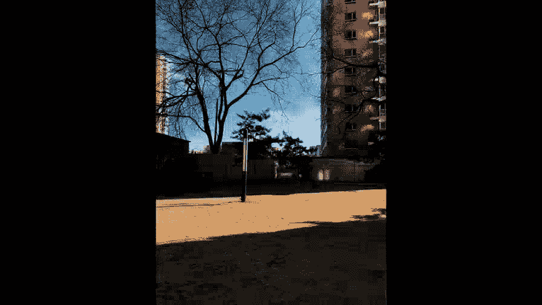
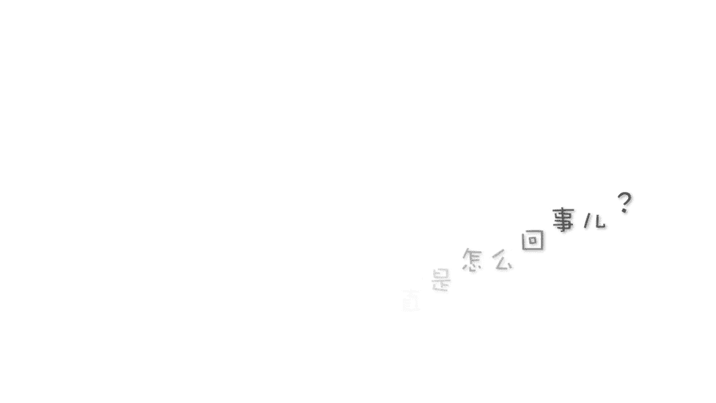
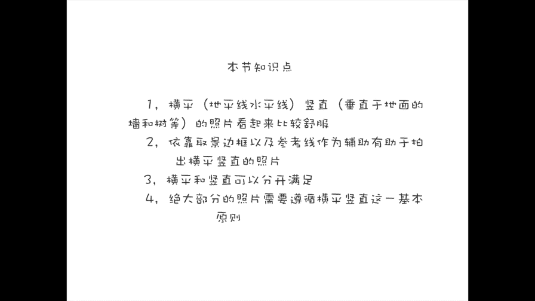

# 贾树森-手机摄影高手（完结）：2.【入门】揭秘光线构图视角运用技巧：第6讲 照片的横平竖直是怎么回事儿？

🎼大家好，我是大叔。现在开始今天的分享。

为了更形象的回答这个问题啊，我给大家看几个电影片段，咱们边看边说。大家看的时候不要光去看这个电影画面了啊，要注意我在旁边会打出一个小窗。这个小窗里面呢我会用红色和黄色标出来了，这里面的隐藏的线条。

那么这个线条是大家在正常拍照的时候可能不会留意到的。有横线条和竖线条。所谓的照片的横平竖值呢就是指我在小窗里画的这些。比如说红色代表着竖直线条，黄色的代表着水平的线条。

那么也就是说红线条和黄线条都该在它应有的位置上，该竖值的数值，该水平的水平。如果我们去取景构图的时候呢，把这些东西都摆正了。那么我们拍出来这张照片呢，就是横平竖值了。所谓的这些线条。

其实它是隐藏在画面里面的。如果我们不注意啊呃如果我不给大家标出来，可能大家就不会注意这些线条的存在。比如说这个镜头吧，我如果现在不标，大家想象一下，哪些是竖线条，哪些是横线条。

有的同学说我看到了这些线条的存在？但是我为什么要把它拍的水平，为什么要把它拍的竖直呢？😡。

我歪着拍难道不行吗？是可以，但是呢就是说横平竖直呢这种拍法呢它是符合我们建筑的本身的这个基本特点，对不对？那么我们盖楼这个墙肯定是垂直往上垒地面呢我们肯定是水平的海平面水平的，像比萨斜塔这样的倾斜建筑。

毕竟是少数的例外。那绝大多数的建筑或者是像门啊，窗户什么的，它都是横平竖直的。所以我们拍的时候呢，要遵循这一基本的规律。😊，即便是我们在拍摄人物的时候啊。

因为人物是生活在这样的一个横平竖直的这样一个世界里面。所以呢我们在拍人的时候呢，也尽量啊去把这个人呢啊这种取景构图也是把它拍的横平竖直。那这样呢人才会稳定，才不会感觉后面要歪了，要倒了，对吧？

所以照片的这种横平竖值呢是符合自然界的基本规律，也符合人的呢基本的视觉习惯啊，正好还有一个电影镜头呢，我们可以看一下，我们从上往下垂直俯拍的时候，那么怎么样来保持。横平竖直的问题，大家看一下。

留意一下地上的花啊，凳子这个边沿啊，我画了线的。那么看一下这张图呢，它其实是横平竖直的啊，这样看起来呢很舒服。像我拍的M先生的这张呢，也是俯拍符合横并竖值。小树躺在沙发上的这一张呢。

也是由上往下啊正正的俯拍的。那么大家可以留意一下画面当中的一些线条啊，它也是符合横平竖直的。横屏竖直啊，说起来容易，做起来可不轻松哈。那么到底应该怎么样能保持我们拍照的横屏数值呢？用用什么来判断啊。

首先就是我们屏幕啊这个四面的边框。它就是围起来呢，它是一个长方形啊，我们可以用它来作为辅助判断这个线条是不是直了。另外一个就是拍照界面上还有参考线，两横两竖，我们可以用这些竖线条来呢对我们取景当中的。

存在的这些竖线条，比如说后面的楼啊、楼体呀，这些线条呢是应该垂直的。其实想要拍的数值呢呃就是我们在拿手机的时候，就是要注意手机要垂直地面。那这个时候拍的照片基本上都是垂直的。

如果像夏倾节啊呃向下的方向就浮了。或者是呢往上仰了。😡，这样呢就很难拍出数值的照片。我们呢也同时用取景框当中存在的横线条来对画面当中，我们取景当中这些背景里面的横线条。比如这个墙，我们要把它对的水平。

手机如果斜一点，那么拍出来照片就倾斜了。不管是哪面倾斜也好，反正总之是倾斜了，对吧？😊，这个问题呢我先回答哈，就是横屏和竖值不用，非得同时满足。比如说像这个电影画面啊，那么这个时候只有数值是满足的。

横屏在画面里面看不到，但是实质上它是满足的，因为呢地面肯定是平的。如果你墙都是垂直的话，那么地面肯定是平的，只不过在画面里面它没有体现出来。所以我们有些片子不用费得看到。像这个镜头呢。

我们很明显就能看到它的水平线是在的，也就是说横屏是没有问题的对吧？我们等下来，我们看一下这个我画的这个图，看看横屏在画面里面是非常非常直观的。但是这个时候我们看不到垂直的线的存在啊。由此可见呢。

我们在拍摄的时候呢，横平或者竖直我们满足一个。那么这张照片呢就不会看起来歪七扭八的对吧？比如说这张我拍的这一把椅子，那么它只有横是平的。竖直的线条却不竖直。那么这个时候我是略略有一点俯拍。

这个完全没有问题。包括像这个街边的修鞋的这么一个小景啊，那么它的横也是平的，但是竖直不对，这个铁栅栏呢，它本来应该是竖直的是吧？它因为我俯拍了，所以呢它在这里面它变成了斜线条。

这个呢也是符合我们的视觉习惯的是没有问题的。还有这张街道的照片，我们的竖线条是竖直的。还有这个家里面的一个场景，那竖线条是对的，但是横线条呢我们在这里面找不到。像这样的情况呢都没有关系。

我们只要保持竖线条是竖直的就可以了。还有一些情况，比如说像这个建在山坡上的房子呀，它的地平线不是那么明显，或者是呢呃像这个大树它也长在一个倾斜的山坡上。那么这样的情况呢，呃。

我们可以让这个屋房屋的墙是垂直的，让这个大树是垂直的。那么就可以了。

这个问题提的太好了，我正好借机会跟大家澄清一下。照片的横平竖值，它是我们在拍摄照片进行构图的时候的一个基本原则。请注意基本原则不是构图方法啊。比如说像框架式构图呀、引导线构图呀，三分法构图啊等等。

它是构图方法。我们讲的这个横平数值是基本原则。就是说你在用这些构图方法的时候，仍然要遵循横平竖值的原则。那这可以算是大树老师的一个独家秘籍哈，不传之秘哈。😊，啊，为什么要说这个原则啊，要提出这么个原则。

就是我经常会看到很多照片，就像这样照片拍的这样，我们可能会大概觉得哦这张照片有点不太舒服。那具体哪儿不舒服，不知道。那学了横平数值之后，大家就知道了，原来问题出在这儿。😡。

这个是其他教科书上不会告诉你的这么一个原则。那我们回到这个问题的本身，就是说是不是所有的照片都必须横平竖直呢？我们刚才也说了。大概90%了，要遵守要横平数值，那么还有10%呢，对吧？

也就是说这个问题的答案就是不是所有的照片都必须横并数值。😡，那么不横边竖值的情况啊，大概分这么几种哈，一种就是比如像沙发呀，还有像我报小数啊，像这种啊就。可以微微倾斜的。这也是可以的。

从视觉角度上也是比较舒服啊，不会那么突兀。那当然了，也有一些照片不太好确定这个基准线啊，甚至没有基准线的。我们呢就可以不遵守这个横评数值的这个基本原则。也就是说在这10%的范围之内。

第二种情况就是当我们在比如说使用一些构图方法与这个基本原则发生冲突的时候，那我们可以遵循这个构图方法。比如说对角线构图，那么很多情况下就不能遵循这个横平竖直这个原则。那么我我们以构图方法为主。

第三种情况呢，就是有可能大家在拍摄的时候有一些自己的想法，有一些呢比较新奇的一些创意。那么这个时候大家可以遵循自己的创意，遵循自己的想法去进行构图。最后呢，大叔老师还是要给大家一个建议。

就是建议大家在初学的时候一定要多多练习，把照片尽量拍的横平竖直。

🎼今天的分享就到这儿，我是大叔，我们下次再见。😊。

。