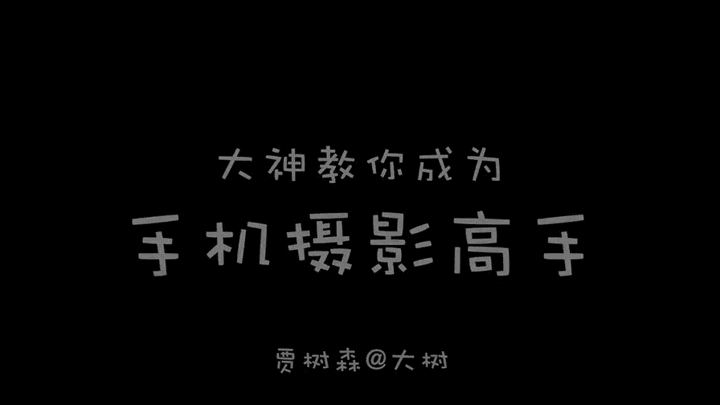
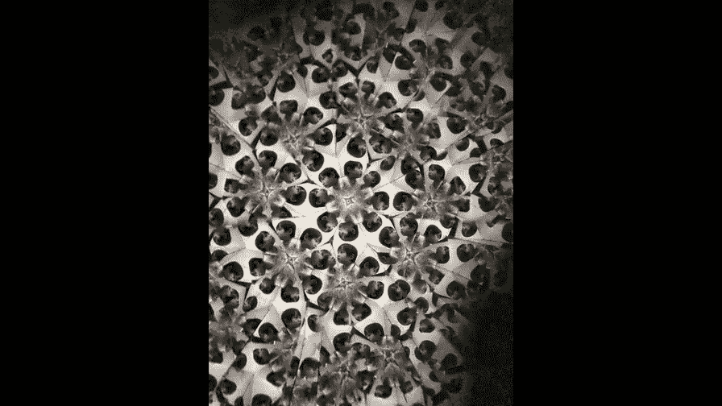
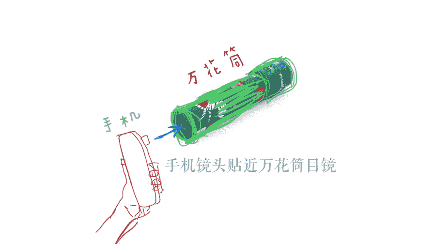
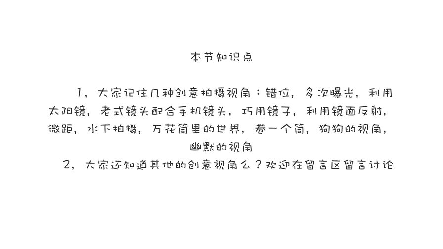

# 贾树森-手机摄影高手（完结）：2.【入门】揭秘光线构图视角运用技巧：第7讲 你知道什么是创意视角吗？

🎼大家好，我是大叔。现在开始今天的分享。😊。

创意是一件非常有意思的事哈。那么当然创意的这个定义咱就不聊了。咱就聊点直接的哈呃我给大家分享几个小的创意吧。那么其实创意有非常多，我这里呢只是举一些小例子给大家抛砖引玉啊。

希望大家呢能够开发出更多的创意来。那我要跟大家分享的第一个创意呢，就是错位啊，怎么个错位法呢？像这种捏住太阳或者是扶住太阳啊，或者是手捧太阳的，这样大家伙都玩过吧，对不对？

那么这个其实就是一种错位摄影啊啊，本来我们的手肯定是比太阳要小多了，对吧？那么现在我们利用错位啊。😊，也就是说，利用这两个物体的位置差异或者是距离差异啊，然后什么高低差异。

那么由此而产生一些呃异于常规的一个视觉差啊，就是就是拍出来的东西呢跟实际当中存在的差异。像太阳的这种就是。那么还有一种，比如说我们也经常会想这种电视塔啊，那我离得很远，我可以。

把它像一个火炬一样拿在手里面，对吧？但实际上它的这个差异是很大的。我们只是利用了这个距离远近啊，利用它跟镜头这个距离远近产生的透视而发生了一些戏剧性的变化哈。那么这样呢就看起来比较有趣。

也会让照片呢看起来比较有创意。利用错位的手法呢，我们可以玩很多有意思的创意出来啊。比如说这个手啊像一只张大的嘴啊，要吃掉啊，行走的人一样。那还有另外一种错位啊，就是像这样哈。

这张照片现在感觉我是不是趴在这个悬崖边上啊，就要掉下去了啊，只喊救命的这种感觉啊，那么拍摄的过程其实是这样的，大家看一下，其实呢就是找一个比较有纵生感的场景啊，那么可以是露面啊，可以是这样的大石头。

那个大石头呢，我就觉得有点啊像悬崖一样哈啊拍的时候呢，自己要根据这个感觉啊去设计一些动作，那么如果。不把嘴的话，可以拍几张试一试啊，然后呢感受一下。在这个过程中呢，我其实是真的去喊了几声救命啊。

虽然声音不是很大。但是你这样去喊一下呢，就感觉很逼真啊。呃，我把这个照片发到朋友圈之后呢，大家都说我是戏精。好吧，我忍了。拍完照片之后呢，大家要记得把它旋转一下。

这样才能让这个视觉上的这个错位更加的明确更加的强烈。第二个创意呢就是多次曝光啊，先分享第一种的就是大家看看这张照片怎么拍成的啊。呃，是把相机呢先加在三脚架上一张一张拍啊。这张照片里面有很多个我啊。

大家戏称这个叫做小树找爸爸。😊，呃。大家看我把相机织好了之后，然后我会在。自己事先规划好的几个位置啊来拍摄。那么。注意拍摄的位置啊，不能互相遮挡啊，不然的话后期合呢是合不上。同时呢还要注意避让行人哈。

至少得有一张里面是没有其他任何一个行人的这一点要注意，后期和呢需要用到一个软件，我用的是sap C。那么这块软件呢，我们后期的课程里面会给大家讲到。那现在如果大家不会这个方法呢也没关系啊。

先把这个方法记住。然后那个。我呢再给大家分享一个。可以直接用相机拍成啊多次曝光的。但是这个呢就是需要下载一个软件，啊，可能也需要花钱。呃，他一次可以拍两次啊，像我这种三个人的，他就拍不了了。

这款软件呢叫做hipomatic，它既可以当做照相机来使用，也可以呢用作来修图的软件啊，它能拍出一些比较像lomo一样的那种胶片风格哈。那么这块相机它有一个多次曝光的按钮啊，把这个按钮打开之后呢。

我们可以拍两张，在一张底片上。那么他是在相机里面直接就能拍成的，不用后期合。第三个小创意呢就是我们可以利用太阳镜啊来作为一个道具。比如说可以把它放在镜头前面呀。

让它加一个绿色镜等于哈啊本来天空是这样的啊，拍出来，就是刚才那样，那么也可以拍摄这个太阳镜的镜面啊，它可以反射外面的东西。有的时候呢我们也可以利用这个啊就跟戴墨镜的人呢去拍一个小合影。

把自己放在那个眼镜里面也很有意思。还有一个创意呢，就是可以拿一个老式的镜头啊，放在手机的镜头前面啊，这样呢可以拍出来一个倒影啊，挺有意思的。在一个圆圈里面拍摄倒影。啊，不过呢对焦的时候要特别的仔细啊。

不然对不清楚。我这只头呢是一个宾德645的胶片机的镜头，它比较重。我在手里面拿了半天呢，手都酸了。后来我就把它放在这个石头上啊呃这样呢我就不用手拿了来取景。对焦也比较方便。

那第五个创意呢就是我们可以巧用镜子哈，这个镜子大家里都有啊。嗯我这个是稍微大一点的镜子，大家女孩子可能会随身写在一些小镜子啊，或者有的时候在外面我们也会碰到一些镜子。那么利用这个镜子呢。

我们可以实现景物的一个戏剧性的变化啊。那么我们本来拍这面可以把另外一个另外一面的这个景色呢给拍到镜子里面去，有点比较抽象，比较超现实的感觉啊。那么你看我这个既把桥拍上了，又把桥对面的这个电视塔给拍上了。

就感觉到哎这个让人眼前一亮哈，那么其实不光是这样的镜子啊，像各种摩托车呀，汽车的这个反光镜啊，我都可以拍出很多东西，把人放进去也好，把一些景物放进去也好。哎呀，瞧这个愁眉苦脸的样子啊，总之镜子啊。

大家要记住。那说到了镜子，其实还有很多啊，有点像镜子的东西。比如说像屏幕啊或者是玻璃啊，各种各样的像水面啊，各种各样的反射反光。我们可以利用一下。大家看下这个是电脑屏幕啊。

我利用一下跟窗口形成一个特别有趣的这个镜像效果啊，就比我们单独拍一个窗外，就显得比较有趣。还有这个呢大家留意一下哈，我红线指的这个我手机啊，在那个台上放了一个手机。那么我把另外一部手机放在绿色区域。

这个这边这个边框啊，利用手机屏幕作为一个反射面。大家看一下像一个镜面效果啊，有点像水面呢或者是什么样的感觉，对不对？生活当中有很多像玻璃一样的东西，或者是真的玻璃，像这个是正好是窗户啊，跟外边天空。

然后这个也是。街道旁边的橱窗。那小树在里面有一个影子啊，这个当然是真正的玻璃了哈啊我利了一个反射原理啊，那么拍出来你看大家四个在里面就很有趣。呃，像这一张呢，就是我利用了桌子面上面的一个玻璃。

还有另外一个一部手机的玻璃啊，这个呢就是一个玻璃桌面，它反射的桌子旁边的树。那这个就是车站的那个橱窗玻璃，还有这个是桌面上的一些积水啊，其实这个桌子并不是玻璃的，但是这个水面在这个时候呢就成了镜面。

像这个你看还有木头的花纹是吧？那地面上的积水，我们可以利用很多次很多次，永远都没有够啊。那么他的倒影也非常的有意思，有趣啊。对于有些倒影的片子呢，我们可以在拍摄之后呢，把它。倒立过来啊。

这样的话呢给大家形成一个视觉上的冲击。我们也可以特别靠近某种物体或者是小动物啊，像这个就是小动物。那么利用手机的微距，甚至可以给手机加上微距镜头啊，我们进入一个微观的世界。

拍出大家不曾见过的一些细节和局部。那第八个创意呢是可以尝试水下拍摄。那么现在我们可以啊手机略微有一点防水功能。如果不放心的话呢，可以买一个专门的相机，防水套啊，给手机用的，可以呢尝试比较浅的水下拍摄。

或者是也可以利用一个玻璃杯子啊，把手机放在杯子里面啊，就在水表面这块这个地方稍微的往下面深那么一点点，这个杯子里面是没有水的对吧？那么手机的也不会被水给浸透，很多人小时候都玩过那个万花筒啊。

我们拿一个桶进去看啊，里面是花花世界，对吧？但你有没有尝试一下，把它对准小朋友或者对准某些花啊什么的一些东西。我们可以把手机的镜头呢对准万花筒的目镜这边啊，通过万花筒。

我们可以拍摄出很多有意思的一些组合啊，这个我就是通过一个万花筒拍的小。

特别有趣。在生活当中，其实随处可见这种水管啊，像这个是一个下水道的管子。那么通过这个派一个小数就很有很有意思。那么如果没有这样的水管呢，我们可以啊现场做一个。那么这个呢就是用一本杂志啊卷了一下。

通过这个。直卷去拍这个小说。那么像这张就是家里面的那个铺地的那个垫子啊，把它卷了一下，拍的小说。那么垫子上方呢有一个灯，正好照过来，上面的花和蝴蝶就显得比较梦幻啊。想让照片有创意呢。

我们不应该放过影子啊，像这种由于阳光和窗户玻璃之间的两次折射哈，形成了两个影子啊，我跟小树我们加在一块四个影子就显得比较有趣。还有的影子呢是比较有意思啊，像我这个呢是不是像有一个人扛着一个摄像机啊。

在给小树和树妈那个录像呢，是不是？那其实这个影子呢，就是我扛的小树，这小车，我翻过来扛的那两个小轮呢，就像两个胶片盒一样。那第12个创意呢，我把它总结为叫做狗狗的视角。

我们人吧基本上很少用狗狗的视角去观察世界。我们都说狗眼看人低是吧？如果我们放低了这个视角呢，用狗狗的这个视角去拍一些东西，那么大家肯定觉得会比较新奇，因为很少见，是不是？比如说小树的这几张照片呢。

我当时就是躺在这个地面上哎拍的这几张照片。那么大家有没有发现这个这个角度其实我们平时难得一见，对不对？像这种玩这种小汽车这么低的角度哈。当然了，我们也可以向上仰拍啊。

这是在一个电梯里拍电梯顶部的玻璃的反光啊，拍的我自己。那么这个是从1个6十来层的楼往下拍的俯拍，包括这张游泳的啊，当然这张也获得了IP一个奖了啊。那最后再跟大家说一个就是幽默哈，我们拍照片的时候。

我们可以多多开发一些幽默的元素，一些因素哈，或者一些动作。

或者是一些有趣的瞬间啊，那么这样拍下来之后呢，让大家看到照片之后呢，会有一种特别想笑的感觉哈，觉得特别有趣。有关于照片的创意呢，应该说非常多，可能要写上一本书至少哈。所以这里只给大家罗列这么几个。

希望能给到大家一起发啊，拍出更多有创意的作品。

🎼今天的分享就到这儿，我是大叔，我们下次再见。😊。

🎼。