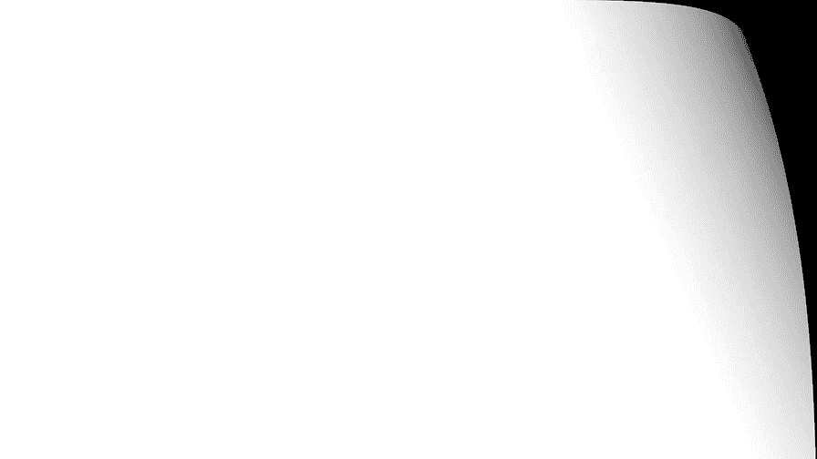

# 贾树森-手机摄影高手（完结）：3.【高手】24种生活场景模拟拍摄训练：第11讲 怎么拍摄剪影？

🎼大家好，我是大叔。现在开始今天的分享。😊。

一般来说，最适合拍摄剪影的必须是逆光的光线。如果在室外呢，最适合的光线是一早一晚的逆光。当然我们是指的有太阳的好天气了哈，阴天就不算这个时候的清晨或者是黄昏，那么它的光线的角度呢是比较低的，也比较柔和。

各种反射光和杂光它比较少。在这样的时候去拍摄剪影呢是最容易出效果的。一旦太阳升高了之后呢，由于光线的变化，各种杂光，各种反射光都出来了，甚至呢有阳光直接照射到这个被摄主体的侧面啊。

那么拍摄的效果呢将大打折扣，尤其是在一些地方有很多反射光哈，比如说像这个。墙啊，像这个地面呀，那么对这个M先上身上都产生了非常强烈的反光。那么这个时候拍摄剪影就很勉强啊，那我也是通过了一些手段啊。

比如说呃跳成曝光啊，等一下会讲到，那么还有后期的一些手段。其实呢。反射光对拍摄剪影是特别致命的啊，即便是在清早或者是傍晚的时候，我们也要注意啊，在选择拍摄地点的时候。

要看一看被摄主体的前面是不是有一些墙啊，有一些会反光的东西。比如你像这个吧哈，我就是用一个特别简单一个白纸壳，然后呢靠近被摄主体。大家很容易能看到这种反光对主体还是影响很大的。

甚至呢有可能导致我们拍摄剪影的失败。拍摄剪影呢不仅仅在室外可以，在室内也是可以的。只要满足逆光的条件，同时呢主体和背景它的亮度差足够大。那么我们在室内，比如像像这张是在汽车里拍的，那么在室内呢。

如果有灯光比较明亮的灯光的情况下，也是可以拍的。那么这张照片呢就是在一个小黑屋里拍的啊，我简单布置了一下灯光，我给大家揭秘一下，就是这样子的呃，两部手机来照明。一部手机呢是打了一个逆光。

另外一个手机呢负责把这个背景给照亮，不然的话呢它的亮度差不够。所以拍摄剪影要满足的光线条件呢就是主体要出于逆光的条件下，同时主体与背景，它的亮度差要足够大才可以。通常的情况下呢。

如果说我们拍摄的这个条件正好满足拍摄剪影的条件，那么这个时候的曝光呢其实是不用调。但是在多数情况下，这种条件可能都略有偏差。所以我建议大家最好在有条件有时间的情况下呢，要进行对焦和曝光锁定。

因为拍摄剪影是在逆光的条件下拍摄，所以呢有可能会造成对焦失误。所以我们要把焦点锁定。那么再根据实际的这个情况来调整曝光。绝大多数的时候呢都是向下，也就是说压暗一点曝光是比较合适的。那曝光是否合适。

它的判断标准是什么呢？这个时候我们的曝光要以背景的亮度为基准。比如说像这张照片吧，也就是我们以海面和天空这个曝光来作为标准的，让它的曝光是合适的。那么这个时候由于主体和背景它的亮度差是比较大。

所以呢背景如果曝光合适了，那么主体呢就因为曝光不足而产生了剪影。

由于剪影照片，他。隐藏了主体的细节啊，因为它曝光不足了，它成为一个剪影了，对吧？那么只剩下主体的一个轮廓，一个形状。所以拍摄剪影的时候，我们要求选择明亮并且简洁的背景。

没有其他的一些物体在光源和主体中间，否则的话呢，我们拍出来的照片就会因为这些物体的遮挡而影响了主体形状的一个表现。从而呢主体不突出，主体呢就会被掩藏在这些杂论的背景里面去。

当然我们会经常遇到那种我非要在这拍不可的这种情况哈那怎么办呢？呃，这个时候我们可以采取低机位去仰拍，那么你就应该蹲下或者是躺下来降低机位。那么这个时候呢形成了仰拍地面上的一些会影响到主体的这些景物呢。

会因为你降低了机位，而消失不见，或者是呢不足以影响到主体。有时候可能因为阳光的强弱，或者是呢取景的角度的关系，那么这个阳光容易在镜头上形成一个比较讨厌的炫光。这时候我们可以调整一下取景的角度。

让主体呢正好把太阳给挡住，以改善这个状况。同时呢有的时候我们可以让这个太阳从身体的某一个部位啊露出了一点点来，形成一个小小的这么一个光斑。那么增加画面的气氛和幽默感。因为剪影照片当中这个主体啊。

它因为曝光的关系，那么它的细节就很少很少了。这个时候起作用呢就是它的轮廓或者是呢它的形状。所以我在很多时候给树妈拍剪影照片的时候，我都会要求她跳起来。

这样呢比单纯的让他就是干站在那儿拍出来的照片呢要精彩很多。在沙滩上这样去拍的时候呢，我基本上是躺仰躺在沙滩上的，然后呢进行对焦，锁定焦点，然后呢把曝光调整好。像这样的情况下，取景构图要注意哈。呃。

因为跳跃的它会有一定的活动范围。所以呢我们在确定构图的时候，要把这个活动范围给设想好啊。取景构图的时候，充分考虑到这些。可变的因素。通常我是在声妈在起跳之前，我就开始按快门，一直连拍。

那么像这样去拍那么个几次就没有问题了，就能拍到非常精彩的照片了。当然了，像一些瑜伽呀、锻炼身体呀，或者是什么舞蹈呀。以形体为主的这些动作呢，是特别适合用剪影来表现的。在有些情况下呢。

我们不得不逆光去拍摄一些东西。或者是人物或者是物体主体和背景的这个明亮反差呢，又达不到拍摄剪影的这种条件。这个时候我们就可以拍摄一些半截影的照片。跟剪影一样，半剪影的照片呢也要求。背景相对来说比较简洁。

同时呢也要求。主体的轮廓比较明显。但是半截影有一个不同于剪影的地方，就是因为剪影呢主体是没有什么细节的，黑乎乎一片。

半截影呢就可以让主体有一些细节。比如说呢服装的细节呀，表情的一些大概的细节呀。拍摄半间硬的照片在曝光的时候要特别小心。这个时候曝光的调整要兼顾主体和背景。背景上有层次，主体上呢也略有层次。

同时在拍摄的时候也可以把HDR功能打开。以便于更好的兼顾主体和背景的曝光。

🎼今天的分享就到这儿，我是大叔，我们下次再见。😊。

