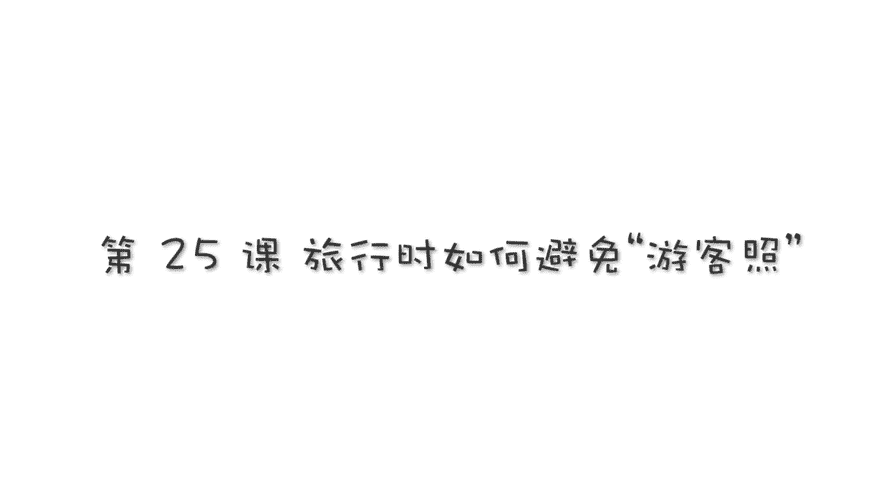

# 贾树森-手机摄影高手（完结）：3.【高手】24种生活场景模拟拍摄训练：第12课 旅行时如何避免“游客照”？

🎼大家好，我是大叔。现在开始今天的分享。

的确是哈在很多时候我们千辛万苦到达了这个旅游景点，我们的目的地之后呢，我们发现人太多了，根本没有办法拍照。所以就像树妈现在这个情况，他摆了半天在这儿。怎么拍后面一堆人，是不是？

我想这是大家面临的共同的一个问题啊。😊，实在是很令人头疼。不过呢咱还是有绝招的哈。那大叔老师跟大家说一说第一个绝招。那刚才这个照片呢，我是站着拍的。好，现在呢我们不用挪地方，我们直接蹲下来。哎，不对。

其实这张照片呢我已经躺下来了啊。大家看这影子看影子我蹲下躺下，其实是坐在地上了，已经啊往后仰躺着。😡，那么。这一周。就能把后边的人呢拍的小小的。首先他矮了，对吧？我们尽量呢靠近拍摄的主体，就是数妈。

我们尽量靠近数妈，尽尽量离数妈近一点。那么这个时候呃由于镜头的这个透视啊，我们拍照片这个透视关系的变化。那么我们拍出来呢，就是近大远小，离镜头越近的越大，对吧？那么这个时候瘦妈就变得很高大。

后面的人呢就变得很小。这样的话呢就有效的突出了主体啊，让后边的游人呢啊变得不那么。明显也可以说是不足为患啊。那第二个绝招呢就是我们可以把镜头转个方向，大家注意。啊，我不往那边拍，我往大海这方向拍。

大家看到是不是后面就没有什么人了，是不是啊个别，比如说有经过的人，那么我们可以稍微等一下啊，他总归他是不会一直停在这儿的，等他们啊都走过去了，那么咱们再开拍，对吧？😊，绝对是只有大海和主体，还有沙滩。

我们想怎么拍就怎么拍，想怎么浪就怎么浪啊，不是海浪的浪啊，是浪花的浪，开个玩笑。那么这个时候我们可以随心所欲的去进行拍照啊。😊，没有别人的打扰。第三个绝招呢就是我们沿着沙滩往岸边上走一走。哎。

那这个这个沙滩呢正好它有一个比较低洼的地方，是远离海边的。我正好站在低洼这个地方。然后呢拍小树和树码这么做啊，有这么几个好处。第一个呢就是我处于一个低洼的地方，本身就比较低了。如果我再蹲下来就更低了。

这个视角啊，我们就会有一点仰拍，那后面背景的人呢啊就不足为虑了。另外一个就是当我们远离海边的时候，本身这块的游人就不多了。那么我们寻找这样的角落呢去拍照啊，就能做到这个后面没有多少游人来干扰我们了。

如果这三招还不奏效的话，别着急。老师还有第四个绝招，那就是虚化背景。我们可以利用手机的虚化功能，将背景的杂乱人等虚化，这样呢就是突出了主体，把游人都虚掉了。如果手机没有这个功能呢，也不必着急。

我们在后期课里面会教大家怎样利用软件把背景虚化掉，简单介绍这么四个绝招吧。如果大家有更好的绝招呢，欢迎大家给老师进行交流。我经常在朋友圈里会看到大家去了很好看的地方，结果呢拍出来照片呢却特别的一般。

很单调，很死板啊，是普普通通那种游客照片哈。啊，为了避免大家拍出这种死板单调的游客照呢，我给到大家的第一个小建议呢就是。其实这个在。前面人像那课里面跟大家讲过，就是建议大家首先呢动起来啊，那甩甩头发呀。

风吹乱头发呀，或者是跳起来。这样一来呢，我们拍摄的照片就不会死板和单调。再一个呢我们完全可以从大海这边朝向沙滩这边来拍摄。当我们拍摄了足够多的大海之后呢，我们完全可以调一个方向，对吧？呃。

从这边来拍沙滩呀、酒店呀、蓝天呢，同时呢我们配合上一些动作啊，动态的，那么我们会抓拍出很多精彩的照片啊，这样呢就有别于千篇一律的啊大海蓝天的照片啊，那会显得丰富了一些。第3个，避免照片单调的办法呢。

是可以拍一拍背影。比如说叔妈和小树这样啊，听妈妈讲一讲那大海的故事。第四个方法呢就是我们可以拍摄啊诸如我们的影子呀，我们身体的某一个局部呀，或者某我们的某一些物品呢来代替啊拍摄我们人的脸啊。

比如说我们拍一家三口的小脚丫啊，然后呢就这就是我们一家三口的合影了，对吧？不拍脸，只拍脚丫，拍这个海浪，流过我们脚丫的这种状态，啊，这种感觉是不是也特别有意思呀。第五个方法呢是我们可以在沙滩上画画啊。

比如说我们画个有爱的心形，或者是呢带着孩子一块来画这个心形，画一些其他的图画。在这个过程当中呢，会产生很多特别有趣、特别有爱而又出乎你意料的一些动作和瞬间。当然我们在沙滩上还可以开展其他的活动。

比如说玩泡泡就是一个非常好的活动啊。大人和孩子呢都可以同时参与进来，那么大家都能获得极大的这个满足感和愉悦感。同时呢我们的照片也就更加的丰富多彩，充满了欢乐。去海边旅游呢。

大家大部分时间都是哼耗在海边的，因为都喜欢大海嘛。但是我建议大家呢就是要适时的啊离开海边。然后呢，比如说呢可以寻找一下酒店里面的游泳池边上啊，这边呢一个是游人比较少。

另外一个呢我们也可以在这拍一点比较特别有文艺范儿的照片。所以大家在出门旅行啊，出去拍照片的时候，千万不要死守着一个地方不放啊，脑筋一定要灵活啊，打一枪换个地方啊，拍一张换个视角啊。

这样比较容易拍出丰富多彩而又与众不同的旅行照片。出门旅行都拍些什么呢？呃，简单总结吧。就是吃穿住行。所见所闻。一般来说，我们出门旅行。啊，都会选择那些我们喜欢的地方，或者说没有去过的地方啊。

那这些地方肯定有一些特别漂亮的景色也好啊，比较独特的动物也好，或者呢一些啊风土人情啊什么的，房屋建筑什么的，是我们没有见过，或者很少见到的。那么这些呢都会吸引我们把它给拍下来，把它给记录下来。

刚才这些说的是旅行当中的所见所闻。那么当我们自己出去旅行的时候呢，我们需要拍一些我们自己的吃穿住行。我拿我们。去越南的一次旅行呢，为例子啊，跟大家说一说。都拍些什么东西。😡。

首先这个拍摄呢不是在我们到达了目的地才开始的啊，它其实是在我们决定要出去旅行。在我们收拾行李的时候，就已经开始了。我们可以记录下来。比如说像小树坐在我们的旅行包上的这么一个镜头。然后坐出租车的。

以及呢坐大巴车的然后呢在机场候机啊，然后呢嗯比如说机场候机，还尿了裤子，画了一件呃他姥姥的这个T恤衫啊，在那自己还是在那玩的特别嗨啊，在坐飞机的时候呢，我们可以记录下悬窗外面的一个风景。

也可以记录孩子在坐飞机，在悬窗边上啊，又会发生很多事儿啊，比如说他有很多东西他比较新奇啊，他会问这儿问那儿啊，很多有意思的瞬间。呃，即便是孩子睡着了呢，我们也可以选择把它拍下来啊。

在将来孩子长大的某一天。我们可以把这事儿拿出来当笑话说一说，是不是？当然了，在著名的这些景点呢，我们也可以不能免俗的啊拍一张到此以游的照片。那到了酒店之后呢。

我们也可以在酒店的走廊里呀、楼梯上啊、房间里呀，大拍特拍。同时在我们体验当地美食的时候呢，也不要忘记拍一些美美的照片啊。比如呢越南岘港的这个咖啡是特别好喝的，非常便宜又比较美味。

所以呢我们也可以把它给记录下来。那除了拍咖啡本身的话呢，我们也可以选择把当地的风情啊，当地的一些街道呀，一些呃行人呀，一些。标牌啊给拍进来啊。这样会比较有异域风情啊。

这个呢我们在怎么拍美食那边也讲过了呃，越南岘港呢也是靠海边的地方，所以呢我们会拍一些有关海边的风景呀，以及呢树妈和小叔在海边上玩的，或者是我自己在海边上玩的啊，当然了呢他因为它是法蜀的一个知民地曾经是。

然后当然它也有一些啊有那些外国风情的这些。建筑啊，比如说教堂等等，那这些呢我们都可以把它给记录下来。

🎼今天的分享就到这儿，我是大叔，我们下次再见。😊。

🎼大家好，我是大叔。现在开始今天的分享。😊。