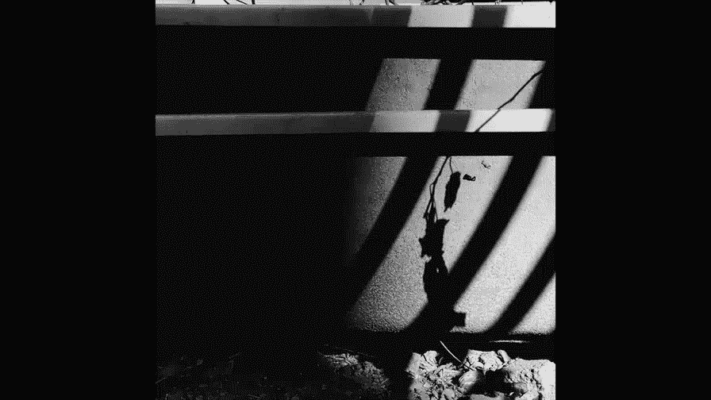
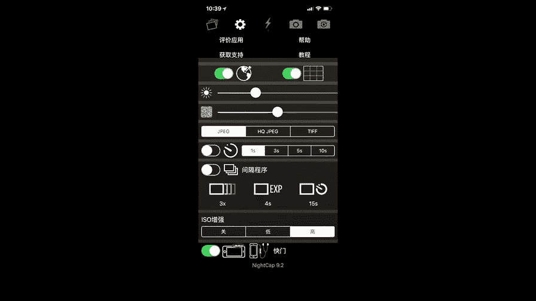
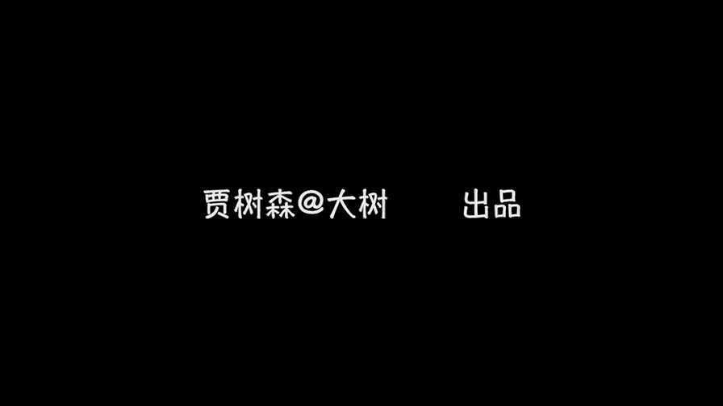

# 贾树森-手机摄影高手（完结）：3.【高手】24种生活场景模拟拍摄训练：第13讲 全景和夜景怎么拍？

🎼大家好，我是大叔。现在开始今天的分享。😊。

咱们的手机里面呢有一个模式，专门呢就是拍全景的iphone的叫做全景啊，安卓手机有的叫全景拍摄等等，就类似的哈。那么这是iphone的拍照界面。在这个拍照界面里面呢，我们可以切换到啊全景模式啊，我又。

滑动啊，就能找到这个叫做全景。切换到全景这块啊，然后你能发现画面呢啊这个取景的感觉变了啊，出现了一个箭头，还有一条线。它这上面有提示啊，就是我们移动的时候，这个箭头要沿这个线走啊，不能歪，不能高。

也不能低。那么。iphone手机在拍摄全景的时候也是可以锁定曝光和焦点的。在这个时候你在画面里面找比较亮的位置啊，像现在这个带尖这个楼这啊，用手指在这长按就能锁定曝光和焦点。这个选点呢有是有讲究的。

你要选择画面里面不是最亮，但是比较亮的位置，这样会让你的照片整体感觉曝光是合适的，不会太亮，也不会太暗。那么弄好之后呢，就可以移动了。按照箭头的方向，在移动之前，必须把这个大楼的竖直线条啊。

跟我们手机的这个边框，竖直边框对平行了，包括里面还有那个取景的这个景子线都要对平行。然后呢在水平的移动啊，这个箭头始终在线上，这个时候你拍出这个大楼呢，它才不歪啊，不然的话呢，这个地平线呢就可能斜了啊。

就不好看了。那么iphone手机的这个移动方向是可以切换的啊。比如说现在是向右移动的。我们点一下这个箭头就可以向左移动了。安卓手机呢跟苹果的切换不太一样啊，运动方向，像这款安卓手机啊。

华为荣耀的一款选前景模式之后呢，它的切换按钮呢是在画面的就是在屏幕的左上角啊切换横拍还是竖拍，并且这款手机可以通过点击屏幕，然后来获得一个对对焦点和调成曝光的这个原。Car啊。但是安卓手机呢品牌特别多。

呃，各种各样的情况都有。有的时候它是左右都可以移动的啊，不用切换啊，这点是不一样的。个别安卓手机可能无法锁定了曝光和焦点。这个呢要根据自己的手机呢，你自己去研究一下啊，安卓和苹果稍稍有点不一样。

那这个呢还是苹果的界面啊，这张呢就是我运动的时候就歪了啊。那么大家能看到这个箭头有点偏离中中心线了啊，拍出来之后啊，这张照片就是水平线就倾斜了哈。呃，虽然我这个后来呢也做了一些调整啊，还是挺花功夫的。

所以大家尽量在拍摄的时候，还是把水平线找平会比较好一点。对于一些比较狭长的，然后比较广阔的这种风景的啊画面呢呃是适合使用全景功能来拍摄的嗯。它呢其实是可以把手机的镜头拓展成一个广角来使用。

那么使用全景拍摄的时候，是不是一定要转完它的所有角度呢？其实不用啊，我在很多时候呢啊其实只转到一半，或者是某一部分，我觉得OK够用了就可以了。啊。

那么这个时候它的全景功能是其实是作为我们手机的一个辅助镜头来使用的，就相当于一个超广角啊来使用的。比如说像这个镜头哈，我拍到我觉得OK了的时候呢，我摁一下下面那个快门按钮啊，它就停了。😊，这个就OK了。

因为像这个镜头，我用手机单独的这个镜头是拍不下来的。所以呢我就用了一个全景，稍微把它拍广一点啊，这样取得更多了。像这张黑白的呢也是啊。类似于这种拍法，拍到一半的时候可以停止的哈。全景除了横着拍之外呢。

也可以竖着拍啊。像这张照片就是竖着拍的。大家看一下我数字拍的时候哈，然后鼠焦点调曝光，看看我为什么在这个楼这儿。😊，缩焦点啊调曝光，大家最后再看一遍啊，其实我是从另外一个方向运动的啊，挪过来了。然后呢。

手机现在横着拿，然后呢往上走走走走走走走走走走走，一直仰着头仰过来，大家看到了吗？最后的落点在那个楼上，而且那个龙的亮度在这个画面里面是处于次要地位的第二名的啊，差不多，所以呢我就用它来锁焦点了。

然后又走了一遍啊，大家再看一下哈。这个运动呢要留意方向啊，对于一些适合用竖视全景去拍的啊，我们可以采用竖视全景去拍啊，拍出来的画面呢会给人带来一些视角上的变化和视觉上的冲击。

全景功能还可以干一个特别有意思的事儿哈，大家看一下啊，我先把这个IM先生呢先放在一个位置，然后呢，在全景模式下呢，先去转动手机。让他呢呃离开M先生，直到M先生就是说不在画面里面了。然后呢。

我再把M先生呢给拿走。哪个方向啊一定要注意是手机转动的相反的方向啊，也就是说让镜头看不见你。然后呢，你再放到一个镜头没有取到的地方。回来呢再转镜头啊。然后再转到没有M线上的地方。

再把M线上从相同的方向拿走。然后呢，再放到一个地方去。然后大家看看我的取景器啊，现在呢已经取好景了，然后也锁定了曝光和焦点。这个时候移动了啊，看看。移动哎，看不到M先生了。然后大家要记住啊。

我从哪个方向把这个M先生拿走了啊，然后再从另外一个方向，也就是说镜头现在看不到，对不对？我都在镜头后面做这个事情，然后把M先生放好了。😊，这个时候我再转镜头啊，沿着这个箭头的方向，然后继续去转。

转到什么样呢？直到M先生消失，我再把M先生从镜头的后面放到下一个镜头将要转到的地方。继续去转动镜头。其实我这次转的时候呢，这个箭头和中心线呢有一点偏离啊呃水平没有找好。因为我这个是放在三脚架上的。

其实我们正常呢拍这个呢，我们可以一个人拿着相机，然后另外一个人呢去当模特，然后让这个人动啊呃。这个时候就没关系了，这个中心线呢我们可以保持，只不过呢拿相机这个人呢一定要稳住手机啊。

稳住等着这个人呢从另外一个方向身后绕过去。跑到下一个地方，镜头照不到的地方，然后呢再慢慢转过来。这样的话在同一个画面里面呢，就可以有好几个M先生科或者是好几个你了，对不对？现在已经开始了啊。

下面是我的亲自示范啊啊，我拍我自己，现在我用我自己的手呢来进行锁定焦点和曝光。大家看到我把手伸上去，然后找到一个相光的面啊，让它尽量比较亮的位置去锁定焦点和曝光。好之锁好之后呢。

我们进入画面去拍摄第一个镜头。这个玩法其实是应该是一个人给另外一个人拍啊，现在只有我自己，所以呢我就必须自己来操作了。我进入画面之后呢，我用耳机线来启动快门。

然后我自己用手去推动啊这个三脚架的这个摇把啊，让它转转了之后，大家留意到我刚才是从哪个地方转过来的嘛？啊，是镜头运动的相反方向。然后呢再转一下，再从相反的方向过来进入下一个位置，然后接着再转啊。

直到完成了最后拍摄。好的，大家看看这个现在画面不动的时候呢，就是我从我再从箭头相反的方向啊，往镜头前面绕，绕过来，准备好之后呢，去推动这个相机让它转转到下一个位置。然后呢，我现在又从镜头后面。

转的啊绕过来。绕过来，这个其实已经有点进来了，我自己给自己拍，毕竟还是受限制哈啊然后呢这样呢完成一张多胞胎的照片哈，还是挺有意思。

用这种办法呢可以给小伙伴在海边啊啊或者是草原上啊等等一些地方呢拍很多千奇百怪的东西啊，人物呢可以有各种状态，或喜或悲或搞笑或幽默，被拍的人呢也可以离镜头啊近一点或者远一点。

这样呢人物的大小呢就会也会发生变化，或者是人物有一种幽默的状态啊，这样呢啊会带给大家一种比较新奇的感官刺激。😊，拍摄夜景呢有一样东西是必不可少的，就是三脚架哈。当然现在有所嘿的呃6秒8秒啊。

可以稳定吃鸡拍摄的，但是呢有一个三脚架呢毕竟还是比较靠谱的啊，所以三脚架呢呃是一个比较必备的东西。另外一个呢就是按照自己手机的情况吧呃，备一个充电宝，因为拍夜景呢都需要长时间曝光。

那么充电宝有的时候还是。有必要备一个的啊，不然到时候没电了，尴尬，是不是？其次呢就是拍夜景呢，我们需要选一个比较好的位置来拍啊。像现在我选的这个景色呢，就是有特别漂亮的高楼大厦，然后呢也有很漂亮的水啊。

有水呢是非常重要的，因为有水会产生很多倒影，大家看到了吗？啊，在水里面有倒影啊，整个这个画面呢啊它会特别的有有意思，对吧？上面有实景，下边有虚景啊啊互相映衬啊，就会显得啊这个漂亮加倍，记得吗？

拍摄夜景呢安卓手机基本上把超级夜景打开呢，嗯八成就可以搞定了。而苹果手机呢因为没有类似于安卓手机超级夜景这种长曝光的功能，所以呢就要借助软件的帮忙。其中一款软件呢，它叫做netcap啊camera。

然后它长这个模样啊。点击打开之后，它的界面啊就是这样的啊，为了便于大家看的比较大一些啊，我就把它横过来看哈。进来之后，画面右下角五角星呢是相机的选项，打开之后，这里边有长曝光或者是亮光轨迹模式。

现在呢用的是亮光轨迹模式，我们来看一下哈。😊，然后这里面呢，它有些项目是可以调的，用手指在四个边框，任何一个边框点一下啊，就能出现一些字母。上边框ESP是快门速度，下面SO呢是感光度。

左边这个WB是色温，右边这个FOC呢是指焦点。这个ESP呢调快门速度，我们一般呢调整到让画面亮度看起来合适为止啊。画面右边这个调焦点的，我们可以手动去调整焦点。但一般的我们在画面上点一下啊。

焦点的位置有个小方块就可以了。这个ISO感光度哈，我们可以去调，可以让它尽量低啊，或者呢就是让它保持自动。当然了，这个ISO要跟快门速度配合来使用啊。呃上面这个色温大家看一下，我在上下去动它的时候呢。

画面的这个温暖程度啊会发生变化，它的颜色有的翻黄，有的翻蓝啊。这个根据需要去调整，大部分情况下用自动就没什么问题了。然后都调好之后呢，我们按这个白色的快门按钮，它变红了。这个时候呢就已经开始拍摄了。

大家请留意画面当中移动的汽车啊，看看它变成了什么样子啊。这种亮光轨迹模式呢会把画面当中所有移动的这种有亮光的东西呢都形成轨迹。包括天上的云啊，只不过天上的云呢它运动速度比较慢，你需要很久。

然后呢它才能形成轨迹。大家看一下这几张图片呢，就是用这个方式来拍的。那么这个在白天也是可以用的啊，不单单是拍夜景能用呃，这个呢就是你在上面。就是手机一定要放在三角架上，放在三角架上时间越长。

它的轨迹呢就会拉的越长啊。它的公作原理呢是利用了一些叫做对战的一种东西啊，那么咱们不详细讲啊，还要介绍另外一款也能拍夜景的软件呢，它叫做slow shutter啊。进来之后的界面是这样的。

它在屏幕上也是就这样横着显示啊，所以我也给大家横着显示了。那么点击这个齿轮，进入拍照模式选择，这里边也有什么灯光轨迹啊、低光模式啊等等哈。这里面的ISO通常选自动。中呢根据情况，降噪呢选中。

这里面呢也有一个模式，是动态模式。还有灯光轨迹，然后还有低光模式，低光模式不用说了，跟那个nett cap里边那个长曝光是一样的，就是用来排长时间曝光的。比如说可以拍夜景啊，可以拍瀑布。

变得特别虚啊这种。那么另外一个动态模糊，这个动态模糊啊就是动的东西它会变虚啊，这个虚的感觉呢也说不大好，大家可以去试一试哈。另外那个灯光轨迹模式跟nc里边那个叫亮光轨迹模式，他们俩基本上相似。

这个slow shutter跟n cap不一样的地方是它的曝光和焦点呢是这样调的啊，在屏幕上点一下焦点和曝光圈呢可以分离。蓝色方块是焦点，黄色圆圈呢是曝光叠好之后，摁快门它会过一段时间，哎。

才开始真正去拍摄啊。拍摄完了之后呢，点保存，然后再点一下清除才能进行下一张的拍摄啊，这是它的一个小的不一样的地方。我们用灯光轨迹，然后来拍一张，大家看一下还是什么效果。焦点曝光，然后弄好之后呢。

按快门启动。然后开始拍摄，大家留意水里面的啊这个有亮的地方，而且在动的东西呢，包括路面上的汽车啊都发生了变化，对吧？这个跟那个ncap那个亮光轨迹差不多啊。然后再大家看看。低光模式就是长曝光啊。

这长曝光的时间呢大家可以选试一试不同的时间，对于画面的影响啊。选好之后，我们可以调一下曝光和焦点啊，进行一下锁定嗯。按快门拍摄。这时候他就真正开始拍摄了啊，那个圈得转一下。他让你相机稳定一下。

然后开始真正去拍摄。大家留意到呃这个水面里面的那个楼的感觉哈，包括路面上汽车，它动的虚的那个感觉，跟刚才那个灯光轨迹模式是不一样的啊，这个大家要留意。斯路莎的他长这个样子啊，然后戒之后呢。

它的设置要在这儿改啊。就是右下角这个符号。嗯，点完之后呢，大家按照老师的这些设置去设置就可以了。net cap，然后长这个样子。进来之后呢，大家点这个齿轮啊，齿轮啊。

然后呢它的设置啊也按照老师这样去设置就可以了。

这两款软件呢都是收费软件啊，苹果手机的如果对夜景有强烈的需求，可能需要购买或者拍一些慢门什么的呃。安卓手机呢基本上可能就不用了。接下来我要说一下拍夜景的时机问题，这个非常重要啊。

大家通常以为拍夜景呢就是夜内去拍。但是夜里我们去拍夜景的时候，通常拍出来都是黑漆漆一片，对吧？所以呢这个时机是不对的。嗯，想要拍好夜景啊拍的好看。那么通常呢是从日落之后的一段时间内开始。

具体多长时间这个不太好说。所以呢如果你想拍夜景呢，就早点去，先把。景点选好了，你的拍摄地点选好了，把这个景啊什么都取好，然后呢把相机啊、测像架呀都调试好，在那等着。大家看看这个现在的时候呢。

灯光是一点点亮起来的对吧？呃，天色一点点暗下去。到什么样最好呢？就是最好的时候呢，就是灯光和天空这个颜色呢它会达到一个平衡。啊，有些人呢会呃称为一个什么蓝色石刻呀什么之类的那大家留意天空的密度，叫密度。

其实就是天空的亮度，天空呢不能太亮，你看现在呢还是有点太亮，对吧？像在树啊什么这块是黑漆漆的。但是天空呢也不能太暗，太暗之后呢，天上就是。😡，模糊的一片黑的啊，暗黑色的。大家看一下我这张照片呢。

是用iphone的原生镜头啊去拍的一个全景。那么基本上是原生镜头拍夜景的。极限了啊，对于iphone手机来说的话，他能做到的也就这样了。再晚的话，肯定就只能靠这些软件啊来才能实现了。在日落之后呢。

渐渐接近于拍夜景的最佳时刻的时候，光线变化是非常快的。大家一定要抓紧时间去拍摄。嗯，最好的时刻大家一会儿看啊嗯，下一张照片。呃，这个还没有到，这个时候楼体还稍微是有一点黑的啊，大家看一下这个啊。

它的整体的感觉啊，楼和天空的感觉啊，是那种灯火辉煌，特别明亮的感觉。但是这样照片呢是用那个灯光轨迹模式拍的啊。这个呢是长曝光模式拍的。大家能看到这个水面里面的这个倒影的感觉啊，它是不太一样的啊。

呃这个大家可以呃在拍摄过程中呢，自己去多尝试。然后呢选择自己喜欢的以及适合这样照片的这种呃拍摄模式呢去拍摄啊。

🎼今天的分享就到这儿，我是大叔，我们下次再见。

