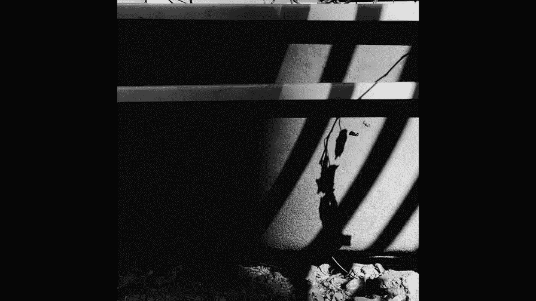
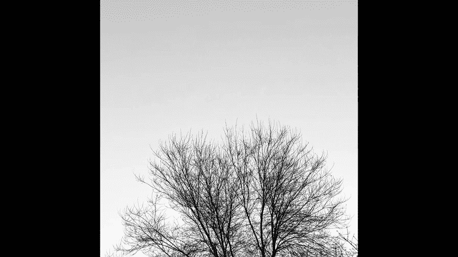
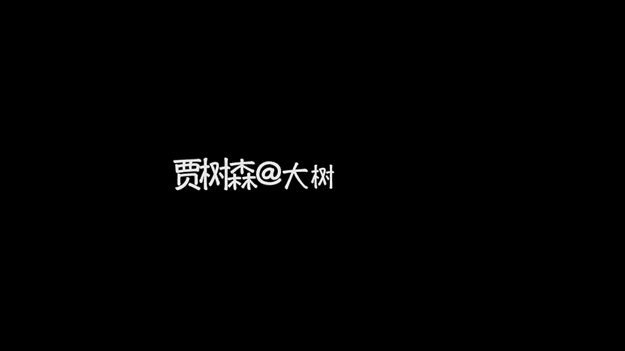

# 贾树森-手机摄影高手（完结）：3.【高手】24种生活场景模拟拍摄训练：第14讲 怎样拍出惊艳的风景照？

実？

🎼大家好，我是大叔。现在开始今天的分享。😊。

看到这个问题呢，估计很多人会犯嘀咕哈，那难难道这还用想吗？呃，但其实这个是非常重要的一个问题，它比摄影技术更重要。因为这决定了你拍摄时的那种心态。很多人一想到风景哈，立刻就会想到啊，拿着这个长枪短炮啊。

比如说到西部去，到国外去，到沙漠里，草原上啊，好像只有去了自然景观特别奇妙壮丽的地方才能拍出好的风景作品。

当然了，去那些地方肯定是更容易拍出好照片。但我觉得呢这个绝对是一种误读哈。如果你只有到别的地方风景名胜，你才能拍出好的照片，这只能说明你对生活的感受能力不够高，发现不了日常生活当中那些奇妙。

你要知道你的生活也是别人的风景。有一位特别著名的摄影家，他叫做欧文佩恩。他说，即便是拍摄一块蛋糕，也可以产生艺术。当你用心去观察体会，换一种全新的眼光去看待身边的事物的时候，你不但能拍出好的照片。

更能让自己的生活更加丰满。我记得我们前面的课呢曾经给大家说过，怎么样去培养自己的摄影眼力啊，培养自己对日常生活的这种感受能力，感知能力。就像这一块特别普通的油漆，还记得吗？我们前面的课给大家展示过。

就在马路边上。那么。它的形状它的颜色是这么的漂亮，可是呢路边啊经过的人有多少人会注意到这一点呢？其实想拍好风景啊，在拍风景之前呢一定要有谋啊，要有想法，建议大家谋定而后动。很多人出去玩，一到景点。

立刻就使劲拍呀，一顿乱拍呀，生怕错过了什么。其实这样看似拍了很多，但可能很多都是废片儿。同时呢你又处于一个忙乱之中。😡，没有心情去体味风景。那么这个其实拍拍风景来说的话，这是很大的一个误区。

拍照其实也是一个取舍的过程。如果你什么都想要，你可能什么都得不到。真正好的作品呢，首先是要打动你自己才能。再去打动别人。所以我们要做的呢，其实还是要。真正的去提高我们自己的摄影眼力啊，提高我们拍风景。

感受风景的这种啊基本功。那只有这样的，你才能发现自己周围的美哈，去记录美。然后呢，在你去一些啊风景名胜也好，还是名山大川也好，还是什么样也好。在这样的过程当中呢，你才能啊发现。

别人发现不到的那种美好的风景。然后呢，并且通过这个风景啊表达出来你对生活的热爱。当你的感知力提升了，你的摄影眼力提升了，你的摄影水平呢会大幅提升。更关键的是呢你会发现啊你活的特别幸福。

爱与激情呢是成就一切的根基，对摄影也是一样。那么一幅好的风景作品呢，不仅仅能表现出来它特别壮丽，特别秀美的这种美，还能表现出来你的情绪。你想表达的感情。😊，摄影是光线的艺术啊，拍风景也是一样。

如果你呢有了好的光线就已经成功了一大半哈。在讲光线的时候，我们曾经讲过啊，测光有助于体现景物的立体感。那么在日出之后和日落之前的一段时间呢，它的太阳的角度呢它比较低光线比较柔和。

那么这个时候太阳对地面景物的这种照射角度呢基本上啊是比较立体的。我如果我们选择一个测光去拍，是比较容易获得相对惊艳的照片呢，一早一晚的这个时段呢也被称为摄影的黄金时段啊，它是比较容易出片的啊。

除了测光之外，我们也应该多多的去关注逆光。虽然逆光在拍摄风景当中可能不是特别多的被用到。但是逆光呢会使画面产生一种独特的气氛。以及那一些特殊的光影效果。对于逆光的巧妙运用呢。

可以让我们在像中午这样光线不好的时候，也能拍出不错的风景照片。而运用逆光呢来拍摄一些剪影也是非常不错的选择。那么日出日落本身也是特别特别漂亮的。所以我们除了关注日出日落时刻的这个光线之外呢。

我们也可以啊关注日出和日落本身。日出和日落本身呢它就是一道亮丽的风景哈，具体怎么拍？日出和日落，我们的课里面呢。会在下一课里面会给大家说啊。当然了，像这样的光线呢是来自于好天气的。那么坏天气的时候。

我们也不要停止拍摄。其实有的时候坏的天气呢往往是特别完美的拍照的光线。我们在前面第二0课跟大家讲过，如何在这样恶劣的天气里面拍照片。那么在这样的天气里面，往往会拍出一些独特气氛的照片啊。

甚至呢是令人震撼的照片。对于反差比较大的景物呢，建议大家开启HDR功能来进行拍摄。因为手机呢它对于光线的呃记录呢是有限的。所以呢如果反差比较大，那么容易造成风景当中的某些细节呢表现不出来。

我们也可以运用相机的慢门来拍摄一些景物啊，呃这样拍出来照片呢呃能让大家看到不一样的风景啊，不一样的景致。很频凡的景物呢也可能变得。比较独特。那么具体怎么样使用慢门呢？

我们上一节课在夜景里面呢也跟大家分享了两款软件啊，slow starter和nett cap是针对于苹果手机的。那么安卓手机里面的流光快门也有类似的效果。除了自然风光之外呢。

我们也可以拍一些城市的夜景啊，呃怎么拍夜景？我们上一节课刚刚讲过，对吧？其中最重要的也是对于光线的把握啊，拍摄夜景呢也有黄金时刻，不能太早，也不能太晚。除了光线呢构图对于拍摄风光也是极端重要的。

构图上给大家的第一个建议呢要善用线条，在风景当中，其实有很多种线条啊，直线啊、曲线啊、外的斜的、S型放射型什么的，这些线条呢它们的辨识度很高，它们有很强的吸引眼球的能力。所以呢我们拍摄风景的时候呢。

要尽量的去利用这些线条啊，让我们的视线能够引导到啊风景当中的一个呃纵深处啊，让这个风景呢更加的有立体感。同时呢某些线条呢它也能对画面起到一个装饰作用。另外一个呢就是建议大家使用极简构图。

极简是手机摄影的不二法则哈那这种极简极简构图呢。那这种基建构图呢充分体现了少即是多的概念啊，用很少的画面元素呢来表达出悠远的意境和丰富的韵味。基建构图呢也就是说你用大面积的留白配上一个呢比较有趣的主体。

一般来说我们会寻找大片的纯色背景，比如说蓝天呀、大海啊、草原等等哈，然后呢再配上一个特别啊就是关注关注度。然后呢，再配上一个比较有趣的啊关注度比较高的一个主题。

当然了也不是说非得是天空、大海、草原之类的大场面哈。那么这种大面积的留白，其实在生活当中的一些小细节也能构成这样的机简画面啊。只要我们用心去观察啊就能发现。在拍风景的时候呢，加入倒影的元素呢。

会让画面看起来呢更具有张力。它有的时候会颠覆大家的一些常规的思维，从而让大家觉得非常的惊艳。倒影常常会让美丽的风景呢，它的这个美丽程度要加倍的对吧？因为有一个实景，有一个虚景。

那么它就有一个虚实相应的这么一个关系。同时有的时候它还能呃形成一种对称的美啊。拍风镜一个问题是绕不开的，就是地线的位置，到底是在画面的哪个位置合适呢？如果天空中的内容特别的丰富。

比如说云彩什么的特别漂亮，我们可以让天空呢占3分之2，地面呢占3分之1。如果说地面和天空都很精彩。我们也可以让它们一分为2。如果地面上的景物比较丰富的话，我们呢可以让地面占3分之2，甚至是更多。

我们还可以注意画面当中的色彩运用来提升照片的一个视觉张力。对于风景照片来说，色彩也是极为重要的一个元素。不管是对比色还是和谐色。如果我们运用到位的话呢，都会给眼球呢带来意想不到的冲击效果。

那么这样的照片呢也会让人眼前一亮。这张照片其实里面还隐藏了一个桃心儿。大家看到了吗？那这个桃心呢其实是依靠色彩和光线来完成的。当然我们很多时候呢会遇到一些色彩不够漂亮的风景。

那么这个时候我们完全可以啊尝试一下黑白照片。黑白照片呢它只有黑白灰啊，它排除了色彩的一些干扰，反导让照片当中的一些比如说影调呀、线条呀、图案啊或者是纹理，它更加的。被突出和表现了出来。

拍摄风景的构图呢还可以尝试特别经典的框架式构图。当我们把风景放到一个啊窗户里面啊，放到一个桥洞里面，或者是某某些框架里面的时候呢，它又别有一番风味啊。这些框架呢不仅使风景呢增加了美感。

也增添了更多的层次感和纵深感。在拍摄风景的时候要注意运用前景啊，再美丽，再漂亮的风景呢也是需要陪衬的。好的前景除了起到衬透的作用之外，还会增添。照片的一个纵深感。

它会使照片的中景、近景、远景的层次更加的分明。对于一些场面特别宏大，特别漂亮的风景呢，我们可以啊用手机的全景功能来拍摄一张全景。那这种全景呢可以表现出来风景的这种恢宏之美。

当然我们也可以给手机加一个广角的附加镜。除了灰弘之外，我们也可以关注一些景物的细节和局部。比如说像我拍的这个啊岩石。你从远处看呢，它可能只是一个颜色。但是当你仔细的靠近的去看的时候。

也会发现他们特别独特的美。当然，在拍摄一些特别细致的局部的时候，甚至是微观世界的时候，我们可以用一些像微距镜头啊附加在手机上来表现一些我们日常生活当中，有可能会忽略的一些细致之美。

对于我们司空见惯的一些风景呢，我们可以采取改变视角的办法。比如我们正常看到的这种花呢，可能是这样的。但是呢我通过趴在地上去仰拍，那么就会从一个低角度的这么一个视角拍出人们平时生活当中不会见到的视觉效果。

动物呢是风光照片里面特别重要的一部分，不管是野生的还是农场圈养的哈，把它们取进你的画面，让动物们成为你画面的主角或者是陪衬，那么绝对都会让你的照片更加的有味道。相比较与其他的东西呢，人更容易成为焦点。

也更容易制造故事。所以呢人物也是风景当中不可缺的一部分。如果你运气好的话呢，你会拍到一些陌生人。但是如果可以的话，我们也可以把自己的朋友和家人啊取到画面里面去。

甚至呢自己的影子也可以成为风景当中的一个组成部分。我们也可以在风顶当中放一个小道具。比如说我们用手拿的叶子，或者是呢或者是呢把我们喜欢的玩偶放到美丽的风景当中。摄影它本质上是我们。

思想的一个在外部的投射。所以呢你怎么想你便会怎么拍。😡，风景呢不单单是风景，更是我们的思想情感的一个承载体。最高级的风景是以景研制，以景寓情。跟其他的照片一样，风景照片也是需要进行后期修图的。

那么风景照片后期修图呢啊一般来说七分拍三分修，建议大家不要修的太过度。那么修图的这个最终的。标准呢是要体现我们拍风景的一个初衷啊，要体现出我们的情感。表达出来我们拍风景的这个情绪。具体的一些修图方法呢。

我们在后面的后期课程里面会给大家一一介绍。🎼今天的分享就到这儿，我是大叔，我们下次再见。

