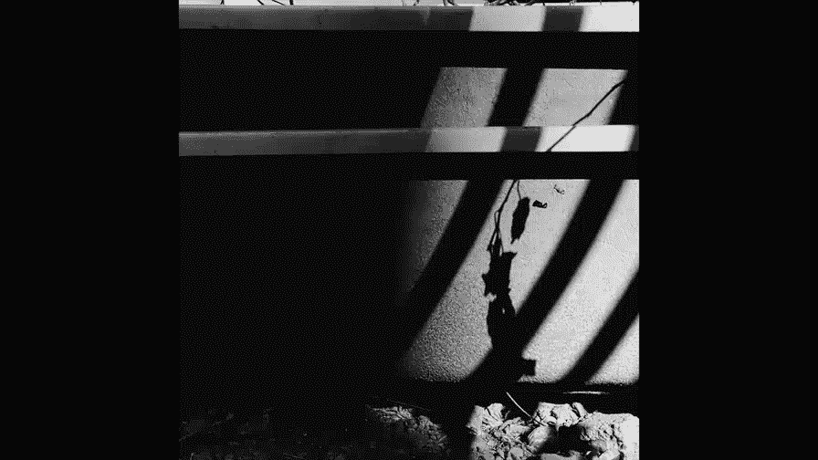
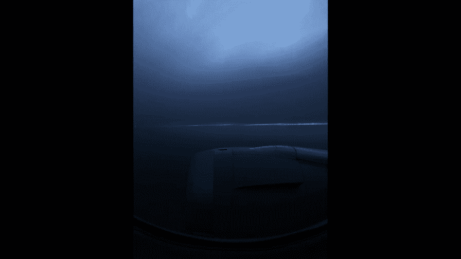
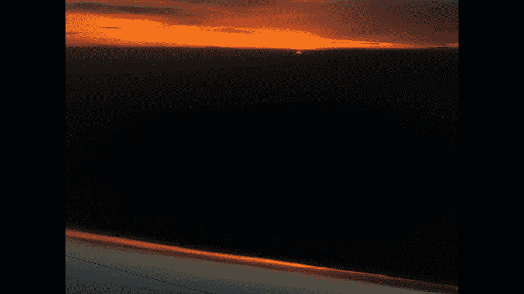
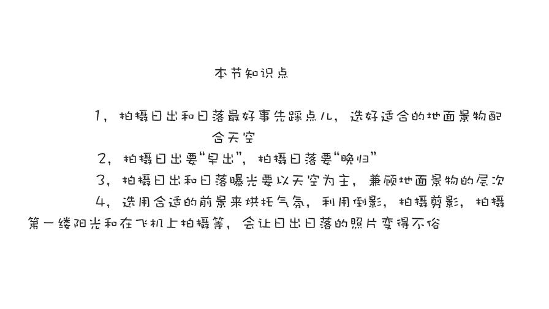

# 贾树森-手机摄影高手（完结）：3.【高手】24种生活场景模拟拍摄训练：第15讲 如何拍日出日落？

🎼大家好，我是大叔。现在开始今天的分享。😊。

拍摄日出日落呢首先最重要一条呢就是先选好拍摄地点。啊，对于我们经常居住的地方，我们会知道太阳呢大概从什么地方升起，从什么地方落下，地面上呢都有什么景物可以衬托太阳。要知道呢太阳还是那个太阳。

但是拍出来可就完全不一样了。其中很大的一点呢，就是因为你的选景啊，你选的拍摄地。除了太阳之外呢，用什么景物来衬托了太阳。那这一点其实很关键的。在家的附近，我们当然比较熟悉了。

比如说我们可以从啊楼顶拍出去啊，日出和或者是日落，也可以在公园里面呢寻找一些桥啊，寻找一些水面来衬托太阳。像这张呢是在坝上草原，然后碰见的啊，然后这个小船的也是在越南旅行的时候碰见的。那么像这个海滩呢。

是我们在澳洲旅行的时候，安顿好住鼠之后呢，我们直奔啊距离最近的一个特别漂亮的海滩呃。这个海滩还是比较有名的哈，而且呢就是我们住的那个宾馆呢，也是根据这个海滩来命名的。所以呢我们一住下。

马上就奔这个著名的海滩而去。运气不错。因为在这之前呢一直是阴霾的天气哈，一直有阴有雨。所以我们在那个海滩停留的那一瞬间呢，就是傍晚的时候突然天晴了哈，然后出现了特别漂亮的落日和晚霞。😊。

我们在去这个旅馆的路上，就一直在说这个海滩哈，所以其实是事先做了准备了的。然后还有这个日出呢，紫色的天空，真是又美又浪漫。在头一天晚上就是我们在那儿逛的时候，我就发现了这片牧场，特别漂亮。

远处呢还有海啊。我就想这个地方如果拍日出肯定很好看。这头一天晚上踩火点之后呢，我第二天早晨天还没亮，我就到了这个点去等待了哈。那在等待的过程中呢，我拍了很多照片，其中就有这张蓝色的天空。

其实这时候太阳还没有出来。但这也正好是我下个月说的问题，就是想要拍好日出和日落呢，我们要做到早出晚归。首先先说一说拍日出我们要早出来，我们来看一看我在同一地点拍的啊，太阳从啊刚刚要露头要出来。

然后一点点呢冲破云层啊，慢慢的呢啊升到天空中啊，这一一系列的过程。那么大家可以对比一下你们更喜欢哪一个呢？其实我更喜欢刚刚那个太阳还没有出来的时候，那一片。

紫色的天空特别的漂亮。所以呢我们一定要赶在太阳出来之前到达拍摄点啊，去拍摄这么一系列的过程。因为当太阳真正破晓而出的时候啊，这个过程首先它很短暂。那么你如果去晚了赶不上。

另外一个就是呢我们也要拍摄太阳出来之前的这么一段时间，那个光线的变化是特别丰富多彩的。跟拍日出不一样的是呢，拍摄日落要晚归啊啊，这个天空呢其实是朝东的天空啊，我们看一下在日落的过程中呢。

太阳对它造成的影响。呃，我们看一下这这一片云呢，它上面的。光线啊和色彩变化，其实很丰富，也很微妙。那么我们在拍日落的时候，千万不要太阳一落，然后呢我们就离开啊拍摄场地，拍摄这个点。

那么我通常都会在太阳落了之后呢，在这多待一会儿，甚至呢待到完全黑了之后，这张照片呢是太阳还没有完全落下去的时候，我朝西拍的啊，然后这个是它的对面，也就是说朝东的方向是个海滩。

大家看看太阳落了之后的一段时间内，它发生了特别丰富的变化哈，它的云彩呢从黄色一直变到橘红色啊，真的是变化万千哈，那个颜色。那这个呢是大理的洱海边上啊拍摄的太阳，这时候完全落了。最后一抹余灰。

然后这张照片呢是完全没有太阳的光芒了，而且呢现在灯已经起来了。大家要留意到这个时候这种特别静谧的蓝色是特别漂亮的。所以我们在拍日落的时候，千万不要在太阳落了之后，就马上离开拍摄场拍摄场地啊。

一定要在那多留一会儿多拍一些。那这个时候这种照片呢，你只有拍出来之后呢，你自己仔细去观察，你才能发现其中特别微妙的这个变化。拍摄日出和日落呢曝光呢有一定的难度。因为这个时候呢反差比较大哈。

就是太阳刚刚出来的时候，刚刚落下的时候，天空和地面景物的反差是比较大的啊，通常我们要照顾天空的密度啊就是说说密度可能有点难懂，就是天空要有层次哈，对一些特别漂亮的朝霞呀，晚霞呀，或者是呃日出日落的时候。

那个太阳哈呃最好是有一定的层次比要白花花一片啊，你像这里面的这个最亮的地方，这个天空啊，东方的雨堵白一肚白，然后呢也要有层次。其实这张上面有月亮的大家呢看到一个小点点哈。那么大家的曝光要按天空为准。

那么后面这些楼啊稍微黑一点，没关系。当然了，在一些时候，如果地面的景物非常的美，我们呢也要照顾地面景物的层次。那么这个时候我们可能就要用到HDR的功能哈，把地面的景物呢也拍出来一些层次。

那这样呢啊使这样照片整个的感觉呢就比较立体，比较丰富。你像这张照片，这样呢就有点过于照顾太阳的层次了哈。那其他的楼啊一点层次都没有了，黑乎乎一片了哈，就像这样的就不是很好看了。拍日出户的日落的时候呢。

我们如果只拍一个太阳，你像这样其实也蛮好看，再加上一点波浪，嗯，还可以，不过呢略显单调，对吧？如果这个时候我们把它加上一个人。或者是两个人，那么这张照片是不是就有点？立体了一点，丰富了一点。

不是那么单调。所以呢我们在拍日出和日落的时候，给他加一个合适的前景，有助于烘托照片的气氛。能作为前景的有很多哈，比如说风景当中的人呐啊或者是一把椅子，或者是一些。羊嗯草原上的花儿，然后水中的一艘小船儿。

甚至呢是正在吃早餐的奶牛等等哈，非常多。但是呢我们在选择前进的时候要注意不要让前景呢抢夺了。夕阳或者是日出或者是朝霞的风采哈，我们要主次有别。那么选这些前景呢是为了烘托气氛的。在拍日出或者日落的时候呢。

可以想办法拍出倒影哈。比如说像玻璃呀、水面呀等等，很多东西都可以拍出倒影。那么这个时候像天空中的云彩特别的美哈。如果能拍出倒影呢，我们不仅能使这个美景加倍，也能使照片呢产生一种虚实相生的美感。

除了把镜头直接对准日出和日落啊，对准天空，我们也可以把镜头对准日出热时那一缕阳光。你可以说是一缕神奇的阳光，因为这个时候呢，光线呢特别的低啊，它会在地面上输缝隙里面形成特别漂亮的。

我们在大白天绝难见到的那种光线，要想捕捉到这样的光线呢，必须有一双敏锐的善于发现的眼睛，日出和日落的时候是特别适合拍剪影的啊啊，这也会让我们拍摄的日出和日落的照片有一点不一样，怎么样拍剪影呢？

我们前面的课已经讲过了，那这里面就不详细给大家说了。如果我们有机会坐飞机，呃，正好有赶上日落的时间。那这个时候我就会选一个靠窗的位置哈，那么在飞机上可以拍日落，也是一个非常不错的体验。

那这是其中有一次我给时尚芭莎男士呢去上海啊拍摄一个人物的专访。去的时候，由于我们在机场耽搁了很久啊，那个上海那地方下雨有雷电，所以呢就航空管制我们就在机场待了好久。等我们飞上天空的时候。

我只来得及拍下最后这一抹啊，一个一条光带啊，最后一抹阳光透过云层。然后呢，它很快就完全变成蓝色调了。

那这里面大家其实也能看到这个蓝色调呢，其实它也是在变化的啊。这些是原片，我并没有调过，所以大家能看到这里面的颜色变化很微妙，很丰富啊。所以呢这也是我们所说的，就是拍日落要晚归啊，多停留一会儿。

后面还有很丰富的变化。然后我们从上海回来的时候呢，就在天空上碰到了相对来说不错的日落哈。嗯，大家能看到这个时候的云海啊被太阳照射啊，然后形成了特别漂亮的金色海洋。当然随着飞机呢，它一直往前飞啊。

我们遇到的这些云呢也不一样，它也在慢慢的发生变化啊呃有的时候甚至呢变化很快呃。所以呢我们在这个过程中呢要持续不断的去拍摄，不然的话很容易错过非常多的一些景象哈。那么这个时候其实太阳它往下走的也很快。

我跟大家说过啊，日落或者日出这个过程其实都很短，太阳很快就会落下去。所以这个时间呢我们要抓紧时间去拍摄。呃，由于是在飞机上呢要透过悬窗去拍，因为它有玻璃，有的时候呢会有一些玄光出现啊，这个时候要注意啊。

避让寻找一些角度，甚至有的时候我也能拍出来，就是窗户上特别脏的那些灰点儿啊什么的。呃，如果碰到这种情况，可以稍微停一下，实在避不过去也没有办法，对吧？但是大多数情况下呢呃还是可以拍到不错的照片。

那像这个时候你看哈有两个亮斑啊，那么如果你调整位置的话呢，是可以把这个亮斑避让掉啊，让它少很多，或者是呢后期把它修掉。大家通过这个能看到，其实上面玻璃上还是挺脏的哈。拍摄日出呢我们要拍摄。

太阳冲破云层啊，破晓而出的那一瞬间啊，那个云彩呢会有一个亮边镶在那儿。那么拍摄日落呢，我们要拍摄太阳，要落进云层里面的最后那一刻，那最后这一抹夕阳呢是特别有感染力的。

此时天空中的色彩呢也是如雪般的热烈和奔放。在飞机上拍日落呢，还有一个东西是绕不开的，就是记忆啊。那么这个东西呢其实不用刻意避开，完全可以把它当成。

前景中的一部分啊，并且利用它呢作为构图中一个重要的元素，让它呢为构图来服务。

🎼今天的分享就到这儿，我是大叔，我们下次再见。