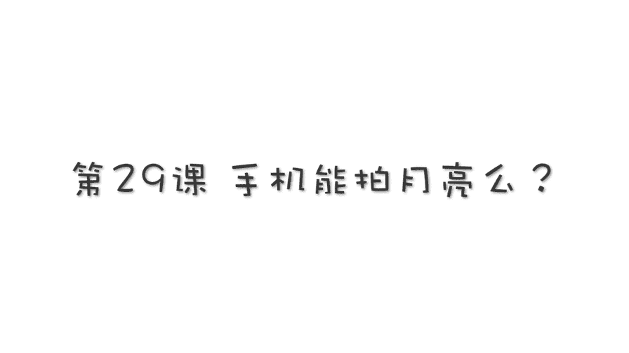
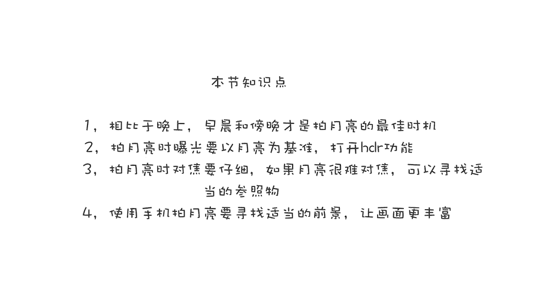
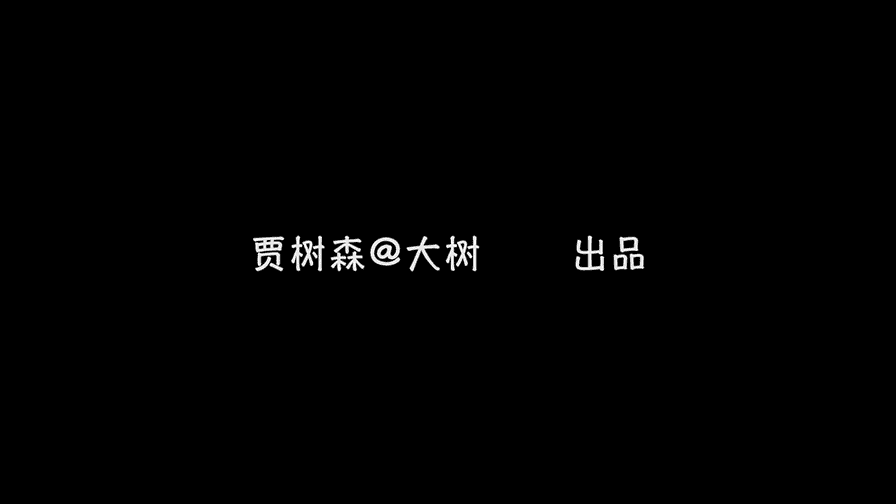

# 贾树森-手机摄影高手（完结）：3.【高手】24种生活场景模拟拍摄训练：第16讲 手机能拍月亮吗？

🎼大家好，我是大叔。现在开始今天的分享。😊。

在2018年的1月31日哈，我们观测到了。特别独特的，号称是152年没有出现过的一种叫做月全石超级月亮和蓝月亮啊，三种天象呢组合在一起的一个奇观哈，我那天呢也拍了几张。那这几张照片呢是用单反拍的哈嗯。

呃，但是我们要讲的是用手机拍月亮。呃，在那天晚上，手机基本上被单反。完全。虐掉哈毫无还手之力。那么手机到底能不能拍月亮呢？很多以前的同学也问过我，老师，我看这月亮特别漂亮，我都想把它拍下来。😡。

确实是哈啊当我们面对美好事物的时候，我们都有想把它记录下来，想把它拍下来的这个冲动哈。那么手机到底是不是可以拍月亮呢？手机在满足了一定的条件的时候，是完全可以拍月亮的。还能拍的不错。

那么它要满足的条件呢，第一个就是我们要把握正确的拍月亮的时机。比如说像超级蓝月亮出现的那个晚上那个时间段，如果我们拿手机去拍，就基本上是这样的啊。呃，我们是很难把月亮给拍的好的，要么就是一个亮点。

要么就是虚的。嗯，要么就是小小的。总之呢。很难。😔，那么拍月亮的正确时机其实并不是在晚上。拍月亮其实是在白天。比如说像现在这样啊，这是早晨其实是啊很多时候我们会留意到早晨太阳刚刚出来的时候。

我们在上班的路上哈会发现月亮还在天上，那么这个时候恰恰是拍月亮最好的时机，而不是在晚上。那么大家留意到这个楼哈，这时候已经被太阳照到了是吧？太阳刚刚出来。那么这个亮度其实已经很高了。啊。

大家可以看看我现在这个时间段我派出来月亮是什么样的，刚刚好正合时，对不对？😊，这个是晚上的时候，月亮出来，有的时候晚上他会。就是天还没有完全黑下去，月亮就出来了。那么这个时候这几张照片啊是。

随着时间一点点往后推移的，大家可以看一下啊，月亮跟景色的一些关系啊。当天色越来越暗的时候，其实我们派月亮就慢慢的不太醒了啊，到最终呢它就只能拍成一个亮点了。否则的话，周位就是漆黑一片。

所以呢其实我们拍一辆最佳的时机并不是在晚上，而是在傍晚或者是清晨的时候。这个傍晚呢当然不能太晚哈，比如说像现在啊，那么太晚了之后，它就成一个亮点了。但是清晨的时候呢也不能太晚啊，太晚了之后呢。

如果太阳啊特别高的出现在了天空上的时候，太阳的亮度啊特别亮了的时候呢，周围的景物它的亮度就提高了。同时呢天空的亮度也提高了。那么月亮呢它的亮度反倒相对来说变得低了。

那么这个时候月亮在啊这样的环境当中就相当的不明显了。啊，大家可以看一下这张照片就是在那太阳升的比较高的时候拍的。所以呢我们拍月亮啊要把握一个正确的拍摄时机。具体是什么时间能出来，傍晚呀，还是早晨能出来。

这个呢是要根据季节，还有根据这个上半月下半月这都不一样啊，然后甚至有的时候没有啊都有可能的，大家呢要仔细去观察啊。拍月亮的时候怎么样去调整曝光呢？嗯，我们拍月亮的时候。

曝光调整基本上要按照月亮的亮度来调整啊，就是你至少得让月亮有层次，对不对？啊？当然了，这个时候有可能啊周围的景物会压的比较暗，但是没关系，这个时候我们以月亮为标准。同时我们要把相机的HDR功能给打开啊。

因为这个时候可以最大限度的保证月亮上的层次。呃，因为月亮亮度比较高，对吧？大家看一下第一张照片，这个月亮的亮度就太亮了。如果放大看基本是没有层次的。那么像这一张，我打开了HDR功能。

那么这个时候月亮上是有层次的，这点一定要注意啊。有的时候可能周围的景物呢它比较亮啊，亮度高跟月亮呢可以达到平衡。那么有的时候呃周围的景物呢可能就变成剪影了哈呃或者是呢。比压的比较暗。其实像这个龙呢。

它亮度其实挺高的啊，因为这时候太阳已经出来了啊，但为了照顾月亮的层次，我们通常会把它压的比较暗。拍摄月亮呢有一个难点哈，就是对焦。呃，如果对不好的话呢，那么这个月亮就是虚的。呃。

可能有的同学他经常会在对焦的时候，就把月亮直接拉的特别大，然后去就对这个月亮。那么手机在这方面它的性能呢相对来说没有那么强大。所以我们对焦的时候还是需要一点技巧的。

那么这个技巧呢就是我们尽量在呃不变焦的情况或者两倍变焦的时候呢去对焦，不要使用光学变焦啊。那么如果能对在月亮上，当然更好了，对吧？有的时候它就对不上。那么像这样的时候我们可以寻找周围的参照物。

比如说我们可以把这个焦点呢对在数上，竖十二这块啊，其实这个距离呢跟无穷远呢是也差不太多了啊。当然你如果能对在月亮上，没问题，你就对在月亮上对不上，就寻找一个比较远的一个参照物，然后呢来进行对焦。

对完焦之后呢，我们再可以去考虑一下变焦啊，把它这个大小调整合适的位置。我刚才提到了一个变焦哈，那么这个时候我要告诉大家，我们要谨慎使用数码变焦哈。我们为了让月亮变得比较大。

有的时候我们会把月亮就拉的比较近一点。那么这个时候就需要使用到变焦功能啊。呃，现在好多手机可以进行一倍两倍变焦，主流是两倍变焦。那么有的个别手机呢出现了三倍变焦。当然你这个时候可以使用三倍变焦。

因为它是光学变焦。呃，如果两倍变焦的呢，觉得月亮有的时候不够大，不满足构图的要求需求。那么这个时候我们可以把呃变焦呢稍微往上嘛拉一点，我通常会变到三倍。左右不超过4倍。如果呢大家看这个啊。

呃这个就是比如这是两倍变焦，就是光学变焦的时候再往上拉一点还可以，对吧？3倍左右吧，如果拉到现在这样4倍。那么这个时候我们就能看到这个有点虚乎乎的边缘上已经有一些锯齿状的。

那么这个时候其实呢就已经到极限了啊，大家呢在使用数码变焦的时候一定要注意啊，不要太过分，否则的话呢适得其反。我们可以拍完了，呃在进行剪裁啊，把月亮让它变得大一点。

但是呢不要在拍摄的时候使用那么猛的数码变焦。我们用手机拍月亮的时候，一定要利用好前景啊，以这一组照片为例子吧。大家看这张照片，其实呢有一定的前景哈，有楼有水还不错。我后来呢又往后挪了一挪。

把树呢也给取进去了。嗯，比刚才呢稍微丰富了一点，不过构图上值得商榷，然后呢，我又把楼给排除在外，只取了一个树，然后呢，我又拉近了一点嗯，构图比较紧，然后我又。😊。

把两棵树也取进去啊，又多了一点，又挪了一个位置。后来觉得有点乱糟糟的，然后又把这个树和楼呢又再考虑考虑结合一下，我就不断的在那找呀。哎，我发现这个哎我这个影子正好还能映在树上，然后呢，有一又有一棵树。

又有水，又有楼，还有月亮，这个感觉呢就很棒。嗯，这个前景还是挺有意思的。😊，所以呢寻找一个特别合适的前景去拍月亮啊，是特别重要的。因为我们用手机拍月亮呢啊不会把月亮拍的那么那么大哈，所以我们就有点意境。

对吧？😊，那有些时候为了找到一个特别合适的前景呢，我们需要爬上爬下左转右挪啊，前进后退啊，总之呢比较花时间花功夫，也需要花心思啊，需要有耐心。然后呃有的时候需要一寸一寸的去挪啊。

为了让他呢落在一个特别合适的位置上哈。当然有的前景呢我们是需要等待的，需要等待一个合适的时机。你比如说像这个鸽子飞过这个楼的，我们需要等待。然后呢，这个云和月亮啊，这个互动关系也是需要等待的。

那么如果实在没有什么好的前景可以用。我们也可以自己用手指照一个前景，或者用其他的东西照一个前景也是可以的。

🎼今天的分享就到这儿，我是大叔，我们下次再见。😊。

