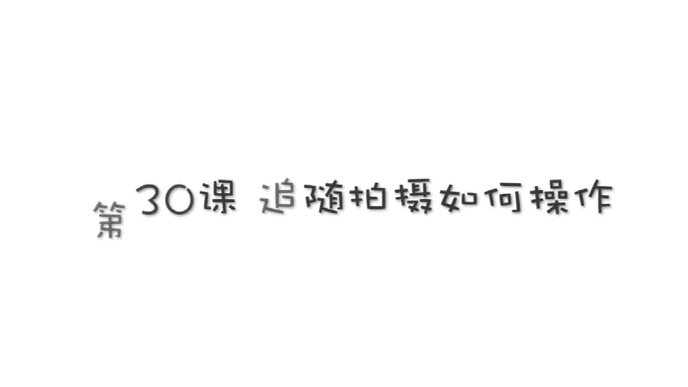
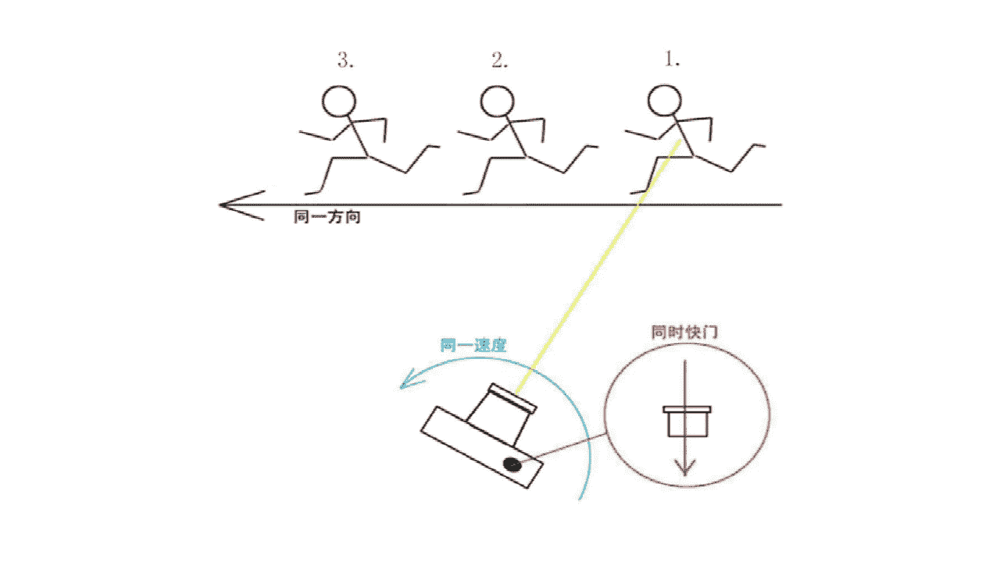
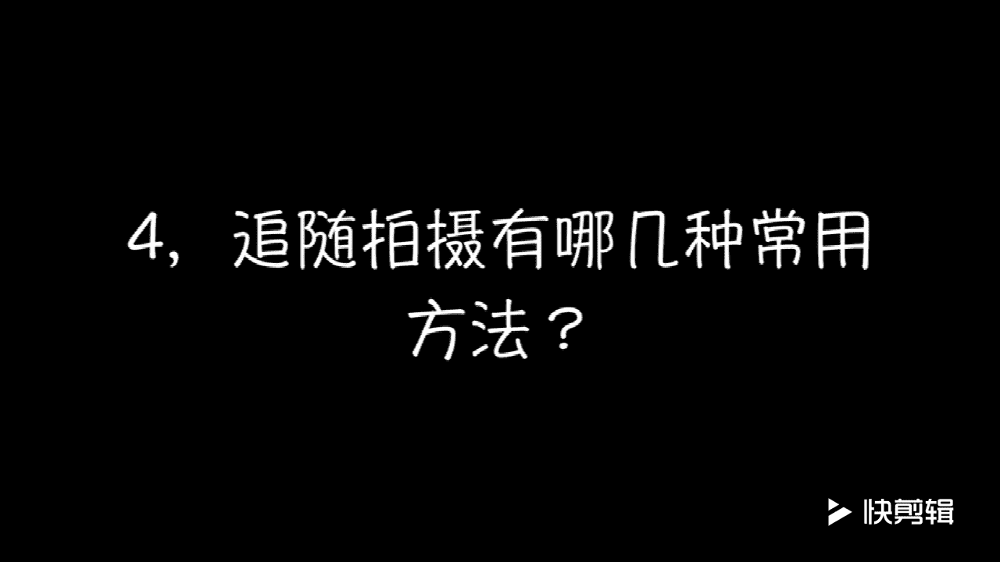
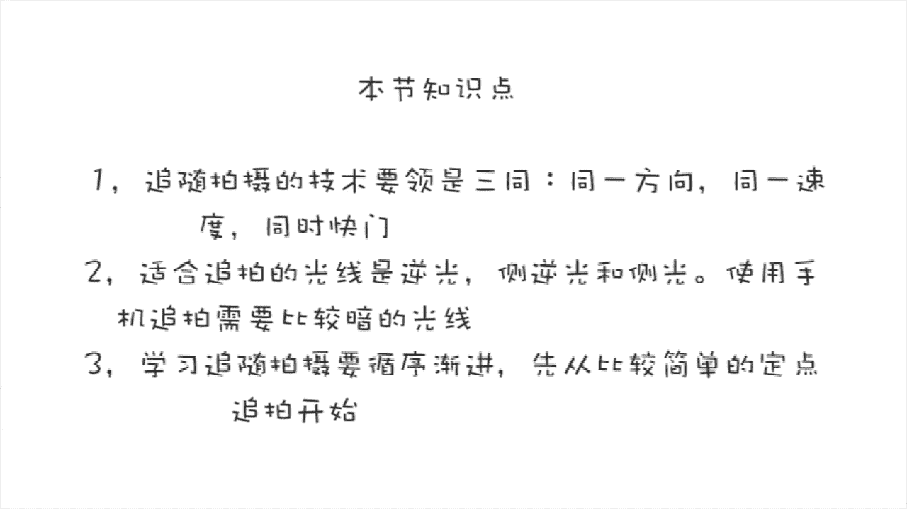
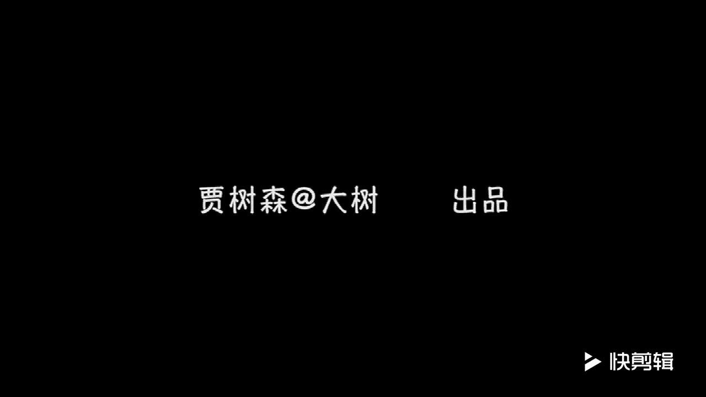

# 贾树森-手机摄影高手（完结）：3.【高手】24种生活场景模拟拍摄训练：第17讲 追随拍摄如何操作

。🎼Yeah。🎼大家好，我是大叔，现在开始今天的分享。😊。

大家可能经常会看到类似于这样的照片，只有汽车是实的。马路或者是背面的树啊、建筑啊，那么它是虚的，拉成了线啊，感觉非常的有动感。这就是我们所说的追随拍摄手法。不过这些呢都是使用专业的单反相机拍摄出来的。

那么使用手机能拍出类似的照片吗？要是学会下面几个小技巧呢，还是可以的。

追随拍摄法呢是一种技术性比较强的摄影技法，它主要用来拍摄一些运动感比较强的物体。那么这种拍法拍出来的作品呢比较容易体现速度感和动感。他的视觉冲击力也比较强的。追随拍摄法的技术核心就是简单总结有三同。

哪三同呢？第一同就是统一方向，也就说是相机随着运动的物体是朝着同一个方向来移动的。第二同是指着统一速度，相机与运动物体保持相同的速度来移动。第三同呢是同时快门，也就是说在移动相机过程中同时按下快门。

这三瞳呢要同时满足啊，任何一个不满足这个拍摄就失败了。我们可以让移动物体一直保持在画面中心位置，以保证他们的运动速度是一样的。相机的移动速度过快或者是过慢，拍出来的照片主体都是虚的。另外。

在按快门的时候呢，手机不能上下抖动。否则也会造成主体不清晰。那对这样的移动物体，我们从哪个地方开始按快门呢？像这样的拍摄呢，在一和三之间啊是比较好的位置。其中二呢是最佳的一个拍摄位置。

所以呢我们要在一之前就开始按快门啊，注意我从什么时候开始抬相机啊，它借入了我的视野之后立刻跟上，同时按快门，一直按快门是这个快门是处于连拍状态的啊，那这样我们能拍下一连串的照片。

我们可以从当中选择位置和状态最佳的一张或者几张。

来作为最终的成品。这当中呢还有一点特别重要，就是在拍摄之前需要预调焦点啊，就是把那个焦点在移动物体会出现的这个位置，预先把它锁定，并且把曝光调整好。最适合追拍的光线呢其实主要像逆光啊、侧逆光呀。

甚至是侧光。都能拍出不错的追拍的作品。那么顺光其实是比较不合适的。大家看一下哈，我拍摄的这个时刻呢是傍晚啊，是朝西边拍的。那么虽然是傍晚，其实光呢也是有一定方向的。

大约呢是个逆光或者是侧逆光这么一个光照的方向。那么这个时候呢。移动这个物体啊，在背景上是比较容易被突出出来的。不会隐藏到背景里面。另外一个用手机来拍追随拍法呢，它对光线的强弱其实还是有一定的要求。

用手机不像专业的单反相机那样，在白天也可以拍摄追随拍法。所以我们用手机拍摄追随拍法呢通常都是在光线相对来说比较暗的时候，比如说黄昏傍晚的时候，或者是夜晚的时候，或者是在地库啊等等一些光线比较昏暗的地方。

更容易拍摄出追随拍法。也就是说，靠天吃饭的成分比较大。当然这个虚化的程度跟物体的移动速度还是有关系的。比如说这个时候光线其实是偏亮的，因为太阳还有一似余灰，对吧？大家能看到。

从自行车到摩托车被拍摄的移动物体速度越快，那么我们拍出来的这个虚化效果就越明显。一直到太阳落山啊，大概是这样的一个时刻吧。那么这个时候光线暗下来了，我们才能够用追随拍法拍摄像小朋友的奔跑呀。

小朋友骑脚踏车呀等等，这样才能拍摄出比较有动感的效果。总之就是在用手机进行追拍的时候呢。移动物体移动的速度越慢，那么它需要的光线就越暗。在同等亮度的条件下，移动速度越快的物体越容易拍出动感的效果。

除了光线之外呢，我们还要选择那些相对来说比较简洁的背景，以便于呢突出主体，比主体黑暗很多或者是明亮很多。也就是说主体与背景之间的明暗反差比较大，或者是颜色反差比较大，这样的背景呢都更加有利于主体的突出。

追随拍法时呢，如果对于前景选择比较得当。那么它会更加烘托出主体的这个动感虚化的感觉。但是在选择前景的时候要留意，不要让它干扰到主体。比如说现在我选择这个树作为一个前景。

那么我们尽量让主体不要离这个树太近，尤其是它的前进的方向不要堵在树上啊，像这种要拉开一点距离，说到这个前进的方向啊，我在这里加一句，就是说我们拍摄追随拍法这种运动物体的时候呢。

我们是尽量让它在前进的方向上有一定的空间，不要太堵在画面边上了，那样就会给人一种马上就要撞墙的感觉。

最常用的追随拍摄手法呢主要有两种，一种呢就是拍摄者是固定不动的。那么让相机随着移动物体来移动。像这一系列的照片呢，都是使用这个方法来拍摄的。也是相对来说比较容易操作的一个追随拍摄手法。

那建议初学的可以使用这个方法来慢慢训练。以便于循序渐进的掌握追随拍摄手法。还有一种追随拍摄手法呢是相机和移动物体保持同样的速度平行移动。这个拍摄手法呢操作起来略有难度啊。因为在这个移动的过程中呢。

可变的因素增加了。你比如说对于相机和主体的这个移动速度的控制啊，以及相机在拍摄时不能上下抖动啊，要稳定住啊，这些呢可变因素都是比较难以控制的。所以我刚才建议大家先从第一种比较简单的方法练起。

就是我们的人不动，只让相机随着运动物体一起移动。这种方法学会了之后呢，再慢慢过渡到比较难以驾驭的第二种方法。当然，追学拍法还有很多具体的操作手法。那么大家可以在以后的拍摄过程中呢慢慢的去进行探索。

🎼今天的分享就到这儿，我是大叔，我们下次再见。😊。

