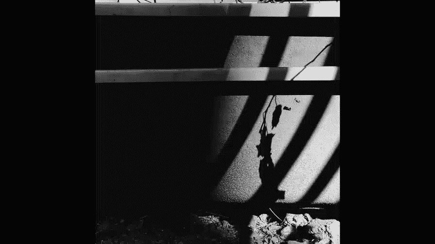
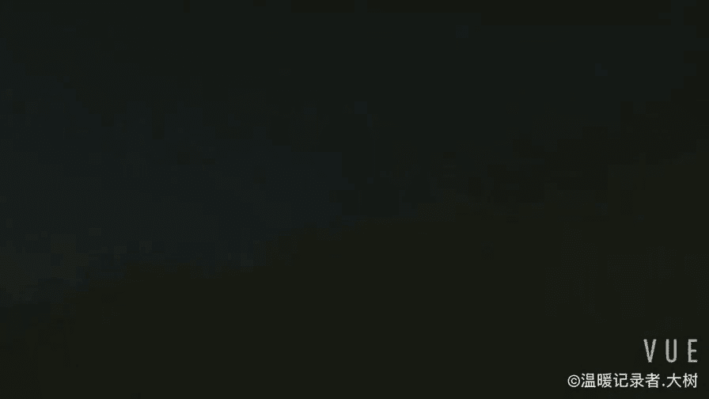
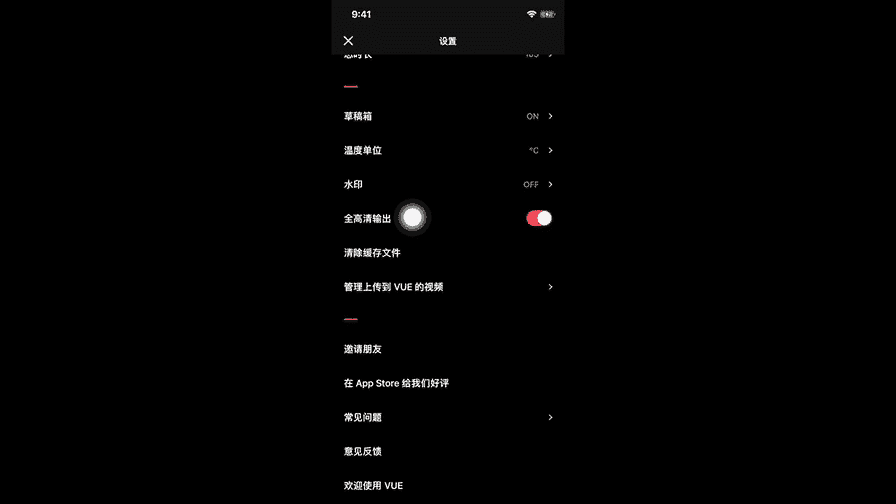
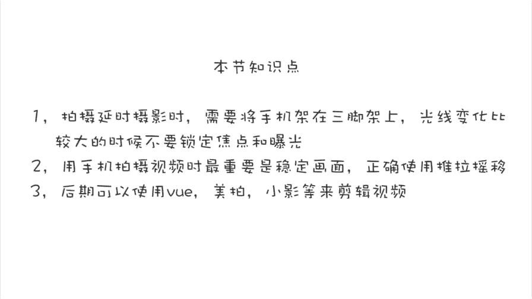

# 贾树森-手机摄影高手（完结）：3.【高手】24种生活场景模拟拍摄训练：第18讲 怎样用延时拍摄拍视频？

🎼大家好，我是大叔。现在开始今天的分享。😊。

在讲相机拍照界面的符号的时候呢，跟大家介绍过哈，不管是安卓的还是苹果的，都说过这个延时摄影。那么我们找到延时摄影这个项目的时候呢，把它选中。然后拍摄延时摄影的时候，需要把相机架在三脚架上。

像现在这个呢是把手机呢用这一个八爪鱼啊，这个三角架桥八爪鱼，它可以任意的去弯曲啊固定在这个栏杆上。那么我们取好景之后，把它给固定住。然后按下这个录制按钮就可以进行拍摄了。🎼他需要拍摄这么一段时间啊。

延时摄影呢拍摄的对象呢是那些动的比较多的。比如说像天上的云哈，天上一定要云，而天还要动的。如果是天气晴朗，万里无云，那就没有什么可拍的。🎼另外一个他也可以拍一些像人来人往的这个轨迹呀。

或者像光流过的这一个过程等等。🎼拍摄延时摄影的时候呢，也是可以锁定焦点和曝光的。不过呢对于那些亮度会发生变化的场景，比如说刚才这个啊。🎼其实呢就不应该锁定曝光。因为这个曝光呢它会在拍摄的过程中发生变化。

到了最后的时候呢，曝光已经有点过曝了啊，这个时候可以让曝光呢进行自动啊，它会自动的去适应环境的变化。

用手机来拍视频呢，最需要注意的就是画面呢要稳。也就是说我们拍的时候手手机啊要拿住，不要晃来晃去。呃，拍摄画面的时候呢，也不要是运动的特别快，给人晃的很晕。这样呢想看什么也没看着。

比如说我们记录孩子玩耍的一个小事件吧，我们可以跟随着车，然后慢慢的慢慢的移动，不要太快。车过去了也不要回来再找孩子，你看孩子他会跟着跑过来。所以我们这个机器呢就慢慢的运动的等在那儿。

然后呢去记录这个过程。拍摄视频的时候呢，它镜头的运动啊分为这么几种，叫做推拉摇移。那么这种呢叫做摇啊，也就是镜头随着主体缓慢的移动。摇的时候镜头要稳，不要上下摆动，并且比较忌讳，频繁的左右摇摆镜头。

拍摄的画面要稳，其中还包括我们在拍摄视频的时候，手机不能上下抖动。那么为了要稳呢，我们可以双手拿手机，并且把胳膊肘呢尽量靠近身体来稳定画面。如果用手机拍视频的需求比较多。要求也比较高。

可以选用这种手机稳定器来拍摄视频。当然有条件的话呢，是可以把手机架在三脚架上来拍摄视频的。大家看左面的这个画面呢，就是在三脚架上拍的，除了这个花呢在风的吹拂下呢微微动了一点之外呢，其他的都特别的稳定。

我们也可以通过把胳膊肘支在栏杆上，桌子上或者将身体靠在树上来稳定相机，以免画面抖动，并且在拍摄视频的过程中呢，我们可以按画面右下方的这个白点来进行图片的拍摄。这个就是我们在拍摄视频的时候。

如果遇到特别精彩的画面呢，可以通过这个方法同时拍下图片。第二个需要注意的是呢，大家在拍摄视频的过程中要谨慎使用变焦啊，那么这种变焦呢在运动摄影上叫做推拉，啊，刚才说的推拉摇移。

这其中的推拉就是变焦可以变啊，但是要缓慢。不要呢一会儿变大，一会儿变小，一会儿变大，一会儿变小。这样看起来真的是让人运。头转向的哈。第三点呢就是希望大家多多的使用横拍，而不是使用竖拍啊。

就是我们拍摄视频的时候，尽量就是横着去拍。这样拍摄的画面呢更加具有电影的感觉。第四个要注意的就是在拍摄过程中要谨慎使用手动对焦功能，那么有的时候我们的镜头呢处意运动当中的时候。

你感觉好像这个东西也没太对时啊，呃我们可以略微等一下，因为它对焦呢需要一个时间。如果还没有对的话，我们可以用手指轻点啊，要对焦的那个区域，尽量不要锁定。当我们在拍摄固定画面的时候，固定镜头的时候呢。

我们是可以进行对焦和曝光锁定的。那么这个时候呢焦点会更加准确。第五个需要注意的是，用手机拍视频的时候，要寻找那些光线比较好的地方来拍摄。像现在小树目前这个地方光照情况就不是很理想。

大家能看到画面的颗粒和噪点呢都特别的大。画面质量呢也降低了。用手机拍视频的时候，他对于光线的需求呢比用手机拍照片，对光线的需求呢还要严重啊。如果遇到这样的情况呢。

就尽量的多开灯或者挪到光线比较明亮的地方，再或者可以用LED啊、手电筒啊等等，来改善现场的光照情况。第六个方面就是不管我们是拍人还是拍景物，我们不要一直固定在某个景别上。我们拍一些全景的时候。

在切换到踪景近景。乃至于特写去拍各种景别的镜头。那么这样呢，在我们后期去剪辑这个视频的时候呢，画面就比较丰富了。第七个建议呢就是大家要注意固定镜头和推拉摇移这些镜头在拍摄过程中的有机搭配。

比如说现在这个就是移的镜头啊，从上往下移动的一个镜头。同时这些运动的方式啊，我们也可以多想出一些新的创意啊，新的方式，比如说像摇的镜头，我们不仅是左右可以摇。我们呢也可以旋转的去摇。

那么这样呢画面就非常的有意思了，对不对？第八个就是我们在拍摄的时候可以想一些创意啊，一些小策划。比如说这一组镜头呢，我就想拍摄数码跟小树从画外走到画内，或者是从画内走到画外，而这个过程中呢人是动的。

但是我镜头是固定不动的。固定警别不动。🎼拍完之后呢，我们可以通过一些软件把它剪辑在一起，就是一个非常有创意的小短片。所以最后一个建议呢就是大家在拍完视频之后啊。

要善于使用后期的编辑软件进行剪辑编辑并且配偿音乐。这样不仅提升了视频的可看性，也更方便我们与家人和朋友进行分享。我目前最常用的视频剪辑软件是VUE啊，这个比较具有电影感。以前我最常用的是叫美拍哈。

其他的还有叫做小影，也是口碑不错的一个视频剪辑软件。苹果手机自带的视频剪辑软件按mo也是非常好用的。这些软件呢也同时可以把照片做成视频。另外还有几个主打视频分享的社区，比如像抖音秒拍，还有快手。

那么这些呢都是主打视频的。社区同时呢它也具有一部分的视频剪辑功能。当然了，相关的软件和社区呢还有非常多，我就简单的给大家推荐怎么几款。简单的跟大家说一说VE使用方法哈，在桌面上找到UE点开之后呢。

界面就这样，下边这大红点按住它是可以进行直接拍摄的。😊。

那么大家看一下这一块这一排哈。😊，我们把它点开之后呢，能看到哈，这里面是关于画幅的选择，还有总时长以及分段的数。这次呢我选择自由分段。这个总时长呢建议选10秒，因为它比较容易分享在朋友圈里面。

这些设置好之后呢，点击左下角这个加号，进入手机相册来选择视频进行编辑。因为我这次选择是自由分段，所以呢每一小段视频的长度可以自主选择啊。最短的当然是一秒起了，然后呢从里面选取自己想要选取的片段。

选好这一段之后呢，摁右下角的对勾，再进入下一段的编辑和选择啊，一直到剪辑买了10秒为止。现在我们可以针对视频进行一些润色了哈。那么屏幕最上面这一排有4个符号啊，这一一排的菜单。

这里面呢有针对于画面的一些亮度调整啊，反差调整啊，或者是增加暗角，提高画面的锐度，以及呢增加转场添加字幕，更改滤镜或者是呢给视频添加音乐。以及呢增加贴图等等。当这一切都完成之后呢，就可以把视频输出了。

有两点需要特别说明一下，一个就是滤镜可以在最开始的时候通过这红换蓝这三个圆圈来进行事先设定。另外一个就是一个设置问题啊，那么大家看一下就这三个横的，把它点开之后呢，里边找最下边一个设置。

这里面呢其他的问题都不用管，主要是这个全高清输出，这个要把它点开啊。最后用两个用VE剪的小短片呢结束今天的课程。图片之外，视频呢也是记录我们生活的另外一种非常有力的形式。

来玩。

🎼今天的分享就到这儿，我是大叔，我们下次再见。😊。

🎼。