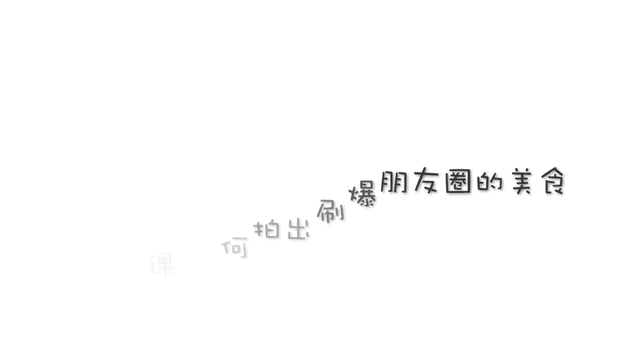
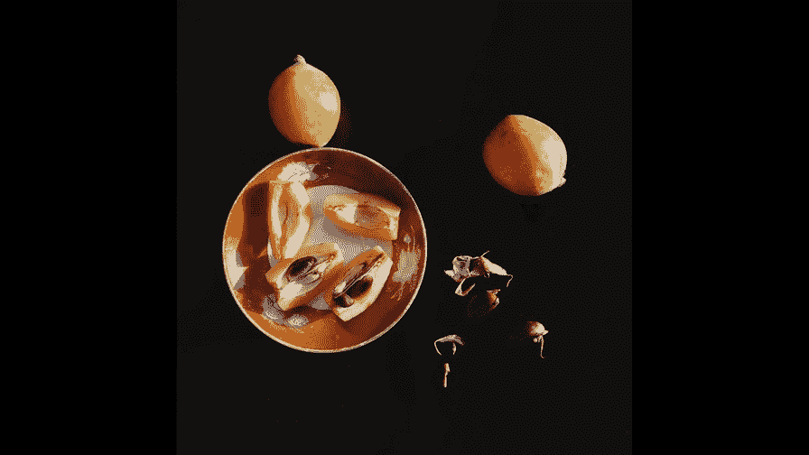
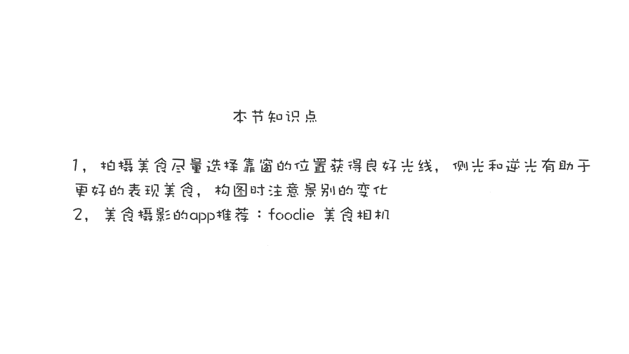

# 贾树森-手机摄影高手（完结）：3.【高手】24种生活场景模拟拍摄训练：第1讲 如何拍出刷爆朋友圈的美食？

🎼大家好，我是大叔。现在开始今天的分享。😊。

好的，我们开门见山，先从美食拍摄的这个角度先说起啊。

美食拍摄的基本角度呢有这么三种。第一种就是平拍啊，大家看一下，就是跟实物相同的高度拍过去。因为相机现在跟实物所在这个平面，也就是桌子面，它的夹角呢几乎是零度，所以呢又叫做零度啊。

这个角度平拍比较适合于拍摄那些侧面形状比较漂亮或者侧面的质感比较好的视品啊，那么我们现在把相机放在实物的正上方啊。往下俯拍啊，因为这个时候相机呢跟桌面呢成90度，所以呢这个角度又叫做90度俯拍啊。

90度俯拍比较适合展现实物的外部形状，或者是餐盘的整体布局等等。那么在零度的平拍和90度的俯拍之间呢，还有一个角度，那么它就是45度的俯拍啊，那么这个夹角大约45度。当然了，多于40度或小于40度。

这些角呢都是可以的。在这两个之间通常都可以简称为45度的俯拍。至于说具体俯拍到什么样啊，你是46度还是58度。那么呢这个根据食物的具体形状来决定。45度俯拍，它兼顾了90度俯拍和零度平拍的两者的优点啊。

所以呢45度俯拍是使用最广泛的一种拍摄视频的角度，除了角度呢光线对于拍摄美食也是至关重要的，大家看这张照片呢是将近中午的时候，厨房里拍的，没有阳光照进来。那么这张照片呢是我把这个视频呢拿到了太阳底下。

然后这张呢是略微逆光拍摄的。那这几张呢是早晨的阳光拍的啊，太阳刚出来没多久，呃，太阳呢直射到这个柿饼上。那么我拍下来几张，大家感受一下一盘柿饼呢，大家能看出来啊，光线对它的影响还是很大的对吧？呃。

如果没有光线，那么这视饼就显得暗淡无光了。那么有了光线之后呢，我们拍出来东西呢就。特别的诱人是吧？让人非常有食欲。拍美食的时候，这张照片能引起观看者的食欲。那么这个我认为是一个基本的要求。

所以如果我们有拍摄美食的需求的时候呢，出去就餐，然后尽量选择靠窗户的餐桌就坐，或者呢选择室外的就餐环境去就餐。那么拍摄美食的时候，对于光线的方向怎么选择呢？啊，这张照片是顺光拍的。

我们能看到呢顺光其实啊对于食物的表现一般，立体感比较差。那这张呢是逆光的条件下拍的，为了能让大家看的更清楚一些哈，这几张照片都没有修图，都是原图哈。那么能看到逆光的时候呢。

我们能把这个枇杷果的这个果肉啊，能拍出一些半透明的感觉啊，那么这也是逆光拍实物的一个非常大的一个优点啊，包括这个视饼。当然另外一种光就是测光了，测光对于食物的颜色啊、立体感以及质感的表现呢都特别的好哈。

所以呢。逆光和侧光是拍实物比较常用的光线。当然，测光和逆光有的时候会面临着反差比较大啊。那么这个时候我们可以用身边的白纸啊，白色。桌布啊等等来进行反光，以改善光照的反差情况啊。

现在我用的是一个反光板来进行改善光线。有些时候我们的就餐环境不是很好啊，那么灯光设置了。不是很理想。拍照片呢会受到很大的影响。那么拍出来的实物呢。嗯，反差不够，然后呢色泽也不好，比较灰暗。

那么这个时候怎么办呢？大家可能想到的第一个办法就是开启闪光灯，对吧？但是如果这个时候你真的把闪光灯打开了，那就歇菜了，那就真的成烂菠菜了，对不对？😊，所以这个时候千万不能开闪光灯啊。

我们可以啊把手机的这个手电筒打开啊，借一部手机对吧？然后给改善一下照明啊，呃照明的方向当然最好不要顺光了啊，我们可以稍微测一点光线或者稍微。逆光一点点啊去调整一下啊，根据实际的效果来调整。

这样呢我们可能在有限的这个环境当中呢拍出相对好的美食作品啊。我这是一漏就简，给大家模拟一下一些餐厅的就餐的环境啊啊，看看能拍出什么样的东西，怎么样来改善了个光线，这里边有一个小插曲跟大家分享一下。

这碗面呢菠菜鸡蛋面其实是中午要吃的面，然后我拍完了发给叔妈叔妈又把他中午吃的东西发给我了。因为他当天中午是外出吃饭了啊，高级餐厅，这一盘沙拉100块，然后我跟他开玩笑，我说你看我这碗面价值5块钱。

我拍成值50的了，然后你这盘沙拉100的让你拍成5块钱的沙发了。首先这个光线就不好看，其次呢摆的也乱七八糟，构图也不好看，对吧？如果咱们有效的去组织一下哈。那么你看。

价值10块钱的早餐也能看起来有滋有味儿的，对不对？所以看来除了光线之外，构图也很重要。拍美食的构图呢一般分为这么几种情况哈。那第一个呢就是特写，对于这种颜色或者是质感或者是形状特别美的。

我们可以呢贴的很近去拍它局部的一个特写啊。把它拍的特别的诱人啊。那对于餐盘整体上比较好看的这种食物呢，我们可以把它拍全啊啊拍一个盘子比盘子大一点啊，或者拍一个小蛋糕。

比蛋糕再大一点的这么样一个构图也可以。啊，或者是在这个盘子周围啊放一些东西，那么这么样一种构图。啊，至于怎么放，咱们等一下会讲啊。啊，这是涉及到摆盘了啊，这个非常关键对于拍摄美食。

或者是呢像这个柿饼这张呢，就是在旁边要留白。再或者我们组合一下啊，像几种食物呢组合在一起这样去拍。那么像这种下午茶，我们可以拍摄一堆儿。当然也可以啊配合拍特写。比如说我们发朋友圈。

可以拍这么一堆儿的啊这么一个中景的，然后呢再配合上一些特写。那么我们来发朋友圈就比较丰富了。正好提到了发朋友圈哈，我就接着发朋友圈呢拿一个越南的滴漏咖啡为例子啊，跟大家说一说呃。

整体的一个拍摄构图的分布啊，比如说我们拍这个滴漏咖啡，我们可以拍咖啡的特写。啊，特写呢也分好几种啊，从正面往下俯拍45度的。俯拍，然后呢还有一个平拍。啊，这几种拍摄角度都有，对吧？那么还有一个构图上。

我们除了特写之外，我们还可以拍整套的这些餐具。除了整套的餐具之外呢，我们我们还可以把人物带上啊，比如说这个我就把数码给带上了啊，也把这个老板娘给我们泡咖啡的时候，他的手他的一些动作带进去了。

就让人哎对这个东西就很有欲望啊，很有欲望去研究，去想去琢磨，那更有欲望去喝了，对不对？另外一个就是带上了当地的一些人文环境。比如说呢呃带上了越南的这个街道啊，他街道上摩托车很多。

我们拍了拍到了一些摩托车，当然我们采取了一所在让他虚掉啊，让他是动感的虚化啊，不能抢夺了我们实物的视线。另外一个我们也取上了一些街道上的一些标牌啊，都是这个越南文字的啊，一看呢他就比较具有。异国风情啊。

所以我们拍摄美食在构图上呢一定要灵活多变啊，除了各种各样的特写之外呢，还要照顾到一些人文的环境啊，甚至呢把人也拍摄进去啊。那像这几张照片展现的实物呢，我们是在超市里买的啊，总价值也就200块钱。

但是呢我们绝对吃出了超五星级的这个价值啊。关于拍摄美食的创意呢，应该说。有万千种变化啊，那么我简单的。拿芒果啊做一个例子来给大家示范一下。呃，我自己呢切了一个芒果啊，把这个皮儿呢。

我就顺便扔到了一个菜板上。这个菜板呢木质的菜板也是我拿它来作为道具的，直接就作为我拍摄的一个背景来使用了。呃，同时呢又拿出另外几个芒果放在旁边，还拿了一把勺子。这个树叶子是小树呢啊上楼下玩的时候。

剪的一个小树叶子拿到了楼上，我也把它摆上去了，改变一下色彩关系。不然的话呢，这里面只有黄色或者橘红色这两种颜色。那么这个绿色放进来呢就比较醒目啊。这是另外一个摆的方式，我把刀也放在这儿了啊。

作为一个道具来使用。那么像这种拍摄的方式呢啊就是比拍一个单排啊，什么都没有，要丰富一些。那么这个其实呢就是所谓的这个。拍摄美食的摆盘啊。这个很关键，一张美食作品呢是不是有创意，那么摆是很重要的。

同时呢你使用的一些道具也非常的重要，专业拍美食的人是具有特别多的道具的，各种桌布啊，各种盘子，刀子，然后呢以及各种菜板，甚至各种其他的板子，啊，食材，甚至啊那么他们都是用来作为道具来使用。

搭配的来拍美食，能让这个美食呢就看起来特别的漂亮，又有格调啊。现在我是又拿了几个插花啊，没有开的芍药啊，放在了这个边边上。然后把它作为画面的一部分来拍摄。那么像这样的摆布方法呢就比较浪漫一点啊。

温馨一点。美食摄影的软件呢，我给大家推荐一款叫做福底美食相机。那么大家搜索的时候一定要用英文来搜索啊。因为有一款软件它专门叫做美食相机。那么呢那款软件我用过之后觉得一般啊。

所以推荐大家使用这款福底美食相机，福底美食相机。这个软件呢它操作比较简单，滤镜也挺丰富的。呃，能拍出比较出色的照片，嗯，它有26种不同的滤镜效果，其中包括像美味呀、浪漫啊、新鲜啊、清凉啊等等。

大家可以根据不同的美食来进行选择。当然还有一些其他的功能，比如说剪裁呀、开启闪光灯啊。调整画面亮度啊等等。我个人在拍美食照片的时候，不太愿意使用啊像美食相机这样的软件去进行拍摄。

那么我还是喜欢使用手机的原声相机去拍摄。然后呢，在使用其他的软件进行修改。像这几张照片呢，我都是用啊viss狗来进行修图的啊，修改的过程其实也很简单很快速。

那么这款软件也会在后期的课程中给大家做详细的介绍。有关于美食拍摄的学问其实还是蛮多的啊，时间有限，简单就说这么多吧，算是给大家入个门。

🎼今天的分享就到这儿，我是大叔，我们下次再见。😊。