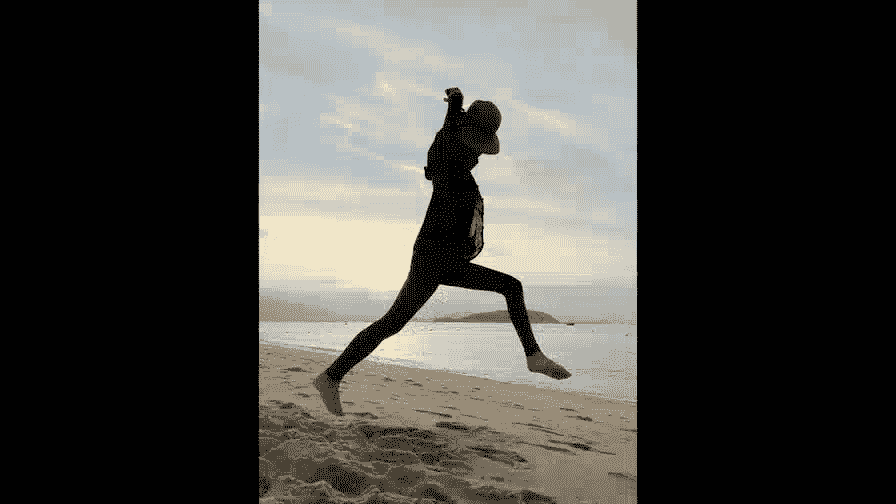
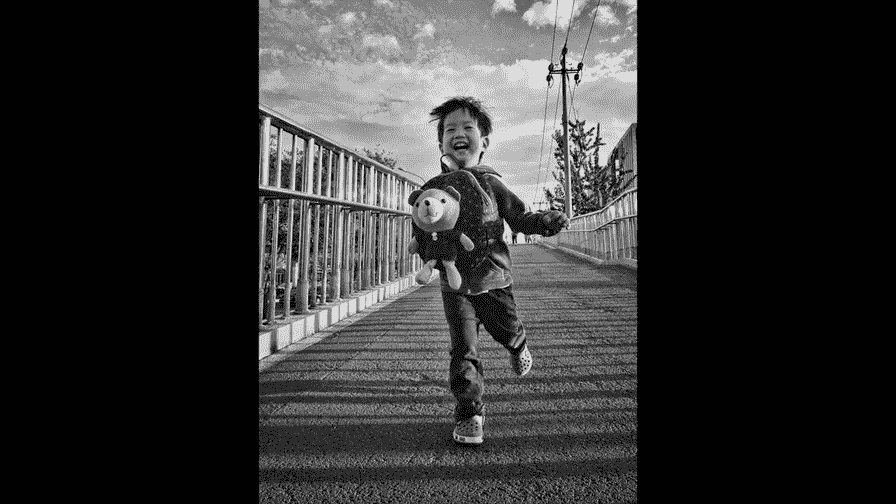

# 贾树森-手机摄影高手（完结）：3.【高手】24种生活场景模拟拍摄训练：第2讲 怎样在不同环境下把人像拍美？

🎼大家好，我是大叔。现在开始今天的分享。

如果我们在给人拍照片的时候呢啊，我们让人家站在那儿啊硬摆动作，或者是强挤笑容啊。哈哈哈哈你笑一笑吧，什么什么的啊，像这样的，如果是拍明星或者是超模，我相信也不会拍出特别出彩的照片，何况是我们普通人呢。

时间稍微一长，然后都会让人觉得困倦啊，让人觉得很不耐烦，表情也很难能维持那种特别生动的特别丰富的表情。拍出来的照片呢也会显得死气沉沉，号无生机。但是呢一旦我们让模特儿动起来哈，哪怕只是在沙滩上漫步。

我们也能拍出相对来说比较生动的照片。呃，有句话不是那么说吗，牵一发而动全身啊，一动这个照片就出彩了。在动起来的同时呢，我们可以配合，比如说可以甩甩头发呀，呃跳一跳转一转。那不管是长头发还是短头发。

只要他去做这个动作的时候呢，呃他就一定会非常的开心。😊，这个拍照首先它这个气氛就特别好。那么在这样的气氛下，肯定是拍不出来那种死板的照片的那人处于这种特别放松，特别。😡，高兴的这种状态的时候呢。

他的浑身每一个细胞都会散发出特别迷人的魅力。那么这个时候的人呢，他是最美的，他是最帅的。说妈在越南香港海滩上呢有一组超级经典的甩头发的照片，这是不动的啊。呃海边是有点风。

然后呢甩头发甩甩甩甩甩就甩出一组特别特别经典的照片，大家看了呢，肯定会觉得特别的有趣啊。这张照片应该是在前面也看过啊就像做了一个超级酷的一个发型一样啊，当然我们也可以拍那种奔跑的啊。呃。

如果朝着镜头跑的难度，可能拍摄难度会比较大一些。但是呢也会非常的精彩。因为这个过程确实会令人感觉到开心，也有很多无法预料的瞬间出现。还有一个打破拍照死板的必杀绝技，就是跳跃。当我们腾空而起的时候。

我们大多都是忘乎所以的。不过呢在拍摄跳跃的时候，记得一定要使用连拍哈。想要拍出大长腿，首先得有大长腿。开个玩笑哈。那么我我们呢怎么样才能尽量的把腿拍长呢？啊，首先就是要低角度。Yanghai。啊。

尽量靠近这个模特。呃，是我们手机呢它本身就是一个广角镜头啊，大概24毫米啊，我们在之前讲过了。所以呢这个广角的它有一个特点呢，就是当我们去靠近这个拍摄的主体的时候呢，我们会有一个变形的拉伸。

那么我们把这个模特的脚啊，尽量靠近画面的下部边缘。那么这个时候呢，它就会有一个变形的拉伸作用啊，这是因为光脚镜头产生的这么一个效应。那这里面有一个需要注意的是，比如说我们像在沙滩上赤角去拍的时候呢。

呃最好把脚后跟稍微提起来一点，模拟一下，穿高跟鞋的感觉哈。同样呢我们坐在沙滩上也是可以啊这样去拍的啊，但是呢脚就腿的摆放的方法啊，要稍微注意一下，最好呢膝盖冰拢啊，然后往一旁稍微斜一点点。

同样的也是脚呢要尽量贴近画面下部边缘。呃，拍摄角度也要是低啊，如果我抬起来了啊，比如像这样再高一点的话，那么这个时候呢就会显得腿特别特别的长。如果模特的脚呢伸向画面底部的啊某一个角啊，尽量接近这个角。

那么腿呢也会被拉长一些，坐在这儿的，还有坐在这个长条椅子上的，这个腿呢都有一点拉长的作用。其实想拍出大长腿呢，除了角度和取景有关系之外呢，穿衣服啊也是有讲究的。我们尽量去穿一些。

比如说瘦身长裤啊啊或者是牛仔短裤啊，A字裙啊等等，这种比较修身的衣服，你像这样照片呢，它本身这个裤子是没有问题的。但是这个上衣呢它比较长，把腿挡掉了很长一部分。那么现在这种取景和构图啊。

啊就不会使腿显得长。那么这时候怎么办呢？这时候我们可以换一个方向啊，让他把腿呢多露出来一些，然后拍个半身的。那么这个时候有一个想象的空间，反倒显得腿呢感觉像是比较长的一样。出去拍照片。

我们到底要穿什么衣服呢？嗯，这是个问题啊，其实我们很多时候要根据我们拍照的环境来挑选服装。比如说像现在这个环境啊，来给淑妈拍照片。那么淑妈穿这个上衣啊，其实是不太合适的，因为周围以绿色居多啊。

那淑妈穿了一个绿色的外套。所以呢这个衣服在在这拍片呢，就显不出来。他的衣服就容易掉到背景里面，我我们说啊它这个跟这个环境色有点靠色了，或者说我们说那什么一点叫顺色了哈。那么这个其实躲猫猫合适。

大家都找不到，对吧？那么大家都找不到你拍人，那你肯定这人突不出来呀，是不是？这个主体肯定无法突出了。所以我们要找一个跟这环境能反差出来的颜色。比如说像黄色呀、红色呀、白色等等。俗话说。

红花还得绿叶来配哈。在一片绿色当中呢，红色的花朵呢会显得更加的鲜艳和突出。那么在一个蓝色的游泳池里面啊，一个黄色的呃游泳圈，那就会显得更加的吸引人的眼球。是大家的视觉焦点。在一面黄色的墙前面啊。

那么淑妈穿着这件红色上衣，在黄色和绿植的掩映下呢，也是显得更加的红艳和突出。那其实红色呢在很多环境里面都会显得特别醒容和突出。所以呢呃红色可以作为一件万能搭配色啊，推荐给大家。

还有一个白色也是可以作为万能的颜色啊推荐给大家百搭。呃，放在哪儿都可以出彩，都能啊拍出非常美的照片。要回答这个问题，其实要涉及到几个小概念哈，把这几个概念说清楚了呢，这个关系也就说清楚了啊。

其实我是最讨厌说概念的，不过我们可以用图说话啊，也很容易懂的。那要说一说什么叫做特写人像，什么叫做半身人像？什么叫做全身人像。那么特写人像指的就是呢。取到肩部以上的啊。加头部的。

那么这样一个构图呢叫做特写构图配人物的时候。那么特写呢主要是突出人物的面部，它对于背景表现的比较少，背景取的少，人物面部取的多，主要是突出面部呃，形象表情的。如果说环境不好不好看，这景色不好看。

我们可以选择拍特写。或者是呢我们想要强调人物的这个面部表情。我们可以拍特写，对吧？那么这个时候呢，景色。景物环境就不那么重要了。但是这个时候呢，我们依然要小心的去选择背景啊。

选择那些相对干净的背景来拍特写。不然的话呢它容易分散注意力，全身这个相对来说比较好理解哈。那就是把人物拍全了，脚和头都在画面里面啊，或者是呢人物比较小，那么这样的照片呢都可以叫做全身照片。

全身照片呢除了能表现出来人物整体的一个状况哈，比如说它的服装啊，它的肢体语言呀等等。那么还能表现出来很多的景色，如果我们遇到了特别漂亮的景色，我们可以选择把人物呢拍的稍微小一点。

以便于容纳更多的风景进来。同时呢这样的照片呢也往往会显得更加有意境。可以传递某种情绪，或者是要突出一个形体动作，那么也也需要选择全身的构图来拍摄。人物的半身构图呢是接于特写和全身中间的这么一种构图。

它通常呢会取到人物的，比如说腰部往上或者是呢膝盖往上啊，大概这么一个范围。那半身构图呢是。

兼顾人物和景色表现的这么一种构图，也正因为它可以把人物和风景二者皆而有之。所以呢这种半身式的人像呢是我们用的最多的一种拍摄人像的一种方式。

🎼今天的分享就到这儿，我是大叔，我们下次再见。

