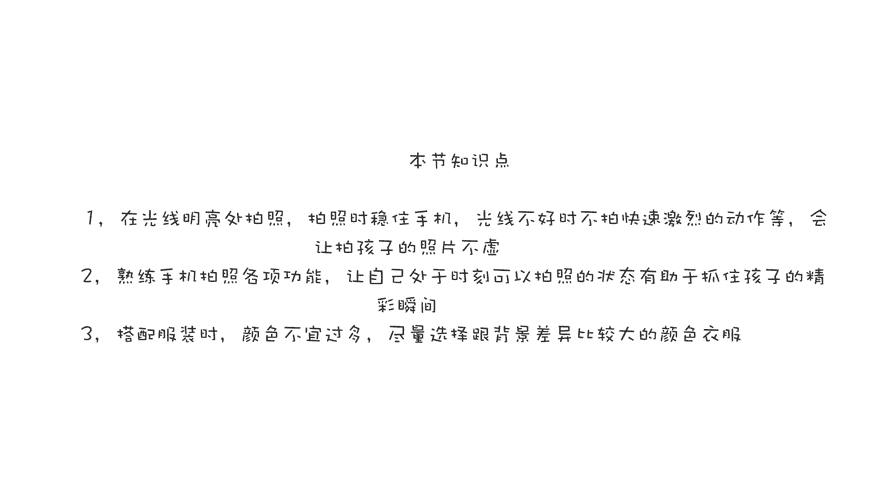
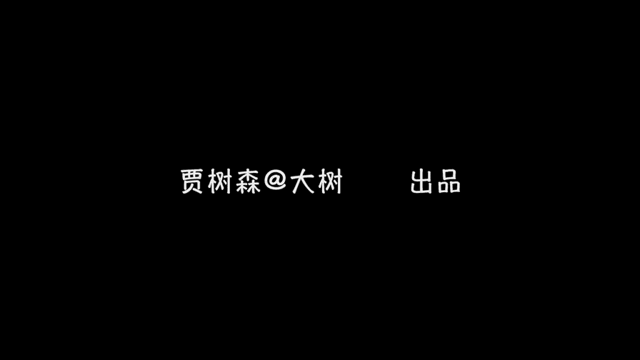

# 贾树森-手机摄影高手（完结）：3.【高手】24种生活场景模拟拍摄训练：第3讲 如何拍摄活泼好动的孩子？

🎼大家好，我是大叔。现在开始今天的分享。😊。

呃，这是同学们经常会给我提的一个问题哈。就是如果你用手机拍过小朋友，你就会有这样的体会。孩子太活泼了，我我怎么拍才能不虚呀，是吧？动作太快了。那么我们用手机拍大人的时候相对还好，因为孩子他特别活泼好动。

所以呢很多时候我们不可控，动作又很快。我们用手机一拍就虚了，觉得特别特别美好的瞬间，哎，特别有意思，结果一拍虚了，很遗憾，我将会从以下几个方面呢跟大家说一说，怎么拍才能不虚，说几个小技巧哈。

那么这个小技巧呢，其实不单单是针对拍孩子有效。对于那些移动速度比较快又不可控的。比如说像飞鸟啊啊，小猫小狗啊等等啊，很多这样的快速移动的抓拍是很有效的。甚至呢是对一些突发事件的抓拍。

所以呃这个其实是一些有关于抓拍的技巧。当然了，因为是针对孩子来问的，所以呢我这里面会有一些有关于孩子的问题。那么其实这些技巧呢挪到其他的地方依然是可以适用的。那第一个拍照不虚的技巧呢。

就是我们尽量寻找那种光线好的地方来拍照。比如说顺妈和小树这张在酒店的走廊里啊比较混暗。那即使后来在电梯里面，这个光线依然不是很强。所以呢我拍了一些有很多是虚的。大家如果放大看这照片都是有一点点虚的。呃。

要么是人动了，要么是手抖了。但是我们一旦移到了户外，在光线充足的地方，你看小说即便是在奔跑，那么拍摄下来也是没有问题的，一样是可以把它的动作凝固下来，基本上是不会虚。用手机来抓拍不虚的技巧呢。

第二个就是一直要牢记，拿住手机啊，千万不能抖。稍微抖动一点就会虚掉。因为手机它的抓拍能力有限哈，我们在拍摄一些动作特别大的时候，比如说现在小树这种在摆这个东西，大家能看到那小熊已经虚了哈。

所以像这种情况呢，建议大家不要在那种动作特别激烈的时候去拍。但这个其实也是有限定条件，就是光线比较暗的时候。那么你在外面在室外，你跳跃起来没有问题，奔跑起来也没有问题。

因为这个时候啊手机给出的快门速度是比较快的，能够把这些动作给凝固下来啊，我知道大家都有这个需求。那我就就像在那时候拍怎么办呢？所以呢我给大家说第四个技巧，就是可以采用追随拍法。

这个追随拍法呢就是专门针对这种光线比较暗，运动速度有相对较快的时候进行抓拍。比如说孩子在动啊，或者是拍汽车拍什么的，但是这个追随拍法稍微有一点点小难度。所以呢这个我们会拿出一整课的时间。

专门来给大家讲具体怎么去操作啊，这课啊会在后面一点，大概30克左右啊。嗯，除了虚之外，这个也是一个大家面临的主要问题，就觉得手机的速度太慢了，抓不住还是单反快啊，很多同学都会问这样的问题。

我知道在这也是大家的痛点啊。那么我给大家说几个吧，秘集啊，抓拍的秘籍。第一个就是熟练使用手机的拍照功能啊，比如说快速打开照相机呀，快速去对焦调成曝光啊等等啊，这些技巧一定要熟练。那么熟练之后呢。

我们才能随时准备去抓拍啊，这个随时准备抓拍是什么呢？说的就是你的手机一直要处于一个能拍摄的状态。即便是我们掌握了快速打开的功能啊，那个只是怎么说呢？一个技巧。但是在有些时候你即便是快速打开，还是不敢趟。

所以如果你的照相机应该是一直处于一个开的状态啊，你一直时刻准备到时刻准备到。那么你这个时候你才有可能把一些精彩的。瞬间给记录下来。比如说你就在泳池里边，小树养水的这张，我其实是一直在跟他一块玩。

那么手机呢一直是处于一个在拍摄的状态，就是不断的拍不断的拍。那么正好出现这个瞬间，哎，那我就正好能抓住。如果说我看到这个瞬间很好，我再掏出手机链，那么再去拍，那就来不及了。还有小树的这张照片。

其实他是之前一直在拖着这个大箱子在走。那么我呢一直在拍他，拖着这个大箱子就感觉特别有意思。因为大箱子特别大，然后就几乎跟他一样大了，对不对？所以呢我就一直在拍，那么他拖着拖着突然拖不动了。

就把那箱子扔到地上了。突然做出这么一个动作来。那么这个动作其实他是不可回放的啊，所以只有你处于拍摄的状态当中，所以顺手就是下意识的就把这张就抓拍下来了，还有这张照片哈，这是我们在澳大利亚的一个海边上。

我们当时呢在那吃午饭草地上，然后把那些面包渣儿呀，然后那个虾壳啊什么扔给这个海鸥吃，我就在那躺在那拍，突然就这个小妹妹哎就从这前面经过了。当时我也是抓拍了几张，但是海鸥的飞翔状态不是很理想。

那么紧接着他姐姐也过来了，我就又抓拍了几张。那么你大家可以想象，这个如果我就是那个那个小妹妹过去，我也没留意。然后姐姐过来了，我看挺好的，我这拿出手机来再准备拍，就肯定来不及的。第三个关于抓拍的秘籍呢。

就是建议大家实时的使用连拍。你像小时候这样照片呢，大家在片头里面已经看过很多次了，对吧？这个就是小说只做了一次这个动作。那么我用连拍呢，把它整个的动作瞬间全部都给记录了下来。

那么现在选的基本上是最完美的一张，就是最后他动作打到最开，沙子全部扬起来这么一个状态，包括这张小树在沙地上玩的。大家留意一下，它的左脚啊把沙子扬起来的一个瞬间啊，如果不是使用连拍，我相信即使是用单反。

也是很难能。百分之百的成功率去抓拍到这样一个瞬间。那么我们在抓拍的这个过程中呢，去使用连拍呢，容易把一些精彩的瞬间呢给记录下来。第四个，关于抓拍的秘籍呢，就是我们要跟孩子打成一片啊，边玩边拍。

如果你想抓拍到孩子一些特别精彩的，特别自然的瞬间呢，你就必须跟孩子一块儿呢边玩边拍。那么大家看看有的时候呢，我是在跟小树旁边在在拍啊，看着他玩儿。那么但是一旦他有需求啊，比如说爸爸你帮我弄个这个啊。

或者爸爸你哎过来一块玩这个吧。那么这个时候呢，我就会把手机放下来，参与到他的这个活动当中啊，跟他一块儿去玩儿。啊。其实我们拍孩子呢就是更多的是一个亲子关系的体现。就是如果我们跟孩子关系好。

我们跟他玩的特别开心。那么这个时候我们就在这个过程中特别容易。遇到那些特别精彩的瞬间。那当这些瞬间出现了，你才有可能拍得到啊。所以我们要多多的跟孩子去互动。当然了，有的时候我们会针对孩子耍点小花招哈。

比如说我们可以摆拍当中去偷拍或者是抓拍啊，比如说这张照片吧，呃就在我家旁边的这个电梯啊，这旁边有一个小过道，它有个窗户，我带小叔在楼下玩，然后回家的时候呢，我就发现从这个窗户透过来这个夕阳特别漂亮。

这个光线特美啊，啊，还有窗户的那个影子照在墙上。所以呢这时候我就赶紧的招呼小叔过来，小说小叔赶紧过来看夕阳啊，特别漂亮，小叔就在在在在这跑过来，呢在他跑过来这个之前的时候呢，我一边喊一边已经把手机啊。

这些焦点呀，曝光啊，都会调好了，等他一跑过来走到这个光线最好的这个地方的时候，我就一通猛拍啊，那么这个时候其实是我给他设了一个陷阱啊，就是我们所谓的一些小花招，对吧？我们看到一些地方比较好。

然后呢或者一些地方光线比较好。那么有的时候我们很想给他拍，但是呢我又不愿意强制他去拍，所以呢我就会想一些办法啊，让他自己。自动的去跳到这个陷阱里面。呃，当然有的时候也不奏效，不奏效就算了啊。

那就等着下回再说，你知道总有奏效的时候是吧？嗯，关于服装搭配哈，其实不光是孩子大人也一样。嗯，给大家第一个基本的建议吧，就是服装的颜色不宜过多，一般来说不超过4种主色啊。太多了就太花哨。

因为我们面临的大自然呢，它的颜色真正是太丰富多彩了。如果我们自己又穿了又那么花，那么多颜色，跟背景当中就很难去产生一个相对比的关系，把自己呢给突出出来哈，很容易掉到我们的大自然里面去，被淹没了。当然了。

呃小朋友们通常都会穿相对于说比较花哨的衣服，尤其是小姑娘啊。那么这个时候我们尽量去选择那些比较干净的背景啊，就相对比较干净。当然像小说这个纯白的，当然最好了，对吧？那么有很多地方，比如像这个绿草地啊。

然后或者找一一面墙啊，那么这个时候把它的花衣服呢，在这当中就给衬托出来了啊，就主体呢也会比较突出。那么在服装的色彩的选择上呢，我们尽量就是跟背景有差别。比如这个就都是红色的，但这红又不一样啊。

它就还能突出出来，对吧？但是最好的是对比的颜色了。比如说你像蓝色和黄色呀、红色和绿色呀，那么这个时候。

都能把这个人物给突出出来，不会以淹没到背景里面去。

🎼今天的分享就到这儿，我是大叔，我们下次再见。😊。

