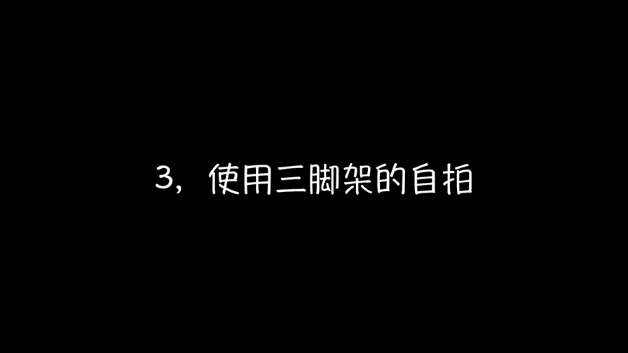
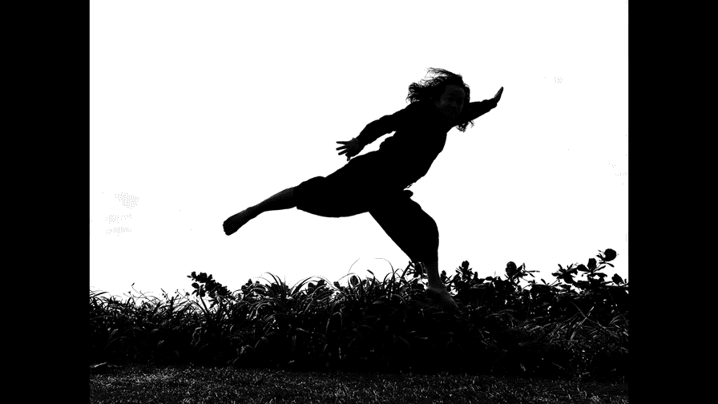
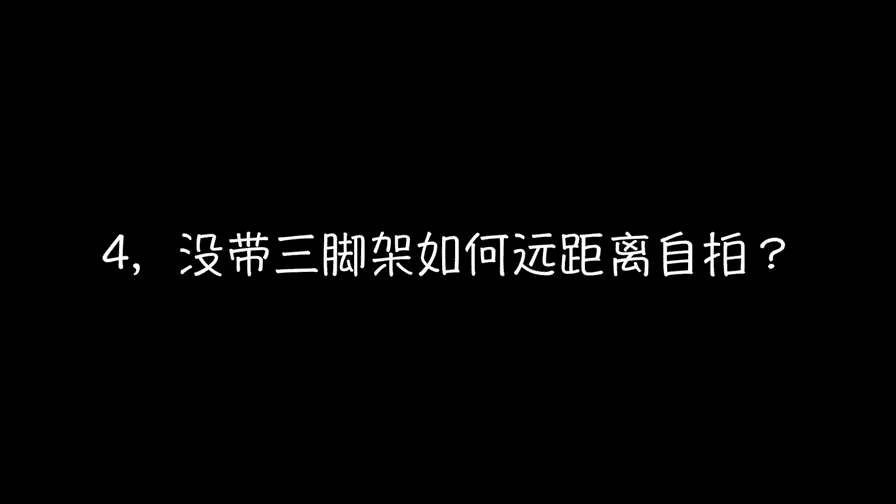
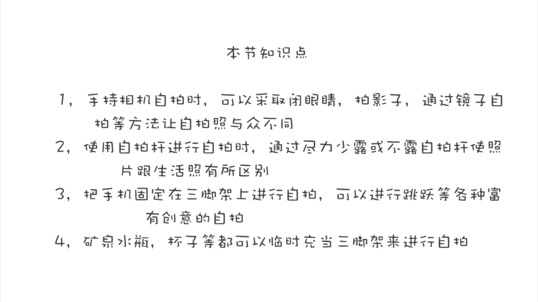

# 贾树森-手机摄影高手（完结）：3.【高手】24种生活场景模拟拍摄训练：第4讲 怎样自拍好看又不落俗套？

🎼大家好，我是大叔。现在开始今天的分享。😊。

我的这张自拍照呢是我用我的第一部智能手机啊，那是HTC的一款哈。用它来拍的，那时候手机还没有前置摄像头，我用后置摄像头啊，自己盲拍就是这样，然后对。找。拍了好多张。

然后才找到一张不错的那现在手机有了前置摄像头之后呢，大家自拍起来就更容易了。下面我通过几个方面吧，给大家说一说怎么样自拍才能够不落俗套。自拍呢大家用的最多的应该就是手持相机呃，利用前置摄像头。来自拍。

美女们通常都是斜上方45度啊。😡，那么咱们来点不一样的哈。闭上眼睛去自拍呢是一个不错的主意。不管你是在冥想瞎想，还是假装睡着了。这都会让照片看起来有一点不一样。也可以拍下我们的影子，比如说跳起来的。啊。

牵着孩子或者是爱人的手的。以及影子投在树上或者一些比较好看的岩石上啊，那这样照片都会让人眼前一亮。通过镜子来自拍呢，是我用的比较多的一个方法。我们手持相机的时候呢，我们通过镜子来拍摄。

可以把人呢拍的相对来说小一点，而不仅仅只拍一张大脸。不同的镜子呢会产生各种各样不同的效果。比如说像这个是两面墙上都有镜子，那么他们之间呢互相多次反射，从而让三个不同侧面的大树老师呢出现在同一个画面里面。

使用自拍杆来进行自拍呢，可以让相机离我们更远一点，可以囊括更多的我们自己。比如说呢手持只能拍个头像，对吧？那只能拍个特写。那么用自拍杆呢就可能能拍上半身。不过就像这几张照片这样呢。

拍出来之后更像是一个生活的记录。如果像我这样哈，在自拍的时候呢，把自拍杆给排除在画面之外啊，不像刚才那样漏那么多。那么这张照片看起来呢就稍微有一点不一样了。如果我们让自拍杆在画面里减少出现的同时呢。

我们又向旁边看，不看镜头。那么这样的照片看起来是不是又好了一些？他有点不太像是自己给自己拍的啊，更像是别人从别人的视角给我们拍过来。那这样的照片呢看起来呢就更加的具有一点艺术的感觉了。

这组照片是我在越南岘港，然后早上起的特别早，在日出的时候在海边自拍的。当我发在朋友圈里的时候呢，很多小伙伴都特别喜欢，应该说是货在无数吧哈。那当大家听说这是自拍的那就更加喜欢了哈哈。😊。

也有很多小伙伴呢打听是怎么拍的啊。稍微有点遗憾的，就是当时没有拍视频。为了给大家说的更形象一些，我在海边又拍了另外一组。大概的给大家还原和解读一下啊，这种自拍怎么拍？并不是说这种拍摄呢只能在海边拍哈。

只不过是有点凑巧。我这两次呢都是在海边儿。那你把这个拍摄场景换成是啊，比如说草原。比如说山上，比如说街道上都是一样的啊。😡，那，这样的拍摄呢我们还是需要一个三脚架。我把手机呢在三脚架上支好。大概的取景。

然后呢把它给固定锁紧。同时呢我们要找一个点去对焦啊，把焦点锁定，然后呢曝光给调整好。这个对焦的这个点呢，自己要记住啊。😡，我们要走到那个点去摆一些动作，然后进行拍摄。

同时呢我们需要把这个手机的延时自拍给打开。通常呢我们要选10秒。然后呢，当他开始计时的时候呢，我们就赶紧到达那个对焦点啊，去摆动作，然后呢拍摄。苹果手机在使用延时自拍的时候，如果那个实框是关闭的。

那么它可以在摁快门的时候呢，它是连拍10张的。那么在连拍10张这个区间内呢，我们是可以微微做一点动作。比如说跳跃啊什么的，那么他是可以把这一连串的动作给记录下来的。那么使用三脚架来自拍呢。

大家能看到它可以囊括更多的风景啊，除了是把人拍成全身的之外，让我们呢能有更多的创意的空间。在拍摄的过程中呢，自己要实时的来进行查看回放啊，检查一下刚才拍摄的情况，以便于及时的做出调整。

不过用这种方法来自拍跳跃还是有点尴尬。因为这个时间真的不是特别好把握。关键时刻还得启用这个拍摄利器哈，这个遥控快门这个时候就派上大用场了。使用了遥控快门之后呢，拍摄就特别的方便了，然后可以跳啊。

可以在镜头前面去耍呀。甚至连这个来个厕手翻也是可以的哈。那么。这个过程中啊有一点是大树老师的诀窍啊，就是特别重要的一点。那么就是在我们拍跳跃的时候呢，我们一定是在起跳之前，就要把这个快门按下去。

让它处于一直拍摄的状态。那么这个时候呢，我们才能把这个整个的跳跃的过程给记录下来。我们到时候从中挑选啊跳的最好的那个或那几个就可以了。

如果你的相机前置摄像头的像素够高的话呢，在这个过程中可以用前置摄像头去拍。这样呢你在屏幕上能看到自己比较容易把握动作和表情。手机放在三脚架上进行自拍呢，还是能拍出逼格比较高的照片的。需要注意的是。

在我们进行创作的时候，一定要留意自己的手机，不要被别人捡走了。

在我们没有带三脚架的时候呢，又想远距离进行自拍怎么办呢？比如像这张呢，我当时就是跟小树，然后坐在那儿就觉得这种感觉特别好，就想把它拍下来，可是恰恰呢就是没有带三脚架。

那么我呢就把手机给放在了地面上啊啊找了两个石头呢，把它倚靠了一下，这样手机呢就能站得住了。同样的这几张照片呢，也是我把手机放在这个桌子上，然后呢，就是用这个咖啡壶和杯子把它给夹在那儿固定了一下。

来进行自拍的。那么像矿泉水瓶啊，还有很多其他的东西，我们都可以把它当做临时的三脚架呢来使用。只要我们想可以说我们可以无时无刻不自拍。

🎼今天的分享就到这儿，我是大叔，我们下次再见。😊。