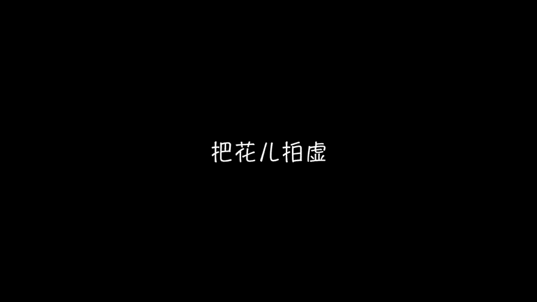

# 贾树森-手机摄影高手（完结）：3.【高手】24种生活场景模拟拍摄训练：第5讲 如何拍好花卉？

🎼大家好，我是大叔。现在开始今天的分享。😊。

想让花朵更突出。我给到大家第一个建议就是可以采用虚实对比。怎么样虚实对比呢？就是我们拍花的时候啊，把手机尽量靠近花朵去调焦拍摄。这面有两点需要注意。第一个注意呢就是我们靠近花朵的时候对焦要仔细。

不然的话很容易虚焦。第二个就是我们选择要拍摄的这个花朵的时候呢，要留意使它离其他的花朵或者是背景，有一定的距离，不然呢虚化效果也不好。我给到大家的第二个建议呢，就是要注意画面当中的色彩对比。俗话说。

红花还得绿叶来配是吧？我们在拍摄花朵的时候，不要只拍一种颜色的花。我们可以让比如说拍点叶子呀，或者用另外一种颜色的花呢来衬托我们现在要拍的这个花朵。那通过这样的色彩对比呢。

会使我们要拍的这个主体会更加的突出。第三个给到大家的建议呢，就是采取明暗对比的方式，让花朵呢更加的突出。比如说我们可以把花朵放在相对来说比较暗的背景里面。那么这个花朵呢会因为明暗反差的对比而更加的突出。

如果我们的照片能同时满足虚实对比、色彩对比以及明暗对比，那么我们这张照片呢将会是一张非常不错的拍花的作品。我们先来看看用顺光拍画是什么样哈。那么顺光的特性，我们前面讲过了，它其实呢它的光比较均匀。

但是拍出来的片子呢它会比较平，对吧？😊，那同一朵花我们呢稍微转一下方向啊，让它处于一个测光的位置。我们来看一看啊。那么测光的这个特性呢是比较有立体感啊，会让这个花呢看起来稍微立体一些。

同时呢它跟背景也能脱开一些，对吧？那么平光的时候它跟背景容易融在一起，用逆光来拍花呢，它会使花瓣啊这个叶脉呀都比较清楚啊，花瓣的感觉呀，呃，能看的特别的真。那么逆光拍花呢，它有一个问题。

就是如果说这个花特别的厚啊，特别厚重。那么用逆光拍呢就不太合适。因为它打不透。所以呢我们就看不清花瓣的一些形状呀，一些叶脉的感觉呀，有很多攻略会告诉大家说，千万不要用逆光去拍花啊，这是忌讳呃。

但是我却不这么认为啊，我其实是蛮喜欢用逆光来拍花朵的。那么用逆光拍花的时候呢。啊，我们要留意这个曝光啊。我们把曝光呢尽量的往上调一调，就是把它调亮一点。同时呢我们把HDR给打开。

让它有更多的层次记录在这个照片上，也便于我们后期再来进行制作。那么用逆光来拍花的时候呢，其实最好的时间呢是清晨和傍晚的时候，因为这个时候光线的反差不是很大。同时呢我喜欢用逆光来拍花的一个原因。

也是因为用逆光来拍花的时候呢，它的颜色特别好看，也有一种暖暖的黄调子啊，它的气氛非常好。当然测光也是一个不错的选择。另外一种我常用来拍花的这个光线呢就是测逆光啊。

什么叫测逆光呢？就是这个光线呢？位于逆光和侧光之间的一种光线啊，那么这种光线呢容易给花朵勾勒出一个亮边，同时呢它又具有一些逆光的特性，拍出花来呢就特别美，也容易呢跟背景脱得开，花呢也特别的醒目和突出。

用逆光来拍花，有的时候有一个问题就是太阳的问题啊。如果太阳直射进镜头的时候会有吃光啊。那么这时候我们尽量用一些花朵呀、树枝啊等等，把太阳呢给挡住啊，这样呢就没有这个耀眼的光斑了。

还有一种我特别喜欢用的光线呢就是局部光线。我们可以寻找那些从树缝里边啊，叶子叶子缝里边啊，花朵缝穿过来的阳光啊，透过来的这么一点局部的光线。那么这一缕光线呢把我们想要拍的东西给打亮了。那周围是暗下来的。

那么利用这个明暗对比，让这个花呢特别的漂亮，特别艳丽，也有一种中星捧月的感觉。像这样最后的一抹夕阳产生的一个局部光线呢。会让这个顺光也能拍出不俗的照片。很多时候我们会遇到光线不好的情况。

比如说傍晚黄昏的时候，我们意犹为继还想拍啊，怎么办呢？那么这时候我们可以用手机上的手电筒来作为一个照明光源啊，把花朵给照亮，从而改善我们拍摄的光线条件。那么用这个手电筒的时候呢，要注意啊。

就是不能离花太近。不然的话呢，这个光会比较硬啊，花呢也会过亮。同时呢我们要注意变换光线的角度哈啊不要让光线打的太平。你像这个如果太平呢就不好看了，对吧？然后本来是个平光。

我呢用这个树枝或者是其他的花呢挡了一下，就模拟了一下阳光穿过来的这种感觉啊，有点阴影，那么拍出来呢就有点像在阳光下拍的感觉啊，特别的有。😊，光影的感觉。拍花的构图上呢，我给大家先说第一个吧。

就是比较忌讳的，不要构图太满啊。就是比如像这种花呢特别繁茂的，我们比较忌讳把它拍的满满当当，就是满屏幕全是花啊，这个时候构图啊要注意疏密有致啊。比如说你偷点天空啊呃枝条当中露点缝隙的这种啊。

选择这样的枝条来拍啊。😡，就会比较好一些，派的太满，容易让人觉得喘不过气来啊。那么给点缝隙，让大家透气啊。那这样照片呢让人看起来也比较舒服。第二个，关于构图的建议呢，是在拍花的时候要尽量留白啊。

就是让它旁边呢要画着旁边有一些空白的地方，就是像国画那样去留白，让花呢有一个延展的余地，让人呢有想象的空间。另外一个关于构图方面呢，就是建议大家在处理一些花朵的排列啊，或者有枝条的时候呢。

尽量对角线构图啊，可以略微旋转一下手机，让树枝倾斜。呃，这个时候就比要拍的横屏竖直了，呃，容易显得矮板。当然其他的一些构图方法，比如像中心构图法，也是很适合来拍花的。大家根据实际情况灵活运用。

很多时候我们喜欢把花拍的特别大，充满了整个画面。比如像这样中心构图，那么这样拍呢不错，很好啊，让人能看到花儿一些细节，但是呢不要把所有的花都拍成这样，除了花的特写之外呢，我们也可以多拍几朵花。

当然我们如果遇到特别美的单朵花呢，我们也可以把它拍下来。除此之外呢，我们也可以拍一些树枝上的花啊，或者是花的一个全景啊，一大片花。也是很美的。像接下来的这两张图呢，我同时都是把别的树绿树也拍了进去。

那么这个在绿树的掩映下呢，这一片樱花呢显得更加的娇艳欲滴和引人注目。你比如这个场景吧，我拍下来这个画面呢是近处有一棵树，我拍下来几根树杈。那么远处呢又有好几棵樱花的树。那么这个呢有一个远近的呼应关系。

所以我们在拍花的时候要注意这种拍花的大小的变化啊，这样会使画面更加的丰富。其实想要花朵更突出呢，还有一个就是要求尽量干净的背景。我在前面只讲了三个对比哈。那么这个时候我要跟你说一个，想要花更突出。

还有一个要尽量干净的背景。但是是不是必须是全黑或全白纯色的背景，完全没有杂色的背景。才是最好的呢。答案是不是啊，特别干净的背景呢确实是容易使花朵更加的突出，但也容易使画面略显单调。

所以我们拍花最好呢就是带上一些环境，或者是枝杈，或者是花的叶子，甚至是落在地上的花瓣，这样有选择性的去利用背景的景物，实现虚实结合，前后呼应，从而使画面呢更加丰富和耐看。我们面对着这样一束花哈。

这种小矮花种在地上的，我们拍来拍去，比如说拍个全景，拍个近景呃再拍个特写啊，或者是在略待角度的一种特写。那么拍来拍去还就是这样。😊，这个时候我们就需要变一个视角，大家可以想象一下。

我这张照片是怎么样拍出来的。😡，大家看看哈，我就是这样趴在地上拍出来的啊，也就是说我们可以变个视角，采用仰拍的视角来拍这么矮小的花。那么这种视角是大家平时不会去这样去观察这个花的对吧？

那么就给大家一个眼前一亮的感觉。啊，如果我们碰到了像这样的景色啊，这个花树呢这个樱花树啊正好在。湖边啊，我们可以拍一下水中的倒影，这样拍出来照片呢就比较有创意，比较有新意。那大家看起来呢就会有新鲜感。

我们还可以把镜头对准落在地上的花瓣，寻找一种落英缤纷的感觉。当然，我们在拍花的时候，也可以把花的影子同时取进画面，或者干脆我们也可以故意把花拍虚。这些拍花的小花招，有助于大家拍出那些别具一格。

独树一帜的拍花的照片。那么大家也可以自己再去挖掘一些新鲜的拍花小绝招。

🎼今天的分享就到这儿，我是大叔，我们下次再见。