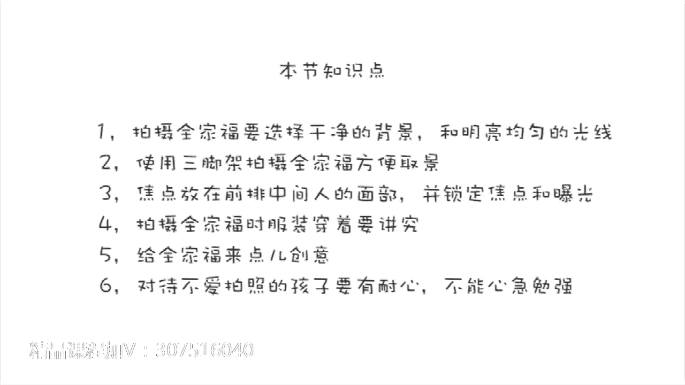

# 贾树森-手机摄影高手（完结）：3.【高手】24种生活场景模拟拍摄训练：第6讲 怎样拍好全家福？-

🎼大家好，我是大叔。现在开始今天的分享。😊。

在我们的家庭影集和手机相册里面，有一种照片是一定不会少的。那就是全家福。看起来小小的一张全家福呢，其实这背后啊他拍摄的门道还是不少的。下面我先分别的把这些小门道呢告诉大家。然后呢。

我再通过一次真实的拍摄全家福的一个记录，跟大家把这些小门道呢串在一块儿，并且呢。在这当中，我还要跟大家说一个特别重要的，就是在全家福的拍摄过程中，怎么样来搞定那些不愿意拍照的孩子。

拍摄全家福呢首当其冲的，我们就要选一个背景。一般来说，不管是在室内还是在室外，我们都建议大家选择那种尽量干净的背景。或者是对自己家有特殊纪念意义的背景。在光线的选择上呢，尽量选择。

顺光或者是略测一点的光线。如果是在室内的话呢，也要选择光线明亮的地方。同时要注意我们每个人的脸上都能获得比较均匀的照明。拍摄全家福一个必要的附件呢，就是可以当做三脚架来使用的自拍杆。

有遥控快门当然最好了。如果没有这个三脚架的话呢，就只能这样来拍合影了。能想出用镜子这一招也是蛮拼的。这种两用的自拍杆呢比较方便灵活。因为有的时候我们在旅途当中比较匆忙。

或者是呢那个地方没有办法去架设三脚架，所以呢用自拍杆来小范围的拍合影。比如说像一家三口的这种合影呢，是比较灵活和实用的。这个时候我们通常都是使用手机的前置摄像头来拍摄。

那么我们可以从屏幕上看到自己的表情啊、动作呀，可以随时调整。拿自拍杆的人呢要注意自己不要离手机太近，不然的话呢容易变形比较厉害。人会显得太大或者是太胖。如果拍全家福的时候，人比较多啊。

比如说像我家就比较多，我兄弟姐妹比较多哈。那么这样的话呢，就需要去安排每个人的位置。去排列一下。比如说像我们家这次呢就是按照家庭为单位啊，大概的话堆去排的。同时呢还要留意啊，看看是不是有人被挡住了。

这个是非常重要的。如果人少呢，也可以排一些比较有创意的。比如说像这种啊从前往后排成一排。那么这个时候呢，我们对焦一定要注意啊，焦点是要对在最前面这个人的脸上，并且把焦点锁住。这个怎么锁焦点。

我们前面已经讲过了，同时把曝光调整到合适的位置。拍全家福的时候呢，最好大家都能盛装出席哈。有那种比较有特色的，比如说唐装啊等等，那是最好的。如果实在没有，像我们这样穿一个亲子装也是不错的。如果这也没有。

那么我们大家尽量穿的相对来说漂亮一点就可以了。当然，拍全家福呢最重要的是人，只要人都在，那么就是最幸福和最开心的。拍全家福的时候，如果总是拍拍在，时间久了呢，可能会觉得有点缺乏新意哈。

那么呢我们在拍全家福的时候呢，可以想点折啊，改变一下策略。比如说呢我们可以设定一个情境啊，就像这样，我抱着小树呢去踩水玩啊，那么这个过程中呢去抓拍，就很开心，也可以抱着小树，我们一家三口一块跳起来。

再或者呢我们可以把手机放在地面上向上仰拍，或者我们也可以更大胆一点，我们干脆只拍我们身体的某个局部，比如我们一家三口的脚，或者一家三口的拖鞋，用三片新型的叶子来代表我们家三个人。😊。

如果实在想不出好点子，我们也可以从别人那里汲取一点灵感。借鉴一下他们的创意。

接下来呢是18年狗年春节的时候，我们全家在三亚一个酒店啊，过春节的时候，我们拍全家福的一个实况。我现在在寻找拍摄的背景啊。最终呢选择了泳池边儿上，然后呢，背景是泳池远景呢是酒店，还有椰子树。

蓝天白云非常漂亮。然后这个方向它也是顺光的一个角度。那么学好了之后呢，我把手机呢固定在三脚架上，把它织好。先呢让树妈在那儿做一个定点啊啊来进行对焦。并且把焦点锁定，然后呢调整曝光。弄好之后呢。

开始安排其他人赎姥姥呀。输姥，你先坐好，你把裤腿弄一下啊，预留出我跟小树的位置。好的，万事俱备，只欠东风就差我了。我来啦哎。😊，结果呢哈哈我过来之后呢。😊，小树今天不配合呀，他正玩的高兴呢。

所以他不愿意拍照站着也行，刘瞅瞅啊。😊，哎呦，那怎么办呢？他玩他的呢，他还沉浸在他的游戏里面呢。好吧，我们遇到了第一个难题。可能也是唯一的难题吧。我知道大家在拍摄全家福的时候。很多都会遇到这样的问题。

呃，如果有孩子在的话，那在大多数情况下，孩子都不是特别喜欢配合家长来拍照。那怎么办呢？我先采取第一个语案啊，就是大人们都看着相机，我们呢尽量引导孩子去看向相机的方向。这个时候千万不能跟孩子着急。

不能跟孩子强制他必须怎么怎么样。那么这时候如果这样做呢，就是特别会引起他的逆反。如果家长在这个时候用墙生气。啊，呵斥孩子，那么孩子的情绪肯定就低落了下来。那么今天这个千家福肯定就泡汤了啊。

孩子即便勉强参加了拍摄，表情也会很差很差。所以这时候我们尽量引导他。家长这个时候呢要分下工啊啊，有一个家长呢去耐心的引导孩子。另外一个家长呢伺机抓拍，这样去拍了几张之后呢，我又改变策略哈。

我把小树给抱起来啊，悠它啊，这样一动起来呢，就打破了原先的这个状态哈，在这个过程中肯定会有一些非常好的瞬间。此时呢是树妈负责抓拍啊，我们还是拍到了一些很有意思的照片的。我这一计不成，又生一计哈。😊。

好坏呀，然后我趁着这个查看照片的这个时候呢。把这个小树呢给整到。🎼手机这儿就是啊，小树哪去了。哎呦，太可惜了呀，对吧？大家能看到，在我和淑妈的这两个老奸巨猾的加攻之下，小树果然上当跑过去。

自己参与到这个拍摄当中了。虽然不是一步到位哈，那当然孩子呢毕竟是孩子，他玩心很重。那么这时候家长们呢就是要耐心啊，然后慢慢的跟他玩，一步一步的把他给引到呃这个拍摄当中。同时这个过程当中呢。

我们也可以去抓拍，能拍到很多特别有意思的瞬间。那么这些瞬间呢，说实话你摆呢你是摆不出来的。最后有两个方面要提醒大家注意。一个呢就是在室外拍摄全家福的时候，我们要随时注意光线的变化。

因为有的时候可能天上没有云啊，太阳光呢也不会发生什么变化。但是像我们拍摄的那天呢，天上的云比较多，又有一点风。这个云呢在天上它是不断的动的，所以有的时候这个云呢就把太阳给遮住了。

那么这个时候光线就发生了变化。呃，因为拍摄全家福的时候，我们把这个曝光给锁定了，对不对？所以光线变化的时候，这个相机呢它是不会发生曝光的自动改变的。那么我们要随时对曝光做出调整，不然的话呢。

容易发生曝光失误。另外一个呢，就是在室外使用这种小三脚架的时候，一定要放稳放好，不然的话就容易像这样啊，这时候我的气皮已经进这个树丛里面去了啊，幸亏是进树丛了，差一点掉到泳池里面去了。

可以找一个比较重的东西，把三脚架的下边的山脚呢给它压住啊，压稳，这样就不会倒了。

🎼今天的分享就到这儿，我是大叔，我们下次再见。😊。

