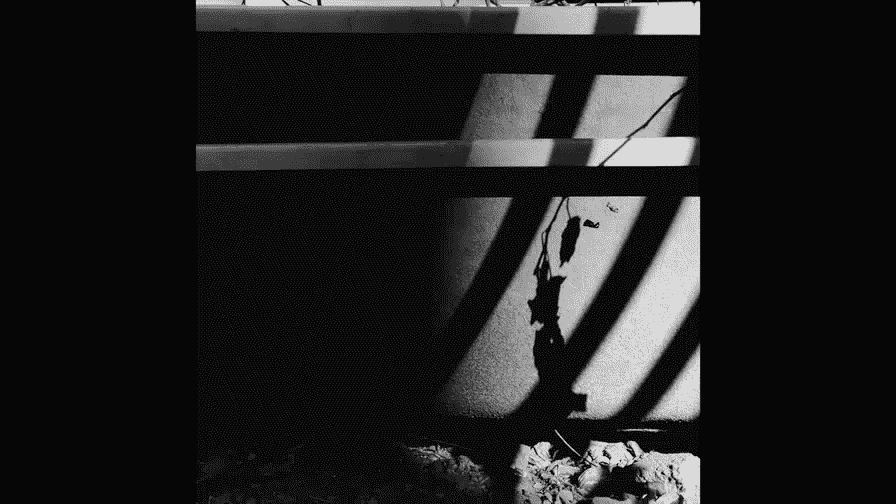
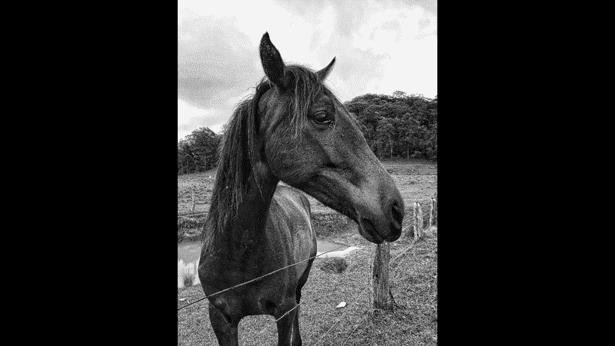

# 贾树森-手机摄影高手（完结）：3.【高手】24种生活场景模拟拍摄训练：第7讲 如何在恶劣天气下拍好照片？（1）

🎼Yeah。🎼大家好，我是大叔。现在开始今天的分享。😊。

这个恶劣俩字呢容易把人吓到哈。其实这个恶劣呢我打了引号，主要呢是相对于晴天来说的哈。那么我们拍照片大抵都希望是晴天，万里无云啊，光线充足等等之类的啊，确实是在这样的光线下呢，我们有很多光影啊。

很多东西可以去拍，然后拍的照片呢颜色也丰富啊啊光线的变化也比较分明，空气也比较透彻啊，总之各种好吧啊。😊，呃，但是呢。天气不是我们所能决定的对吧？有的时候呢。物业密布啊。下雨下雪有雾，对吧？

那么这样的天气我们是没有办法改变的。我们唯一能做的呢就是接触它啊，在这样的天气呢，也努力去拍出好照片。

我们通常会想啊，在这样的天气下可能拍不出什么好照片来。然后这个时候。大抵都缩在家里面，但有的时候比如说我们碰巧在旅游的途中啊，赶上了这样的天气。你比如像这张照片呢，就是在旅游的途中啊，就是碰到了阴雨天。

那怎么办呢？😊，所以其实呢啊我们要练习在这样比较所谓的恶劣天气这个条件下呢去发现去拍摄一些照片出来。而其实呢在这样的天气中往往能拍出一些出乎我们意料的好照片。那在这样的天气里面该怎样去拍摄呢？

我们先从他们的光线特点来说起吧，我们先来了解一下阴天的光线特点吧。阴天呢通常天空中阴云密雾哈。光线相对来说比较暗。但是在它不下雨的时候啊，大多数时候的阴天呢整个的天空啊就像一个巨大的柔光箱一样。

大家知道我们在影棚里拍片呢都要用闪光灯啊，闪光灯前面要加一个柔光箱，就是为了让光线变得柔和。而在阴天的时候呢是一个天然的大柔光箱啊，大家注意我们脸上的光线都是比较柔和的。

而且这个时候我们拍一些地面的景物，它的光线也是比较柔和，同时。阴天的色彩饱和度是比较高的，它不像晴天那样，然后各种反光哈，各种光斑。那么阴天的光线呢是比较柔和的。同时呢景物饱和度是比较高的。

这光线一柔和了之后呢，我们对于事物的这些层次表现呢就会比较多。比如说像这个。这么黑的这个羊驼哈，那么大家能看到啊，它的层次表现呢是非常丰富的哈。阴天的结果呢有的时候会下雨了，是吧？当真正下雨的时候。

光线就变得比较差了。其实呢是在雨中的时候是不太适合拍照片的。当然了，在雨天的时候也是特别有某种氛围，某种气氛，特别适合小叔啊呃在不愿意上幼儿园的路上啊，这种气氛对吧？有一种忧伤的气氛。

雨天的光线我们刚才说了特别差，所以呢我们一定要留意把手机呢要拿稳端住啊，不然的话很容易虚。那么在雨天的时候呢，地面就会湿掉，对吧？所以我们可以利用一些霓虹灯啊。

在地面上呢形成的一些倒影啊、光斑啊之类的来进行拍摄啊，利用这种橱窗的光线呢来照亮孩子的脸啊改善一下光线啊，也是别有一番味道的。相对于晴天呢，雾天也是一个比较特殊的天气状况哈。那么大家看看这张照片呢。

是我在一个公园里面拍的。然后它有一个湖哈，早晨起来的时候雾比较大，雾天的光线呢其实跟阴天有点类似，不过呢它跟阴天不一样的是啊雾天的时候呢，远处的景物呢都看不清楚哈。这本来可能是一个劣势。

但是呢我们也可以利用一下，把它拍成呢像类似于国画的那种啊效果哈。我们经常在天气预报里听到雨夹雪的名词是吧？那么雨跟雪有的时候常常接伴而来，甚至有的时候你分不清到底是雨还是雪。

那么下雪天的光线跟下雨天的光线其实是差不多的。当雪正在下的时候，光线也是相对来说比较暗。唯一不同的是呢，雪可能不会马上让你的衣服变湿。但像现在这种呢，基本上就是雪到了地面马上就融化了。

当然这跟季节有关系哈。下雪天的光线呢也会比较暗，在大多数时候，嗯，这个时候还是要注意，我们要把手机端住啊，避免虚掉。在另外一个呢，下雪线有个特别大的特点。如果地面上的积雪已经很多了。

那么这个时候曝光我们就要注意了。因为这个时候拍出来照片通常会比较暗，所以呢我们在拍摄的时候要把曝光呢稍微往上调整一下哈，避免曝光不足。但是白雪呢其实也有好处哈。

它有的时候当我们人脸呢靠近雪比较近的时候呢，它会起到一个特别强的反光作用啊，让我们的脸上啊光线会比较亮。但然这是指在雪停了的时候哈，如果雪正在下的时候呢，其实也没有那么强的光线了。

这阴天、雨天、雾天、雪天，他们的光线特点大概就这样。下面我们根据这些特点呢，给到大家一些拍摄的小建议哈。那第一个建议呢就是运用框架式构图在合适的时候，比如说这只猫嘛它在那呆着，拍起来呢平淡无奇啊。

如果我把这个大铁门的栅栏哈，当做一个相框，把猫呢框进去。哎，那么这个就觉得有意思了哈，把后面呢那些平淡无奇的景物呢给它排除在画面之外了，同时呢也改善一下，由于阴天造成的光线平淡。😊。

阴天的天空呢常常是阴云密布哈。那么这些阴云呢其实是我们拍摄的特别好的一个素材。而且呢它有的时候变化莫测哈特别的丰富。所以这个时候我们可以把镜头对准天空啊，拍摄天空中的云，有很多惊喜出现。其实。

如果只拍天空有点单调的话，我们可以给天空再加点材料。比如说我们把旁边的楼也拍上是吧？啊，或者是把经过的飞机或者是飞鸟什么的啊，拍到画面里面去，这样呢使得我们的照片呢就更加的丰富一些。

在阴雨天呢拍摄风景的时候，我们要把地平线放在什么位置呢？嗯，这个呢啊其实是在后面风景里面会给大家讲。但是呢现在我要跟大家说一下，先啊就是我们要根据天空中的云的感觉来确定地平线的位置啊。

像现在这样的天空中的云呢特别的丰富，我们就可以把呢天空多占一些啊啊地面少一些。😊。

但是呢如果天空呃白花花一片，那么这个时候我们可以适当减少天空在画面当中的比例，甚至呢我们可以让天空占更少的比例早。

