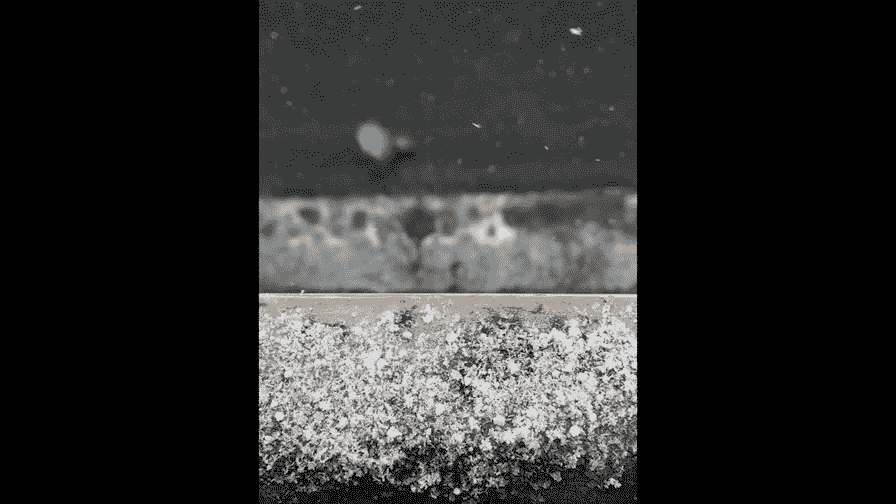
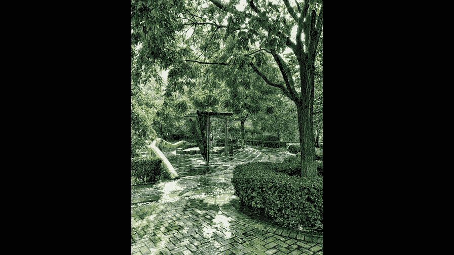
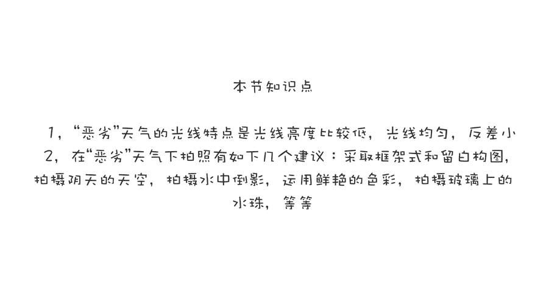

# 贾树森-手机摄影高手（完结）：3.【高手】24种生活场景模拟拍摄训练：第7讲 如何在恶劣天气下拍好照片？（2）

去表现地面上的这些景物。在阴天拍摄的时候呢，还要注意深浅色调的一个搭配哈。因为阴雨天它的反差比较低啊，光线柔和，对不对？所以我们这时候可以利用一些深色的东西呢啊把这个画面当中的反差呢给拉起来哈。

他们当中呢就形成了一个对比，从而使照片的影调呢更加的立体和丰富。

同时也是因为啊阴雨天气它的光线比较柔和平淡。那么我们可以在这样的天气拍摄的时候呢，给画面当中适当的啊增加一些鲜艳的色彩，比如说你拍孩子的时候，可以给他换上颜色特别鲜艳的衣服哈。

或者拿着一些比较颜色鲜艳的工具啊等等啊，或者是呢你在画面当中去有意的增加一些色彩鲜艳的元素啊，比如说像颜色鲜艳的柱子啊、花朵呀，甚至一些树木啊等等哈，让这个照片，它的色彩丰富起来。

还有呢当雨天的时候有积水哈，像这张照片这样，我们可以运用倒影哈，去拍很多特别有趣的啊照片，比如说像现在啊一个小水坑特别浅哈。你看我在这儿先取好景影，然后呢大家能看到楼的这一个倒影在里面。哎。

正好有一个人经过哈，谢谢这位模特哈，我拍到了一张非常不错的照片。我拍完之后呢，把它给调了180度。😊，啊，那这样照片呢看起来就很有趣，对不对？还有马路上经过的自行车，也可以这么去拍。

甚至像一些车辙里面呀，或者是桌子上的一些积水啊，都会产生非常有趣的倒影。这就是以后马路边的一个小水坑哈。我在那儿来回蹦了几次哈，就得到了这一组照片啊。😊，在下雨的天气里面呢。

我们可以多去关注一些挂在玻璃上的水珠哈。🎼大家可以看一下这个就这种水珠呢，它是特别适合表现某种啊气氛，某种情绪哈。我们可以靠近啊仔细的去对焦，把它拍下来。那么在一些时候呢，玻璃上的水珠是清楚的。

而外面的景物呢是虚幻的哈，给人一种特别梦幻的感觉。我们也可以在构图的时候多做一些留白的构图啊，就是组织构图时呢把一些白白的天空呀多留一些在画面里面。或者你像白雪，我们拍白雪的时候，也可以利用大面积的白。

然后来构图啊，就有点类似于国画里面的那种留白构图啊，给人一种想象的空间。在阴雨天拍摄的时候呢，我们可以适当的去使用黑白来表现。

当一些景物呢不是特别的出色，或者颜色呢比较单一的时候，我们可以把它做成黑白效果。哎，这个时候往往呢能取到不一样的效果哈。比如说像这个车折里面的一汪水啊啊彩色上没有什么特别丰富的地方。

但是我把它做成黑白之后呢，这个当中的黑白影调还是很丰富的。所以有的时候使用黑白灰呢，往往更能突出我们想要表现的景悟，或者是我们的情绪。搬水的雨的有的时候往往会有闪电啊，我们也可以用手机把它拍下来。啊。

拍摄技巧呢主要是一个用连拍啊，就是一直拍拍拍拍拍拍，可能会抓到一个。再一个呢也有人用录像的手段啊，一直录。然后呢，等他。录出来之后呢，你再使用截屏啊，把那个画面呢给截下来。当然还有更好的一个手段。

我们会在夜景的里面给大家介绍一个软件啊，可以用那个软件来拍闪电。在大场景之外呢，我们还可以运用一些特写镜头来表现一些细节啊啊。在这样的天气里面呢，比如说像水滴呀，像雪地里面的一棵枯草呀。

甚至我趴在雪地里的这些一折的印儿啊，我们都可以把它拍下来。然后。😊，其实还蛮有趣的，对不对？我们也可以靠近啊去拍一些落在栏杆上的雪花呀，甚至飘在天空中的雪花啊，我们去把这些细节拍出来呢。

能给大家以更强的一个信息传达啊，甚至给人一种震撼。

除此之外呢，雨后出晴也绝对是拍照的绝佳时机哈。那么这个时候各种景物啊都被洗涤一新啊，焕发着全新的生命力。

有的时候我们也会在天空找到一些惊喜。甚至是彩虹。跟雨后出晴一样哈，雪后出晴也是拍照的大好时机。这个时候光线又好。然后呢还有白雪啊，同时呢呃白雪在阳光的照射下呢，还有反光啊。那么在这样的时候去拍照。

第一呢不冷。第二呢，光线又好。呃，我们不管是利用顺光啊，测光还是逆光去拍摄，都能获得特别好的啊光线照明也能拍出特别漂亮的照片哈。

哎，列了好多这种小建议，那列不过来了，其实还有不少。😊，总而言之，一句话呢就是希望大家转变一下思维啊，在不太好的天气的时候呢，也要努力去发掘，去发现啊在这样的天气，其实也是能拍出不错的照片的。

🎼今天的分享就到这儿，我是大叔，我们下次再见。😊，🎼。