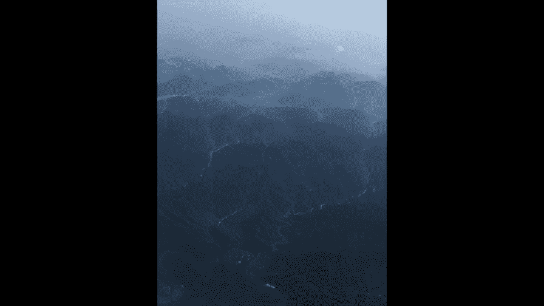
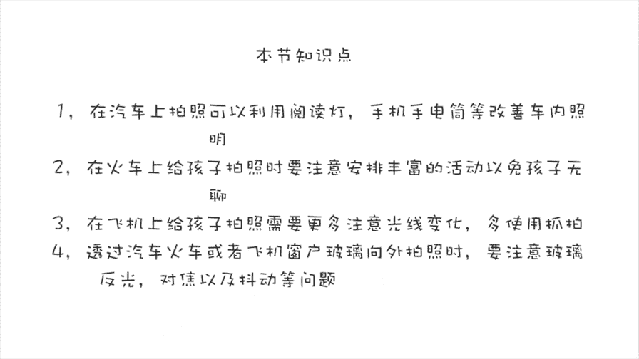

# 贾树森-手机摄影高手（完结）：3.【高手】24种生活场景模拟拍摄训练：第8讲 如何在汽车、火车、飞机上给孩子拍照片？

🎼大家好，我是大叔。现在开始今天的分享。😊。

很多小朋友都特别喜欢汽车，尤其是小男孩，小树呢也是这样。有一个阶段，他会经常的要求去玩方向盘，询问车上的各种按钮啊，或者是玩阅读灯。这个阅读灯呢，在光线不好的时候，是很好的照明光源。

我们可以好好的利用一下，比如像这张呢是在地下车库的时候，光线很暗，后边这两个车门上面这个阅读灯呢，其中一只呢给小树和树妈脸上提供了正面顺光的照明。另外的一只阅读灯呢是形成了一个逆光的照明。

当小树稍微大了一点之后呢，他在车内的活动范围以及动作的幅度都特别的大。那么单靠阅读灯呢是很难把它记录下来的。所以这个时候我们可以用上手电筒啊，去增加一个辅助的照明。不管怎么说。

在车辆静止的时候都还好说哈。那么车一旦动起来了。比如说现在我们是做一辆中巴车那。啊，在傍晚的时候，这个光线是不足以把它们凝固下来的，所以拍出来呢基本上都是虚的。即便是偶尔有路灯照进来。

那么这个光线呢也是勉强啊，拍摄起来有很多会虚掉的。这样的时候，在不影响车上其他乘客的前提下呢，我们可以打开。另外是手机的手电筒。来进行一个额外的照明啊，这样的话呢我们会获得相对来说比较清晰。

质量比较好的图片。这个时候最重要的要记住，一定要把手机端稳，因为车还是比较陡的，因为它在开，对不对？另外一个就是要注意，这个时候就不要拍那些动作过快的瞬间了。因为它很难凝固下来。

在白天的时候光线就好多了。即便是这个车在开，也基本上没有什么问题。你要坐的呢，就是把握光线的方向，以及呢动作瞬间就能拍到一些比较精彩的照片。那么像这种旅游大巴上坐的这个位置也是比较有讲究的。

一般来说我会坐在过道的对面，或者是稍微偏前错一个座位，这样拍摄起来啊，这些角度和视角呢会比较好，便于取景。因为小树的奶奶家呢住在沈阳，所以我们经常会坐高铁动车啊，去沈阳去看小树奶奶。

那么我相信大家也会有很多啊这种坐火车出行的机会哈，那么在车上呢给孩子拍照片呢？呃，我们会面临第一个问题就是可能像座位上桌板上会放很多杂七杂八的东西。那这样拍出来照片呢就比较杂乱。

所以我们尽量把它要挪开一些。在火车上碰到的第二个挑战呢，就是小朋友们通常会感觉到比较无聊。因为大人呢可以看看书啊，刷刷微博微信，那小朋友怎么办呢？但杀手锏就是看动画片，对吧？

趁着小朋友老师呢可以多方位多角度的去取景，并且利用前景。尝试框架式结构等等。但是要注意不能让孩子离电脑太近啊。同时呢即便是看动画片，孩子特别开心，也要控制看动画片的时间，不能时间过长。

那接下来就剩下什么，比如说吃东西啊，小朋友也都喜欢的可以带一些小朋友们喜欢吃的零食，这些零食除了可以让小朋友打发时间，变得开心。我们家长呢也可以在旁边抓拍很多其中有意思的瞬间。

甚至我们可以用吃剩下的果皮做一个创意小游戏。家长呢也不要总是刷手机，总是看书啊，多陪陪孩子一块玩一玩。这样坐火车的小朋友呢会感觉到开心和快乐一些，触妈也会给小树呢有选择性的带一些书在火车上看。

比如说像这本火车揭秘呢，在火车上看呢，就特别的应景哈。看完之后我们可以带孩子火车上去转一转，啊，找一找相关的一些东西，劳逸结合，可以到这个了解车厢的连接处呢去待一会儿，在那个地方呢有很多按钮啊什么的。

小树呢会对这些比较感兴趣啊，经常会在那问半天。这个听起来有点。😊，像是我在教大家在火车上怎么带孩子是吧？但其实不然哈。😊，那么我们拍孩子其实拍的是亲子关系，我们只有让孩子有的玩，有的干。玩的开心。

我们才能拍的好。这其中当然会用到一些抓拍的技巧。这些技巧呢我们在之前十6课里面给大家讲过，所以在火车上给孩子想拍好照片。第三个要面对的问题就是善于使用抓拍。第四个。

在火车上要应对的挑战是火车上的光线变化莫测，也可以这么说，因为有的时候可能是逆光，有的时候顺光。有的时候太阳呢直射了进来，照在脸上，有时候又突然开进了隧道。所以那这些呢都需要我们很好的去把握这个光线。

同时呢也要把握构图，避免呢把一些乘客过多的给拍进来，这样会容易引起呢别人的反感。好，火车的故事讲完了，让我们去赶飞机吧。这么快就上了飞机了哈那上了飞机第一件事，大家通常都干什么？😊，自拍对不对？呵？😊。

顺光啊、逆光啊，或者是来点创意，整个仰拍。其实自拍这么大幅度的仰拍呢是不太合适的，已经变形了，不说还拍出了双下巴，对吧？😊，好吧，还是拍孩子去吧。这是小树呢第二次坐飞机，第一次坐飞机的时候，他还小。

据他自己讲的，他已经不记得了。那坐飞机在飞机上拍照呢。首选的位置，当然是靠近这个悬窗边上是吧？那这个位置光线是不错的。但是如果我们从里面往外边拍的时候呢，通常都面临着逆光的情况啊。

因毕竟呃室外的光线还是比较强的那这个时候我们尽量把那个曝光啊往上调一调，让孩子脸上呢有有一个比较明亮的曝光，不然呢脸就容易黑。但是如果我们想表现窗外的一些景色，一些景物。

那么呢我们就把曝光呢往下拉一拉啊，让曝光暗一点，照顾一下窗外的景物，让窗外的景物呢能够看清楚。飞机上都有一个叫阅读灯的东西哈。那小树候刚头的时候特别新奇啊，特别。想去摁，把它摁亮。那这个阅读灯挺亮的。

然后如果孩子扬起脸呢去看它的时候，正好是顺光。但是如果我们坐在那儿，然后这个阅读灯打在脸上这个光呢就比较恐怖了。然后它是一个顶光，所以这一点呢我们要注意啊控制一下光源这个方向。

小朋友们在前几次坐飞机的时候呢，都通常会比较兴奋，感觉到特别多的新奇的事儿哈。小时候呢经常会把小手呢按在悬窗上，这也是一个非常有意思，值得留下的瞬间。通常最好的拍摄角度呢就是坐在同一排啊，挨着坐。

那如果没有在同一排呢，前后排这种哈，我们可以呢通过这个座椅的缝隙啊，去拍一些孩子的瞬间，这也是用手机拍照的一个天然优势。因为它比较小巧，比较灵活，可以通过这样小的缝隙呢去拍照。那么单反呢就望洋星态了啊。

那这些时候呢我们可以跟孩子有互。动也可以呢把这个快门的声音给它关掉啊，采取静音快门，不引起孩子的注意啊，偷偷的进行抓拍。这样更能够抓拍到孩子比较自然的一些动作和瞬间。如果飞机比较大哈。

孩子坐在中间这一排啊，那么这个地方呢，它的光线呢是不太好的，尤其是两边的悬窗都把那个遮阳板给拉下来了。那么光线就比较暗。那这个时候呢我们可以通过椅背上的这个屏幕呢这个亮度啊，改善一下光线。

但这亮度其实是还是比较有限。那么这时候呢我们可以把阅读灯给打开啊，啊，找到合适的光照方向啊，能够拍到一些照片。另外一个呢就是。把悬窗的这个遮阳板打开，这样呢会把这个亮度呢。给得到很好的一个改善。

飞机上的光线呢还是比较复杂的，再加上孩子可能动作也比较快，需要比较强的抓拍能力和对光的把握能力。这个呢需要大家多多练习，才能够熟练的掌握。在车辆静止的时候呢，我们从车窗往外拍照呢，相对来说比较容易。

不管是汽车还是火车，当它停止的时候，可以从车窗外面获得比较好的影像。但是一旦车开动了。如果我们还这样拍照的话，还有可能会因为车辆的抖动而虚掉。如果是从车辆行进的方向左右两侧向侧面去拍景物的时候呢。

我们也会发现。景物被拉成了线状的虚化。离车越近的续的越厉害。比如这张照片里面离车辆最近的栏杆已经虚化了，同时呢它还因为果动效应而变得倾斜。我们在拍这样照片的时候呢，尽量去拍离车辆远的景象。

或者是选择那些离车辆特别近的地方，没有明显大的物体的时候来拍摄。在坐飞机的时候呢，大家也都特别喜欢从悬窗往外面拍一些比较好看的圆呀，或者是风景。那么从悬窗往外拍照片，要注意。

第一呢就是阳光不要直接照到镜头上，否则的话呢有特别强烈的一个玄光。另外一个就是要把手机的镜头贴到悬窗的玻璃上，否则呢有的时候会反射一些灯光啊，尤其是晚上的时候或者傍晚的时候呃，机舱内的灯光如果亮起来了。

那么这个玻璃上就会有反光。再一个就是由于悬窗的玻璃它是比较厚，所以我们对焦的时候要小进一些。同时呢要仔细的去调整一下曝光。

🎼今天的分享就到这儿，我是大叔，我们下次再见。😊。

