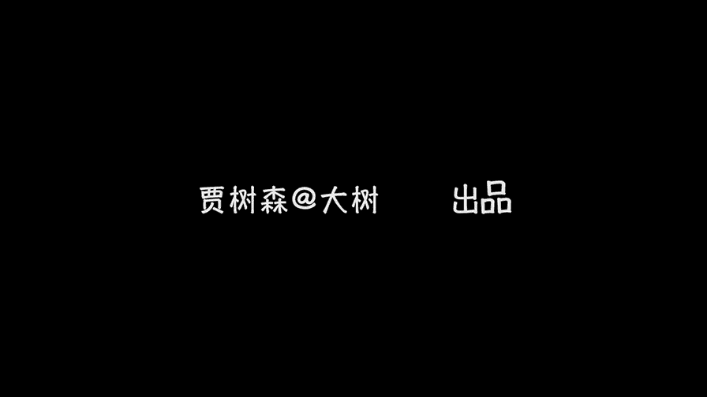

# 贾树森-手机摄影高手（完结）：3.【高手】24种生活场景模拟拍摄训练：第9讲 怎样在拥挤的街头抓拍？

🎼大家好，我是大叔。现在开始今天的分享。😊。

街拍的英文名字叫做sdre snap。街中s追就是街道的意思，代表着走过的，看到的啊周围的普通的一些啊地方。而snap原来的用法之一，它就是形容词啊，指快闪的仓促的突然的以及咔嚓的声音啊。

快速且灵活的移动，猛然获取的镜头。从这个英文的名字当中呢，我们能了解到街拍的两层意思，一个是拍摄的场地是在什么地方。第二个呢就是获取影像的方式。街拍是一种以街道为拍摄基地的人文摄影。

街拍的照片具有真实感，具有生活的氛围。好的街拍作品呢总是很容易打动人。那么，到底怎么样才能拍出好的揭拍作品呢？这个技巧之一呢就是偷拍哈，我们用手机接拍的最大的优势就是手机具有很强的隐蔽性。

把手机拿在手里面呢，随时随地呢不知不觉就能够进行一些偷拍哈。偷拍的时候呢就不能按那个大快门了哈，我们要用这个手机的音量键或者是耳机线来作为快门来使用。你像这样照片呢，也是隐蔽式偷拍啊。

我把手机呢是拿在耳朵边儿上，然后像是打电话的样子啊，一边。拍呢一边往前走哈，再看一遍啊，这是慢镜头，其实很快就路过了。那么对这种拍摄呢，你要心里面有一个数，大概是哈你能拍到什么位置？

你像这种呢都是把手机啊，大概放在腰屏的位置啊，就是这样的去偷拍。那既然是偷拍呢，就一定要把快门的声音给关掉啊。其实在整个街拍的过程中都应该关闭快门啊，不然的话咔咔咔的那你肯定摆明了，你要告诉人家。

你在拍摄，对不对？偷拍里面其实有一个特别的技巧叫做盲拍。这个盲拍呢是不能看屏幕的啊，抬起手来就拍。因为你去看屏幕的时候，别人就发现你在拍了。这位看书的外国友人，我呢就是把手机放在腰部的这个位置。

不能看屏幕，然后呢就假装路过走过去啊，就扫了一通啊。盲拍的时候，你需要对自己手机镜头的缺景范围有所了解啊，这可能需要多多练习，才能够熟练掌握啊。那第三个技巧呢是可以利用视觉盲区啊大胆的进行拍摄。

比如说这张照片呢，就是我在吃早饭的时候，正好挨着窗户边坐，我是坐在窗里面，然后呢，玩手机的这个老爷爷呢，他是坐在窗外面的。那么我在窗里面拍，他是看不见我的。我拍的时候呢。

那个玻璃窗呢又映出来另外一个在用餐的人的影子啊，就是特别有趣。那么像这组照片呢，是我坐在一个咖啡厅里面啊，也是靠窗的位置。我在咖啡厅里一边喝着咖啡呃，一边拍路过窗户的人啊。

看到他们形形色色的来来往往的啊，非常的有意思啊。呃应该说每个人都是一啊都是一本故事书的感觉哈。那么在这样的。位置去拍的话，那么对方呢基本上是发现不了你的。

所以你可以进行啊大胆的去构图呀、取景啊、拍摄呀呃能拍的相对来说比较从容一些哈。第四个技巧呢是可以寻找一些掩护啊。比如说我拍这个老奶奶的时候呢，我其实是正带着小树呢，我带着小树呢，我就坐在他旁边。

然后我们俩就坐在那儿，正好要等树妈。这个老奶奶在那卖东西，我们就坐在隔壁啊，做邻居了。那这时候我就一边拍小树，一边偷偷的拍拍几张他，一边拍小树，一边偷的拍几张他。呃，我们可以用家人或者是朋友来做掩护。

然后进行一些拍摄。这样呢不太容易被察觉。第五个技巧呢是我们可以拍一些有趣的背影啊啊拍摄背影呢相对来说比较安全。不过呢不要被当成跟踪狂或者色狼之类的啊，要注意。第六个技巧呢就是可以选择在人多的地方拍照啊。

比如说像公交车站呀，那么这时候大家都忙着上公交车呀等车呀什么的啊，基本上很少有人会留意到你在拍照啊呃，当然我们要采取一些技巧了，不能也是举起相机就拍，那肯定被发现了，对吧？其他的人多的地方有很多。

其实你像十字路口呀、广场呀呃等等啊，然后特别繁华的一些商业街区都是可以的。嗯，这个时候大家都忙各自的事儿啊，很少有人会关注到你。但是即便在这样的地方呢，我们也应该尽量做到自己呢在人性当中不醒目啊。

像老师这样的话就有点夸张了哈，我上街拍街拍的话，就很容易被人发现。因为。😊，太醒目了，还没等你开始派别人呢，别人已经先盯上你了啊。当然最稳妥的办法还是征得被拍者的同意啊。比如说像啊这一对父子呢。

我在澳洲旅行的时候遇到的，我就觉得哎特别吸引我。嗯，我就特别想拍，然后我就走上去用特别蹩脚的英语跟他交流，然后就询问他能不能拍啊，他很痛快就答应了哈。其实有的时候有些事情不像我们想象的那么难啊。

其实你不会英语的话，你也可以啊利用手语啊，比如说你指指他，你指指手机，哎，是是稍微的给他示意一下，他也能听明白，这个是完全没有问题的哈。有的同学可能说我每张照片我都征得同意，那我还不拍了是吧？拍不了了。

所以呢其实有些时候我们可以心照不宣，你知道吗？像我在澳洲哎街头有个街头艺人在表演，他其实是完全啊能看到大家在拍他，对不对？他也没有拒绝，那这个时候大家就心照不宣啊，就默许，其实是。

所以呢嗯你就可以在旁边放心大胆的去拍摄。那像这样照片呢，其实我是等了好久，等到的一张啊非常有故事的照片。当然了，像这种情况，如果身上有零钱的话，啊，建议还是呃扔几个钢蹦给他哈，都不容易，对不对？呃。

十分卖力的表演哈。还有在澳洲的一个火车站台上，然后这位看书的老爷爷特别的吸引我的目光哈，我就拿手机在旁边啊，默默的在那拍。其实他是完全能看到我的哈，他也没有呃对我说不哈，所以呢我就在那儿慢慢拍。

而且呢我离他呢的距离也不是特别近。尽量的不去打扰到他。像这张照片这样呢，我其实是后期剪裁出来的，我拍的时候并没有取得这么紧啊。如果这么大的话，就离离人家太近了，这样呢就是特别的有入侵性。

这张照片我是在北京的地铁上拍的，这位女士明显看出来我是在拍她。当时我虽然是盲拍哈，她也看出来了，但是呢她也特别善意的目光看着我，她并没有制止我，对吧？那么这就是默许。像这位看车的大叔哈，他在低头玩手机。

然后我正好路过，我就拍了一张，结果特别不巧的就是我拍完一张之后，手还没收回来呢，他正好抬头看见了。我们彼此呢就互相尴尬的笑了一笑，你知道？呃，就这样过去了。如果有机会有可能呢，我们尽量跟他们去做朋友啊。

先跟他们去聊天呀啊去了解他们的呃生活呀，了解他这个人本身的一些故事啊。那么了解了之后熟了之后呢，那你在这个过程中呢，再去拍几张，他们也不会反对啊。而且当你了解了他之后呢，你拍的照片也会有不一样的深度的。

第11个技巧呢是要学会等待啊，当我们看到比较好的光影或者比较好的背景的时候呢，我们要等待那儿啊啊先对好胶呀，取好景啊，大概在那等着啊。当有合适的人路过的时候，哎，我们就把它拍下来了。

在一些光线比较复杂的地方呢呃预先调焦和调成曝光呢是非常重要的。不然的话呢，你等到这个瞬间出现的时候呢，你再去调整这些的时候就已经晚了啊。如果你不调，那么你拍出来的这个曝光肯定是不太对的啊。

正好借着美女这张图呢跟大家说一个技巧，就是在拍摄过程中最好不要去修图。那么这个美女的图呢，我是拍完了之后马上就修了，然后发到了朋友圈。因为这样做呢会耽误你宝贵的拍摄时间。

你有可能会错过一些特别精彩的人和事。第13个技巧呢就是改变视角哈啊改变常规的拍摄视角呢，这是我们说过很多次的哈。嗯，比如说我们从郭际天桥上，然后来拍这个公交车站啊啊，拍这个来来往往上车的人。嗯。

这个时候我们能获得一种我们平时很少见到的一种视角啊，像这位美女啊啊奔跑的追赶这个公共汽车，那么还有像这个椅子啊啊或者是从郭街天桥上去拍一些呃出租车呀，从楼顶上往下拍呀等等。呃，或者是从下往上拍。

总之呢呃寻找一些有别于常规视角的视角来拍摄，容易获得一些不一样的效果。第14个技巧呢就是让自己时刻做好准备，时刻处于一个拍摄的状态当中。比如说我正在拍这位老奶奶的一个背影啊，她穿着花衣服啊。

我觉得挺好看的。然后我正拍着呢，稍一回头余光啊，看到两位美女在大风中啊，头发被吹的特别凌乱的就过来了，我立刻把手机镜头调转过来了，然后就一通拍啊，拍到了特别精彩的一些照片。那么如果我不是在那拍摄。

我是没有办法在这样的距离，然后这样去拍摄的。那这时候我离他们的距离其实挺近的，而且他们也明显看到我在拍照。那么这个动作呢其实是被默许了的哈。两位美女一笑而过啊。

技巧十5呢是寻找一些特别好的地点和光线去拍照。比如说像现在这个位置啊，夕阳正好从楼缝中穿过来一束光哈。那么这束光呢它照到了对面的楼上又反射回来，在地面上有一个特别漂亮的光驱。

那么这个时候我们寻找这样的地方拍照呢，它比较容易出片儿啊。绩效十六呢是要利用一些有趣的影子哈。嗯在日落之前和。日出之后的一两个小时之内呢啊太阳的角度比较低，这个时候是我们拍照的黄金时刻。

所以呢我们可以啊去拍摄一些特别有趣的影子啊，大家留下来的人来人往的这种影子。嗯，这也是我们拍摄的一个素材之一啊。所以呢除了记录黄金时段的这个光线啊，我们也可以啊记录这个时期的影子。

那么如果你坚持拍下去的话，那单独的一个影子是可以成为街拍的一个系列的哈，呃也是很有趣的。第17个技巧呢是我们要多使用连拍哈，在一些动作比较快的时候，比如说像那小孩在跑的。呃，要使用连拍。

这样呢呃比较有助于抓到那些特别精彩的瞬间。技巧十八呢是拍摄那些令人回味的瞬间。我们去街拍呢，绝不是就是抬起手机，在街上随便乱拍一期哈。注意拍摄的内容我们是要有选择的啊，要选择那些啊能打动大家的一些瞬间。

能让大家去琢磨啊，或者是呢能让大家开心一笑的瞬间。第19个技巧呢是大家要多去关注一些细节哈啊不要把目光只放在高楼大厦和那些人的身上，我们也可以去关注一些细微的东西啊。比如说呢马路边上的这滩水哈。

嗯这里面有倒影，对吧？我们可以贴近的去观察一下。如果你不仔细的话，你可能就是一瞬间从那旁边就溜走了。当然了，像这样的细节呢有非常多哈，这个需要我们呢用心去体验和观察。对街拍呢。

我的一个原则还是就是尽量不要打扰到被拍的人啊，或者是呢嗯我们呢得到对方的默许。最好呢是得到对方的同意。啊，当然了，像。这位大师这样，他可不管那么多，他甚至拿闪光灯直接闪你一下哈。那么这种拍摄呢。

我我个人觉得可能不太适合中国的国情哈。那么即便是在国外啊这种拍摄的也是特别带有侵略性的哈，也很容易成为被告。所以在街拍的时候呢，我们要尊重当地的一些风俗和习惯，千万不要在不该拍摄的时候，随便拍摄。

同时要遵守当地在肖像方面的相关法律。关于这个问题呢，我将用一些街拍大师的金剧来为大家解答。因为我口齿不伶俐，只有通过照片来表达。这说的就是呢街图摄影呢，其实呢呃他也是在讲故事哈。

也是摄影师表达自己的一个啊方式。这位大师说，对我来说，摄影是观察的艺术，在平凡的地方找到有趣之处。对于所见之物，可以做到的事情很少，可以观察的方式却有很多。这位大师说，比写摁快门接拍的时候。

与人的沟通更加重要。他觉得拍摄的意义在于获得故事，而获得故事最佳的方法呢就是去接触人，每个人都有不同的故事。按下快门之前呢，最重要的是去了解你拍的是什么，你的作品里包含了什么。我爱我拍摄的人们。

他们是我的朋友。虽然我不认识他们，也再也遇不到他们。但是在我的照片里，我与他们同在。😡，摄影是一个短暂的创造性时刻，你的双眼要注意构图或者是情感表现，你需要凭直觉去按下快门，这就是摄影师创作的瞬间。

当你错过这一瞬间，他就永远消失了。这位是鼎鼎大名的不猎松哈，他提出了决定性瞬间的理论。这个决定性瞬间呢可谓是影响了无数摄影师啊，仅仅观察是不够的。你需要去感受你所拍摄的对象。也就是说，在拍摄的时候呢。

不仅仅用眼睛来拍，而是要用心去拍。那么你用心拍摄的照片呢，他才能够打动啊旁人。

🎼今天的分享就到这儿，我是大叔，我们下次再见。

