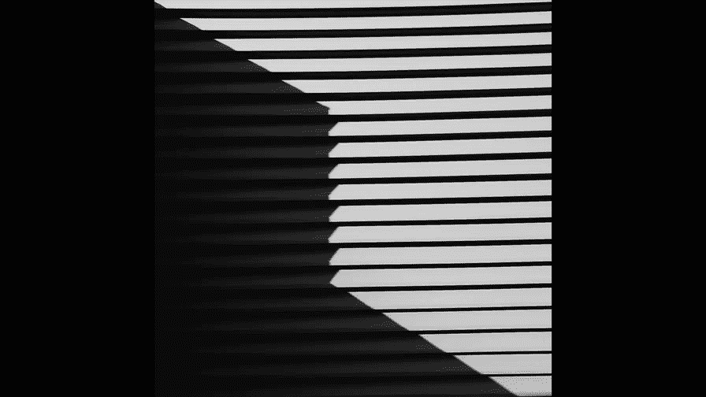
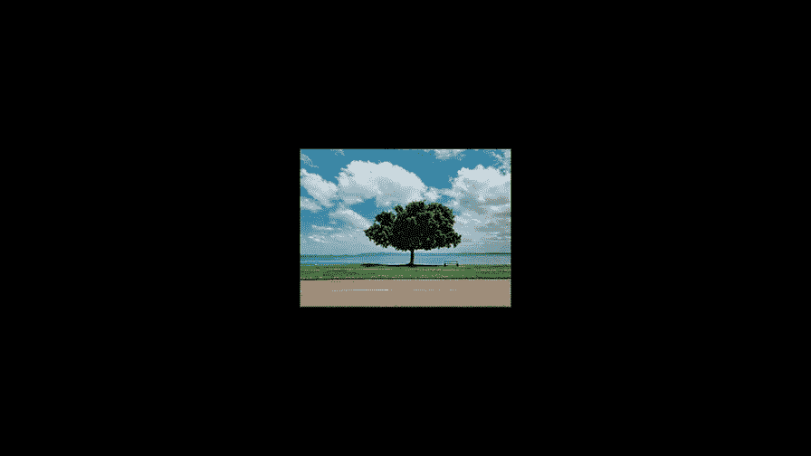
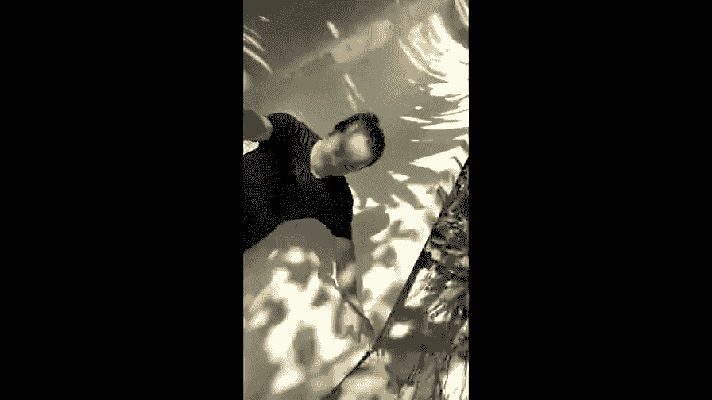

# 贾树森-手机摄影高手（完结）：4.【大神】超详细的后期修图软件教程：第1讲 怎样修出有胶片质感的照片？

🎼大家好，我是大叔。现在开始今天的分享。😊。

从这一次开始呢，我们的分享进入了一个新的阶段，那就是后期。那这一部分的分享呢采取录屏的方式来给大家呈现。啊，录屏呢它在这上面显示就这么一窄条哈，所以我们要调整一下观看的方式，以达到最好的观看效果。

不然的话这画面在屏幕上太小，有很多操作呢，咱们看不清楚。好的，我们先来看苹果的修改方式啊。😊，使用安卓手机的朋友呢，稍微等一下，苹果手机的修改方式呢是这样的，在课程的播放界面时呢。

我们点击画面中红色箭头所指的这个标志。然后再点红色箭头指的这个标志。就能切换到竖视满屏状态。现在这张图啊，如果在你的手机当中是满屏显示就对了。也就是说这四颗星呢分别在我们手机的四个角上。

我这个呢是iphone叉的截图，有可能用其他手机的朋友呢呃应该是。屏幕这两边可能有一窄条是黑的，这个没关系啊，只要你能显示全就可以了。接下来说安卓手机的在课程的播放界面时呢。

点击画面右上角箭头所示的三个点儿，点完了之后呢会出现一个画面比例。我们点这个画面比例啊。画面比例点完了之后会出现这么几项，我们选择放大裁切，那么这个时候基本上就会切换到全屏状态。这张图片同样的啊。

在手机上是全屏显示就OK了。个别品牌的安卓手机有可能跟这个调整方法不一样。但是大家呢去寻找一下啊，总之把它调整到竖适全屏状态。V斯co呢是一款主打胶片风格的滤镜。呃，它基础功能是免费的。

但是现在呢就是免费的功能越来越少。然后他现在推广的就是这个叫年度这个使用计划哈。一年可能100多吧，然后就这个叫叉的这个。大家呢我建议先不要买，咱们可以先使用它的基础免费版本。大家下载之后呢。

也不用注册就能先用。如果你不小心点了试用的话，那建议你在它的试用期内一定要把它取消，不然的话呢它会直接扣费的哈。这个大家一定要小心啊，它免费的滤镜。嗯，还是有一些的那大家用了之后呢，再决定是否购买。

或者其实呢他给出的那些免费的滤镜。你也可以在那个基础上去做一些调整。我觉得大致还是够用的啊。当然如果你有高的要求，那再考虑是不是购买他这个年度计划。因为我这个已经下载完了，所以我可以从这儿直接打开啊。

这是它打开后的界面。这样我从那个它的图标直接进一下啊。下载之后呢，它的图标是这个样子的啊，vissco，然后呢可以把它打开。咱们先认识一下这个界面，因为我已经是使用过的，所以我这里面有很多图片啊。

这个是vissco它的一个图片库啊。如果你第一次使用的话，这里面是没有图片的。我们要用vissco来修一个图片呢，我们首先要把。要修的图片导入到visco的相册里面，然后才能进行修改。

导入图片的步骤是这样的，大家看一下啊，这有一个加号。点一下之后呢，我们就能看到这里啊，我们的相册显示在这里的。现在是所有的相册啊，你可以翻可以去选。然后呢，我通常比较习惯于是把图片先选一遍，筛选一下。

放到个人收藏文件夹里面，这就根据个人喜好了。然后在这里面选呢相对来说选片的量会比较小一点。我找一张有各种毛病存在的图片呀。好，大家看下这两张图片哈。😊，我把它导入进来。点一下它就会出现一个黄框。

也就是说选中了。然后再点一下。这两张图片都选了。其实当你选了的时候，大家能看到啊，下面这块弹出一个东西来，对吗？就是导入。好的，两灯学好之后呢，就点这个导入。

那么这两张图片就导入到visgo的相册里面了。导入进来之后，如果你想修哪张，你就点哪张啊。啊，为了给大家示范功能比较清楚呢，我选这张构图不是那么好的啊，比较歪，比较斜的。叠好之后还是一个黄块。

接下来一步啊，这里。大家注意我这个白点示范啊，我这个大白点啊看一下。点这两个杠。进来之后，它显示的下边这一排小窗啊，大家看一下。啊，我目前因为我是买了他的这个年度会员，所以呢我的滤镜非常的多。

你要没有买的话，肯定是没有这么多的。下边这个小窗每一个就代表一个模拟胶片的风格啊。Vsco它就是模拟很多胶片的这种色彩呀，这种反差呀、颗粒呀等等。比较出名的。所以我们进来之后呢，每一个小窗。

一个缩影图啊，就代表着这种胶片的风格。通过这个小缩影图啊，这个小窗户我们大概能看到每一款胶片它不同的色彩风格。比如说这款你看啊它偏红，在那个原先缩影图就能看出来，这张是黑白，在这能看出来是吧？

我们可以选择一款适合这张照片的滤镜选择了之后呢，在这里有一个机关啊，这里选了之后呢。这个缩影图就变成这样了，对吗？我们在这个缩影图上再点一下，点开之后呢，大家留意一下是这样啊。

我先讲这个十二的这个啊加12，我们用手指按着这个白点，可以向左滑动。在我们向左滑动的时候，我们能留意到。画面上这个颜色、饱和度等它得发生变化啊。我们往左移动的时候呢，数值也在发生变化。

这个呢是可以把这个滤镜的程度降低的啊这么一个滑块。我们可以可以根据我们可以根据胶片来决定用到什么程度。好的，我们再来看一下这三个东西啊，强度、字服和温暖度。那么这个东西呢不是所有的滤镜里面都有的。

这个是这款滤镜现在这个叫柯达啊什么什么什么的这个。呃，这个啊这是他模拟胶片的这个名字。那么。这款胶片是有这个调整项目的，比如说强度我们现在是调整的字符，我们看一下也可以调整啊，它对画面也是有影响。

还有一个呢是这个温暖。我们左右滑动一下呢，就能看到它对画面的影响啊是这样的。就是说这个颜色呢可以偏暖一点，也可以呢啊偏冷一点。根据你对画面的理解啊来调整。调好之后，在这里啊对勾。确认。好的，滤镜选好了。

再接下来看这个。点一下之后呢。我们进入到这个调整的界面了啊，这里面呢用手指在这下滑动一下，有很多个调整项目。那么第一项呢，它它就是曝光调整。这个曝光调整呢调整的就是画面的亮度啊。

积累之后这个滑块啊打圆点，左边右边移动，就能看到画面的亮度再发生变化哈。比如说我们稍微调低一点，同样按对勾确认。接下来呢就是对比度。好的，对比度可以调整啊。可以增加或降低反差啊。

如果不知道什么是反差的话，咱们也不用非得弄明白啊。然后呢，你在这上面滑动一下，你就能看出来它对画面的影响啊。通常来说的话，在左面这边就太灰了。😡，右边这面呢就反差太大。

大家能看到这个呃要么太画面里面有的地方太黑了，有的地方太亮了。所以呢调整程度一定要把握啊，可以略一般的情况下可以略微加强一点点。但是根据画面啊，有的是适合降低的。好的。现在注意这个调解啊。

调解之后期来呢，它有这么几项可以更改的啊，一个是。剪材和拉直。接下来还有个倾斜。我们先来看一下剪裁啊，剪裁这块呢它是有这个画幅比例调整的。比如说我想剪成3比2，哎，你可以点。你可以点。

16比9这都可以调的啊。那么如果我不想用这个比例的话，那么我们进来之后啊。看一下哈，我们进来之后，它是自由剪裁的。你这个时候你你随便编这个画幅比例啊。但如果你想调，那么你就调下边这一排。

大家再来看一下这个东西啊，我们左右去滑动的时候，我们看到这个照片呢在旋转啊。如果这照片有点儿。威啦。我们可以通过这个来调整。这里面不是有有线吗？对吧？我们用这个线条来对这个画面当中这个线条啊，把它对直。

好，大概调整好了之后呢。我们还看到这个竖直的线条还没有竖直啊，这个时候办这个事儿的是这个功能叫做倾斜。这些点开之后，我们能看到一个X和一个Y。X呢就是指水平方向的调整。Y呢是指竖直方向的调整。

现在我们看水平方向上的可能问题不大啊，基本上平了。现在呢大家看一下这个数值不行，所以呢我们调Y的方向啊，这就跟我们学数学的那个X轴和Y轴是一样的啊。调外。你看哦，这个更厉害了。那么就说明调的方向不对。

返回来往这边调哎。好像有点多了，再往回拉一点，现在好像差不多了。那么下边这条水平线还是有点不太水平，对吧？我们再动一下X。哎。稍微。平了一点对吧？调好之后呢，我们就选这个。对勾。这一项啊。呃。

可能需要点时间去适应，就是说有很多东西你可能未必呃能把握的准，到底调哪个调多少，往哪个方向调，您可能需要一段时间来适应，再往后看啊，一个是锐化和清晰度，这两个都是让照片变得更加清楚的。

如果你这张照片对焦不是啊很好，你可以用这个来加强一下，或者是你要你想强化质感，也可以用这个来加强一下，这个当中呢清晰度它的这个调整呢，会对画面造成比较大的影响啊。大家看一下，我直接拉到12。

所以呢对清晰度的调整一定不能太多啊。锐化的它的影响倒没反倒没有那么大。所以呢这个它的程度你可以自己把握啊。但我通常建议不要把照片的锐度加的特别特别的多啊。而，这一项呢是饱和度。它影响的是画面的鲜艳程度。

大家看一下，我拉到最右边啊，是不是太艳丽了是吧？拉到左边的时候，画面几乎变成黑白的了，还有一点点颜色，也就是饱和度降低的非常多。那么像这样照片来说的话，可以略微增强一点点饱和度。再接下来这个色调。

私交这里面有两项调整的指标，一个是高光，一个是阴影。什么叫高光哈？照片里面最亮的部分。比如说像这张照片里面的天空啊，大家看一下或者楼如这个白色的部分，黄色的部分啊。我们调一下，看看啊。

画面当中发生变化的这些就属于高光部分。像这张照片，我们可以略微。把高光加起来一点。接下来这个阴影呢它影响的是画面当中比较暗的地方。比如说像这个框里面的黑色部分呢，或者是深色的大楼呀。

还有一些建筑上的投影等等啊，我们看一下它对于画面的影响啊，深色的部分都会受到影响的。阴影呢如果提的太多，画面就会发灰。啊，所以呢这项调整完之后，我们可以翻回来对于对比度再进行一下调整。

或者是呢你在调整的时候，先不要着急去调整对比度，把刚才的那两项调整完之后，再来调整一下对比度啊，你是增加还是减少，对吧？好的，我们可以略微加一点。因为调整完那个阴影之后，画面会变灰啊。

呃阴影和高光都会影响到这个指标，所以再调整一下。好的。色调完了之后是一个白平衡。这里面呢也有两项调整指标。第一项呢就是色温，然后呢，它影响的是画面的温暖程度啊，也就是说它是。偏暖。还是偏冷。

这个呢刚才在呃滤镜的程度里面。也有一个叫做温暖啊，那么它这个东西啊。我刚才说了，有的滤镜有那个调整项目，有的没有。所以呢如果没有的，我们可以在这个地方去修改画面的温暖程度啊。也就是说它的色彩倾向。

你是喜欢暖色调的还是喜欢冷色调的啊？好的，我们可以。略微加一点点。或者减一点点。啊，这张照片我原先调的我是剪一点点的，所以我可以略微剪一点点，然后画面不那么。黄ang哈。还有一项就是色调。

色调呢是画面偏红或者是偏黄。啊。这个呢是根据个人的喜好来调的。好的，如果你把握不好的话，暂时可以先不动这一项啊。如果你用的熟练之后，可以再对它呢进行一些深入的研究。啊，调好之后呢点对勾。

再往后面有一个肤色啊，这个对于。修改皮肤啊啊是有一定的帮助的。我们大概看一下，它影响画面的也是偏黄或者是偏红啊，有一点跟色调调整的那个感觉稍稍有一点像。具体影响到什么程度啊，我们可以针对每张图片。

然后去调整一下，试一试啊，就能看出来。好的，对勾退出。这个呢夹暗角的。就是给照片四周啊，四个角这边让它变暗。我们调一下看看就知道了。啊，中心是不变的，它的。边边上发生了变化啊，那么像这一项呢。

也不建议一下子修改的特别狠，可以略微加一点啊，当然是也是根据图片了啊。好的。颗粒。😊，呃，如果你特别喜欢胶片的这种感觉，可以略微增加一点颗粒，模拟胶片啊。啊，后面的这个像褪色。我们看一下。

就是让照片呢变得灰秃秃的啊，这种灰秃秃的呢，它其实是模拟一种过期胶卷的这种感觉啊。好的。我们根据实际情况来啊。还有你想达到的这个目的。好。呃，接下来再看看那个色调分离。这个色调分离啊。

它其实调整的是阴影色调和。高光色调在这里。硬色调我们看一下啊，我们点一下，大家能看到吗？阴影的部分它就偏红了，我现在选择红的滤镜，当然程度也是可以调的。你可以让它多，也可以让它少。

高光色调也是我们也可以让它多，也可以让它少。啊，但是这项呢我通常不怎么调啊。好的。退出啊，还有可以加边块啊，边块的颜色也是可以调啊，边块的这个宽度也能调。比如说调成黑的，调成黄的，调成这个，这是边块啊。

还有这个。叫HSL。那么这里面呢它的调整呢是就这几种颜色啊，可以分别去调这一项呢，我也建议啊大家在用熟了之后再来进行调整。因为这个弄不好的话，会容易手忙脚乱啊。

这里面所有的颜色都可以去动啊啊比如蓝色我们也可以动一下蓝色，后面看看后面这些所有蓝色调的东西啊，它的这个饱和度增加或者是减少啊，亮度也可以增加或者减少。啊只影影响有蓝色色调部分不会影响其他的部分啊。

好的，可以。打叉退出。关于这几项呢，就是。我想说明一下。呃，像这个HSSL呀，然后色调分离呀、褪色呀、颗粒呀等等。那么这些东西其实呢呃我们进来调了之后。啊，它其实是完可以完全改变这个滤镜。

它的一些原先预设的这些色彩倾向等等。那么你把这些东西调了之后呢，其实是等于你把这个滤镜完全更改了。所以呢如果你滤镜不够多，那么你就可以进来多去调整这里面的这些分项。实际上呢即使滤镜不是那么多。

我们也可以调出很多种啊色彩的变化来啊，色彩风格的变化。所以呢如果我们肯多花一点时间，然后对这些项目进行一些细致的修改。那么我们会调出一些自己喜欢的色彩感觉的。图片修正好之后呢。我们点这个右上角有个保存。

好，图片被保存到vissco的相册里面了。大家一定要记住，到这一步不算完啊。呃，还有一步。点这儿啊右下角。我们选保存到设备相册。选择实际尺寸。这个时候它才保存到手机的相册里面了啊。

如果说你不进行最后这一步的话，我们的图片只存在于vissco的相册里面。你在手机相册里面是找不到它的。所以这个一定要注意啊，别到时候修完了之后，哎，我这张图片不见了哈啊。

下面给大家分享一个vissco的批处理小诀窍啊就是。这里。这两张图片是在同一个地方拍的对吧？他的这个。各种条件都相对来说比较一致。比如说颜色呀，比如说光线呀等等。所以对这种情况呢。

我们是可以采取批处理的。把它处理的跟刚才那样图片的色彩是一样的。这样做呢，我们在同一个地方拍的所有图片，它的色彩风格也会保持基本一致。好的，操作方法呢是这样的，我们点一下已经改好的这张图片啊。

点击右下角这三个点。大家看一下，在保存到设备相册下面有一个复制编辑，我们点一下。好的。再点一下。这张图片啊。点好之后呢。下面第三个点点一下。选择。连贴编辑，大家看一下啊，这块发生了变化，对吧？

选择了之后，那么我们刚才那张图片所做的修改。就粘贴到这张图片上了。如果说你觉得哎。还没有修改的那么到位。好的，我们可以呢把它给取消啊，点两下，或者直接或者直接点下边这个啊叉。如果图片多的话啊。

就可以点这个叉。把它再点开。好的，我们进来之后呢，再对它进行一下修改，感觉亮度上稍微有点低，对不对？然后我们进到这儿啊。把这个报光稍稍。拉起来一点点。好的，再把这个。阴影。

色调在这里边阴影呢再提高一点点。这里面有个东西啊，粘贴编辑是不起作用的，就是对照片的透视调整啊，我们所说的这个这一项目的调整，它是粘贴不了的。这个项目。这里面比如说它有点歪，你看现在这个稍稍有点歪啊。

稍稍有点歪，我刚才为什么没选这张来做处理呢？就是它不太方便给大家讲解这些所有的功能哈，然后垂直方向上呢。😊，因为它很少它变得很少，这个就是我们前面讲过的横平竖值啊，我们在拍照的时候尽量让它都做到位。

那么我们在后期的时候，第一呢是是省事儿。第二呢就是说你做了这些调整之后呢，对画面它是有损失的啊。好的，然后这张图片其实我们还可以再检查一下啊，我把下面这些东西不要这么多好的。好，同样有点保存。好。

大家看一下批处理的保存哈，比如这两张我们都没有保存过。😊，点右下角这三个点儿，点完之后呢，先保存到。设备相册它这里边。实际尺寸保存。好的，这两张图片呢就。修完了。大家看一下，在相册里面。好的，这两张呢。

都别修好了哈。😊，色彩感觉大概一样。因为它选用的是同一款的这个滤镜啊。关于vissco呢，还有一个小窍门也跟大家分享一下，就是滤镜太多呃，每次翻呢要翻好久。嗯。

有没有好的办法把自己喜欢的滤镜啊放在一块儿。我有一个办法啊，我们点一下进来。到这儿来啊，点这个地方再看一下啊。点这个地方之后呢。就是我们喜喜欢的滤镜，可以呢点一下这个五角星啊。点一下这个五角星之后呢。

我们选的这个滤镜呢，它就放到了。啊，我们先保存一下啊，比如说我就先选这两个啊。保存。保存了之后呢，大家看一下我们刚才选的这些滤镜呢都放在前面。比如说前面这一排哈都是老师曾经选过的啊，点过行标的啊。

五角星点一下都在这儿。然后才是后面的这些原先排的这些滤镜。那么当你选择了你喜欢的滤镜放在前面之后呢，你每次呢就可以优先选这些滤镜，不用往后翻的很远啊，这是一个滤镜的，就是所谓的叫收藏吧。

就是把你好用的滤镜收藏在前边啊。好的，vissco呢就跟大家分享这么多内容啊，vissco这个滤镜呢相对来说还是比较容易上手的。当然了，可能比较难的情况呢是大家对于这个色彩感觉的把握。

那么对于滤镜的选择啊，没有什么太好的这个捷径。唯一的办法呢就是大家多去看一些好的作品。啊，观察它的一些色彩感觉啊，色彩风格。你也可以呢用你自己的图片啊，多去尝试不同的滤镜啊，多去调整里面的参数。

这样的话呢能提高你对色彩的把控能力。

🎼今天的分享就到这儿，我是大叔，我们下次再见。😊。

