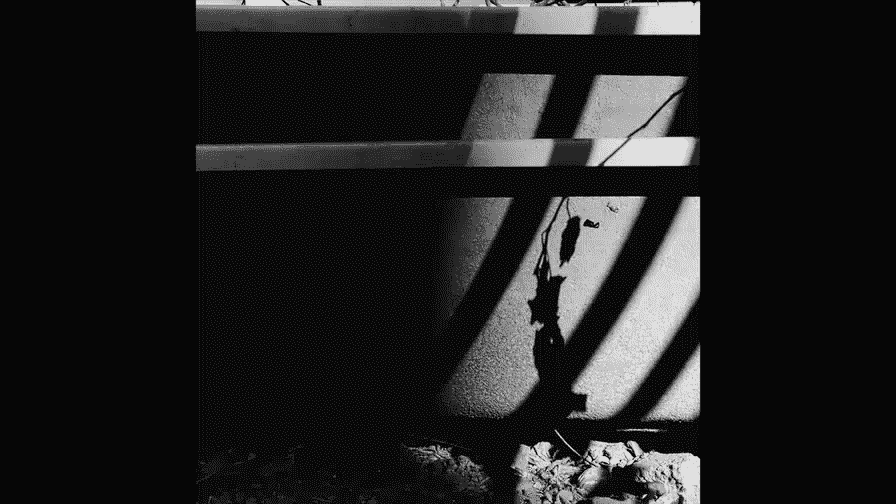

# 贾树森-手机摄影高手（完结）：4.【大神】超详细的后期修图软件教程：第2讲 为什么snapseed被称为手机版的PS？

🎼大家好，我是大叔。现在开始今天的分享。😊。

在正课开始之前呢，还是要跟大家提示一下哈，先把手机切换到数十全屏状态去播放后期的课程。除了今天的课程之外呢，我们后面所有的课程啊都是这样来切换。那我们后面可能就不再提示了啊，请大家记住这一点。

然后切换的方法呢，我们上节课也详细给大家说了啊。😊，使用苹果手机的同学和使用安卓手机的同学切换方式不一样。但是呢大家都最后把这样图片打到全屏显示就OK了。大家看一下snap C呢，它是这样的。

那么它在苹果上就叫做sap seat。在安卓系统里面，如果你去搜索的话，它有可能叫做纸画修图啊，就是用手指去滑动屏幕来修图。呃，这块软件呢它是。谷歌开发的一款就特别全面，并且专业的这么一个后期修图软件。

为什么它叫做手机版的PS哈？也就是说手机版的photoshop主要是因为它的功能特别的多。😊，呃，有点像呢我们在电脑上用photoshop来修图一样。大家有的同学可能会了解。

知道这个photoshop在电脑上修图是特别强大的这个功能啊。那么这个snap C的为什么受到如此的重视呢？呃，除了它的功能比较强大。相对来说也比较专业之外呢。那sapse它的全部功能目前都是免费的。

所以呢用起来还是比较方便的。但是从另外一个角度来说，因为它的功能特别的多，所以呢我们可能要多花一些时间来熟悉它的各项功能哈，它的各个工具都是干嘛用的。我们在桌面上找到这个图标啊，step C，然后呢。

点击就能打开这个软件。我们先来说一下它的设置问题啊，在这里右上角有三个点，把它点开。再看一下，这里面有一个教程。我们呢可以去看一下教程，它里面有一些基础功能的介绍什么的。最重要的我要说这个设置。

这里面呢前面的都还好啊，选项这个地方都还好啊，这个选保存到snap seat相册里面就行了。最重要的是导出和分享这个选项。第一项啊一定要。选这个啊，看着啊，不要调整大小。因为这里面呢它有很多。

尺寸可以选，咱们就选第一个啊。格式和画质。我们点开看一下啊，G壁G或者是PNG。那么个PG里面又分。😊，百分之百95%、80%，我们就选第一个百分之百。不要改变任何的画质啊。好的。

接下来咱们说一下这个怎么样打开一张图片啊，这上面呢中文字写的很清楚，打开点击打开之后看这里。通常我们都是拍了照片以后才修的，所以呢我们就打开设备上的图片啊。进来之后啊，所有的相册都排在这儿。

比如说是所有照片还是个人收藏，还是怎么怎么样。我通常我的习惯，个人受伤里面。好的，选一张图片。好的，我们就选这张。呃。这张呢大家看一下，因为后面呢还是有一些歪呀，有些鞋呀什么的啊。

咱们拿这张图片来说事儿。图片打开之后，我们先来看这个吧工具。点开之后呢。大家用手指在这上面上下滑动啊，这个工具下面还有啊。好的，他的所有工具目前都在这里。我不按照这个顺序来说啊。

我按照我修片的一个大概的顺序来说这些工具。首先呢一张图片打开之后，我们先要观察这张图片。都有些什么问题，首先看它是不是正啊，现在这张图片有些歪。😡，好的，有些歪呢，我就需要把它给调整过来。😊。

所以呢调正过来用什么呢？用旋转或者是透视这两个。旋转图片。大家看一下，借了之后，它会自动的去进行调整啊。那么它自动调整之后啊，还可以，但是还不是那么正。

所以我们用手指在这屏幕在这个上面就是左右滑动的时候呢，它就会跟着啊它会跟着这样去转。比如说我们大概转一下，但还是不直，注意竖线条这个个你把水平子对直了之后，竖线条还没有直，那就说明什么呢？

它就不光光是这个水平方向这个。😡，旋转就能解决的事儿了。所以呢我们还是需要进行这个透视调整。啊，等一下我再切出去啊，我跟大家说一下这个。😡，呃，这个符号。我们去点一下之后啊。

图片它是进行90度的顺时针旋转啊。大家看一下啊，再点就回来了。然后呢，这个符号是图片是左右就是水平方向的翻转的。原先车头冲左边，现在冲右边了啊，咱们这个可以干这个事儿。好的，我先不进行这个旋转啊。

我把它。😊，打勾儿。打勾就确认了啊，我们现在打叉。😡，退出。然后呢，用什么呢？透视。好的。同时进来之后啊，有好多项啊。我们重点讲前两项，因为这两个是我们用的最多的，一个是倾斜。

这个倾斜跟咱们上节课讲的vissco里面的倾斜是一样的。X方向。看到没有？左右箭头竖直线头上下上下箭头就是指外方向的调整。我们可以根据图片的实际情况进行两个方向的调整。水平方向和垂直方向。然后呢。

在这里面也有旋转。大家看一下啊，点一下这个。然后呢，也可以进行旋转调整。这个旋转跟刚才那个旋转有什么不一样的地方呢？大家留意啊，我现在呢照片这四个角。😊，有一条黑的大家留意了吗？我们在进行这些。

调整的时候呢，这些空余的这些黑黑的地方就空出来了。这个空缺的地方它是会自动修补的。大家留意啊，它是自动填充角。那么vissco里面是没有这项功能的啊。只有snap C里面有，咱们再看看竖直方向的啊。

我们再调大家看一下啊。😊，黑的地方它自动给补上了。好，这是snap see跟vissical不一样的地方。他补完之后啊，有的时候他补的很好。那有的时候呢他。😊，就是稍稍会有一点问题啊，有问题的地方呢。

我们要留意一下，回头呢我们可以把它给裁掉啊。好的，这一项调整好之后，我们点这个对勾就确认了这一项。好的，接下来我们干嘛呢？就是我们要看一下这个边缘的地方是不是需要剪裁啊，工具。

剪裁剪裁这里面呢第一项就是自由剪裁，我们推动任何一个角就可以随便剪裁到任何的一个位置啊。😊，啊，怎么解都可以。但是呢我们也可以选其他的尺寸啊，就是有比例的。比如说按照圆图比例啊、正方形啊等等啊。

各种比例都有。这个呢我们就不需要剪台了，退出来。再进工具啊。接下来翻过来讲这个调整图片，调整图片点开之后，大家留意这个符号啊。我们去点一下。好的。调整图片里面有很多个项目，亮度、对比度、饱和度等等。

这些东西全在这儿。这个时候如果我们用手指上下滑动的时候，在这里啊，我们就能选这些小项目啊。蓝条的。比如说我们选个饱和度。选个饱和度。OK这时候一放手。😊，我们怎么调呢？用手指在屏幕上左右滑动啊。

它为什么叫做纸花修图呢？就是因为它是用手指滑动的哈，在屏幕上滑，咱们就可能改变饱和度。这一点呢跟vissco的那个饱和度也是一样的哈。当我们往右调的时候，照片变得特别艳。往左调的时候呢，照片艳丽度降低。

😊，大家留意一下，这上面的有一排数值啊，它的数值在这里。能看到数值的变化是多少啊。好的。这一个。这调整图片里面呢，这张图片比如说稍稍有点暗。好的，我们把它提亮一些。但是题太亮之后呢，大家发现就是天空呀。

还有这个白墙呢就。不太行了，这对吗？层次没有了。所以这时候呢我们要看这里面的一个什么呢？高光。高光啊高光可以往下压一压。大家看到了高光的变化啊。强着里。我调的时候大家看一下哈。但是这个呢也不能拉动太多。

太多之后，这照片就发灰了。好，这里面还有什么呢？还有阴影，这个高光和阴影啊就跟vissco是一样的啊。好的，我们也可以动这个对比度。然后这里面还有什么？还有一个叫做氛围的。氛围呢我们调一下啊。

看看它影响的是照片当中整体的一个感觉。不仅仅是明暗分布，还有呢颜色上也略有变化。啊，所以它叫做氛围其实也挺贴切的，具体它影响到什么样子，大家要自己亲身去试一试，去感受一下它能变到什么样子啊。

影响到什么程度。这个要自己把握。咱们接着看这里面还有一个叫做暖色调的东西。蓝色调是干嘛呢？我们调到右右边这头啊，看一下照片变得特别黄。如果我们调到左边这头，照片变得特别蓝。好，它调的其实就是照片的色温。

那sci现在呢有一有一项专门就叫做色温。我们看一下在这里。的工具这。就是白平衡调的就是色温啊。看到没有？色温。这里面的这个白平衡啊，它除了色温之外，还有一个叫做着色。

其实这个跟呃vissco的那个里面呢也差不多啊。😊，色温专门就管这个的啊。着色呢是让照片偏红或者是偏黄啊，他就干这个用的。好，这张照片其实我最想调的是什么？他脸现在特别暗。好，这是。

这里面有一个特别的啊跟别的不一样的东西就是叫做局部。我们把这局部点开之后呢。😡，注意啊，这块这个有个蓝色的加号带圆圈的啊，它一定是蓝色的状态。我们才可以在要修改的部位点一下啊，比如说脸。

现在出现了一个量字，对吗？这个时候如果我们在屏幕上左右滑动的时候，我们可以看看啊发生了什么变化。这个区域变亮了，大家留意到没有哎。亮。就是变量这个区域我们是可以调的。我们用手指在屏幕上。

两只手指在屏幕上做开合状啊。两只手指搭在屏幕上打开。就变大了。缩小两个手指挨在一块儿的时候，哎，就这样还还可以继续继续变小。红色的位置就是我们一会儿调整能影响到的位置。比如说我们放大一点啊。

现在全图都记住有了啊，然后我去调的时候，大家看一下量的区域很大，对吗？然后我现在呢我把它缩小。😊，我把它缩小。大家看到了吗？它影响的只是小树的脸。😊，好的，这是调的这个。

当我们用手指上下去滑动屏幕的时候啊，上下滑动啊上下滑动。我们看一下哎。😊，又出现了更多的字儿啊，一个是对，对呢就是对比度，还有一个饱是饱和度。结呢是结构结构干嘛用的，等一下我们会讲到啊。😊，好的。

我们先把这个局部提亮一些。好的，打这个对勾退出来。但发现没他的。他的这个脸变亮了一些，对吗？好的，我们再来看看这个结构。结构在这里面。

其实啊在突出细节里面突出细节里面我们看一下这个就是它的一个分项目的一个。调整分项目调整里面就分结构，还有锐化。这个结构就是让照片变得更加清楚的一个东西，有点像vissco里面啊叫做清晰那个那个项目。

好的，我们去把它调整到最大的时候，看一下嘛，他对照片的影响很大。vissco的那个清晰对照片的影响程度也是很大的对吧？所以呢结构这个项目我们不能调的特别多，一般在1015这样子就差不多了。

如果我们把它往左调的时候啊。照片就变得虚乎乎的。我们可以用这个来给照片做一些美容啊，比如说你是想让皮肤变得特别的光滑，可以这样来调好的。我们通常是调稍微加一点。刚才看了这里面还有个叫做锐化的东西，对吗？

锐化的东西跟vissco里边那个锐化是一样的，它对照片的影响并没有那么大，所以呢它可以略微多调一点啊。😊，再看看工具里面还有一个。叫做画笔功能。这个画笔功能也是sMC里面用的特别多的一个工具啊。

把它点开之后。他是这样的。有4个项目可以更改，一个是加减光，一个叫曝光。这个加减光和曝光呢，其实它俩调的是一回事儿，只不过呢曝光啊这个程度有点大，所以我通常都用加减光就可以了，曝光不用。

然后后面有一个色温，有一个饱和度。刚才色温我们讲了，有其实这里面有好多个都可以调的对吧？在调整图片里面有一个温暖度啊，然后呢还有一个站门调白平衡的，那里面有个色温。😊，好的，这个呢有饱和度，还有一个。

单独调的这些调呢都可以局部作用于这样照片啊。大家看一下加减光这个啊，在这儿有个向下的箭头，我们点一下，我通常不会用十加1的话，这个程度有点太厉害了，一条一刷就一条子啊，我给大家示范一下吧。示范一下。

看啊，这十子擦两下之后，这块白的特别厉害。😊，好的，不想要了怎么办呢？我们继续调这个箭头，有个橡皮擦。哎，刚才调的一插就没了。😊，所以我经常会用到这个比如说五啊，我们可以去把图片放大一下。然后呢。

比如说面部这也可以擦一擦帽子这个边缘什么的，擦一擦，让它稍微亮一点，胳膊，然后阴影里面的腿啊。可以查一查。把它提亮一些哈。只画修图啊，就在屏幕上划来划去的。好，这个改完之后，我们接着想改别的。

看看这儿啊，点一下这个笔。😊，比如说色温吧，我们试一试啊。色温，然后就在脸上我就使劲画给大家看一，现在是加实啊，它的程度看到没有？脸变黄的很厉害，对吧？然后我在这个在这儿吧啊，我在这时间换了到了。

大家看一下。看到没有？他的程度是很厉害的哈。如果你调调好了，觉得合适了，点对勾。好，我这箱呢我就瞎调的，我把它关闭。我们接着再看。好，修复功能。呃，这个修复修复功能干嘛用的呢？我们看一下有些东西。

比如说我们想办法修掉呃，示范一下吧啊这个。😊，这个东西。我把它修掉，用手指在这划。就可以了，我们接着把这旁边的水泥也弄掉啊。好的，它呢就是如果你想修的稍微细一点，就放大最大，然后来进行修。

就马马虎虎还行。比如说这块还有个点啊。😊，呃，不过它的功能也没有那么强大啊，就是samp C的，它这个修复功能还是稍稍有点有点有点渣啊，简单的还可以靠近边缘的地方就稍稍有些吃力啊。😊，什么样的地方呢？

比如说像这个这个地方可能就有点烦了，就修完之后呢，呃它不一定合适。比如说这儿啊，我们看一下这儿。大家看到牵扯到边缘的地方，哎，这个还修上了。😊，哎，看到没有？就这样的地方，它就会出现这种情况。

所以呢这个有的时候我们要量力而行。啊，有些地方可能他搞不定。再接着接着看看它的工具。嗯。😊，这里面还有像HDR这个HDR呀。有自然，有人物，有精细，还有墙。呃，这个用的时候一定要注意，嗯。

它对图片影响比较厉害。容易使图片失真啊，看起来比较假。呃，所以呢我们用的时候呢，就是要把这个滤镜的强度尽量往下。弄一弄啊，大家看一下滤镜强度，它默认的数值啊挺大的，所以我们可以滑动，让它小一些啊。

这里面呢这个滤镜的强度，我们点一下这个啊，点一下这个滤镜的强度，这里面呢还可以调亮度和饱和度。呃，这几个项目可以同时在这调哈。但是你可以在外边调。好的。呃，这个HDR啊，就是如果你图片特别灰。

或者是你的明暗反差特别大，我们可以用这个HDR的项目这个工具来调。当然我们在拍的时候呢，咱们之前讲过也可以呢把HDR功能打开，这样呢能多保留一些层次出来。HDR这个工具在后期做的时候。

它跟前期的是不太一样的，它只能略微找回来一些啊，所以呢啊拍和修啊，这个要分开。呃，还有一个。戏剧效果。对图片的影响也是很大啊，戏剧一戏剧二、明亮一、明亮二，还有昏暗的。呃，这个同样的，如果我们想用呃。

如果照片比如特别灰啊，我们可以用这个来做做完之后啊。他的这个的确是这个人如人如其名啊，他的名字起的也是特别的贴切。呃，这个戏剧啊对这个。照片影响也是很厉害的。他接来之后默认的这个滤镜强度是加90。

我们来看一下他这个项目啊。😊，啊，滤镜强度是90，然后饱和度直接给减低了40。所以这些呢我们都调啊，滤镜呢强度，比如说即便做的话，我们不要那么多，像这样照片做到20可能就差不多了。

饱和度呢我们可以加回来啊，加到正常的状态。这个根据照片来看啊好的工具里面呢我们再看还有一个叫做曲线的东西。这个是呃samp C的，目前来说里面比较好用的工具之一哈，我们点一下看看曲线。曲线这里面呢。

我弄个头啊呃，他进来之后，他默认的是我上次用的那个曲线。所以呢我们要弄到头这啊，有个中性，然后柔和对比这个柔和对比和强烈对比，其实有的时候还挺有用的。如果你的原图拍的素质比较好的话。

那么有可能你用一个柔和对比就能把图片解决掉很大一部分。啊，当然后边还有强烈对比啊，还有调亮调暗啊，还有后面其他的预设。你可以进行尝试啊，看看是不是合适你来用。当然呢就是如果不合适的话，或者是色调合适。

亮度不合适什么，你也可以稍微动一下，这些都是可以动的啊，可以调用数枝点住这个点儿啊。比如说现在换这个点儿，然后你可以调啊，可以动这张图片啊。但是曲线呢就是也比较难调，所以呢大家啊还是要去熟悉一下才行。

下面还有一些项目啊，然后我就不讲太多了。这些项目呢大家去试一试，应该都会用。呃，黑白的我们后面有课会专门讲到双重曝光也会有课专门讲到呃，讲一个这个镜头模糊。接下来再讲一个镜透模糊啊。

镜头模糊我们用的可能还是比较多的。镜头模糊点开之后呢。它默认的是这个两个圆圈的这种虚化方式。这个圆圈的位置我们可以挪用手指点住中间的这个。哎，可以挪。它的形状也可以改两只手指啊。

两个手指在这儿开合啊拉缩啊，打开手指靠近，手指打开两只手指啊，然后你可以调这个。还有什么可以调的呢？我们点开这个啊。😊，模糊强度我们可以左右去调啊。像这种呢就是说模糊的强度建议不要弄得太大。

不然的话呢就是虚化的特别假。刚才看到了还有一个过渡是干嘛呢？就是指两个圈中间的这个区域啊，这个区域就是过渡。过度我们可以让它小一点，也可以让它大一点。通常来说不建议弄得特别小啊，那样的就是虚化的程度。

它没有没有变化啊，直接就是虚的合实了。那看起来呢又不太真啊。还有一个它这里面加了个运影啊，运营强度就是在里边可以直接加的。就是四个角变暗的。呃，我们再来看一下这块有个点儿啊。

我们点一下这个看看会发生什么变化。哎，这个虚化的。方式变了啊，这个我们用手指在这个点的两边点住，然后呢。可以把它旋转啊。可以把它旋转。在这个蓝点的两边啊，竖指点在这儿，然后旋转就可以了。呃。

这个宽窄呢也可以。变两只手指往一块儿往一块合。系。开合啊开合。然后这个这两条就是过渡区了啊，过渡区也是可以调的。嗯，我们看一下过渡区。调大调小啊。还有运营的强度好。我们先退出来啊，先不做。

我再接着跟大家说一下，这块有一个单独的叫做运营。啊，就跟刚才那个是一样的。只不过这个阴影呢，我们可以调大小和位置，点住这个蓝点看一下啊。可以变位置，然后呢大小也可以改双指开合，两只手指这上面开合啊。

注意上面尺寸呢上面有数值的变化啊，中心尺寸。我们调大还是调小。好的，比如说我调小一点啊，然后呢我再把它压的比较暗，大家看一下发生了什么变化。然后呢，我再把这个调大一点，看看没有它作用的区域啊。

这就很明显了，好吧。好的，这里面呢。呃，文字文字功能其实很简单了，这上面都有一些具体的文字提示啊，所以呢大家操作起来都没什么太大难度啊。关于工具呢。我再说两句哈，就是工具呢这里面比较多。

到底先做哪个后做哪个，大家可能先上来的时候会有点晕。其实我刚刚给大家介绍的时候，我已经基本上按照自己修片的一个大概的顺序说的啊。首先我们进来先做透视和旋转的调整，把照片的歪和斜解决了。😊。

然后呢再进行剪裁。如果我们先进行剪裁，再做这两个，那么图片的这个画质可能会受到损失。这两项做完之后，我们再进行调整图片，做一些其他的修正。最后我们来进行锐化。大概是这么个顺序啊。先跟大家说一下这个样式。

点开样式之后。这里面有个上呃上市修改第一项。如果我们这。刚才修的那张图片和这张图片，这两张图片呢你想做同样的处理，你就可以点一下这个上次修改。他会把刚才修的那张图片所有的动作作用在这上面啊。

其实也不是所有的动作了啊，有些动作是没法作用的。比如说剪裁，我跟大家说一下啊，比如说这里面的剪裁呀、旋转呀、透视啊，那这些东西它是还有一些局部功能，它是不会作用在这个照片上的。

具体啊哪项能作用作用到这个照片上，我们去试验一下就知道了啊，大家自己去尝试一下。接着看样式，样式里面它给出了一些预设啊。英文字母的这些全部都是他原先给出来的预设，我们可以套这个滤镜。

但它这个滤镜呢就是没法改程度的。接下来我们看看怎么导出，我们点这个啊导出。点完了之后呢，选这个保存副本，就把这图片保存了，不要选其他的项目啊。那这张照片就直接保存到手机的相册里面了。好的。

有关于samp C的基础的一些使用方法，今天呢就给大家介绍到这儿。那下面这两张图片呢，一个是原图呃，一个是我用啊sap C的啊，修过了的图片的一个对比。

🎼今天的分享就到这儿，我是大叔，我们下次再见。😊。

